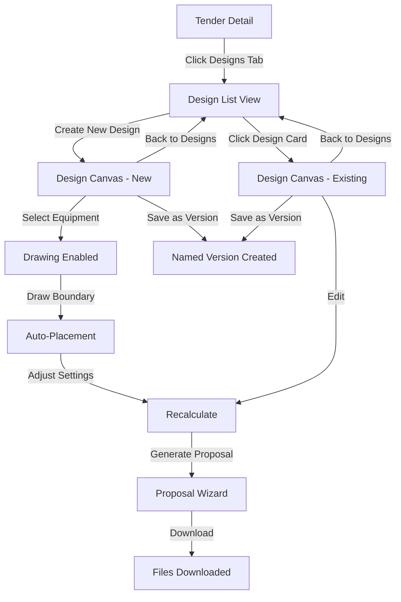

# Core Flows: Map-Based Design Canvas

## Overview

This document defines the user flows for the map-based solar design canvas, covering the complete journey from accessing designs through a tender to generating proposal documents. The flows focus on interaction patterns, information hierarchy, and user feedback—not technical implementation.

---

## Flow 1: Access Design Canvas

**Description:** User navigates from tender detail page to the design canvas.

**Entry Point:** Tender detail page

**Steps:**

1. User views tender detail page with tabs: Overview, Preconditions, **Designs**, BOQ
2. User clicks "Designs" tab
3. System displays design list view showing:
   - All saved designs for this tender (if any)
   - "Create New Design" button (primary action)
   - Each design card shows: thumbnail, name, created date, panel count, system size
4. **If no designs exist:** Empty state with "Create Your First Design" call-to-action
5. **To create new:** User clicks "Create New Design" button
6. **To open existing:** User clicks on a design card
7. System navigates to full-page design canvas route: `/tenders/{tender_id}/design/{design_id}`
8. Canvas loads with satellite imagery centered on tender's lat/long coordinates

**Exit:** User is on the design canvas page, ready to configure equipment

---

## Flow 2: Create New Design

**Description:** User creates a complete solar site design from scratch.

**Entry Point:** Design canvas page (new design)

**Steps:**

1. **Equipment Selection (Required First Step)**
   - Right panel shows "Equipment Configuration" section (expanded by default)
   - User selects PV module from dropdown (searchable library)
   - System displays module specs: wattage, dimensions, efficiency
   - User selects inverter from dropdown
   - System displays inverter specs: capacity, input voltage range
   - Equipment selection enables drawing tools

2. **Site Type & Drawing**
   - Floating tool palette appears with three drawing tools:
     - "Draw Roof" (for simple rooftop)
     - "Draw Ground Area" (for ground-mount)
     - "Draw Carport" (for simple carports)
   - User clicks desired tool (tool highlights, cursor changes to crosshair)
   - User clicks on map to place polygon vertices
   - User double-clicks or presses Enter to complete boundary
   - System draws filled polygon on map with semi-transparent overlay

3. **Add Exclusion Zones (Optional)**
   - Tool palette shows "Draw Exclusion" tool
   - User clicks tool, draws exclusion polygons (trees, obstacles, setbacks)
   - Exclusions appear as darker shaded areas within boundary

4. **Auto-Placement**
   - System automatically places modules using default settings:
     - Edge setback: 1m
     - Row spacing: 2m
     - Orientation: Portrait
     - Azimuth: 180° (south-facing)
   - Full-screen loading overlay appears: "Placing modules..."
   - Modules render on map as small rectangles within boundary
   - Live panel count updates in floating stats badge

5. **Review Initial Results**
   - Bottom sheet slides up showing summary:
     - Total modules: XXX
     - System size: XX.X kWp
     - "View Details" button to expand full results

**Exit:** Design is auto-saved, modules are placed, user can adjust settings or generate proposal

---

## Flow 3: Adjust Layout & Recalculate

**Description:** User modifies placement settings and recalculates layout.

**Entry Point:** Design canvas with modules already placed

**Steps:**

1. User opens right panel "Placement Settings" section
2. User adjusts parameters:
   - Edge setback (slider: 0.5m - 5m)
   - Row spacing (slider: 1m - 10m)
   - Orientation (toggle: Portrait / Landscape)
   - Azimuth (dial: 0° - 360°)
3. Settings show live preview values as user adjusts
4. User clicks "Recalculate Layout" button
5. Full-screen loading overlay: "Recalculating placement..."
6. System clears old modules, places new modules with updated settings
7. Bottom sheet updates with new results
8. If panel count changed significantly, toast notification: "Layout updated: +15 panels"

**Exit:** Updated layout is auto-saved, results refreshed

---

## Flow 4: View Detailed Results

**Description:** User reviews energy estimates and financial analysis.

**Entry Point:** Design canvas with modules placed

**Steps:**

1. User clicks "View Details" on bottom sheet summary
2. Bottom sheet expands to full height showing tabbed sections:
   
   **Tab 1: System Overview**
   - Total modules, system size (kWp), DC:AC ratio
   - Module layout visualization (grid representation)
   
   **Tab 2: Energy Production**
   - Annual energy output (kWh/year)
   - Monthly production chart (bar graph)
   - Performance ratio, capacity factor
   - Loss factors breakdown (shading, soiling, wiring)
   - Data source: "Powered by PVWatts"
   
   **Tab 3: Financial Metrics**
   - Simple payback period (years)
   - ROI percentage
   - Annual savings estimate
   - System cost estimate (from BOQ integration)
   - Assumptions displayed (electricity rate, escalation)

3. User can collapse bottom sheet by clicking drag handle or "Minimize" button
4. Results remain accessible via bottom sheet tab

**Exit:** User has reviewed detailed results, ready to generate proposal or make adjustments

---

## Flow 5: Generate Proposal

**Description:** User exports PDF proposal and CSV bill of materials.

**Entry Point:** Design canvas with completed design

**Steps:**

1. User clicks "Generate Proposal" button in top toolbar
2. Multi-step wizard modal opens:

   **Step 1: Configure Proposal**
   - Proposal title (pre-filled: tender name)
   - Include sections (checkboxes):
     - ✓ Site layout map
     - ✓ System specifications
     - ✓ Energy production estimates
     - ✓ Financial analysis
     - ✓ Equipment list
   - Company branding (logo upload - Phase 2)
   - "Next" button

   **Step 2: Preview**
   - PDF preview pane showing proposal layout
   - Page thumbnails on left, main preview on right
   - "Edit" button returns to Step 1
   - "Generate" button proceeds

   **Step 3: Download**
   - Loading state: "Generating proposal..."
   - Success state shows:
     - "Proposal ready!" message
     - "Download PDF" button
     - "Download CSV BOM" button
     - "Email Proposal" option (future)
   - "Done" button closes wizard

3. User downloads files
4. System logs proposal generation in audit trail

**Exit:** Proposal files downloaded, user returns to design canvas

---

## Flow 6: Save & Version Management

**Description:** User saves work and creates named versions.

**Entry Point:** Design canvas (any state)

**Steps:**

1. **Auto-Save (Continuous)**
   - System auto-saves changes every 30 seconds
   - Small "Saving..." indicator appears briefly in top-right
   - No user action required

2. **Create Named Version**
   - User clicks "Save as Version" button in toolbar
   - Modal appears:
     - Version name input (e.g., "Option A - South Facing")
     - Optional notes textarea
     - "Save Version" button
   - System creates immutable snapshot
   - Toast notification: "Version saved: Option A - South Facing"

3. **Version Indicator**
   - Top toolbar shows current version name
   - Unsaved changes indicator (*) appears if modified since last version

**Exit:** Work is saved, user can continue editing or switch versions

---

## Flow 7: Switch Between Designs

**Description:** User navigates between multiple design versions for a tender.

**Entry Point:** Design canvas or Designs tab

**Steps:**

1. **From Canvas:**
   - User clicks "Back to Designs" button in top-left
   - System navigates to design list view
   
2. **From Design List:**
   - User sees all designs for this tender
   - Each card shows: thumbnail, name, stats, last modified
   - User clicks different design card
   - System loads that design in canvas

3. **Unsaved Changes Warning:**
   - If current design has unsaved changes, modal appears:
     - "You have unsaved changes. Save before leaving?"
     - "Save & Switch" / "Discard & Switch" / "Cancel"

**Exit:** User is viewing different design version

---

## Flow 8: Edit Existing Design

**Description:** User modifies a previously saved design.

**Entry Point:** Design canvas with existing design loaded

**Steps:**

1. Design loads with all previous settings:
   - Equipment selection
   - Site boundaries and exclusions
   - Module placement
   - Placement settings
2. User can modify any aspect:
   - Change equipment (triggers recalculation)
   - Edit boundaries (drag vertices, add/remove points)
   - Adjust placement settings
   - Add/remove exclusion zones
3. Each change triggers auto-save
4. User can create new version to preserve original

**Exit:** Design updated and saved

---

## Wireframes

### Tender Detail - Designs Tab

```wireframe
<!DOCTYPE html>
<html>
<head>
<style>
* { margin: 0; padding: 0; box-sizing: border-box; }
body { font-family: -apple-system, BlinkMacSystemFont, 'Segoe UI', sans-serif; background: #f5f5f5; }
.header { background: #1e3a5f; color: white; padding: 1rem 2rem; }
.tabs { background: white; border-bottom: 1px solid #e0e0e0; padding: 0 2rem; display: flex; gap: 2rem; }
.tab { padding: 1rem 0; border-bottom: 3px solid transparent; cursor: pointer; color: #666; }
.tab.active { border-bottom-color: #f59e0b; color: #1e3a5f; font-weight: 600; }
.content { padding: 2rem; }
.empty-state { text-align: center; padding: 4rem 2rem; background: white; border-radius: 8px; }
.empty-state h2 { color: #333; margin-bottom: 1rem; }
.empty-state p { color: #666; margin-bottom: 2rem; }
.btn-primary { background: #f59e0b; color: white; border: none; padding: 0.75rem 1.5rem; border-radius: 6px; font-size: 1rem; cursor: pointer; }
.design-grid { display: grid; grid-template-columns: repeat(auto-fill, minmax(300px, 1fr)); gap: 1.5rem; margin-top: 1.5rem; }
.design-card { background: white; border-radius: 8px; padding: 1rem; cursor: pointer; border: 2px solid #e0e0e0; transition: border-color 0.2s; }
.design-card:hover { border-color: #f59e0b; }
.design-thumbnail { background: #e8f4f8; height: 150px; border-radius: 4px; margin-bottom: 1rem; display: flex; align-items: center; justify-content: center; color: #666; }
.design-name { font-weight: 600; margin-bottom: 0.5rem; }
.design-stats { font-size: 0.875rem; color: #666; }
.design-date { font-size: 0.75rem; color: #999; margin-top: 0.5rem; }
</style>
</head>
<body>
  <div class="header">
    <h1>Tender: Downtown Solar Project</h1>
  </div>
  
  <div class="tabs">
    <div class="tab">Overview</div>
    <div class="tab">Preconditions</div>
    <div class="tab active" data-element-id="designs-tab">Designs</div>
    <div class="tab">BOQ</div>
  </div>
  
  <div class="content">
    <div style="display: flex; justify-content: space-between; align-items: center; margin-bottom: 1.5rem;">
      <h2>Site Designs</h2>
      <button class="btn-primary" data-element-id="create-design-btn">+ Create New Design</button>
    </div>
    
    <!-- Example with existing designs -->
    <div class="design-grid">
      <div class="design-card" data-element-id="design-card-1">
        <div class="design-thumbnail">Map Preview</div>
        <div class="design-name">Option A - South Facing</div>
        <div class="design-stats">1,245 panels • 498 kWp</div>
        <div class="design-date">Last modified: 2 hours ago</div>
      </div>
      
      <div class="design-card" data-element-id="design-card-2">
        <div class="design-thumbnail">Map Preview</div>
        <div class="design-name">Option B - East-West</div>
        <div class="design-stats">1,180 panels • 472 kWp</div>
        <div class="design-date">Last modified: 1 day ago</div>
      </div>
    </div>
    
    <!-- Empty state (hidden when designs exist) -->
    <div class="empty-state" style="display: none;">
      <h2>No designs yet</h2>
      <p>Create your first site design to get started</p>
      <button class="btn-primary" data-element-id="create-first-design-btn">Create Your First Design</button>
    </div>
  </div>
</body>
</html>
```

### Design Canvas - Main View

```wireframe
<!DOCTYPE html>
<html>
<head>
<style>
* { margin: 0; padding: 0; box-sizing: border-box; }
body { font-family: -apple-system, BlinkMacSystemFont, 'Segoe UI', sans-serif; overflow: hidden; }
.canvas-container { display: flex; flex-direction: column; height: 100vh; }
.toolbar { background: #1e3a5f; color: white; padding: 0.75rem 1.5rem; display: flex; justify-content: space-between; align-items: center; }
.toolbar-left { display: flex; align-items: center; gap: 1rem; }
.toolbar-right { display: flex; gap: 0.75rem; }
.btn { background: transparent; border: 1px solid rgba(255,255,255,0.3); color: white; padding: 0.5rem 1rem; border-radius: 4px; cursor: pointer; font-size: 0.875rem; }
.btn-primary { background: #f59e0b; border-color: #f59e0b; }
.version-name { font-size: 0.875rem; opacity: 0.8; }
.canvas-main { flex: 1; position: relative; background: #e0e0e0; }
.map-area { width: 100%; height: 100%; background: linear-gradient(135deg, #a8d5ba 0%, #7fb3d5 100%); display: flex; align-items: center; justify-content: center; color: #666; font-size: 1.5rem; }
.floating-palette { position: absolute; top: 20px; left: 20px; background: white; border-radius: 8px; padding: 0.75rem; box-shadow: 0 4px 12px rgba(0,0,0,0.15); }
.tool-btn { display: block; width: 48px; height: 48px; background: #f5f5f5; border: 2px solid #e0e0e0; border-radius: 6px; margin-bottom: 0.5rem; cursor: pointer; display: flex; align-items: center; justify-content: center; font-size: 1.25rem; }
.tool-btn:last-child { margin-bottom: 0; }
.tool-btn:hover { border-color: #f59e0b; background: #fff8e1; }
.tool-btn.active { border-color: #f59e0b; background: #fff8e1; }
.stats-badge { position: absolute; top: 20px; right: 20px; background: white; border-radius: 8px; padding: 1rem; box-shadow: 0 4px 12px rgba(0,0,0,0.15); min-width: 200px; }
.stats-badge h3 { font-size: 0.875rem; color: #666; margin-bottom: 0.5rem; }
.stats-value { font-size: 1.5rem; font-weight: 600; color: #1e3a5f; }
.right-panel { position: absolute; right: 0; top: 0; bottom: 0; width: 320px; background: white; box-shadow: -2px 0 8px rgba(0,0,0,0.1); transform: translateX(100%); transition: transform 0.3s; }
.right-panel.open { transform: translateX(0); }
.panel-toggle { position: absolute; left: -40px; top: 50%; transform: translateY(-50%); background: white; border-radius: 4px 0 0 4px; padding: 0.75rem 0.5rem; cursor: pointer; box-shadow: -2px 0 8px rgba(0,0,0,0.1); }
.panel-content { padding: 1.5rem; overflow-y: auto; height: 100%; }
.panel-section { margin-bottom: 2rem; }
.panel-section h3 { font-size: 1rem; margin-bottom: 1rem; color: #333; }
.form-group { margin-bottom: 1rem; }
.form-group label { display: block; font-size: 0.875rem; color: #666; margin-bottom: 0.5rem; }
.form-group select { width: 100%; padding: 0.5rem; border: 1px solid #e0e0e0; border-radius: 4px; }
.bottom-sheet { position: absolute; bottom: 0; left: 0; right: 0; background: white; border-radius: 12px 12px 0 0; box-shadow: 0 -4px 12px rgba(0,0,0,0.15); transform: translateY(calc(100% - 80px)); transition: transform 0.3s; }
.bottom-sheet.expanded { transform: translateY(0); }
.sheet-handle { height: 40px; display: flex; align-items: center; justify-content: center; cursor: pointer; }
.sheet-handle-bar { width: 40px; height: 4px; background: #e0e0e0; border-radius: 2px; }
.sheet-content { padding: 1rem 2rem 2rem; }
.sheet-summary { display: flex; gap: 2rem; align-items: center; }
.sheet-stat { flex: 1; }
.sheet-stat-label { font-size: 0.75rem; color: #666; margin-bottom: 0.25rem; }
.sheet-stat-value { font-size: 1.25rem; font-weight: 600; color: #1e3a5f; }
</style>
</head>
<body>
  <div class="canvas-container">
    <!-- Top Toolbar -->
    <div class="toolbar">
      <div class="toolbar-left">
        <button class="btn" data-element-id="back-btn">← Back to Designs</button>
        <span class="version-name">Option A - South Facing</span>
        <span style="font-size: 0.75rem; opacity: 0.6;">Auto-saved 2 min ago</span>
      </div>
      <div class="toolbar-right">
        <button class="btn" data-element-id="save-version-btn">Save as Version</button>
        <button class="btn btn-primary" data-element-id="generate-proposal-btn">Generate Proposal</button>
      </div>
    </div>
    
    <!-- Main Canvas Area -->
    <div class="canvas-main">
      <!-- Map (placeholder) -->
      <div class="map-area">Satellite Map View</div>
      
      <!-- Floating Tool Palette -->
      <div class="floating-palette" data-element-id="tool-palette">
        <div class="tool-btn active" data-element-id="tool-roof" title="Draw Roof">🏠</div>
        <div class="tool-btn" data-element-id="tool-ground" title="Draw Ground Area">🌍</div>
        <div class="tool-btn" data-element-id="tool-carport" title="Draw Carport">🚗</div>
        <div class="tool-btn" data-element-id="tool-exclusion" title="Draw Exclusion">🚫</div>
        <div class="tool-btn" data-element-id="tool-edit" title="Edit">✏️</div>
      </div>
      
      <!-- Stats Badge -->
      <div class="stats-badge" data-element-id="stats-badge">
        <h3>TOTAL MODULES</h3>
        <div class="stats-value">1,245</div>
        <div style="font-size: 0.875rem; color: #666; margin-top: 0.5rem;">498.0 kWp</div>
      </div>
      
      <!-- Right Panel (Collapsible) -->
      <div class="right-panel open" data-element-id="right-panel">
        <div class="panel-toggle" data-element-id="panel-toggle">◀</div>
        <div class="panel-content">
          <div class="panel-section">
            <h3>Equipment Configuration</h3>
            <div class="form-group">
              <label>PV Module</label>
              <select data-element-id="module-select">
                <option>JA Solar JAM72S30 (545W)</option>
                <option>Trina Solar TSM-DE19 (540W)</option>
              </select>
            </div>
            <div class="form-group">
              <label>Inverter</label>
              <select data-element-id="inverter-select">
                <option>SMA Sunny Tripower (110kW)</option>
                <option>Huawei SUN2000 (100kW)</option>
              </select>
            </div>
          </div>
          
          <div class="panel-section">
            <h3>Placement Settings</h3>
            <div class="form-group">
              <label>Edge Setback: 1.0m</label>
              <input type="range" min="0.5" max="5" step="0.1" value="1" style="width: 100%;" data-element-id="setback-slider">
            </div>
            <div class="form-group">
              <label>Row Spacing: 2.0m</label>
              <input type="range" min="1" max="10" step="0.5" value="2" style="width: 100%;" data-element-id="spacing-slider">
            </div>
            <div class="form-group">
              <label>Orientation</label>
              <select data-element-id="orientation-select">
                <option>Portrait</option>
                <option>Landscape</option>
              </select>
            </div>
            <button class="btn-primary" style="width: 100%; margin-top: 1rem;" data-element-id="recalculate-btn">Recalculate Layout</button>
          </div>
        </div>
      </div>
      
      <!-- Bottom Sheet -->
      <div class="bottom-sheet" data-element-id="bottom-sheet">
        <div class="sheet-handle" data-element-id="sheet-handle">
          <div class="sheet-handle-bar"></div>
        </div>
        <div class="sheet-content">
          <div class="sheet-summary">
            <div class="sheet-stat">
              <div class="sheet-stat-label">TOTAL MODULES</div>
              <div class="sheet-stat-value">1,245</div>
            </div>
            <div class="sheet-stat">
              <div class="sheet-stat-label">SYSTEM SIZE</div>
              <div class="sheet-stat-value">498.0 kWp</div>
            </div>
            <div class="sheet-stat">
              <div class="sheet-stat-label">ANNUAL ENERGY</div>
              <div class="sheet-stat-value">742 MWh</div>
            </div>
            <div class="sheet-stat">
              <div class="sheet-stat-label">PAYBACK</div>
              <div class="sheet-stat-value">6.2 years</div>
            </div>
            <button class="btn-primary" data-element-id="view-details-btn">View Details</button>
          </div>
        </div>
      </div>
    </div>
  </div>
</body>
</html>
```

### Proposal Generation Wizard

```wireframe
<!DOCTYPE html>
<html>
<head>
<style>
* { margin: 0; padding: 0; box-sizing: border-box; }
body { font-family: -apple-system, BlinkMacSystemFont, 'Segoe UI', sans-serif; background: rgba(0,0,0,0.5); display: flex; align-items: center; justify-content: center; height: 100vh; }
.modal { background: white; border-radius: 12px; width: 90%; max-width: 800px; max-height: 90vh; overflow: hidden; display: flex; flex-direction: column; }
.modal-header { padding: 1.5rem 2rem; border-bottom: 1px solid #e0e0e0; display: flex; justify-content: space-between; align-items: center; }
.modal-header h2 { font-size: 1.25rem; color: #333; }
.close-btn { background: none; border: none; font-size: 1.5rem; cursor: pointer; color: #999; }
.modal-body { flex: 1; overflow-y: auto; padding: 2rem; }
.steps { display: flex; gap: 1rem; margin-bottom: 2rem; }
.step { flex: 1; text-align: center; padding: 0.75rem; border-radius: 6px; background: #f5f5f5; color: #999; font-size: 0.875rem; }
.step.active { background: #fff8e1; color: #f59e0b; font-weight: 600; }
.step.completed { background: #e8f5e9; color: #4caf50; }
.form-section { margin-bottom: 2rem; }
.form-section h3 { font-size: 1rem; margin-bottom: 1rem; color: #333; }
.form-group { margin-bottom: 1rem; }
.form-group label { display: block; font-size: 0.875rem; color: #666; margin-bottom: 0.5rem; }
.form-group input[type="text"] { width: 100%; padding: 0.75rem; border: 1px solid #e0e0e0; border-radius: 4px; font-size: 1rem; }
.checkbox-group { display: flex; flex-direction: column; gap: 0.75rem; }
.checkbox-item { display: flex; align-items: center; gap: 0.5rem; }
.checkbox-item input[type="checkbox"] { width: 18px; height: 18px; }
.modal-footer { padding: 1.5rem 2rem; border-top: 1px solid #e0e0e0; display: flex; justify-content: space-between; }
.btn { padding: 0.75rem 1.5rem; border-radius: 6px; font-size: 1rem; cursor: pointer; border: none; }
.btn-secondary { background: #f5f5f5; color: #666; }
.btn-primary { background: #f59e0b; color: white; }
.preview-pane { display: grid; grid-template-columns: 150px 1fr; gap: 1rem; }
.preview-thumbnails { display: flex; flex-direction: column; gap: 0.5rem; }
.preview-thumb { background: #f5f5f5; border: 2px solid #e0e0e0; border-radius: 4px; padding: 0.5rem; text-align: center; font-size: 0.75rem; cursor: pointer; aspect-ratio: 8.5/11; }
.preview-thumb.active { border-color: #f59e0b; }
.preview-main { background: #f5f5f5; border: 1px solid #e0e0e0; border-radius: 4px; aspect-ratio: 8.5/11; display: flex; align-items: center; justify-content: center; color: #999; }
.download-section { text-align: center; padding: 2rem; }
.download-section h3 { color: #4caf50; margin-bottom: 1rem; font-size: 1.5rem; }
.download-section p { color: #666; margin-bottom: 2rem; }
.download-buttons { display: flex; gap: 1rem; justify-content: center; }
</style>
</head>
<body>
  <div class="modal" data-element-id="proposal-wizard">
    <div class="modal-header">
      <h2>Generate Proposal</h2>
      <button class="close-btn" data-element-id="close-wizard">×</button>
    </div>
    
    <div class="modal-body">
      <!-- Step Indicator -->
      <div class="steps">
        <div class="step active">1. Configure</div>
        <div class="step">2. Preview</div>
        <div class="step">3. Download</div>
      </div>
      
      <!-- Step 1: Configure (shown) -->
      <div data-element-id="step-configure">
        <div class="form-section">
          <h3>Proposal Details</h3>
          <div class="form-group">
            <label>Proposal Title</label>
            <input type="text" value="Downtown Solar Project - Proposal" data-element-id="proposal-title">
          </div>
        </div>
        
        <div class="form-section">
          <h3>Include Sections</h3>
          <div class="checkbox-group">
            <label class="checkbox-item">
              <input type="checkbox" checked data-element-id="include-map">
              <span>Site layout map</span>
            </label>
            <label class="checkbox-item">
              <input type="checkbox" checked data-element-id="include-specs">
              <span>System specifications</span>
            </label>
            <label class="checkbox-item">
              <input type="checkbox" checked data-element-id="include-energy">
              <span>Energy production estimates</span>
            </label>
            <label class="checkbox-item">
              <input type="checkbox" checked data-element-id="include-financial">
              <span>Financial analysis</span>
            </label>
            <label class="checkbox-item">
              <input type="checkbox" checked data-element-id="include-equipment">
              <span>Equipment list</span>
            </label>
          </div>
        </div>
      </div>
      
      <!-- Step 2: Preview (hidden) -->
      <div data-element-id="step-preview" style="display: none;">
        <div class="preview-pane">
          <div class="preview-thumbnails">
            <div class="preview-thumb active">Page 1</div>
            <div class="preview-thumb">Page 2</div>
            <div class="preview-thumb">Page 3</div>
          </div>
          <div class="preview-main">PDF Preview</div>
        </div>
      </div>
      
      <!-- Step 3: Download (hidden) -->
      <div data-element-id="step-download" style="display: none;">
        <div class="download-section">
          <h3>✓ Proposal Ready!</h3>
          <p>Your proposal has been generated and is ready to download.</p>
          <div class="download-buttons">
            <button class="btn btn-primary" data-element-id="download-pdf">📄 Download PDF</button>
            <button class="btn btn-primary" data-element-id="download-csv">📊 Download CSV BOM</button>
          </div>
        </div>
      </div>
    </div>
    
    <div class="modal-footer">
      <button class="btn btn-secondary" data-element-id="wizard-back">Back</button>
      <button class="btn btn-primary" data-element-id="wizard-next">Next</button>
    </div>
  </div>
</body>
</html>
```

---

## User Feedback & Loading States

### Loading Overlay

When calculations are in progress (auto-placement, recalculation, energy estimation):
- Full-screen semi-transparent overlay appears
- Centered spinner with message: "Placing modules..." / "Recalculating..." / "Generating proposal..."
- Blocks all interaction until complete
- Automatically dismisses when operation completes

### Toast Notifications

Used for non-blocking feedback:
- "Version saved: [name]" (success, green)
- "Layout updated: +15 panels" (info, blue)
- "Auto-saved" (subtle, gray)
- "Error: Unable to place modules in this area" (error, red)

Appear in top-right corner, auto-dismiss after 3-5 seconds.

### Error States

- **No equipment selected:** Drawing tools disabled, message in right panel: "Select equipment to enable drawing tools"
- **Invalid boundary:** Toast notification: "Boundary must have at least 3 points"
- **No modules fit:** Toast notification: "Unable to place modules. Try increasing boundary size or reducing setbacks."
- **API failure:** Modal dialog: "Unable to calculate energy estimates. Please try again."

---

## Navigation Summary



---

## Key Interaction Patterns

### Progressive Disclosure
- Equipment configuration required first (gates drawing tools)
- Basic stats always visible (floating badge)
- Detailed results hidden until requested (bottom sheet)
- Advanced settings in collapsible right panel

### Immediate Feedback
- Live panel count updates as boundary changes
- Settings show preview values while adjusting
- Auto-save indicator confirms work is saved
- Toast notifications for state changes

### Reversible Actions
- All changes auto-saved (can't lose work)
- Named versions preserve snapshots
- Can switch between designs without losing progress
- Unsaved changes warning before navigation

### Spatial Efficiency
- Floating tools don't obscure map
- Collapsible panels maximize map space
- Bottom sheet slides up only when needed
- Full-screen canvas for maximum workspace