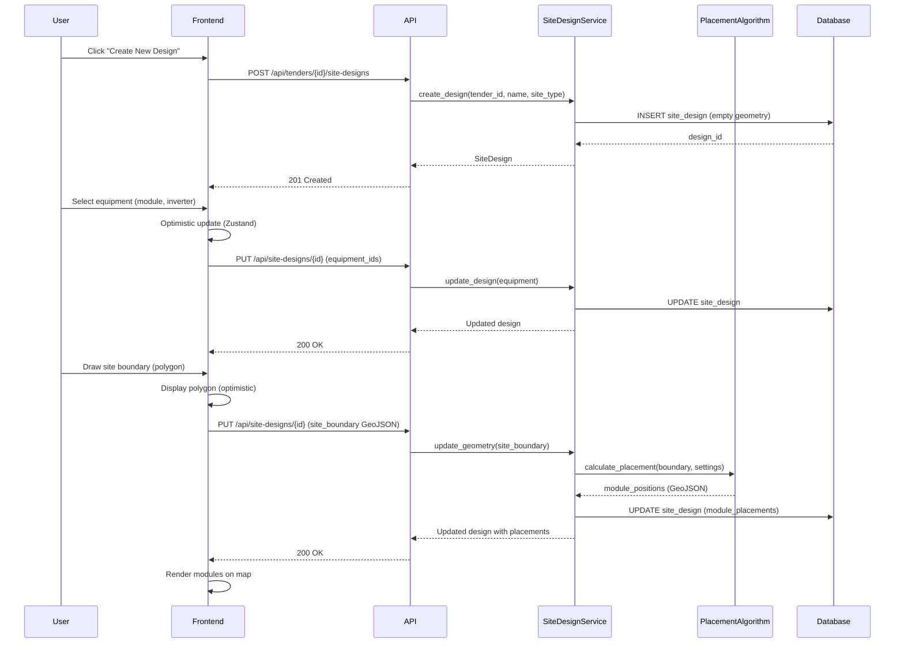
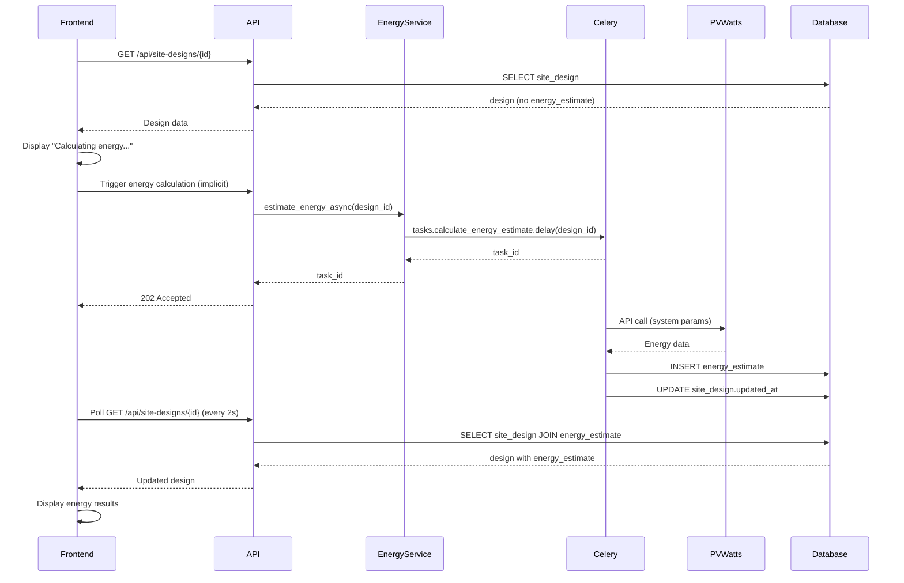

# Tech Plan: Map-Based Design Canvas

## Overview

This document defines the high-level technical architecture for the map-based solar design canvas. It covers critical architectural decisions, data model design, and component architecture that will guide implementation.

**Related Specs:**

- spec:56e1ef8e-0c2e-42d1-a477-ed6c411cf46a/b1f7645a-ab17-4672-8d14-6aecd7bfb2c9 - Epic Brief
- spec:56e1ef8e-0c2e-42d1-a477-ed6c411cf46a/f040b177-a20b-4165-a77a-cb6602a7313b - Core Flows

---

## Architectural Approach

### Core Principles

**1. Separation of Concerns**

- **SiteDesign** model handles visual/geometric design (boundaries, placement, visualization)
- **PVDesign** model handles electrical sizing (strings, inverters, DC:AC ratio)
- SiteDesign references PVDesign for equipment specifications
- Maintains backward compatibility with existing PVDesign functionality

**2. Progressive Enhancement**

- Phase 1: Synchronous operations (auto-placement, energy estimation via cached results)
- Phase 2+: Async migration path designed in from the start
- Architecture supports both sync and async execution without major refactoring

**3. Data Locality**

- GeoJSON stored in JSONB columns (no PostGIS dependency)
- Energy estimates cached in database (avoid repeated PVWatts API calls)
- Equipment library in database tables (searchable, tenant-extensible)
- Design versions as full snapshots (simple, reliable, storage-acceptable)

**4. Existing Pattern Adherence**

- Service layer pattern: `SiteDesignService`, `EquipmentLibraryService`, `ProposalService`
- Tenant isolation at service level (consistent with file:backend/app/services/tender.py)
- Audit logging for all mutations (consistent with file:backend/app/services/audit.py)
- Pydantic schemas for validation (consistent with existing API patterns)

### Key Architectural Decisions

#### Backend Architecture

**Hybrid Sync/Async Auto-Placement**

- **Phase 1:** Hybrid approach based on estimated module count
  - **Sync execution:** Sites with <1,000 estimated modules (fast, <2 seconds)
  - **Async execution:** Sites with ≥1,000 estimated modules (Celery task, poll for results)
  - **Detection:** Estimate module count from boundary area and module dimensions before placement
- **Design Decision:** Most commercial sites will be <1,000 modules (sync path), utility-scale uses async
- **Future Path:** Phase 2 adds shading/terrain analysis (always async)
- **Trade-off:** Slightly more complex than pure sync, but prevents UX issues on large sites

**GeoJSON in JSONB**

- **Choice:** Store geometric data as GeoJSON in PostgreSQL JSONB columns
- **Rationale:** 
  - No additional dependencies (PostGIS adds complexity)
  - Easy serialization to frontend (JSON → GeoJSON → Leaflet)
  - Sufficient for Phase 1 (no spatial queries needed)
  - JSONB supports indexing if needed later
- **Trade-off:** No spatial query capabilities, but not required for MVP

**Equipment Library as Database Tables**

- **Choice:** `EquipmentModule` and `EquipmentInverter` tables with tenant support
- **Rationale:**
  - Full CRUD operations via API
  - Searchable (by name, wattage, manufacturer)
  - Tenant-specific additions (hybrid: central + custom)
  - Consistent with existing data model patterns
- **Schema:** `is_global` flag distinguishes central library from tenant-specific equipment

**PVWatts Integration: Async Background Task with Retry Logic**

- **Choice:** Celery task calculates energy estimates, stores in database
- **Rationale:**
  - PVWatts API calls take 1-3 seconds (too slow for sync)
  - Cached results displayed immediately on subsequent loads
  - Recalculation triggered only when design parameters change
- **Retry Strategy:**
  - 3 attempts with exponential backoff (1s, 2s, 4s)
  - On failure: Mark estimate as "unavailable", allow proposal generation without energy data
  - User can manually retry via "Recalculate Energy" button
- **Trade-off:** Initial load shows "Calculating..." state, but subsequent loads are instant. Graceful degradation if API unavailable.

**PDF Generation: Jinja2 + WeasyPrint + Celery**

- **Choice:** HTML templates (Jinja2) → PDF (WeasyPrint) → Async generation (Celery)
- **Rationale:**
  - Template-based approach is maintainable (easier than ReportLab code)
  - WeasyPrint handles complex layouts (charts, tables, images)
  - Async execution prevents blocking (PDF generation can take 5-10 seconds)
- **Dependencies:** `jinja2`, `weasyprint`, `matplotlib` (for charts)

#### Frontend Architecture

**React-Leaflet for Mapping**

- **Choice:** React-Leaflet (official React wrapper for Leaflet.js)
- **Rationale:**
  - Mature, well-documented, large community
  - Declarative React components for map features
  - OpenStreetMap tiles (free, no API key required)
- **Tile Source:** OpenStreetMap ([https://tile.openstreetmap.org/{z}/{x}/{y}.png](https://tile.openstreetmap.org/{z}/{x}/{y}.png))
- **Caching:** Browser cache with appropriate headers (no server-side proxy needed)

**Zustand for Canvas State**

- **Choice:** Add Zustand for global canvas state management
- **Rationale:**
  - Lightweight (1KB), minimal boilerplate
  - Good for complex UI state (drawing mode, selected tool, unsaved changes)
  - Complements React Query (server state) without overlap
- **State Scope:** Drawing mode, tool selection, map viewport, unsaved changes indicator
- **Server State:** React Query continues to handle API data (designs, equipment, results)

**Optimistic Updates + Background Sync with State Tracking**

- **Choice:** Update UI immediately, sync to backend in background
- **Rationale:**
  - Responsive UX (no waiting for API calls)
  - Critical operations (boundary/exclusion drawing) save immediately
  - Settings changes debounced to 30 seconds
- **Sync State Tracking (Zustand):**
  - Track each change as: "pending" (queued), "syncing" (in-flight), "synced" (confirmed), "failed" (error)
  - Retry failed syncs automatically (3 attempts with backoff)
  - Show unsaved changes warning only for "pending" or "failed" states
  - beforeunload handler prevents accidental data loss
- **Implementation:** React Query mutations with `onMutate` optimistic updates + Zustand sync state store

**Hybrid API Design**

- **Choice:** RESTful CRUD + action-based endpoints
- **Endpoints:**
  - CRUD: `GET/POST/PUT/DELETE /api/site-designs`
  - Actions: `POST /api/site-designs/{id}/recalculate`, `POST /api/site-designs/{id}/generate-proposal`
- **Rationale:** 
  - CRUD for data operations (standard, predictable)
  - Actions for complex operations (clear intent, easier to make async later)

### Technology Stack Additions

**Backend:**

- `weasyprint` - HTML to PDF conversion
- `jinja2` - Template engine (already in FastAPI)
- `matplotlib` - Chart generation for proposals
- `httpx` - PVWatts API client (async HTTP)

**Frontend:**

- `react-leaflet` - Map component library
- `leaflet` - Core mapping library
- `zustand` - State management
- `@turf/turf` - Geospatial calculations (area, intersections)

### Constraints & Assumptions

**Performance Targets:**

- Auto-placement: <2 seconds for up to 5,000 modules
- Energy estimation: Background task, <10 seconds
- PDF generation: Background task, <15 seconds
- Auto-save: Debounced to 30 seconds, <500ms API response

**Data Limits:**

- Max site boundary: 100 vertices (prevents performance issues)
- Max exclusion zones: 50 per design
- Max modules per design: 10,000 (Phase 1 limit)
- Design versions: No hard limit, but UI shows last 20

**Browser Support:**

- Modern browsers only (Chrome, Firefox, Safari, Edge - last 2 versions)
- No IE11 support (Leaflet and modern React require ES6+)

---

## Data Model

### New Entities

#### SiteDesign

Primary entity for map-based designs. Stores geometric data, placement results, and references to related entities.

```python
class SiteDesign(Base):
    __tablename__ = "site_designs"
    
    id = Column(UUID, primary_key=True, default=uuid.uuid4)
    tender_id = Column(UUID, ForeignKey("tenders.id"), nullable=False)
    pv_design_id = Column(UUID, ForeignKey("pv_designs.id"), nullable=True)  # Optional, for Phase 2 advanced calculations
    
    # Metadata
    name = Column(String(255), nullable=False)
    site_type = Column(Enum("rooftop", "ground_mount", "carport"), nullable=False)
    created_by = Column(UUID, ForeignKey("users.id"), nullable=False)
    created_at = Column(DateTime, default=datetime.utcnow)
    updated_at = Column(DateTime, default=datetime.utcnow, onupdate=datetime.utcnow)
    
    # Equipment Selection (Phase 1)
    equipment_module_id = Column(UUID, ForeignKey("equipment_modules.id"), nullable=False)
    equipment_inverter_id = Column(UUID, ForeignKey("equipment_inverters.id"), nullable=False)
    
    # Geometric Data (GeoJSON in JSONB)
    site_boundary = Column(JSONB, nullable=False)  # GeoJSON Polygon
    exclusion_zones = Column(JSONB, default=[])    # Array of GeoJSON Polygons
    module_placements = Column(JSONB, default=[])  # Array of module positions
    
    # Placement Settings
    edge_setback_m = Column(Float, default=1.0)
    row_spacing_m = Column(Float, default=2.0)
    module_orientation = Column(Enum("portrait", "landscape"), default="portrait")
    azimuth_deg = Column(Float, default=180.0)  # South-facing
    tilt_deg = Column(Float, nullable=False)  # Derived from site_type: ground_mount=20°, rooftop=10°, carport=0°
    
    # Calculated Results
    total_modules = Column(Integer, default=0)
    system_size_kwp = Column(Float, default=0.0)
    site_area_sqm = Column(Float, nullable=True)
    
    # Relationships
    tender = relationship("Tender", back_populates="site_designs")
    pv_design = relationship("PVDesign")
    versions = relationship("DesignVersion", back_populates="site_design")
    energy_estimate = relationship("EnergyEstimate", uselist=False)
    financial_analysis = relationship("FinancialAnalysis", uselist=False)
```

**GeoJSON Structure Examples:**

```json
// site_boundary
{
  "type": "Polygon",
  "coordinates": [[[lon1, lat1], [lon2, lat2], [lon3, lat3], [lon1, lat1]]]
}

// exclusion_zones
[
  {
    "type": "Polygon",
    "coordinates": [[[lon1, lat1], [lon2, lat2], [lon3, lat3], [lon1, lat1]]]
  }
]

// module_placements
[
  {
    "type": "Feature",
    "geometry": {"type": "Point", "coordinates": [lon, lat]},
    "properties": {"rotation": 0, "module_id": "uuid"}
  }
]
```

#### DesignVersion

Immutable snapshots of design state for version management.

```python
class DesignVersion(Base):
    __tablename__ = "design_versions"
    
    id = Column(UUID, primary_key=True, default=uuid.uuid4)
    site_design_id = Column(UUID, ForeignKey("site_designs.id"), nullable=False)
    
    # Version Metadata
    version_name = Column(String(255), nullable=False)
    notes = Column(Text, nullable=True)
    created_by = Column(UUID, ForeignKey("users.id"), nullable=False)
    created_at = Column(DateTime, default=datetime.utcnow)
    
    # Full Snapshot (JSONB)
    snapshot_data = Column(JSONB, nullable=False)
    # Contains: site_boundary, exclusion_zones, module_placements, 
    #           placement_settings, calculated_results
    
    # Relationships
    site_design = relationship("SiteDesign", back_populates="versions")
```

#### EquipmentModule

Central + tenant-specific PV module library.

```python
class EquipmentModule(Base):
    __tablename__ = "equipment_modules"
    
    id = Column(UUID, primary_key=True, default=uuid.uuid4)
    tenant_id = Column(UUID, ForeignKey("tenants.id"), nullable=True)
    
    # Module Specifications
    manufacturer = Column(String(255), nullable=False)
    model = Column(String(255), nullable=False)
    wattage = Column(Integer, nullable=False)
    efficiency = Column(Float, nullable=False)
    
    # Physical Dimensions (meters)
    length_m = Column(Float, nullable=False)
    width_m = Column(Float, nullable=False)
    thickness_m = Column(Float, nullable=False)
    
    # Electrical Specs
    voc = Column(Float, nullable=False)  # Open circuit voltage
    isc = Column(Float, nullable=False)  # Short circuit current
    vmp = Column(Float, nullable=False)  # Max power voltage
    imp = Column(Float, nullable=False)  # Max power current
    
    # Library Management
    is_global = Column(Boolean, default=False)  # True = central library
    is_active = Column(Boolean, default=True)
    created_at = Column(DateTime, default=datetime.utcnow)
```

#### EquipmentInverter

Central + tenant-specific inverter library.

```python
class EquipmentInverter(Base):
    __tablename__ = "equipment_inverters"
    
    id = Column(UUID, primary_key=True, default=uuid.uuid4)
    tenant_id = Column(UUID, ForeignKey("tenants.id"), nullable=True)
    
    # Inverter Specifications
    manufacturer = Column(String(255), nullable=False)
    model = Column(String(255), nullable=False)
    capacity_kw = Column(Float, nullable=False)
    
    # Input Specs
    max_dc_voltage = Column(Float, nullable=False)
    mppt_voltage_range_min = Column(Float, nullable=False)
    mppt_voltage_range_max = Column(Float, nullable=False)
    max_input_current = Column(Float, nullable=False)
    num_mppt_channels = Column(Integer, nullable=False)
    
    # Library Management
    is_global = Column(Boolean, default=False)
    is_active = Column(Boolean, default=True)
    created_at = Column(DateTime, default=datetime.utcnow)
```

#### EnergyEstimate

Cached PVWatts API results with hash-based invalidation.

```python
class EnergyEstimate(Base):
    __tablename__ = "energy_estimates"
    
    id = Column(UUID, primary_key=True, default=uuid.uuid4)
    site_design_id = Column(UUID, ForeignKey("site_designs.id"), unique=True)
    
    # Cache Invalidation
    parameter_hash = Column(String(64), nullable=False)  # SHA256 hash of energy parameters
    # Hash computed from: system_capacity_kw, latitude, longitude, azimuth, tilt, losses_pct
    
    # PVWatts Input Parameters (for reference)
    system_capacity_kw = Column(Float, nullable=False)
    latitude = Column(Float, nullable=False)
    longitude = Column(Float, nullable=False)
    azimuth = Column(Float, nullable=False)
    tilt = Column(Float, nullable=False)
    
    # Loss Factors
    losses_pct = Column(Float, default=14.0)
    
    # Results (from PVWatts API)
    annual_energy_kwh = Column(Float, nullable=False)
    monthly_energy_kwh = Column(JSONB, nullable=False)  # Array of 12 values
    capacity_factor = Column(Float, nullable=False)
    
    # Status
    status = Column(Enum("calculating", "completed", "failed"), default="calculating")
    error_message = Column(Text, nullable=True)  # If status=failed
    
    # Metadata
    calculated_at = Column(DateTime, default=datetime.utcnow)
    pvwatts_version = Column(String(50), nullable=True)
```

#### FinancialAnalysis

Basic financial metrics (Phase 1).

```python
class FinancialAnalysis(Base):
    __tablename__ = "financial_analyses"
    
    id = Column(UUID, primary_key=True, default=uuid.uuid4)
    site_design_id = Column(UUID, ForeignKey("site_designs.id"), unique=True)
    
    # Input Assumptions
    system_cost_usd = Column(Float, nullable=False)  # From BOQ
    electricity_rate_usd_per_kwh = Column(Float, nullable=False)
    annual_rate_escalation_pct = Column(Float, default=2.0)
    
    # Calculated Metrics
    annual_savings_usd = Column(Float, nullable=False)
    simple_payback_years = Column(Float, nullable=False)
    roi_pct = Column(Float, nullable=False)
    
    # Metadata
    calculated_at = Column(DateTime, default=datetime.utcnow)
```

### Relationships with Existing Models

**Tender → SiteDesign (One-to-Many)**

- Tender can have multiple site designs (different options)
- SiteDesign inherits lat/long from Tender for map centering

**SiteDesign → EquipmentModule (Many-to-One)**

- SiteDesign.equipment_module_id → EquipmentModule.id
- Required for Phase 1 (equipment selected before drawing)

**SiteDesign → EquipmentInverter (Many-to-One)**

- SiteDesign.equipment_inverter_id → EquipmentInverter.id
- Required for Phase 1 (equipment selected before drawing)

**SiteDesign → PVDesign (Many-to-One, Optional)**

- Optional reference for Phase 2 advanced electrical calculations
- Phase 1: Not used (equipment stored directly in SiteDesign)
- Phase 2: Can link to PVDesign for string sizing, DC:AC ratio validation

**SiteDesign → BOQItem (Indirect via Tender)**

- BOQ items generated from SiteDesign module count
- Integration via file:backend/app/services/boq.py

**User → SiteDesign (Creator)**

- Audit trail: who created/modified designs
- Consistent with existing audit logging pattern

### Database Migrations

**Migration Strategy:**

1. Add new tables: `site_designs`, `design_versions`, `equipment_modules`, `equipment_inverters`, `energy_estimates`, `financial_analyses`
2. Seed `equipment_modules` and `equipment_inverters` with common equipment (is_global=True)
3. No changes to existing tables (backward compatible)
4. Alembic migration scripts in file:backend/alembic/versions/

---

## Component Architecture

### Backend Components

#### SiteDesignService

Core service for site design operations. Follows existing service pattern from file:backend/app/services/pv_design.py.

**Responsibilities:**

- CRUD operations for SiteDesign
- Auto-placement algorithm execution
- Geometric calculations (area, module count)
- Integration with PVDesign for equipment specs
- Audit logging for all mutations

**Key Methods:**

- `create_design(tender_id, name, site_type, equipment_module_id, equipment_inverter_id)`
- `update_geometry(design_id, site_boundary, exclusion_zones)`
- `recalculate_placement(design_id, placement_settings)` - Sync in Phase 1, async-ready
- `get_design_with_results(design_id)` - Joins energy estimate and financial analysis

**Integration Points:**

- `TenderService` - Verify tender access
- `EquipmentLibraryService` - Fetch module/inverter specs
- `AuditService` - Log all mutations
- `PlacementAlgorithmService` - Delegate auto-placement logic

#### PlacementAlgorithmService

Encapsulates auto-placement logic. Designed for easy async migration.

**Responsibilities:**

- Grid fill algorithm (Phase 1)
- Module positioning within boundaries
- Exclusion zone handling
- Orientation and azimuth application

**Key Methods:**

- `calculate_placement(boundary_geojson, exclusions, module_dims, settings)` → module_positions
- Returns: List of module positions as GeoJSON Features

**Algorithm (Phase 1 - Basic Grid Fill):**

1. Estimate module count from boundary area (area / module_footprint)
2. **If estimated count < 1,000:** Execute synchronously
  - Calculate bounding box of site boundary
  - Generate grid of potential module positions (based on module dimensions + spacing)
  - Filter positions: inside boundary, outside exclusions, respect setbacks
  - Apply orientation (portrait/landscape) and azimuth rotation
  - Return valid positions as GeoJSON
3. **If estimated count ≥ 1,000:** Execute asynchronously
  - Trigger Celery task with same algorithm
  - Return task_id for polling
  - Frontend shows progress indicator

**GeoJSON Validation:**

- Frontend: Validate using @turf/turf before sending (immediate feedback)
- Backend: Validate in SiteDesignService before saving (security/integrity)
- Checks: Closed polygons, ≥3 vertices, no self-intersections, valid coordinates

**Future (Phase 2):**

- Add progress reporting for async tasks
- Optimize for shading, terrain

#### EnergyEstimationService

Manages PVWatts API integration and caching.

**Responsibilities:**

- Call PVWatts API (async Celery task)
- Cache results in `energy_estimates` table
- Invalidate cache when design parameters change
- Return cached results immediately if available

**Key Methods:**

- `estimate_energy_async(site_design_id)` - Triggers Celery task, returns task_id
- `get_cached_estimate(site_design_id)` - Returns cached results or None
- `invalidate_cache_if_needed(site_design_id)` - Checks parameter hash, invalidates if changed
- `compute_parameter_hash(design)` - SHA256 hash of: total_modules, azimuth, tilt, equipment IDs, lat/long

**Celery Task:**

- `tasks.calculate_energy_estimate(site_design_id)`
- Calls PVWatts API with system parameters
- **Retry Logic:** 3 attempts with exponential backoff (1s, 2s, 4s)
- **On Success:** Stores results in `energy_estimates` table with status="completed"
- **On Failure:** Stores error in `energy_estimates` with status="failed", error_message
- Updates `site_design.updated_at` to trigger frontend refresh
- **Graceful Degradation:** Proposal generation proceeds without energy data if estimation fails

#### FinancialAnalysisService

Calculates basic financial metrics.

**Responsibilities:**

- Simple payback calculation
- ROI calculation
- Annual savings estimation
- Integration with BOQ for system cost

**Key Methods:**

- `calculate_financials(site_design_id, assumptions)` - Returns FinancialAnalysis
- `get_system_cost_from_boq(tender_id)` - Fetches total from BOQ

**Calculations:**

- Annual Savings = Annual Energy (kWh) × Electricity Rate ($/kWh)
- Simple Payback = System Cost / Annual Savings
- ROI = (Annual Savings × 25 years - System Cost) / System Cost × 100

#### ProposalGenerationService

Generates PDF proposals using Jinja2 + WeasyPrint.

**Responsibilities:**

- Render HTML templates with design data
- Generate charts (matplotlib)
- Convert HTML to PDF (WeasyPrint)
- Async execution via Celery

**Key Methods:**

- `generate_proposal_async(site_design_id, options)` - Triggers Celery task
- `generate_csv_bom(site_design_id)` - Exports BOQ as CSV

**Celery Task:**

- `tasks.generate_proposal_pdf(site_design_id, options)`
- Fetches design, energy estimate, financial analysis, BOQ
- Renders Jinja2 template with data
- Generates charts (monthly energy production)
- Converts to PDF via WeasyPrint
- Stores PDF in file storage (local or S3)
- Returns download URL

**Template Structure:**

- `templates/proposals/base.html` - Base layout
- `templates/proposals/site_design.html` - Main proposal template
- Includes: Cover page, site map, system specs, energy production, financials, equipment list

**File Storage:**

- **Configurable backend:** Abstract storage interface supports local filesystem or S3
- **Phase 1:** Local filesystem (simpler, no AWS dependencies)
- **Phase 2:** S3 for multi-tenant production deployment
- **Configuration:** `PROPOSAL_STORAGE_BACKEND` environment variable ("local" or "s3")

#### EquipmentLibraryService

Manages equipment library (modules and inverters).

**Responsibilities:**

- CRUD for equipment (admin/tenant-specific)
- Search and filtering
- Global vs tenant-specific equipment management

**Key Methods:**

- `list_modules(tenant_id, search_query)` - Returns global + tenant-specific modules
  - **Tenant Isolation:** Always filters by `(is_global=True OR tenant_id=current_tenant)`
- `create_module(tenant_id, specs)` - Add tenant-specific module (sets is_global=False)
- `list_inverters(tenant_id, search_query)` - Returns global + tenant-specific inverters
  - **Tenant Isolation:** Always filters by `(is_global=True OR tenant_id=current_tenant)`

#### DesignVersionService

Manages design versioning.

**Responsibilities:**

- Create immutable snapshots
- List versions for a design
- Restore design from version

**Key Methods:**

- `create_version(site_design_id, version_name, notes)` - Creates snapshot
- `list_versions(site_design_id)` - Returns all versions
- `restore_from_version(site_design_id, version_id)` - Loads version data into current design

**Snapshot Data:**

- Full copy of: site_boundary, exclusion_zones, module_placements, placement_settings, results
- Stored as JSONB in `design_versions.snapshot_data`

### Frontend Components

#### Design Canvas Page (`/tenders/[id]/design/[designId]`)

Full-page route for design canvas. Integrates all canvas components.

**State Management:**

- Zustand store: `useDesignCanvasStore` - Drawing mode, tool selection, sync state tracking
  - **Sync State:** Track changes as "pending", "syncing", "synced", "failed"
  - **Retry Logic:** Automatically retry failed syncs (3 attempts)
  - **Unsaved Changes:** Warn only for "pending" or "failed" states
- React Query: `useDesignQuery`, `useUpdateDesignMutation` - Server state

**Key Components:**

- `<DesignToolbar>` - Top toolbar with actions (Save, Generate Proposal, Back)
- `<MapCanvas>` - Leaflet map with drawing tools
- `<FloatingToolPalette>` - Drawing tool buttons
- `<RightPanel>` - Equipment selection, placement settings
- `<BottomSheet>` - Results display (energy, financials)
- `<ProposalWizard>` - Modal for proposal generation

#### MapCanvas Component

React-Leaflet map with drawing capabilities.

**Responsibilities:**

- Render satellite imagery (OpenStreetMap tiles)
- Display site boundary, exclusions, module placements
- Handle drawing interactions (polygon creation, editing)
- Sync map state with Zustand store

**Libraries:**

- `react-leaflet` - Map components
- `leaflet-draw` - Drawing tools (or custom implementation)
- `@turf/turf` - Geometric calculations (area, intersections)

**Drawing Flow:**

1. User selects tool (Draw Roof, Draw Ground, Draw Exclusion)
2. Zustand store updates: `setDrawingMode('boundary')`
3. MapCanvas enables drawing mode
4. User clicks to place vertices
5. On complete: GeoJSON polygon created
6. **Frontend validation:** @turf/turf validates polygon (closed, ≥3 vertices, no self-intersections)
7. Optimistic update: Display polygon immediately, mark as "pending"
8. **Immediate save:** POST to `/api/site-designs/{id}` with updated geometry (critical operation, not debounced)
9. **Backend validation:** SiteDesignService validates GeoJSON before saving
10. On success: Mark as "synced". On failure: Mark as "failed", show error, allow retry

#### Equipment Selection Panel

Right panel component for equipment configuration.

**Responsibilities:**

- Searchable dropdown for modules
- Searchable dropdown for inverters
- Display selected equipment specs
- Trigger recalculation on equipment change

**Data Flow:**

- React Query: `useEquipmentModulesQuery()` - Fetches available modules
- React Query: `useEquipmentInvertersQuery()` - Fetches available inverters
- On selection: Optimistic update + background sync

#### Placement Settings Panel

Right panel component for placement parameters.

**Responsibilities:**

- Sliders for setback, spacing
- Toggle for orientation
- Dial for azimuth
- "Recalculate Layout" button

**Interaction:**

- Settings changes update Zustand store (local state)
- "Recalculate" button triggers: `POST /api/site-designs/{id}/recalculate`
- Full-screen loading overlay during recalculation
- Results update bottom sheet

#### Results Bottom Sheet

Slide-up panel displaying energy and financial results.

**Responsibilities:**

- Summary view (collapsed): Total modules, system size, annual energy, payback
- Detailed view (expanded): Tabs for System Overview, Energy Production, Financial Metrics
- Charts: Monthly energy production (bar chart)

**Data Flow:**

- React Query: `useEnergyEstimateQuery(designId)` - Fetches cached estimate
- React Query: `useFinancialAnalysisQuery(designId)` - Fetches financial metrics
- **Polling:** If estimate.status="calculating", poll every 2 seconds until status="completed" or "failed"
- **Error Handling:** If status="failed", show error message and "Retry" button
- **Graceful Degradation:** If energy unavailable, show "Energy estimation unavailable" in results panel

#### Proposal Generation Wizard

Multi-step modal for proposal configuration and download.

**Steps:**

1. Configure: Title, sections to include
2. Preview: PDF preview (iframe or thumbnail)
3. Download: PDF and CSV BOM download links

**Data Flow:**

- Step 1: User configures options
- Step 2: `POST /api/site-designs/{id}/generate-proposal` → Returns task_id
- Poll task status: `GET /api/tasks/{task_id}/status`
- Step 3: Display download links when complete

### API Endpoints

**SiteDesign CRUD:**

- `GET /api/tenders/{tender_id}/site-designs` - List designs for tender
- `POST /api/tenders/{tender_id}/site-designs` - Create new design
- `GET /api/site-designs/{id}` - Get design with results
- `PUT /api/site-designs/{id}` - Update design (geometry, settings)
- `DELETE /api/site-designs/{id}` - Delete design

**Actions:**

- `POST /api/site-designs/{id}/recalculate` - Trigger placement recalculation
- `POST /api/site-designs/{id}/generate-proposal` - Generate PDF (async, returns task_id)
- `GET /api/site-designs/{id}/export-csv` - Export CSV BOM

**Versioning:**

- `GET /api/site-designs/{id}/versions` - List versions
- `POST /api/site-designs/{id}/versions` - Create version snapshot
- `POST /api/site-designs/{id}/restore/{version_id}` - Restore from version

**Equipment Library:**

- `GET /api/equipment/modules` - List modules (global + tenant)
- `POST /api/equipment/modules` - Add tenant-specific module
- `GET /api/equipment/inverters` - List inverters (global + tenant)
- `POST /api/equipment/inverters` - Add tenant-specific inverter

**Tasks (Async Operations):**

- `GET /api/tasks/{task_id}/status` - Poll task status (for energy estimation, PDF generation)

### Integration Points

**Tender Integration:**

- Design canvas launched from Tender detail page "Designs" tab
- Inherits lat/long from Tender for map centering
- Design list view shows all designs for a tender
- **Thumbnails:** Static placeholder icon for Phase 1 (generic solar panel icon), real map thumbnails in Phase 2

**BOQ Integration:**

- `ProposalGenerationService` fetches BOQ items via file:backend/app/services/boq.py
- System cost calculated from BOQ total
- CSV BOM export includes BOQ items

**Audit Logging:**

- All SiteDesign mutations logged via file:backend/app/services/audit.py
- Consistent with existing audit pattern

**Tenant Isolation:**

- All services verify tenant_id (consistent with existing pattern)
- Equipment library supports global + tenant-specific items

### Data Flow: Create Design & Auto-Place



### Data Flow: Energy Estimation (Async)



---

## Architecture Validation Summary

**Validation Completed:** Architecture stress-tested against robustness, simplicity, flexibility, scaling, codebase fit, and requirements consistency.

**Critical Decisions Resolved:**

1. **Equipment Storage:** SiteDesign has direct foreign keys to EquipmentModule/EquipmentInverter (not via PVDesign). PVDesign remains optional for Phase 2 advanced electrical calculations.
2. **Auto-Placement Performance:** Hybrid sync/async based on estimated module count (<1,000 = sync, ≥1,000 = async). Prevents UX issues on large sites.
3. **PVWatts Resilience:** Retry logic (3 attempts, exponential backoff) + graceful degradation (proposals work without energy data if API fails).
4. **Data Loss Prevention:** Sync state tracking in Zustand (pending/syncing/synced/failed) + automatic retry + beforeunload warning. Critical operations save immediately.
5. **GeoJSON Validation:** Dual validation (frontend for UX, backend for security). Prevents invalid geometries from corrupting data.
6. **Cache Invalidation:** Hash-based approach (SHA256 of energy parameters). Efficient, deterministic, no false invalidations.
7. **Tenant Security:** Service-level filtering enforced for equipment library (is_global=True OR tenant_id=current_tenant).
8. **Storage Flexibility:** Configurable storage backend (local for Phase 1, S3 for Phase 2). Abstract interface prevents vendor lock-in.

**Accepted Trade-offs:**

- 1.5MB JSONB payload for 10,000 modules (acceptable with gzip compression)
- Static thumbnails for Phase 1 (real thumbnails deferred to Phase 2)
- Fixed tilt based on site_type (user-configurable tilt deferred to Phase 2)

---

## Summary

This Tech Plan establishes a pragmatic, scalable architecture for the map-based design canvas:

**Key Strengths:**

- **Separation of concerns:** SiteDesign (visual) vs PVDesign (electrical)
- **Simple data model:** GeoJSON in JSONB, no PostGIS complexity
- **Hybrid sync/async:** Fast for common cases, scalable for large sites
- **Resilient:** Retry logic, graceful degradation, data loss prevention
- **Secure:** Tenant isolation, dual validation (frontend + backend)
- **Leverages existing patterns:** Service layer, audit logging, tenant isolation
- **Minimal dependencies:** React-Leaflet, Zustand, WeasyPrint

**Phase 1 Deliverables:**

- New data models: SiteDesign (with equipment FKs), DesignVersion, Equipment tables, EnergyEstimate (with hash), FinancialAnalysis
- Backend services: SiteDesignService, PlacementAlgorithmService (hybrid sync/async), EnergyEstimationService (retry logic), ProposalGenerationService (configurable storage)
- Frontend: Design canvas page with Leaflet map, drawing tools (validated), results display, sync state tracking
- API: Hybrid REST + action endpoints

**Future Scalability:**

- Async migration path for all placement operations (Phase 2)
- Equipment library extensibility (tenant-specific additions)
- Version management for design comparison
- Template-based proposal generation (easy to customize)
- Real thumbnail generation (Phase 2)
- User-configurable tilt (Phase 2)

