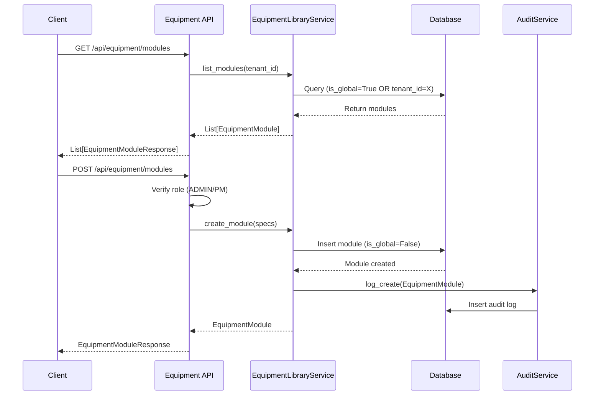

I have created the following plan after thorough exploration and analysis of the codebase. Follow the below plan verbatim. Trust the files and references. Do not re-verify what's written in the plan. Explore only when absolutely necessary. First implement all the proposed file changes and then I'll review all the changes together at the end.

## Observations

The codebase follows a clean layered architecture with FastAPI backend using SQLAlchemy ORM, Pydantic schemas for validation, and service-layer business logic. The existing `PVDesignService` demonstrates the tenant-aware service pattern with audit logging. The API endpoints follow RESTful conventions with role-based access control via Firebase authentication. No equipment library models or services currently exist, requiring full implementation from database schema to API layer.

## Approach

The implementation will follow the established patterns in the codebase, creating a complete equipment library feature with tenant isolation. The approach prioritizes security through service-level tenant filtering, ensuring global equipment (is_global=True) is visible to all tenants while tenant-specific equipment remains isolated. The implementation will mirror the structure of `file:backend/app/services/pv_design.py` and `file:backend/app/api/pv_designs.py` for consistency.

## Implementation Steps

### 1. Database Models

**Create Equipment Models in `file:backend/app/models/models.py`**

Add two new SQLAlchemy model classes following the spec structure (lines 290-351):

- **EquipmentModule**: Include fields for manufacturer, model, wattage, efficiency, physical dimensions (length_m, width_m, thickness_m), electrical specs (voc, isc, vmp, imp), tenant_id (nullable), is_global (Boolean), is_active (Boolean), and timestamps
- **EquipmentInverter**: Include fields for manufacturer, model, capacity_kw, max_dc_voltage, mppt_voltage_range_min/max, max_input_current, num_mppt_channels, tenant_id (nullable), is_global (Boolean), is_active (Boolean), and timestamps
- Both models should use UUID primary keys and include foreign key relationship to Tenant table
- Add relationship properties to Tenant model for equipment_modules and equipment_inverters

### 2. Database Migration

**Create Alembic Migration in `file:backend/alembic/versions/`**

Generate a new migration script to:

- Create `equipment_modules` table with all columns and indexes
- Create `equipment_inverters` table with all columns and indexes
- Add foreign key constraints to tenants table
- Create indexes on (tenant_id, is_global, is_active) for efficient filtering
- Optionally seed initial global equipment data (is_global=True, tenant_id=NULL) with common PV modules and inverters

### 3. Pydantic Schemas

**Create Equipment Schemas in `file:backend/app/schemas/__init__.py`**

Add schema classes following the existing pattern:

- **EquipmentModuleCreate**: Validation schema for creating modules with required fields (manufacturer, model, wattage, efficiency, dimensions, electrical specs), all with appropriate Field validators (e.g., wattage > 0, efficiency between 0-100)
- **EquipmentModuleResponse**: Response schema with all fields including id, tenant_id, is_global, is_active, created_at, using `from_attributes = True` config
- **EquipmentInverterCreate**: Validation schema for creating inverters with required fields (manufacturer, model, capacity_kw, voltage specs, current specs, mppt_channels)
- **EquipmentInverterResponse**: Response schema with all fields including id, tenant_id, is_global, is_active, created_at

Add optional query parameter schemas:
- **EquipmentSearchParams**: Optional schema for search/filter parameters (search_query for manufacturer/model, min_wattage, max_wattage, manufacturer filter)

### 4. Equipment Library Service

**Create `file:backend/app/services/equipment_library.py`**

Implement EquipmentLibraryService following the pattern from `file:backend/app/services/pv_design.py`:

**Service Initialization:**
- Constructor accepting db (Session), tenant_id (UUID), user_id (UUID)
- Initialize AuditService instance for logging

**Module Methods:**
- `list_modules(search_query: Optional[str] = None, manufacturer: Optional[str] = None)`: Query with tenant isolation filter `(is_global=True OR tenant_id=current_tenant)`, apply search filters on manufacturer/model if provided, return active modules only
- `get_module(module_id: UUID)`: Fetch single module with tenant access verification
- `create_module(specs: dict)`: Create tenant-specific module (set is_global=False, tenant_id=current_tenant), validate specs, log creation via AuditService
- `get_module_or_404(module_id: UUID)`: Helper method that raises HTTPException 404 if not found or access denied

**Inverter Methods:**
- `list_inverters(search_query: Optional[str] = None, manufacturer: Optional[str] = None)`: Query with tenant isolation filter `(is_global=True OR tenant_id=current_tenant)`, apply search filters, return active inverters only
- `get_inverter(inverter_id: UUID)`: Fetch single inverter with tenant access verification
- `create_inverter(specs: dict)`: Create tenant-specific inverter (set is_global=False, tenant_id=current_tenant), validate specs, log creation via AuditService
- `get_inverter_or_404(inverter_id: UUID)`: Helper method that raises HTTPException 404 if not found or access denied

**Tenant Isolation Logic:**
- All queries must include filter: `filter((EquipmentModule.is_global == True) | (EquipmentModule.tenant_id == self.tenant_id))`
- Ensure is_active=True filter for all list operations
- Audit logging for all create operations with entity_type="EquipmentModule" or "EquipmentInverter"

**Factory Function:**
- `get_equipment_library_service(db: Session, tenant_id: UUID, user_id: UUID)`: Return service instance

### 5. API Endpoints

**Create `file:backend/app/api/equipment.py`**

Implement REST API endpoints following the pattern from `file:backend/app/api/pv_designs.py`:

**Router Setup:**
- Create APIRouter instance
- Define dependency function `get_equipment_service` that injects EquipmentLibraryService with current user context

**Module Endpoints:**
- `GET /api/equipment/modules`: List all accessible modules (global + tenant-specific), accept optional query params (search, manufacturer), return List[EquipmentModuleResponse]
- `POST /api/equipment/modules`: Create tenant-specific module, require ADMIN or PM role via `require_role` dependency, accept EquipmentModuleCreate body, return EquipmentModuleResponse, commit transaction and refresh object
- `GET /api/equipment/modules/{module_id}`: Get single module by ID, return EquipmentModuleResponse or 404

**Inverter Endpoints:**
- `GET /api/equipment/inverters`: List all accessible inverters (global + tenant-specific), accept optional query params (search, manufacturer), return List[EquipmentInverterResponse]
- `POST /api/equipment/inverters`: Create tenant-specific inverter, require ADMIN or PM role, accept EquipmentInverterCreate body, return EquipmentInverterResponse, commit transaction and refresh object
- `GET /api/equipment/inverters/{inverter_id}`: Get single inverter by ID, return EquipmentInverterResponse or 404

**Security:**
- All endpoints require authentication via `get_current_user` dependency
- POST endpoints require elevated roles (ADMIN or PM) via `require_role` dependency
- Tenant isolation enforced at service layer, not API layer

### 6. Route Registration

**Update `file:backend/app/main.py`**

Register the new equipment router:

- Import equipment router: `from app.api import equipment`
- Add router to app: `app.include_router(equipment.router, prefix="/api/equipment", tags=["Equipment Library"])`
- Place after existing routers, before dashboard router

### 7. Testing Considerations

**Unit Tests Structure** (if requested):

Create `file:backend/tests/test_equipment_library.py`:
- Test service methods: list_modules with tenant isolation, create_module with audit logging, search/filter functionality
- Test API endpoints: GET/POST for modules and inverters, role-based access control, tenant isolation verification
- Mock database session and current user context
- Verify global equipment visible to all tenants, tenant-specific equipment isolated

**Test Scenarios:**
- Tenant A can see global equipment + their own equipment
- Tenant A cannot see Tenant B's equipment
- Search filters work correctly (manufacturer, model, wattage)
- Audit logs created for equipment creation
- Role restrictions enforced (only ADMIN/PM can create)

