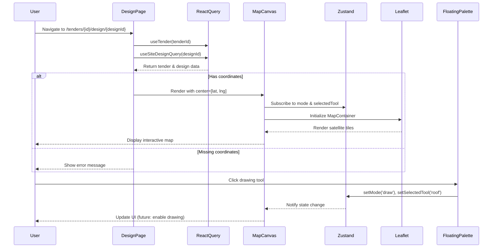

I have created the following plan after thorough exploration and analysis of the codebase. Follow the below plan verbatim. Trust the files and references. Do not re-verify what's written in the plan. Explore only when absolutely necessary. First implement all the proposed file changes and then I'll review all the changes together at the end.

## Observations

The codebase already has all required dependencies installed (`react-leaflet`, `leaflet`, `@turf/turf`, `@types/leaflet`) and Leaflet CSS is imported in file:frontend/src/app/layout.tsx. The map configuration utilities exist in file:frontend/src/lib/mapConfig.ts with satellite tile layers configured. The Zustand store (file:frontend/src/stores/useDesignCanvasStore.ts) manages drawing mode state, and React Query hooks (file:frontend/src/hooks/useSiteDesigns.ts) handle site design data with optimistic updates. The DesignCanvas layout components (CanvasLayout, Toolbar, FloatingPalette, RightPanel) are ready. The design page route exists but is empty.

## Approach

Implement a client-side MapCanvas component using React-Leaflet with dynamic import to avoid Next.js SSR issues. The component will display satellite imagery centered on tender coordinates, integrate with Zustand for drawing mode state, and be wrapped in the existing CanvasLayout. The design page will fetch both tender and design data, handle loading states, and conditionally render the map only when coordinates are available. This approach leverages existing infrastructure while maintaining separation of concerns between map rendering and state management.

## Implementation Steps

### 1. Create MapCanvas Component

Create file:frontend/src/components/DesignCanvas/MapCanvas.tsx as a client component:

**Component Structure:**
- Mark with `"use client"` directive at the top
- Import `MapContainer`, `TileLayer`, `ZoomControl` from `react-leaflet`
- Import Leaflet types: `LatLngExpression`
- Import map configuration from file:frontend/src/lib/mapConfig.ts
- Import Zustand store from file:frontend/src/stores/useDesignCanvasStore.ts

**Props Interface:**
- `center`: `[number, number]` - latitude and longitude from tender
- `designId`: `string` - for future layer integration
- `tenderId`: `string` - for context

**Map Configuration:**
- Use `MapContainer` with center prop, zoom level 18 (close-up for site design)
- Set `scrollWheelZoom={true}` for mouse wheel zoom
- Set `zoomControl={false}` to disable default zoom control
- Add custom `ZoomControl` positioned at `topleft` (avoiding FloatingPalette at top-left)
- Set container style: `height: "100%", width: "100%"` to fill parent

**Tile Layer:**
- Use `TILE_LAYERS.satellite` from mapConfig
- Pass `url` and `attribution` props to `TileLayer`
- Set `maxZoom={20}` for detailed satellite imagery

**State Integration:**
- Access `mode` and `selectedTool` from Zustand store
- Add `useEffect` to log mode changes (for debugging drawing integration in future phases)
- Add placeholder comment for future polygon drawing layer integration

**Styling:**
- Ensure map container has `position: relative` and fills parent
- Add `z-index: 1` to keep map below FloatingPalette (z-20)

### 2. Update Design Page

Update file:frontend/src/app/tenders/[id]/design/[designId]/page.tsx:

**Page Setup:**
- Mark with `"use client"` directive
- Import `useParams` from `next/navigation`
- Import `useMemo` from `react`
- Import `dynamic` from `next/dynamic`
- Import `CanvasLayout` from file:frontend/src/components/DesignCanvas/CanvasLayout.tsx
- Import hooks: `useSiteDesignQuery` from file:frontend/src/hooks/useSiteDesigns.ts and `useTender` from file:frontend/src/lib/hooks/useTenders.ts
- Import `LoadingSpinner` and `ErrorMessage` from file:frontend/src/components/common

**Dynamic Import:**
- Use `useMemo` to create dynamic import of MapCanvas
- Set `ssr: false` to prevent server-side rendering
- Add loading fallback: `
<LoadingSpinner />
`

**Data Fetching:**
- Extract `id` (tenderId) and `designId` from `useParams`
- Call `useTender(id)` to get tender data (for coordinates)
- Call `useSiteDesignQuery(designId)` to get design data
- Handle loading states for both queries
- Handle error states with `ErrorMessage` component

**Conditional Rendering:**
- If loading: show full-screen `LoadingSpinner` within `CanvasLayout`
- If error or missing data: show `ErrorMessage` with navigation back to tender
- If tender missing coordinates: show warning message to update tender with location
- If all data valid: render `MapCanvas` with tender coordinates

**Layout Integration:**
- Wrap everything in `CanvasLayout` with `title={design.name}` and `tenderId={id}`
- Pass `center={[tender.latitude, tender.longitude]}` to MapCanvas
- Pass `designId` and `tenderId` props to MapCanvas

### 3. Handle Edge Cases

**Missing Coordinates:**
- Check if `tender.latitude` and `tender.longitude` exist
- If missing, render helpful message: "Please add location coordinates to the tender to use the design canvas"
- Provide button to navigate back to tender edit page

**Loading States:**
- Show skeleton/spinner while tender or design data loads
- Ensure Toolbar shows correct title even during loading
- Prevent map render until coordinates are confirmed available

**Error Handling:**
- Catch and display API errors from both tender and design queries
- Provide retry mechanism or navigation back to safety
- Log errors to console for debugging

### 4. Verify Integration Points

**Zustand Store Integration:**
- Confirm MapCanvas reads `mode` and `selectedTool` from store
- Verify FloatingPalette updates store state correctly (already implemented)
- Test that mode changes are reflected in MapCanvas (via console logs for now)

**React Query Integration:**
- Verify `useSiteDesignQuery` fetches design data correctly
- Confirm `useTender` provides tender coordinates
- Check that query keys from file:frontend/src/lib/queryKeys.ts are used correctly

**Layout Component Integration:**
- Ensure MapCanvas fills the canvas area within CanvasLayout
- Verify FloatingPalette appears above map (z-index layering)
- Confirm RightPanel toggles without affecting map
- Test Toolbar displays design name and sync state

## Visual Reference

## File References

- file:frontend/src/components/DesignCanvas/MapCanvas.tsx (create new)
- file:frontend/src/app/tenders/[id]/design/[designId]/page.tsx (update)
- file:frontend/src/stores/useDesignCanvasStore.ts (existing)
- file:frontend/src/hooks/useSiteDesigns.ts (existing)
- file:frontend/src/lib/hooks/useTenders.ts (existing)
- file:frontend/src/lib/mapConfig.ts (existing)
- file:frontend/src/components/DesignCanvas/CanvasLayout.tsx (existing)
- file:frontend/src/components/DesignCanvas/FloatingPalette.tsx (existing)