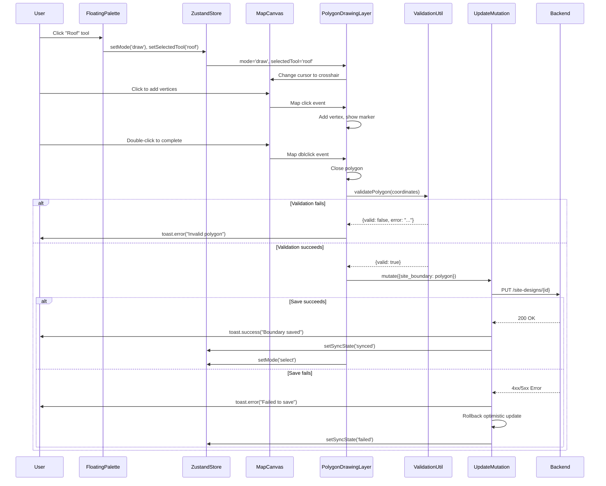

I have created the following plan after thorough exploration and analysis of the codebase. Follow the below plan verbatim. Trust the files and references. Do not re-verify what's written in the plan. Explore only when absolutely necessary. First implement all the proposed file changes and then I'll review all the changes together at the end.

## Observations

The codebase already has the required dependencies installed (`react-leaflet`, `leaflet`, `@turf/turf`, `@types/leaflet`). The `MapCanvas` component is set up with satellite tiles, the `FloatingPalette` component manages tool selection via Zustand store, and the `useSiteDesigns` hooks provide optimistic updates with rollback on failure. Toast notifications use the `sonner` library with a consistent pattern (`toast.success/error/warning`). The backend validates GeoJSON polygons for structure, closure, minimum vertices, and self-intersections using Shapely.

## Approach

The implementation will create a `PolygonDrawingLayer` component that integrates with React-Leaflet's event system to capture map clicks and build polygon vertices. Frontend validation using `@turf/turf` (specifically `turf.kinks()` for self-intersections and basic coordinate checks) will occur before saving. The component will consume the Zustand store's `mode` and `selectedTool` state to determine when drawing is active and which geometry type to create. Upon completion (double-click or Enter key), the polygon will be validated and saved via `useUpdateSiteDesignMutation`, triggering optimistic updates and toast notifications for success/failure.

## Implementation Steps

### 1. Create Validation Utility Module

Create `file:frontend/src/lib/geojsonValidation.ts` to centralize GeoJSON polygon validation logic:

- Import `@turf/turf` functions: `kinks`, `polygon`, `area`
- Implement `validatePolygon(coordinates: number[][][])` function that:
  - Checks minimum 3 unique vertices (4 coordinates including closure)
  - Verifies first and last coordinates match (closure)
  - Validates coordinate ranges (-180 to 180 for longitude, -90 to 90 for latitude)
  - Uses `turf.kinks()` to detect self-intersections
  - Returns `{ valid: boolean, error?: string }` object
- Export validation function for reuse across components

### 2. Implement PolygonDrawingLayer Component

Create `file:frontend/src/components/DesignCanvas/PolygonDrawingLayer.tsx`:

**Component Structure:**
- Accept props: `designId: string`, `currentBoundary: GeoJSONPolygon | null`, `exclusionZones: GeoJSONPolygon[]`
- Use `useMap()` hook from `react-leaflet` to access map instance
- Consume `mode`, `selectedTool` from `useDesignCanvasStore`
- Use `useUpdateSiteDesignMutation(designId)` for saving

**State Management:**
- Local state for `vertices: [number, number][]` (current drawing vertices)
- Local state for `isDrawing: boolean`
- Local state for `tempMarkers: L.Marker[]` (visual feedback for vertices)
- Local state for `tempPolyline: L.Polyline | null` (preview line)

**Drawing Interaction Logic:**
- Use `useMapEvents` hook from `react-leaflet` to listen for:
  - `click`: Add vertex to `vertices` array, create marker, update preview polyline
  - `dblclick`: Complete polygon (prevent default map zoom)
  - `keydown`: Listen for Enter key to complete polygon
- When `mode` changes to 'select' or `selectedTool` changes, clear current drawing state
- Display vertex markers with numbered labels (1, 2, 3...) for user clarity
- Show connecting polyline between vertices as user draws

**Polygon Completion Flow:**
- On double-click or Enter key:
  1. Prevent adding duplicate vertex on double-click
  2. Check minimum 3 vertices, show `toast.error("Boundary must have at least 3 points")` if invalid
  3. Close polygon by appending first vertex to end
  4. Create GeoJSON polygon structure: `{ type: 'Polygon', coordinates: [[...vertices]] }`
  5. Call `validatePolygon()` from validation utility
  6. If validation fails, show `toast.error("Invalid polygon", { description: error })` and keep drawing active
  7. If valid, determine update payload based on `selectedTool`:
     - 'roof', 'ground', 'carport': Update `site_boundary` and `site_type`
     - 'exclusion': Append to `exclusion_zones` array
  8. Call `updateDesignMutation.mutate(payload)`
  9. Clear drawing state (vertices, markers, polyline)
  10. Set mode to 'select' via `setMode('select')`

**Cleanup:**
- Use `useEffect` to remove markers and polylines when component unmounts or drawing is cancelled
- Clear Leaflet layers properly to prevent memory leaks

### 3. Update FloatingPalette Component

Modify `file:frontend/src/components/DesignCanvas/FloatingPalette.tsx`:

- Add visual indicator when drawing mode is active (e.g., pulsing border on selected tool)
- Add tooltip text: "Click to place vertices, double-click or press Enter to complete"
- Consider adding a "Cancel Drawing" button that appears when `mode === 'draw'` to reset state

### 4. Integrate PolygonDrawingLayer into MapCanvas

Modify `file:frontend/src/components/DesignCanvas/MapCanvas.tsx`:

- Import `PolygonDrawingLayer` component
- Fetch current design data using `useSiteDesignQuery(designId)` (already available in parent, pass as prop or fetch here)
- Add `PolygonDrawingLayer` as child of `MapContainer`:
  ```tsx
  <MapContainer ...>
    <TileLayer ... />
    <ZoomControl ... />
    <PolygonDrawingLayer 
      designId={designId}
      currentBoundary={design?.site_boundary || null}
      exclusionZones={design?.exclusion_zones || []}
    />
  </MapContainer>
  ```
- Update cursor style based on drawing mode using CSS classes or inline styles
- When `mode === 'draw'`, set cursor to `crosshair`

### 5. Add Toast Notifications for Save Operations

Enhance `file:frontend/src/hooks/useSiteDesigns.ts`:

- In `useUpdateSiteDesignMutation`:
  - Add `onSuccess` callback: `toast.success("Boundary saved", { description: "Site boundary updated successfully" })`
  - Update `onError` callback: `toast.error("Failed to save boundary", { description: "Please try again or check your connection" })`
- Ensure optimistic update rollback shows appropriate error message

### 6. Handle Edge Cases and User Experience

**Keyboard Shortcuts:**
- Escape key: Cancel current drawing, clear vertices, return to select mode
- Backspace/Delete: Remove last vertex (undo last click)

**Visual Feedback:**
- Show semi-transparent fill preview when 3+ vertices are placed
- Highlight invalid areas (e.g., red outline if self-intersection detected on hover)
- Display vertex count badge near cursor or in toolbar

**Error Handling:**
- Network errors during save: Show retry option in toast
- Validation errors: Keep drawing active, highlight problematic vertices
- Concurrent edits: Handle optimistic update conflicts gracefully

### 7. Update Zustand Store (Optional Enhancement)

Modify `file:frontend/src/stores/useDesignCanvasStore.ts` if needed:

- Add `drawingVertices: [number, number][]` to persist drawing state across re-renders
- Add `setDrawingVertices` action
- This allows drawing to survive component re-mounts (optional, may not be needed)

### 8. Add Cursor and Visual State Indicators

**Map Cursor Styling:**
- Create CSS class in `file:frontend/src/app/globals.css`:
  ```css
  .leaflet-container.drawing-mode {
    cursor: crosshair !important;
  }
  .leaflet-container.drawing-mode * {
    cursor: crosshair !important;
  }
  ```
- Apply class to map container when `mode === 'draw'`

**Drawing Instructions Overlay:**
- Add floating instruction card that appears when drawing starts:
  - "Click to add vertices"
  - "Double-click or press Enter to complete"
  - "Press Escape to cancel"
- Position in top-center of map, auto-hide after 5 seconds or on first vertex placement

## Validation Rules Summary

Frontend validation using `@turf/turf`:
1. **Minimum vertices**: At least 3 unique points (4 coordinates with closure)
2. **Closure**: First coordinate must equal last coordinate
3. **Coordinate ranges**: Longitude [-180, 180], Latitude [-90, 90]
4. **Self-intersection**: Use `turf.kinks()` - empty array means valid
5. **Non-zero area**: Use `turf.area()` to ensure polygon has area > 0

## Component Interaction Flow



## Files to Create

1. `file:frontend/src/lib/geojsonValidation.ts` - Validation utility
2. `file:frontend/src/components/DesignCanvas/PolygonDrawingLayer.tsx` - Main drawing component

## Files to Modify

1. `file:frontend/src/components/DesignCanvas/MapCanvas.tsx` - Integrate drawing layer
2. `file:frontend/src/components/DesignCanvas/FloatingPalette.tsx` - Add visual feedback
3. `file:frontend/src/hooks/useSiteDesigns.ts` - Add toast notifications
4. `file:frontend/src/app/globals.css` - Add cursor styles (optional)

## Testing Considerations

While unit tests are mentioned in subsequent phases, ensure the implementation supports testability:
- Export validation functions separately for unit testing
- Use dependency injection for map instance where possible
- Mock Zustand store and React Query hooks in tests
- Test validation logic independently from React components