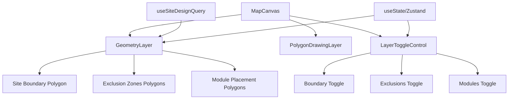

I have created the following plan after thorough exploration and analysis of the codebase. Follow the below plan verbatim. Trust the files and references. Do not re-verify what's written in the plan. Explore only when absolutely necessary. First implement all the proposed file changes and then I'll review all the changes together at the end.

## Observations

The codebase uses React-Leaflet for map rendering with a clean component structure. The `MapCanvas` component currently renders `PolygonDrawingLayer` for interactive drawing. Site design data is fetched via `useSiteDesignQuery` hook, returning `SiteDesignResponse` with `site_boundary`, `exclusion_zones`, and `module_placements` as GeoJSON structures. Module placements are GeoJSON Features with Polygon geometries. The UI follows shadcn/ui patterns with Tailwind CSS styling. The `RightPanel` component provides a collapsible properties panel, ideal for layer controls.

## Approach

Create a dedicated `GeometryLayer` component to render all existing geometries (boundaries, exclusions, modules) on the map. Use React-Leaflet's `Polygon` component for rendering with distinct styling based on geometry type and site type. Implement layer visibility toggles using local state with Switch components, positioned in a floating control panel or integrated into the existing UI. The component will consume data from `useSiteDesignQuery` and render geometries conditionally based on toggle states. This approach maintains separation of concerns and follows existing patterns.

## Implementation Steps

### 1. Create GeometryLayer Component

Create file:frontend/src/components/DesignCanvas/GeometryLayer.tsx

**Component Structure:**
- Accept `designId` as prop
- Use `useSiteDesignQuery(designId)` to fetch design data
- Manage layer visibility state using `useState` for boundaries, exclusions, and modules
- Render geometries using React-Leaflet's `Polygon` component

**Rendering Logic:**

**Site Boundary Rendering:**
- Convert GeoJSON Polygon coordinates from `[lng, lat]` to Leaflet's `[lat, lng]` format
- Apply distinct styling based on `site_type`:
  - **Rooftop**: Blue stroke (`#3b82f6`), light blue fill (`#bfdbfe`), 30% opacity
  - **Ground Mount**: Green stroke (`#22c55e`), light green fill (`#bbf7d0`), 30% opacity
  - **Carport**: Purple stroke (`#a855f7`), light purple fill (`#e9d5ff`), 30% opacity
- Use stroke weight of 2-3px with semi-transparent fill

**Exclusion Zones Rendering:**
- Convert GeoJSON coordinates to Leaflet format
- Apply darker styling: Red stroke (`#ef4444`), dark red fill (`#fca5a5`), 40% opacity
- Use dashed stroke pattern (`dashArray: '8, 4'`) to distinguish from boundaries
- Render all exclusion zones from the `exclusion_zones` array

**Module Placements Rendering:**
- Iterate through `module_placements` array (GeoJSON Features)
- Extract Polygon coordinates from each feature's `geometry`
- Convert coordinates to Leaflet format
- Render as small rectangles with:
  - Dark gray stroke (`#374151`), weight 1px
  - Light gray fill (`#d1d5db`), 60% opacity
  - On hover: Increase opacity to 80% for visual feedback

**Coordinate Conversion Helper:**
```typescript
// Helper function to convert GeoJSON coordinates to Leaflet format
const geojsonToLeaflet = (coords: number[][][]): [number, number][][] => {
  return coords.map(ring => 
    ring.map(([lng, lat]) => [lat, lng] as [number, number])
  );
};
```

### 2. Add Layer Toggle Controls

**Option A: Floating Control Panel (Recommended)**

Create a floating control panel positioned in the top-right corner of the map (below the debug status indicator):

- Use a Card component with white background, shadow, and border
- Position absolutely with `z-[400]` to stay above map layers
- Include three Switch components with Labels:
  - "Site Boundary" toggle
  - "Exclusion Zones" toggle  
  - "Module Placements" toggle
- Use icons from `lucide-react` (e.g., `Layers`, `Ban`, `Grid3x3`)
- Style with compact spacing and small text

**Option B: Integrate into RightPanel**

Add a new Card section in file:frontend/src/components/DesignCanvas/RightPanel.tsx:

- Add "Layer Visibility" card above Equipment card
- Use `Layers` icon from lucide-react
- Include the same three Switch components
- Pass layer visibility state via Zustand store or props

**Recommended: Option A** for better visibility and quick access without opening the panel.

### 3. Implement Layer Visibility State Management

**Local State Approach (Simpler):**
- Use `useState` in `GeometryLayer` component:
  ```typescript
  const [showBoundary, setShowBoundary] = useState(true);
  const [showExclusions, setShowExclusions] = useState(true);
  const [showModules, setShowModules] = useState(true);
  ```
- Pass state and setters to the toggle control component as props

**Zustand Store Approach (More Scalable):**
- Extend file:frontend/src/stores/useDesignCanvasStore.ts with:
  ```typescript
  layerVisibility: {
    boundary: boolean;
    exclusions: boolean;
    modules: boolean;
  }
  toggleLayer: (layer: 'boundary' | 'exclusions' | 'modules') => void;
  ```
- Access in both `GeometryLayer` and toggle controls

**Recommendation:** Start with local state for simplicity, migrate to Zustand if other components need access.

### 4. Integrate GeometryLayer into MapCanvas

Update file:frontend/src/components/DesignCanvas/MapCanvas.tsx:

- Import `GeometryLayer` component
- Add below `PolygonDrawingLayer` in the render tree:
  ```tsx
  <GeometryLayer designId={designId} />
  <PolygonDrawingLayer designId={designId} />
  ```
- Ensure `GeometryLayer` renders before `PolygonDrawingLayer` so drawing layer appears on top

### 5. Handle Loading and Error States

In `GeometryLayer` component:

- Check `isLoading` and `error` from `useSiteDesignQuery`
- Return `null` if loading or error (fail silently, as parent page handles errors)
- Return `null` if no design data available
- Only render geometries when data is successfully loaded

### 6. Add Conditional Rendering Based on Toggles

Wrap each geometry rendering section with conditional checks:

```tsx
{showBoundary && design.site_boundary && (
  <Polygon positions={...} pathOptions={...} />
)}

{showExclusions && design.exclusion_zones.map((zone, idx) => (
  <Polygon key={`exclusion-${idx}`} positions={...} pathOptions={...} />
))}

{showModules && design.module_placements.map((feature, idx) => (
  <Polygon key={`module-${idx}`} positions={...} pathOptions={...} />
))}
```

### 7. Optimize Performance for Large Module Arrays

For designs with many modules (>1000):

- Consider using React-Leaflet's `Pane` component to group modules
- Implement virtualization or clustering if performance issues arise
- Use `useMemo` to memoize coordinate conversions
- Add a module count threshold (e.g., show simplified view if >5000 modules)

### 8. Add Visual Feedback and Tooltips

**Hover Effects:**
- Use React-Leaflet's event handlers (`eventHandlers` prop)
- On `mouseover`: Increase opacity or change stroke color
- On `mouseout`: Restore original styling

**Tooltips (Optional):**
- Add `Tooltip` component from React-Leaflet to show:
  - Site boundary: Site type and area
  - Exclusion zones: "Exclusion Zone"
  - Modules: Module count or index

**Example:**
```tsx
<Polygon
  positions={...}
  pathOptions={...}
  eventHandlers={{
    mouseover: (e) => e.target.setStyle({ fillOpacity: 0.5 }),
    mouseout: (e) => e.target.setStyle({ fillOpacity: 0.3 })
  }}
>
  <Tooltip>Site Boundary - {design.site_type}</Tooltip>
</Polygon>
```

## Component Architecture



## Styling Reference

| Geometry Type | Stroke Color | Fill Color | Opacity | Special |
|--------------|-------------|------------|---------|---------|
| Rooftop Boundary | `#3b82f6` | `#bfdbfe` | 30% | Solid stroke |
| Ground Boundary | `#22c55e` | `#bbf7d0` | 30% | Solid stroke |
| Carport Boundary | `#a855f7` | `#e9d5ff` | 30% | Solid stroke |
| Exclusion Zone | `#ef4444` | `#fca5a5` | 40% | Dashed stroke |
| Module Placement | `#374151` | `#d1d5db` | 60% | Thin stroke |

## Files to Create/Modify

**Create:**
- file:frontend/src/components/DesignCanvas/GeometryLayer.tsx
- file:frontend/src/components/DesignCanvas/LayerToggleControl.tsx (if using separate component)

**Modify:**
- file:frontend/src/components/DesignCanvas/MapCanvas.tsx (add GeometryLayer)
- file:frontend/src/stores/useDesignCanvasStore.ts (if using Zustand for layer visibility)