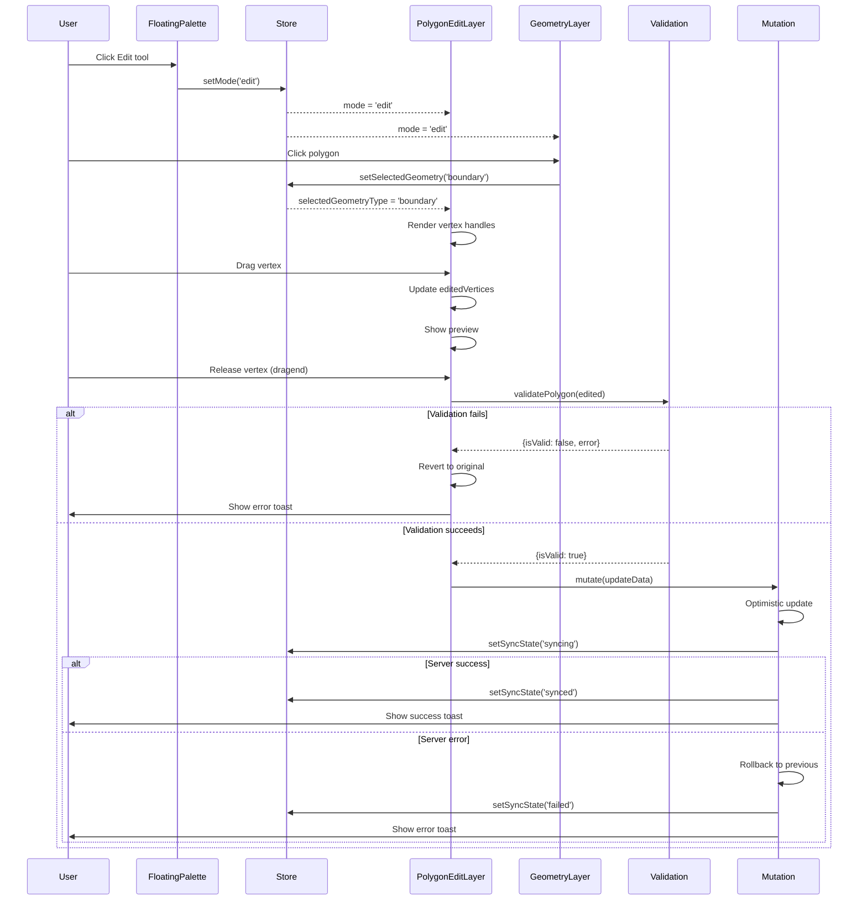

I have created the following plan after thorough exploration and analysis of the codebase. Follow the below plan verbatim. Trust the files and references. Do not re-verify what's written in the plan. Explore only when absolutely necessary. First implement all the proposed file changes and then I'll review all the changes together at the end.

## Observations

The codebase has a well-structured map-based design canvas using React-Leaflet with Zustand for state management. The existing `PolygonDrawingLayer` demonstrates a clean pattern for interactive polygon creation with validation using `@turf/turf`. The `useUpdateSiteDesignMutation` hook already implements optimistic updates with rollback, which can be leveraged for editing. The `FloatingPalette` currently has drawing tools but lacks an edit mode. The `GeometryLayer` renders existing polygons but doesn't support interaction for editing.

## Approach

Implement polygon editing by extending the existing architecture: add an 'edit' mode to the Zustand store, introduce an "Edit" tool in `FloatingPalette`, and create a new `PolygonEditLayer` component that enables vertex manipulation. The component will follow the same validation and mutation patterns as `PolygonDrawingLayer`, using optimistic updates with automatic rollback on validation failure. Visual feedback will be provided through highlighted vertices and edges, with Leaflet markers for draggable vertex handles.

## Implementation Steps

### 1. Extend Zustand Store for Edit Mode

Update `file:frontend/src/stores/useDesignCanvasStore.ts`:

- Add `'edit'` to the `mode` type union: `mode: 'select' | 'draw' | 'edit'`
- Add state for tracking selected geometry:
  - `selectedGeometryType: 'boundary' | 'exclusion' | null`
  - `selectedExclusionIndex: number | null` (for tracking which exclusion zone is selected)
- Add actions:
  - `setSelectedGeometry(type: 'boundary' | 'exclusion' | null, index?: number)`
  - `clearSelection()`

### 2. Add Edit Tool to FloatingPalette

Update `file:frontend/src/components/DesignCanvas/FloatingPalette.tsx`:

- Import `Edit` icon from `lucide-react`
- Add edit tool to the tools array: `{ id: 'edit', icon: Edit, label: 'Edit' }`
- Update click handler to set mode to `'edit'` when edit tool is selected
- Position the edit tool between 'select' and drawing tools for logical grouping

### 3. Create PolygonEditLayer Component

Create `file:frontend/src/components/DesignCanvas/PolygonEditLayer.tsx`:

**Component Structure:**
- Accept `designId` prop
- Use `useDesignCanvasStore` to access mode, selectedGeometryType, selectedExclusionIndex
- Use `useSiteDesignQuery` to fetch current design data
- Use `useUpdateSiteDesignMutation` for saving edits

**Selection Logic:**
- When mode is 'edit', listen for polygon clicks using `useMapEvents`
- On polygon click, determine if it's site_boundary or an exclusion_zone
- Update store with selected geometry type and index
- Highlight selected polygon with distinct styling (thicker border, different color)

**Vertex Editing:**
- When a polygon is selected, render draggable `Marker` components at each vertex
- Use Leaflet's `divIcon` to create custom vertex handles (circular dots, larger than drawing vertices)
- Track vertex positions in local state: `editedVertices: [number, number][]`
- Initialize `editedVertices` from selected polygon's coordinates on selection

**Drag Interaction:**
- Implement `eventHandlers` on each vertex Marker with `dragend` event
- On drag, update the corresponding vertex in `editedVertices` array
- Show real-time preview by rendering a `Polygon` with `editedVertices`
- Add visual feedback: selected vertex has different color/size

**Validation and Saving:**
- On vertex drag end, validate the edited polygon using `validatePolygon` from `file:frontend/src/lib/geojsonValidation.ts`
- If validation fails:
  - Show error toast with validation message
  - Revert `editedVertices` to original coordinates (rollback)
  - Do NOT call mutation
- If validation succeeds:
  - Convert Leaflet coordinates to GeoJSON format
  - Prepare update payload based on `selectedGeometryType`:
    - For 'boundary': `{ site_boundary: newPolygon }`
    - For 'exclusion': update the specific exclusion zone in the array
  - Call `updateMutation.mutate()` with optimistic update
  - The mutation's built-in rollback will handle server errors

**Visual Feedback:**
- Selected polygon: stroke color `#8b5cf6` (purple), weight 4, fillOpacity 0.2
- Unselected polygons: maintain original styling from GeometryLayer
- Vertex handles: white circles with purple border, 12px diameter
- Active (dragging) vertex: purple fill, 14px diameter
- Edge highlighting: dashed line connecting vertices when polygon is selected

**Keyboard Shortcuts:**
- `Escape`: Deselect current polygon and exit edit mode
- `Delete`: Remove selected exclusion zone (not applicable to site_boundary)

### 4. Integrate PolygonEditLayer into MapCanvas

Update `file:frontend/src/components/DesignCanvas/MapCanvas.tsx`:

- Import `PolygonEditLayer`
- Add component after `GeometryLayer` and `PolygonDrawingLayer`:
  ```
  <PolygonEditLayer designId={designId} />
  ```
- Ensure z-index layering is correct (edit layer should be on top for interaction)

### 5. Update GeometryLayer for Edit Mode Interaction

Update `file:frontend/src/components/DesignCanvas/GeometryLayer.tsx`:

- Add click event handlers to rendered polygons when mode is 'edit'
- Use `eventHandlers` prop on `Polygon` components
- On click, call `setSelectedGeometry` from store
- Apply conditional styling based on whether polygon is selected
- Disable layer toggle controls when in edit mode (to prevent confusion)

### 6. Handle Edge Cases and Cleanup

**Optimistic Update Rollback:**
- The existing `useUpdateSiteDesignMutation` already handles rollback via `onError` callback
- Ensure `editedVertices` state is reset after successful save
- On rollback, the query invalidation will trigger re-render with original data

**Mode Transitions:**
- When switching from 'edit' to 'draw' or 'select', clear selection state
- Add `useEffect` in PolygonEditLayer to reset local state on mode change

**Multi-polygon Support:**
- For exclusion zones, ensure only one can be edited at a time
- Provide visual indication of which exclusion zone is selected (index-based)

**Validation Error Handling:**
- Show specific error messages from validation (e.g., "Polygon cannot self-intersect")
- Prevent saving invalid geometries
- Provide visual feedback (red border flash) when validation fails

## Visual Diagram

