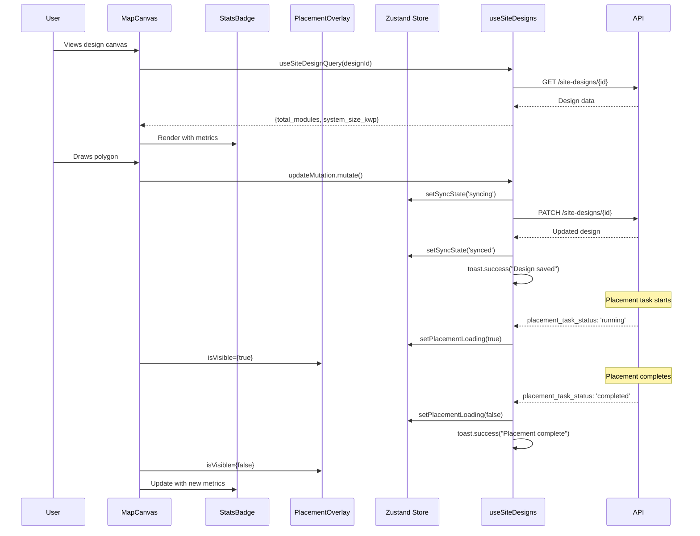

I have created the following plan after thorough exploration and analysis of the codebase. Follow the below plan verbatim. Trust the files and references. Do not re-verify what's written in the plan. Explore only when absolutely necessary. First implement all the proposed file changes and then I'll review all the changes together at the end.

## Observations

The codebase already has a solid foundation for UI feedback:
- Sync state management exists in `useDesignCanvasStore` with states: 'pending', 'syncing', 'synced', 'failed'
- Toast notifications are configured using Sonner library and already integrated in `useUpdateSiteDesignMutation`
- Toolbar component displays sync state indicator with icons (Loader2, Check, AlertCircle)
- `SiteDesignResponse` type includes `total_modules`, `system_size_kwp`, and `placement_task_status` fields
- MapCanvas has a debug status indicator in top-left, leaving top-right available for StatsBadge

## Approach

The implementation focuses on creating visual feedback components that integrate with existing state management. The StatsBadge will display real-time design metrics from the site design query data. A full-screen loading overlay will be added for placement calculations, triggered by monitoring the `placement_task_status` field. The Zustand store will be extended with a `placementLoading` state to track async placement operations. Toast notifications are already functional through the mutation hooks, but we'll ensure they're properly triggered for all geometry save operations. The sync state indicator in the Toolbar is already complete and working.

## Implementation Steps

### 1. Extend Zustand Store with Placement Loading State

Update file:frontend/src/stores/useDesignCanvasStore.ts:
- Add `placementLoading: boolean` to the state interface
- Add `setPlacementLoading: (loading: boolean) => void` action
- Initialize `placementLoading: false` in the store

### 2. Create StatsBadge Component

Create file:frontend/src/components/DesignCanvas/StatsBadge.tsx:
- Accept props: `totalModules: number`, `systemSizeKwp: number`, `isLoading: boolean`
- Use `Badge` component from file:frontend/src/components/ui/badge.tsx with custom styling
- Display two metrics in a compact card-like layout:
  - Total Modules count with icon
  - System Size in kWp with icon
- Show skeleton/loading state when `isLoading` is true
- Style with semi-transparent background, backdrop blur, and border for overlay effect
- Use Tailwind classes for positioning (will be positioned by parent)
- Add icons from `lucide-react` (e.g., `Zap` for system size, `Grid3x3` for modules)

### 3. Create Loading Overlay Component

Create file:frontend/src/components/DesignCanvas/PlacementLoadingOverlay.tsx:
- Accept props: `isVisible: boolean`, `progress?: number`
- Render full-screen overlay with dark semi-transparent background
- Center a card with:
  - Animated `Loader2` icon from `lucide-react`
  - "Calculating module placement..." text
  - Optional progress indicator if `progress` is provided
  - Subtle animation using Tailwind animate classes
- Use `z-[500]` to ensure it appears above all map elements
- Only render when `isVisible` is true
- Use `Card` component from file:frontend/src/components/ui/card.tsx for the centered content

### 4. Integrate StatsBadge into MapCanvas

Update file:frontend/src/components/DesignCanvas/MapCanvas.tsx:
- Import `StatsBadge` component
- Import `useSiteDesignQuery` from file:frontend/src/hooks/useSiteDesigns.ts
- Fetch design data using `useSiteDesignQuery(designId)`
- Extract `total_modules` and `system_size_kwp` from query data
- Position StatsBadge in top-right corner using absolute positioning
- Pass loading state from query's `isLoading` property
- Ensure z-index is appropriate (z-[400] to match debug indicator)

### 5. Integrate PlacementLoadingOverlay into MapCanvas

Update file:frontend/src/components/DesignCanvas/MapCanvas.tsx:
- Import `PlacementLoadingOverlay` component
- Import `useDesignCanvasStore` to access `placementLoading` state
- Render overlay component with `isVisible={placementLoading}`
- Position as sibling to MapContainer to cover entire canvas area

### 6. Add Placement Task Monitoring Logic

Update file:frontend/src/hooks/useSiteDesigns.ts or create file:frontend/src/hooks/useDesignCanvas.ts:
- Create custom hook `usePlacementTaskMonitor(designId: string)`
- Use `useSiteDesignQuery` to get current design data
- Monitor `placement_task_status` field changes
- When status is 'pending' or 'running', call `setPlacementLoading(true)`
- When status is 'completed', call `setPlacementLoading(false)` and show success toast
- When status is 'failed', call `setPlacementLoading(false)` and show error toast with `placement_task_error`
- Use `useEffect` to watch for status changes
- Implement polling with `refetchInterval` when task is in progress

### 7. Verify Toast Notifications for Geometry Operations

Review file:frontend/src/hooks/useSiteDesigns.ts:
- Confirm `useUpdateSiteDesignMutation` shows success toast: "Design saved"
- Confirm error toast displays with proper error message
- Verify `useCreateSiteDesignMutation` shows: "Design created successfully"
- Verify `useDeleteSiteDesignMutation` shows: "Design deleted"
- All toast notifications are already implemented - no changes needed

### 8. Update Toolbar Sync State Indicator (Verification Only)

Review file:frontend/src/components/DesignCanvas/Toolbar.tsx:
- Verify sync state indicator displays correctly for all states:
  - 'syncing': Loader2 icon with "Saving..." text
  - 'synced': Check icon with "Saved" text (green)
  - 'failed': AlertCircle icon with "Failed to save" text (red)
- Component is already complete - no changes needed

### 9. Add Visual Feedback to PolygonDrawingLayer

Update file:frontend/src/components/DesignCanvas/PolygonDrawingLayer.tsx:
- Verify toast notifications are triggered on validation errors (already implemented)
- Ensure `setSyncState` is called appropriately through mutation hooks (already handled)
- Add optional: visual feedback during drawing (e.g., vertex count indicator)
- Consider adding: instruction text overlay when in draw mode

### 10. Add Visual Feedback to PolygonEditLayer

Update file:frontend/src/components/DesignCanvas/PolygonEditLayer.tsx:
- Ensure toast notifications are shown on edit save success/failure
- Verify optimistic updates work correctly with rollback on error
- Add visual indicators for selected vertices (highlight, larger markers)
- Show instruction text when in edit mode

## Component Integration Diagram

## File Reference Summary

**New Files to Create:**
- file:frontend/src/components/DesignCanvas/StatsBadge.tsx
- file:frontend/src/components/DesignCanvas/PlacementLoadingOverlay.tsx

**Files to Modify:**
- file:frontend/src/stores/useDesignCanvasStore.ts
- file:frontend/src/components/DesignCanvas/MapCanvas.tsx
- file:frontend/src/hooks/useSiteDesigns.ts (or create new file:frontend/src/hooks/useDesignCanvas.ts)
- file:frontend/src/components/DesignCanvas/PolygonEditLayer.tsx

**Files to Review (No Changes):**
- file:frontend/src/components/DesignCanvas/Toolbar.tsx
- file:frontend/src/components/DesignCanvas/PolygonDrawingLayer.tsx
- file:frontend/src/lib/toast.ts