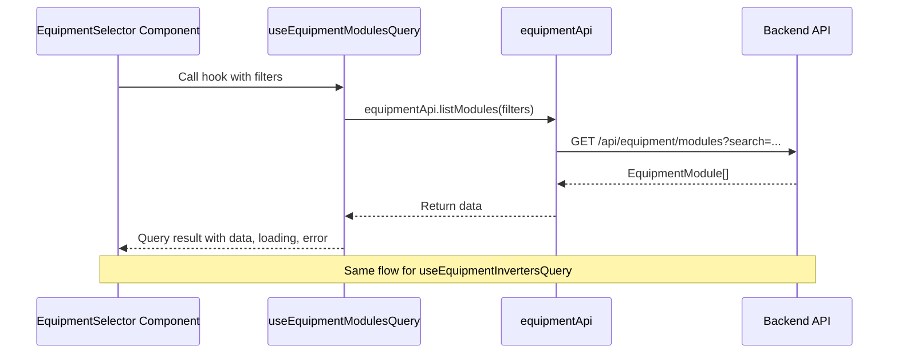

I have created the following plan after thorough exploration and analysis of the codebase. Follow the below plan verbatim. Trust the files and references. Do not re-verify what's written in the plan. Explore only when absolutely necessary. First implement all the proposed file changes and then I'll review all the changes together at the end.

## Observations

The codebase follows a well-structured pattern for API integration with React Query. Backend equipment schemas (`ModuleResponse` and `InverterResponse`) are comprehensive with detailed specifications. The frontend uses a centralized API client (`file:frontend/src/lib/api.ts`), type definitions (`file:frontend/src/types/index.ts`), query key factory (`file:frontend/src/lib/queryKeys.ts`), and custom hooks pattern. Existing hooks like `useSiteDesigns` and `useTenders` demonstrate consistent patterns for queries with proper error handling and toast notifications.

## Approach

The implementation will follow the established patterns in the codebase by: (1) adding TypeScript interfaces matching backend schemas to `file:frontend/src/types/index.ts`, (2) creating API methods in `file:frontend/src/lib/api.ts` following the existing API structure, (3) adding query keys to `file:frontend/src/lib/queryKeys.ts` using the factory pattern, and (4) creating React Query hooks in a new `file:frontend/src/hooks/useEquipment.ts` file following the same patterns as `useSiteDesigns.ts`. This ensures consistency with the existing codebase architecture.

## Implementation Steps

### 1. Add Equipment Type Definitions

Update `file:frontend/src/types/index.ts` to add equipment interfaces matching the backend `ModuleResponse` and `InverterResponse` schemas:

- Add `EquipmentModule` interface with fields: `id` (string), `manufacturer` (string), `model` (string), `wattage` (number), `efficiency` (number), `length_m` (number), `width_m` (number), `thickness_m` (number), `voc` (number), `isc` (number), `vmp` (number), `imp` (number), `tenant_id` (string | null), `is_global` (boolean), `is_active` (boolean), `created_at` (string)

- Add `EquipmentInverter` interface with fields: `id` (string), `manufacturer` (string), `model` (string), `capacity_kw` (number), `max_dc_voltage` (number), `mppt_voltage_range_min` (number), `mppt_voltage_range_max` (number), `max_input_current` (number), `num_mppt_channels` (number), `tenant_id` (string | null), `is_global` (boolean), `is_active` (boolean), `created_at` (string)

- Add these interfaces to the existing type exports at the top of the file alongside other imports

### 2. Create Equipment API Methods

Update `file:frontend/src/lib/api.ts` to add equipment API methods:

- Import the new `EquipmentModule` and `EquipmentInverter` types from `@/types`

- Create `equipmentApi` object following the same pattern as `tendersApi`, `siteDesignsApi`, etc.

- Add `listModules` method that calls `GET /api/equipment/modules` and returns `Promise<EquipmentModule[]>`. Support optional query parameters: `search` (string) and `manufacturer` (string) using URLSearchParams pattern similar to `tendersApi.list`

- Add `listInverters` method that calls `GET /api/equipment/inverters` and returns `Promise<EquipmentInverter[]>`. Support optional query parameters: `search` (string) and `manufacturer` (string)

- Export the `equipmentApi` object at the end of the file

### 3. Add Equipment Query Keys

Update `file:frontend/src/lib/queryKeys.ts` to add equipment query keys:

- Add `equipment` section to the `queryKeys` factory object following the existing pattern

- Define structure:
  ```
  equipment: {
    all: ["equipment"] as const,
    modules: () => [...queryKeys.equipment.all, "modules"] as const,
    modulesList: (filters?: { search?: string; manufacturer?: string }) => 
      [...queryKeys.equipment.modules(), filters] as const,
    inverters: () => [...queryKeys.equipment.all, "inverters"] as const,
    invertersList: (filters?: { search?: string; manufacturer?: string }) => 
      [...queryKeys.equipment.inverters(), filters] as const,
  }
  ```

- This follows the same hierarchical pattern used for tenders, siteDesigns, etc.

### 4. Create Equipment React Query Hooks

Create new file `file:frontend/src/hooks/useEquipment.ts`:

- Import dependencies: `useQuery` from `@tanstack/react-query`, `equipmentApi` from `@/lib/api`, `queryKeys` from `@/lib/queryKeys`, and types `EquipmentModule`, `EquipmentInverter` from `@/types`

- Create `useEquipmentModulesQuery` hook:
  - Accept optional `filters` parameter with shape `{ search?: string; manufacturer?: string }`
  - Use `useQuery` with `queryKey: queryKeys.equipment.modulesList(filters)`
  - Set `queryFn: () => equipmentApi.listModules(filters)`
  - Return the query object directly (following `useSiteDesignQuery` pattern)

- Create `useEquipmentInvertersQuery` hook:
  - Accept optional `filters` parameter with shape `{ search?: string; manufacturer?: string }`
  - Use `useQuery` with `queryKey: queryKeys.equipment.invertersList(filters)`
  - Set `queryFn: () => equipmentApi.listInverters(filters)`
  - Return the query object directly

- Export both hooks as named exports

### 5. Update Hooks Index File

Update `file:frontend/src/hooks/index.ts`:

- Add export statement: `export * from './useEquipment';`
- This makes the hooks available through the centralized hooks barrel export

## Architecture Diagram



## File References

- `file:frontend/src/types/index.ts` - Add EquipmentModule and EquipmentInverter interfaces
- `file:frontend/src/lib/api.ts` - Add equipmentApi with listModules and listInverters methods
- `file:frontend/src/lib/queryKeys.ts` - Add equipment query keys factory
- `file:frontend/src/hooks/useEquipment.ts` - Create new file with React Query hooks
- `file:frontend/src/hooks/index.ts` - Export equipment hooks