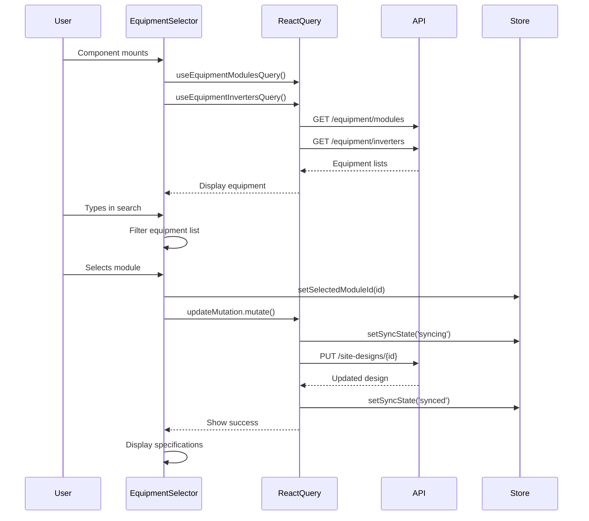

I have created the following plan after thorough exploration and analysis of the codebase. Follow the below plan verbatim. Trust the files and references. Do not re-verify what's written in the plan. Explore only when absolutely necessary. First implement all the proposed file changes and then I'll review all the changes together at the end.

## Observations

The codebase uses shadcn/ui components with React Query for data fetching and Zustand for state management. The equipment hooks (`useEquipmentModulesQuery`, `useEquipmentInvertersQuery`) are already implemented and fetch data from the backend. The `useUpdateSiteDesignMutation` hook provides optimistic updates with retry logic and sync state management. The RightPanel component has placeholder cards ready to be replaced with functional components. The Select component doesn't have built-in search, requiring client-side filtering implementation.

## Approach

Create a new `EquipmentSelector` component that integrates equipment selection with immediate auto-save functionality. Use client-side filtering with an Input component for searchable dropdowns since shadcn Select doesn't support native search. Display equipment specifications in a clean, readable format below each selector. Integrate with existing React Query hooks and mutation patterns, ensuring proper loading states, error handling, and sync state updates through the Zustand store.

## Implementation Steps

### 1. Create EquipmentSelector Component

Create `file:frontend/src/components/DesignCanvas/EquipmentSelector.tsx`:

**Component Structure:**
- Accept `designId` prop to identify which design is being edited
- Use `useSiteDesignQuery(designId)` to get current equipment selections
- Use `useEquipmentModulesQuery()` and `useEquipmentInvertersQuery()` to fetch equipment lists
- Use `useUpdateSiteDesignMutation(designId)` for immediate saves on selection changes

**Module Selector Section:**
- Add Label "Solar Module" with required indicator
- Implement search Input field with placeholder "Search modules..." that filters modules by manufacturer and model
- Use Select component to display filtered modules
- SelectTrigger shows selected module as `{manufacturer} {model} ({wattage}W)` or placeholder "Select a module"
- SelectContent renders filtered modules as SelectItems with format: `{manufacturer} {model} - {wattage}W`
- On selection change, immediately call `updateMutation.mutate({ equipment_module_id: selectedId })`

**Module Specifications Display:**
- Show specifications only when a module is selected
- Display in a grid layout with labels and values:
  - Wattage: `{wattage}W`
  - Efficiency: `{efficiency}%`
  - Dimensions: `{length_m}m × {width_m}m`
  - Electrical: `Voc: {voc}V, Isc: {isc}A`
- Use muted text styling for labels and normal text for values

**Inverter Selector Section:**
- Add Label "Inverter" with required indicator
- Implement search Input field with placeholder "Search inverters..." that filters inverters by manufacturer and model
- Use Select component to display filtered inverters
- SelectTrigger shows selected inverter as `{manufacturer} {model} ({capacity_kw}kW)` or placeholder "Select an inverter"
- SelectContent renders filtered inverters as SelectItems with format: `{manufacturer} {model} - {capacity_kw}kW`
- On selection change, immediately call `updateMutation.mutate({ equipment_inverter_id: selectedId })`

**Inverter Specifications Display:**
- Show specifications only when an inverter is selected
- Display in a grid layout with labels and values:
  - Capacity: `{capacity_kw}kW`
  - Max DC Voltage: `{max_dc_voltage}V`
  - MPPT Range: `{mppt_voltage_range_min}V - {mppt_voltage_range_max}V`
  - MPPT Channels: `{num_mppt_channels}`
- Use muted text styling for labels and normal text for values

**State Management:**
- Use `useState` for search terms (moduleSearch, inverterSearch)
- Use `useMemo` to filter equipment lists based on search terms
- Filter logic: case-insensitive match on manufacturer OR model fields

**Loading States:**
- Show LoadingSpinner component while equipment lists are loading (`modulesQuery.isLoading` or `invertersQuery.isLoading`)
- Disable Select components during mutation (`updateMutation.isPending`)
- Show loading indicator in SelectTrigger when saving

**Error Handling:**
- Use ErrorMessage component if equipment queries fail
- Display error with retry button that refetches the failed query
- Show toast notification on mutation errors (handled by mutation hook)

### 2. Update RightPanel Component

Modify `file:frontend/src/components/DesignCanvas/RightPanel.tsx`:

**Import EquipmentSelector:**
- Add import: `import { EquipmentSelector } from "./EquipmentSelector";`

**Accept designId Prop:**
- Update component signature to accept `designId: string` prop
- Pass designId from parent CanvasLayout component

**Replace Equipment Card:**
- Remove the placeholder Equipment Card (lines 37-45)
- Replace with: `<EquipmentSelector designId={designId} />`
- Keep the Card wrapper with header "Equipment" and Wrench icon
- Place EquipmentSelector in CardContent

**Maintain Layout:**
- Keep existing structure with collapsible panel
- Maintain flex-1 overflow-auto container for scrolling
- Keep gap-4 spacing between cards

### 3. Update CanvasLayout to Pass designId

Modify `file:frontend/src/components/DesignCanvas/CanvasLayout.tsx`:

**Extract designId:**
- Get designId from route params or props
- Pass designId to RightPanel component: `<RightPanel designId={designId} />`

### 4. Add Equipment Selection State to Store

Modify `file:frontend/src/stores/useDesignCanvasStore.ts`:

**Add State Fields:**
- `selectedModuleId: string | null`
- `selectedInverterId: string | null`

**Add Actions:**
- `setSelectedModuleId: (id: string | null) => void`
- `setSelectedInverterId: (id: string | null) => void`

**Initialize State:**
- Set both to `null` in initial state

**Update Actions:**
- Implement setters that update respective state fields

**Purpose:**
- Track equipment selection for use in drawing tool gating (next phase)
- Provide centralized state for equipment selection across components

### 5. Styling and UX Enhancements

**Search Input Styling:**
- Use Input component with Search icon from lucide-react
- Add debouncing (300ms) to search input to reduce re-renders
- Clear button (X icon) to reset search when text is present

**Specifications Layout:**
- Use grid with 2 columns for compact display
- Add subtle border and padding around specs section
- Use Card or bordered div for visual separation

**Empty States:**
- Show "No modules found" message when search returns no results
- Show "No inverters found" message when search returns no results
- Provide helpful text like "Try adjusting your search terms"

**Visual Feedback:**
- Add checkmark icon next to selected equipment in dropdown
- Highlight selected equipment with accent color
- Show sync state indicator (syncing/synced/failed) from store

### 6. Integration Testing Considerations

**Component Behavior:**
- Equipment selection triggers immediate save
- Loading states prevent multiple simultaneous saves
- Error states allow retry without losing selection
- Search filtering works case-insensitively
- Specifications display correctly for all equipment types

**Data Flow:**
- Equipment queries fetch on component mount
- Mutations update cache optimistically
- Store state updates on successful selection
- Parent components react to equipment selection changes

## Visual Structure

