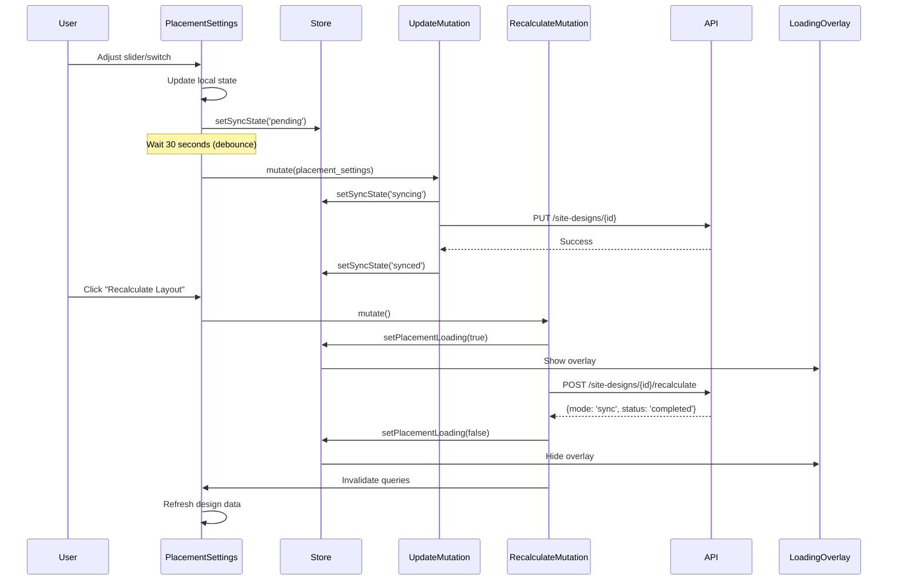

I have created the following plan after thorough exploration and analysis of the codebase. Follow the below plan verbatim. Trust the files and references. Do not re-verify what's written in the plan. Explore only when absolutely necessary. First implement all the proposed file changes and then I'll review all the changes together at the end.

## Observations

The codebase has a well-structured React Query setup with optimistic updates and sync state management. The `useDesignCanvasStore` already tracks placement loading state, and the `PlacementLoadingOverlay` component is ready to use. The backend has a `recalculate_design` service method but the API endpoint is missing. The `PlacementSettings` schema includes all required fields (edge_setback_m, row_spacing_m, module_orientation, azimuth_deg, tilt_deg). The UI components (Slider, Switch, Input) follow shadcn/ui patterns and are already implemented.

## Approach

Create a `PlacementSettings` component that mirrors the `EquipmentSelector` pattern with controlled inputs, debounced auto-save using `useEffect` with a 30-second delay, and immediate save on "Recalculate Layout" button click. The component will integrate with the existing `useUpdateSiteDesignMutation` for auto-save and add a new API method and mutation for the recalculate endpoint. The store will be extended to track placement settings state for local UI updates before debounced save. The recalculate action will trigger the placement loading overlay via the existing store state.

## Implementation Steps

### 1. Add Recalculate API Method

**File**: `file:frontend/src/lib/api.ts`

Add a new method to `siteDesignsApi` object:
- `recalculate: (designId: string) => fetchApi<RecalculateResponse>(\`/site-designs/\${designId}/recalculate\`, { method: "POST" })`

**File**: `file:frontend/src/types/index.ts`

Add the `RecalculateResponse` interface:
- `mode: 'sync' | 'async'`
- `status?: string` (for sync mode)
- `task_id?: string` (for async mode)
- `total_modules?: number`
- `system_size_kwp?: number`
- `estimated_modules?: number`
- `stats?: any`

### 2. Extend Zustand Store for Placement Settings State

**File**: `file:frontend/src/stores/useDesignCanvasStore.ts`

Add to the `DesignCanvasState` interface:
- `placementSettings: Partial<PlacementSettings> | null` - tracks local placement settings before save
- `setPlacementSettings: (settings: Partial<PlacementSettings> | null) => void` - action to update local settings

Add to the store implementation:
- Initialize `placementSettings: null`
- Implement `setPlacementSettings` action that updates the state

### 3. Create Recalculate Mutation Hook

**File**: `file:frontend/src/hooks/useSiteDesigns.ts`

Add `useRecalculatePlacementMutation` hook:
- Use `useMutation` with `siteDesignsApi.recalculate(designId)`
- In `onMutate`: Set `setPlacementLoading(true)` from store
- In `onSuccess`: 
  - If `mode === 'sync'`: Set `setPlacementLoading(false)`, invalidate site design queries, show success toast
  - If `mode === 'async'`: Keep loading true, start polling (or use existing placement monitor)
- In `onError`: Set `setPlacementLoading(false)`, show error toast
- Return mutation object

### 4. Create PlacementSettings Component

**File**: `file:frontend/src/components/DesignCanvas/PlacementSettings.tsx`

Create a new component with the following structure:

**Props**:
- `designId: string`

**State Management**:
- Use `useSiteDesignQuery(designId)` to get current design data
- Use `useUpdateSiteDesignMutation(designId)` for auto-save
- Use `useRecalculatePlacementMutation(designId)` for recalculate button
- Use local state for each setting (edge setback, row spacing, orientation, azimuth)
- Initialize local state from `design.placement_settings` when data loads

**Debounced Auto-Save Logic**:
- Use `useEffect` to watch changes to local settings state
- Set up a 30-second timeout that calls `updateMutation.mutate({ placement_settings: { ...localSettings } })`
- Clear timeout on cleanup and when settings change
- Skip effect on initial mount using a ref

**UI Structure**:
- Loading skeleton while `isLoadingDesign`
- Error alert if query fails
- Edge Setback Slider:
  - Label with current value display (e.g., "Edge Setback: 2.5m")
  - `Slider` component with `min={0.5}`, `max={5}`, `step={0.1}`, `value={[edgeSetback]}`, `onValueChange={(val) => setEdgeSetback(val[0])}`
- Row Spacing Slider:
  - Label with current value display (e.g., "Row Spacing: 3.0m")
  - `Slider` component with `min={1}`, `max={10}`, `step={0.1}`, `value={[rowSpacing]}`, `onValueChange={(val) => setRowSpacing(val[0])}`
- Orientation Toggle:
  - Label "Module Orientation"
  - Flex container with "Portrait" label, `Switch` component, "Landscape" label
  - `Switch` with `checked={orientation === 'landscape'}`, `onCheckedChange={(checked) => setOrientation(checked ? 'landscape' : 'portrait')}`
- Azimuth Input:
  - Label with helper text "Azimuth (0-360°)"
  - `Input` component with `type="number"`, `min={0}`, `max={360}`, `step={1}`, `value={azimuth}`, `onChange={(e) => setAzimuth(Number(e.target.value))}`
- Auto-save indicator:
  - Show small text with sync state from store: "Saved", "Saving...", "Pending save", "Failed to save"
- Recalculate Layout Button:
  - `Button` with `onClick={() => recalculateMutation.mutate()}`, `disabled={recalculateMutation.isPending || !design?.equipment_module_id || !design?.equipment_inverter_id}`
  - Show loading spinner when `recalculateMutation.isPending`
  - Button text: "Recalculate Layout"
  - Helper text below: "Recalculates module placement based on current settings"

**Styling**:
- Use `space-y-4` for vertical spacing between sections
- Use `space-y-2` for label-input pairs
- Use small text (`text-xs`) for value displays and helper text
- Use `text-muted-foreground` for secondary text

### 5. Integrate PlacementSettings into RightPanel

**File**: `file:frontend/src/components/DesignCanvas/RightPanel.tsx`

Replace the placeholder "Placement Settings UI - Out of scope" section:
- Import `PlacementSettings` component
- Replace the `CardContent` with `<PlacementSettings designId={designId} />`
- Remove the placeholder text

### 6. Ensure PlacementLoadingOverlay is Rendered

**File**: `file:frontend/src/components/DesignCanvas/CanvasLayout.tsx` (or wherever the main canvas is rendered)

Verify that `PlacementLoadingOverlay` component is rendered:
- Import `PlacementLoadingOverlay` from `"./PlacementLoadingOverlay"`
- Render it as a sibling to the main canvas content (it uses absolute positioning)
- The overlay automatically shows/hides based on `placementLoading` state from the store

### 7. Add Backend API Endpoint (Note for Backend Team)

**File**: `file:backend/app/api/site_designs.py`

Add the missing recalculate endpoint after the existing routes:
```python
@router.post("/site-designs/{design_id}/recalculate")
async def recalculate_placement(
    design_id: UUID,
    db: Session = Depends(get_db),
    current_user: CurrentUser = Depends(require_role(UserRole.ADMIN, UserRole.PM, UserRole.ENGINEER)),
    site_design_service: SiteDesignService = Depends(get_site_design_service),
):
    """
    Recalculate module placement for a site design.
    Uses hybrid execution (sync for small sites, async for large sites).
    """
    result = site_design_service.recalculate_design(design_id)
    db.commit()
    return result
```

## Visual Flow



## Component Structure

```
RightPanel
├── Equipment Card
│   └── EquipmentSelector
│       ├── Module Select + Specs
│       └── Inverter Select + Specs
└── Placement Settings Card
    └── PlacementSettings
        ├── Edge Setback Slider (0.5-5m)
        ├── Row Spacing Slider (1-10m)
        ├── Orientation Switch (Portrait/Landscape)
        ├── Azimuth Input (0-360°)
        ├── Auto-save Indicator
        └── Recalculate Button
```