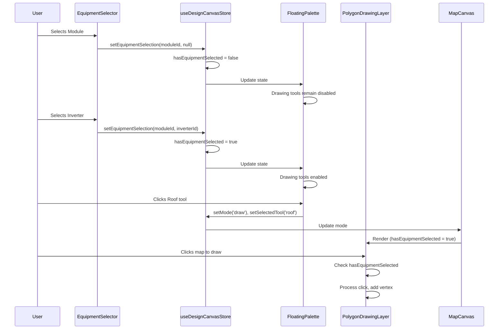

I have created the following plan after thorough exploration and analysis of the codebase. Follow the below plan verbatim. Trust the files and references. Do not re-verify what's written in the plan. Explore only when absolutely necessary. First implement all the proposed file changes and then I'll review all the changes together at the end.

## Observations

The codebase uses a Zustand store (`useDesignCanvasStore`) to manage canvas state (mode, selectedTool) and React Query hooks to fetch design data including equipment selection. The `FloatingPalette` component renders drawing tool buttons (roof, ground, carport, exclusion), and `PolygonDrawingLayer` handles the actual drawing logic by listening to map click events when mode is 'draw'. Equipment selection is stored in the `SiteDesignResponse` object via `equipment_module_id` and `equipment_inverter_id` fields. The UI components library includes a Tooltip component from Radix UI.

## Approach

Add equipment selection gating by tracking equipment state in the Zustand store, disabling drawing tool buttons in `FloatingPalette` when equipment is not selected, showing informative tooltips on disabled buttons, and preventing drawing operations in both `PolygonDrawingLayer` and `MapCanvas` when equipment is missing. This ensures users cannot draw site boundaries or exclusion zones until they've selected both a module and inverter, providing clear visual feedback through disabled button states and helpful tooltip messages.

## Implementation Steps

### 1. Update Zustand Store to Track Equipment Selection State

Modify `file:frontend/src/stores/useDesignCanvasStore.ts`:

- Add new state properties:
  - `hasEquipmentSelected: boolean` - tracks whether both module and inverter are selected
  - `equipmentModuleId: string | null` - stores the selected module ID
  - `equipmentInverterId: string | null` - stores the selected inverter ID

- Add new actions:
  - `setEquipmentSelection(moduleId: string | null, inverterId: string | null)` - updates equipment IDs and automatically sets `hasEquipmentSelected` to `true` when both IDs are present, `false` otherwise
  - `clearEquipmentSelection()` - resets all equipment-related state to null/false

- Initialize state with:
  ```
  hasEquipmentSelected: false
  equipmentModuleId: null
  equipmentInverterId: null
  ```

### 2. Sync Equipment Selection State from Design Data

Update `file:frontend/src/components/DesignCanvas/EquipmentSelector.tsx`:

- Import `useDesignCanvasStore` and extract `setEquipmentSelection` action
- Add `useEffect` hook that watches `design?.equipment_module_id` and `design?.equipment_inverter_id`
- When design data loads or changes, call `setEquipmentSelection(design.equipment_module_id, design.equipment_inverter_id)` to sync store state
- This ensures the store always reflects the current equipment selection from the API

### 3. Disable Drawing Tools in FloatingPalette

Update `file:frontend/src/components/DesignCanvas/FloatingPalette.tsx`:

- Import `TooltipProvider`, `Tooltip`, `TooltipTrigger`, `TooltipContent` from `@/components/ui/tooltip`
- Extract `hasEquipmentSelected` from `useDesignCanvasStore`
- Identify drawing tools (roof, ground, carport, exclusion) - exclude 'select' and 'edit' tools
- Wrap the entire palette in `<TooltipProvider>`
- For each drawing tool button:
  - Add `disabled={!hasEquipmentSelected}` prop to the Button component
  - Wrap the Button in a Tooltip component structure:
    ```
    <Tooltip>
      <TooltipTrigger asChild>
        <Button ... />
      </TooltipTrigger>
      {!hasEquipmentSelected && (
        <TooltipContent side="right">
          <p>Select equipment to enable drawing tools</p>
        </TooltipContent>
      )}
    </Tooltip>
    ```
- Update button styling to show disabled state visually (opacity, cursor not-allowed)
- Ensure 'select' and 'edit' tools remain always enabled

### 4. Prevent Drawing in PolygonDrawingLayer

Update `file:frontend/src/components/DesignCanvas/PolygonDrawingLayer.tsx`:

- Import `useDesignCanvasStore` and extract `hasEquipmentSelected`
- In the `useMapEvents` hook, add equipment check to all event handlers:
  - `click` event: Add `if (!hasEquipmentSelected) return;` before processing click
  - `mousemove` event: Add `if (!hasEquipmentSelected) return;` before updating mouse position
  - `dblclick` event: Add `if (!hasEquipmentSelected) return;` before completing drawing
- In the keyboard event handler (`handleKeyDown`), add equipment check:
  - Add `if (!hasEquipmentSelected) return;` at the start of the handler
- This prevents any drawing operations when equipment is not selected, even if the mode is somehow set to 'draw'

### 5. Add Equipment Check in MapCanvas

Update `file:frontend/src/components/DesignCanvas/MapCanvas.tsx`:

- Import `useDesignCanvasStore` and extract `hasEquipmentSelected`
- Add conditional rendering logic before the `PolygonDrawingLayer` component:
  - Only render `<PolygonDrawingLayer designId={designId} />` when `hasEquipmentSelected` is true
  - This provides an additional safety layer to prevent drawing when equipment is not selected
- Optionally, update the debug status indicator to show equipment selection status:
  - Add equipment status to the debug overlay: `<span>Equipment: {hasEquipmentSelected ? 'Selected' : 'Not Selected'}</span>`

### 6. Handle Edge Cases and User Experience

Additional considerations across all modified files:

- **FloatingPalette**: When equipment becomes selected, ensure previously disabled tools can be clicked immediately (no need to refresh)
- **Store**: When mode is 'draw' and equipment selection is cleared, automatically reset mode to 'select' to prevent invalid state
- **EquipmentSelector**: Show visual feedback when equipment is being saved (already implemented with loading spinner)
- **Tooltip**: Ensure tooltip appears on hover over disabled buttons, not just on click attempts
- **Accessibility**: Ensure disabled buttons have proper `aria-disabled` and `aria-label` attributes for screen readers

## Visual Flow

