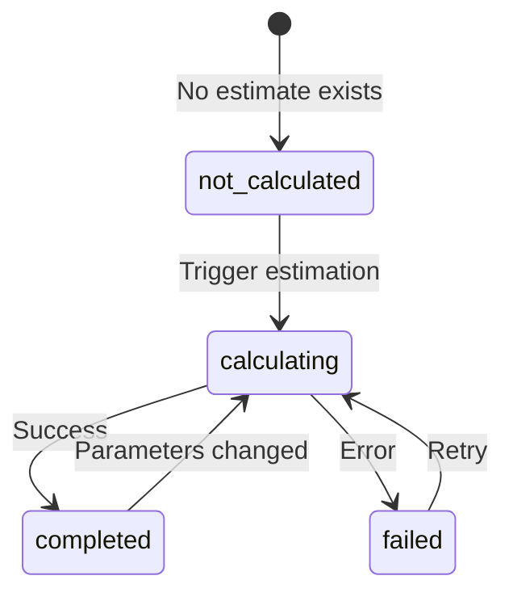

I have created the following plan after thorough exploration and analysis of the codebase. Follow the below plan verbatim. Trust the files and references. Do not re-verify what's written in the plan. Explore only when absolutely necessary. First implement all the proposed file changes and then I'll review all the changes together at the end.

## Observations

The codebase uses TypeScript with strict typing patterns, Pydantic-style schemas on the backend, and comprehensive type definitions in `file:frontend/src/types/index.ts`. The backend already has energy estimation and financial analysis services with well-defined database models (`EnergyEstimate` and `FinancialAnalysis`) and API endpoints. The project uses React Query for data fetching, and the existing type definitions follow a consistent pattern with separate interfaces for requests, responses, and base models. No charting library is currently installed.

## Approach

The implementation will add Recharts as the charting dependency and create TypeScript type definitions that mirror the backend API response structures. The types will follow the existing codebase patterns: using interfaces for API responses, including optional fields where appropriate, and maintaining consistency with the backend Pydantic schemas. The energy estimate types will include status tracking for polling support, while financial analysis types will capture all cost and ROI metrics returned by the backend.

## Implementation Steps

### 1. Install Recharts Dependency

Add the Recharts library to `file:frontend/package.json`:

**Dependencies to add:**
- `recharts`: `^3.7.0` (latest stable version)
- `@types/recharts`: Not needed - Recharts v3.x includes built-in TypeScript definitions

**Installation command reference:**
```
npm install recharts@^3.7.0
```

Add the dependency in the `dependencies` section of `file:frontend/package.json`, maintaining alphabetical order with existing dependencies.

---

### 2. Create Energy Estimate Type Definitions

Add the following type definitions to `file:frontend/src/types/index.ts` after the existing `EquipmentInverter` interface (around line 362):

**Energy Estimate Status Enum:**
Create a type union for energy estimate status values:
- `'not_calculated'` - No estimate exists yet
- `'calculating'` - Async calculation in progress (polling state)
- `'completed'` - Calculation successful
- `'failed'` - Calculation failed with error

**EnergyEstimate Interface:**
Define the complete energy estimate response structure matching the backend API (`/site-designs/{design_id}/energy-estimate`):
- `id`: UUID (optional - not present when status is 'not_calculated')
- `site_design_id`: UUID (optional)
- `status`: Energy estimate status enum
- `annual_energy_kwh`: number
- `monthly_energy_kwh`: Record<string, number> or number[] (12 months of data)
- `capacity_factor`: number
- `error_message`: string | null
- `calculated_at`: string | null (ISO datetime)

**Type naming convention:**
Use `EnergyEstimateResponse` to match the existing pattern (e.g., `TenderResponse`, `UserResponse`)

---

### 3. Create Financial Analysis Type Definitions

Add financial analysis types to `file:frontend/src/types/index.ts` after the energy estimate types:

**FinancialAnalysis Interface:**
Define the complete financial analysis response structure matching the backend API (`/site-designs/{design_id}/financial-analysis`):
- `id`: UUID
- `site_design_id`: UUID
- `system_cost_usd`: number
- `electricity_rate_usd_per_kwh`: number
- `annual_rate_escalation_pct`: number
- `annual_savings_usd`: number
- `simple_payback_years`: number
- `roi_pct`: number

**Type naming convention:**
Use `FinancialAnalysisResponse` to match the existing pattern

**Optional wrapper type:**
Consider adding a nullable wrapper type for API responses that may return null when financial analysis hasn't been calculated yet (similar to the backend's `Optional[FinancialAnalysisResponse]`)

---

### 4. Add Supporting Types for Monthly Energy Data

Create helper types for working with monthly energy data in charts:

**MonthlyEnergyData Interface:**
Structure for Recharts consumption:
- `month`: string (e.g., "Jan", "Feb", etc.)
- `energy_kwh`: number
- `month_index`: number (0-11 for sorting/indexing)

This type will be used to transform the backend's `monthly_energy_kwh` object/array into a format suitable for Recharts bar charts.

---

### 5. Export All New Types

Ensure all new types are properly exported from `file:frontend/src/types/index.ts`:
- Export `EnergyEstimateStatus` type
- Export `EnergyEstimateResponse` interface
- Export `FinancialAnalysisResponse` interface
- Export `MonthlyEnergyData` interface

Maintain the existing file structure and export pattern used for other types in the file.

---

### 6. Verification Checklist

After implementation, verify:
- ✅ Recharts appears in `file:frontend/package.json` dependencies
- ✅ All new types are defined in `file:frontend/src/types/index.ts`
- ✅ Type definitions match backend API response structures exactly
- ✅ Optional fields are correctly marked with `?` or `| null`
- ✅ Status enum includes all possible states from backend
- ✅ Monthly energy data structure supports both object and array formats from backend
- ✅ All types follow existing naming conventions (e.g., `*Response` suffix)
- ✅ TypeScript compilation succeeds with no errors

---

## Type Definition Reference

### Energy Estimate Status Flow



### Data Structure Alignment

| Backend Field | Frontend Type | Notes |
|--------------|---------------|-------|
| `status` | `'not_calculated' \| 'calculating' \| 'completed' \| 'failed'` | Polling state |
| `monthly_energy_kwh` | `Record<string, number>` or `number[]` | Backend returns JSON object |
| `calculated_at` | `string \| null` | ISO 8601 datetime string |
| `error_message` | `string \| null` | Present when status='failed' |
| `capacity_factor` | `number` | Decimal (e.g., 0.18 = 18%) |