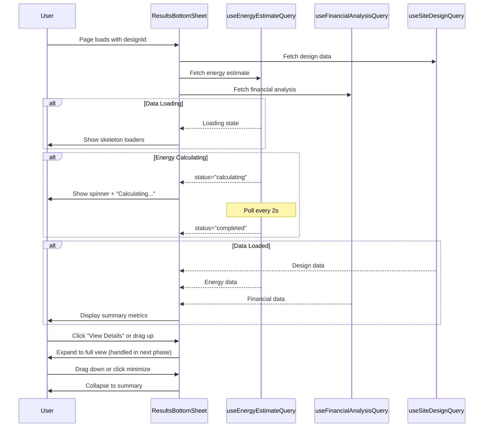

I have created the following plan after thorough exploration and analysis of the codebase. Follow the below plan verbatim. Trust the files and references. Do not re-verify what's written in the plan. Explore only when absolutely necessary. First implement all the proposed file changes and then I'll review all the changes together at the end.

## Observations

The codebase uses Radix UI primitives with custom styling, following a consistent design pattern with glass-morphism effects (backdrop-blur, semi-transparent backgrounds). The existing Sheet component supports bottom positioning with built-in slide animations. Energy and financial data hooks are already implemented with polling logic. The CanvasLayout uses a flex-based structure with a toolbar, main canvas area, and right panel. Component patterns emphasize loading states with Skeleton components and clean separation of concerns.

## Approach

Create a custom bottom sheet component that extends the existing Radix UI Sheet primitive with dual-state functionality (collapsed/expanded). The collapsed state will display a summary bar with key metrics, while the expanded state will be handled by subsequent phases. Use CSS transforms and Tailwind animations for smooth transitions. Implement drag handle interactions using native pointer events. Integrate the hooks for energy and financial data to populate the summary metrics. Position the sheet at the bottom of the canvas area with proper z-index management to avoid overlapping with existing UI elements.

## Implementation Steps

### 1. Create ResultsBottomSheet Component Structure

Create `file:frontend/src/components/DesignCanvas/ResultsBottomSheet.tsx` with the following structure:

- Import necessary dependencies: React hooks, UI components (Button, Card, Skeleton), icons from lucide-react, and the custom hooks (`useEnergyEstimateQuery`, `useFinancialAnalysisQuery`, `useSiteDesignQuery`)
- Define component props interface accepting `designId: string`
- Set up local state for managing collapsed/expanded state using `useState` (default: collapsed)
- Create refs for drag handling and height calculations

### 2. Implement Collapsed Summary View

Build the collapsed state UI showing a horizontal summary bar:

- Create a fixed-position container at the bottom of the viewport with `fixed bottom-0 left-0 right-0` positioning
- Add z-index of `z-30` to sit above map but below modals
- Design a glass-morphism card with `bg-white/95 backdrop-blur-md border-t shadow-lg`
- Include a centered drag handle (horizontal bar icon from lucide-react: `GripHorizontal`) at the top for visual affordance
- Display four key metrics in a horizontal grid layout:
  - **Total Modules**: Use `LayoutGrid` icon, display `design.total_modules` from `useSiteDesignQuery`
  - **System Size**: Use `Zap` icon, display `design.system_size_kwp` formatted to 2 decimals with "kWp" unit
  - **Annual Energy**: Use `Sun` icon, display `energyData.annual_energy_kwh / 1000` formatted to 2 decimals with "MWh" unit
  - **Payback Period**: Use `TrendingUp` icon, display `financialData.simple_payback_years` formatted to 1 decimal with "years" unit
- Add a "View Details" button on the right side with `ChevronUp` icon to trigger expansion
- Implement responsive padding: adjust for right panel state using `useDesignCanvasStore` to check if `rightPanelOpen` is true (add right padding to avoid overlap)

### 3. Add Loading and Error States for Summary

Handle async data states in the collapsed view:

- When `useEnergyEstimateQuery` or `useFinancialAnalysisQuery` is loading, display Skeleton components in place of metric values
- Use `Skeleton` with appropriate widths: `className="h-6 w-16"` for numeric values
- When energy data status is "calculating", show a spinner icon (`Loader2` with `animate-spin`) next to the Annual Energy metric with text "Calculating..."
- When energy data status is "failed", show an error icon (`AlertCircle`) with red color and tooltip showing `error_message`
- When financial data is unavailable, show "—" placeholder for payback period
- Ensure the summary bar is always visible even during loading (don't hide the entire component)

### 4. Implement Drag Handle Interaction

Add pointer event handlers for drag-to-expand functionality:

- Attach `onPointerDown` event to the drag handle area (top 24px of the collapsed sheet)
- Track initial pointer Y position in state
- On `onPointerMove`, calculate delta from initial position
- If dragged upward by more than 50px, trigger expansion to full view
- If dragged downward while expanded, trigger collapse
- Add visual feedback: change drag handle opacity on hover (`hover:opacity-70`)
- Use CSS transitions for smooth height changes: `transition-all duration-300 ease-in-out`
- Prevent default drag behavior to avoid text selection

### 5. Implement Click-to-Expand Functionality

Add click handlers for the "View Details" button:

- Create `handleExpand` function that sets expanded state to `true`
- Attach to the "View Details" button's `onClick` event
- Animate the sheet height from collapsed (auto, approximately 80px) to expanded (60vh or 600px max)
- Use Tailwind's `data-[state]` attributes for animation states
- Add smooth scroll behavior when expanding to ensure content is visible

### 6. Add Minimize Functionality for Expanded State

Prepare the collapse mechanism (UI will be added in next phase):

- Create `handleCollapse` function that sets expanded state to `false`
- This will be triggered by a minimize button in the expanded view (to be added in next phase)
- Ensure smooth animation back to collapsed state
- Reset any scroll position to top when collapsing

### 7. Handle Responsive Window Resize

Make the bottom sheet responsive to viewport changes:

- Use `useEffect` with window resize listener to adjust sheet positioning
- On mobile viewports (< 768px), make the collapsed summary stack vertically instead of horizontal grid
- Adjust metric font sizes for smaller screens: use responsive Tailwind classes like `text-sm md:text-base`
- Ensure the sheet doesn't exceed viewport height when expanded
- Add `max-h-[60vh]` constraint with `overflow-y-auto` for scrollable content in expanded state

### 8. Integrate with Design Canvas Layout

Position the bottom sheet correctly within the canvas:

- The component should be rendered as a sibling to the map canvas in the layout
- Use absolute positioning relative to the canvas container, not the entire viewport
- Ensure proper z-index layering: above map layers (z-400+) but below modals (z-50)
- Add bottom padding to the map canvas equal to the collapsed sheet height (80px) to prevent content from being hidden
- Test with right panel open/closed states to ensure no overlap

### 9. Add Conditional Rendering Logic

Implement visibility rules for the bottom sheet:

- Only render the component when `designId` is provided
- Hide the sheet if no modules are placed (`design.total_modules === 0`)
- Show a minimal placeholder state with message "Place modules to see results" when no data is available
- Ensure the sheet doesn't interfere with drawing tools or polygon editing modes

### 10. Style and Polish

Apply final styling consistent with the design system:

- Use the existing color palette: primary colors for accents, muted colors for secondary text
- Add subtle shadows and borders matching other components (reference `StatsBadge` and `RightPanel`)
- Ensure proper contrast ratios for accessibility
- Add hover states for interactive elements
- Use consistent spacing: 4px grid system (p-4, gap-4, etc.)
- Add smooth transitions for all state changes: `transition-all duration-300`

## Component Structure Diagram

## File References

- Component: `file:frontend/src/components/DesignCanvas/ResultsBottomSheet.tsx` (to be created)
- Hooks: `file:frontend/src/hooks/useSiteDesigns.ts` (existing, contains `useEnergyEstimateQuery`, `useFinancialAnalysisQuery`, `useSiteDesignQuery`)
- UI Components: `file:frontend/src/components/ui/button.tsx`, `file:frontend/src/components/ui/card.tsx`, `file:frontend/src/components/ui/skeleton.tsx`
- Types: `file:frontend/src/types/index.ts` (contains `EnergyEstimateResponse`, `FinancialAnalysisResponse`, `SiteDesignResponse`)
- Store: `file:frontend/src/stores/useDesignCanvasStore.ts` (for checking right panel state)

## Key Metrics Display Format

| Metric | Icon | Data Source | Format | Unit |
|--------|------|-------------|--------|------|
| Total Modules | LayoutGrid | `design.total_modules` | Integer with commas | modules |
| System Size | Zap | `design.system_size_kwp` | 2 decimals | kWp |
| Annual Energy | Sun | `energyData.annual_energy_kwh / 1000` | 2 decimals | MWh |
| Payback Period | TrendingUp | `financialData.simple_payback_years` | 1 decimal | years |