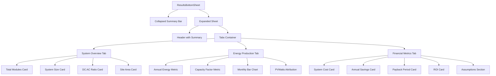

I have created the following plan after thorough exploration and analysis of the codebase. Follow the below plan verbatim. Trust the files and references. Do not re-verify what's written in the plan. Explore only when absolutely necessary. First implement all the proposed file changes and then I'll review all the changes together at the end.

## Observations

The `ResultsBottomSheet` component already has the collapsed/expanded state and summary view implemented. Recharts is installed (v3.7.0). The hooks `useEnergyEstimateQuery` and `useFinancialAnalysisQuery` are working with polling logic. However, there's a type mismatch: the TypeScript type defines `monthly_energy_kwh` as `MonthlyEnergyData[]` (objects with month/energy_kwh fields), but the backend API returns a simple `number[]` array of 12 values representing monthly energy in kWh.

## Approach

Extend the existing `ResultsBottomSheet` component by replacing the placeholder content with a tabbed interface using Radix UI Tabs. Create three tabs: System Overview, Energy Production, and Financial Metrics. For the Energy Production tab, implement a Recharts bar chart that transforms the `number[]` monthly data into labeled chart data. Display all metrics with proper formatting, loading states, and the PVWatts attribution. Use the existing Card components for consistent styling and maintain the component's responsive design patterns.

## Implementation Steps

### 1. Update Type Definition (Optional but Recommended)

**File:** `file:frontend/src/types/index.ts`

- Note the discrepancy: `monthly_energy_kwh` is typed as `MonthlyEnergyData[]` but the API returns `number[]`
- Either update the type to `number[]` or keep it as-is and transform data in the component
- Recommended: Change line 377 from `monthly_energy_kwh: MonthlyEnergyData[];` to `monthly_energy_kwh: number[];`
- Remove the `MonthlyEnergyData` interface (lines 367-370) if no longer needed

### 2. Add Recharts Imports and Tab Structure

**File:** `file:frontend/src/components/DesignCanvas/ResultsBottomSheet.tsx`

- Import Recharts components at the top:
  - `BarChart`, `Bar`, `XAxis`, `YAxis`, `CartesianGrid`, `Tooltip`, `ResponsiveContainer` from `recharts`
- Import Tab components (already imported from shadcn/ui):
  - `Tabs`, `TabsList`, `TabsTrigger`, `TabsContent` from `@/components/ui/tabs`
- Import Card components for metric display:
  - `Card`, `CardHeader`, `CardTitle`, `CardContent` from `@/components/ui/card`

### 3. Create Data Transformation Helper

**File:** `file:frontend/src/components/DesignCanvas/ResultsBottomSheet.tsx`

- Add a helper function inside the component to transform monthly energy data:
  ```typescript
  const transformMonthlyData = (monthlyEnergy: number[]) => {
    const monthNames = ['Jan', 'Feb', 'Mar', 'Apr', 'May', 'Jun', 'Jul', 'Aug', 'Sep', 'Oct', 'Nov', 'Dec'];
    return monthlyEnergy.map((energy, index) => ({
      month: monthNames[index],
      energy_kwh: energy,
      energy_mwh: energy / 1000
    }));
  };
  ```
- Call this function when `energyData?.monthly_energy_kwh` is available

### 4. Replace Placeholder Content with Tabs

**File:** `file:frontend/src/components/DesignCanvas/ResultsBottomSheet.tsx`

- Replace the placeholder content in the expanded sheet (lines 196-204) with:
  - `<Tabs defaultValue="overview" className="w-full">`
  - `<TabsList>` with three triggers: "System Overview", "Energy Production", "Financial Metrics"
  - Three corresponding `<TabsContent>` sections

### 5. Implement System Overview Tab

**File:** `file:frontend/src/components/DesignCanvas/ResultsBottomSheet.tsx`

- Create `<TabsContent value="overview">` section
- Display metrics in a grid layout (2 columns on desktop, 1 on mobile):
  - **Total Modules:** `design?.total_modules` with `LayoutGrid` icon
  - **System Size:** `design?.system_size_kwp` formatted as "X.XX kWp" with `Zap` icon
  - **DC:AC Ratio:** Calculate from design data if available, otherwise show "—" with `Activity` icon (import from lucide-react)
  - **Site Area:** `design?.site_area_sqm` formatted as "X.XX m²" with `Square` icon (import from lucide-react)
- Use `Card` components for each metric with consistent styling
- Show `Skeleton` components when `isDesignLoading` is true

### 6. Implement Energy Production Tab with Chart

**File:** `file:frontend/src/components/DesignCanvas/ResultsBottomSheet.tsx`

- Create `<TabsContent value="energy">` section
- Add top metrics row displaying:
  - **Annual Energy:** `energyData?.annual_energy_kwh / 1000` formatted as "X.XX MWh"
  - **Capacity Factor:** `energyData?.capacity_factor` formatted as "X.X%"
- Implement Recharts bar chart:
  - Use `ResponsiveContainer` with `width="100%"` and `height={300}`
  - `BarChart` with `data={transformMonthlyData(energyData?.monthly_energy_kwh || [])}`
  - `CartesianGrid` with `strokeDasharray="3 3"`
  - `XAxis` with `dataKey="month"`
  - `YAxis` with label "Energy (MWh)"
  - `Tooltip` with custom formatter showing "X.XX MWh"
  - `Bar` with `dataKey="energy_mwh"` and `fill="#3b82f6"` (blue color)
- Add "Powered by PVWatts" attribution below the chart:
  - Small text with link to NREL PVWatts: `https://pvwatts.nrel.gov/`
  - Style: `text-xs text-slate-500 mt-2`
- Handle loading state: Show `Skeleton` with chart dimensions when `isEnergyLoading`
- Handle calculating state: Show spinner with "Calculating energy..." message
- Handle failed state: Show error message with retry button (use `useTriggerEnergyEstimateMutation`)

### 7. Implement Financial Metrics Tab

**File:** `file:frontend/src/components/DesignCanvas/ResultsBottomSheet.tsx`

- Create `<TabsContent value="financial">` section
- Display financial metrics in a grid (2 columns):
  - **System Cost:** `financialData?.system_cost_usd` formatted as "$X,XXX" with `DollarSign` icon (import from lucide-react)
  - **Annual Savings:** `financialData?.annual_savings_usd` formatted as "$X,XXX/year" with `TrendingUp` icon
  - **Payback Period:** `financialData?.simple_payback_years` formatted as "X.X years" with `Calendar` icon (import from lucide-react)
  - **ROI:** `financialData?.roi_pct` formatted as "X.X%" with `Percent` icon (import from lucide-react)
- Add "Assumptions" section below metrics:
  - Display `financialData?.electricity_rate_usd_per_kwh` as "Electricity Rate: $X.XXX/kWh"
  - Display `financialData?.annual_rate_escalation_pct` as "Annual Escalation: X.X%"
  - Style as small muted text in a bordered box
- Show `Skeleton` components when `isFinancialLoading` is true
- Handle missing financial data: Show "Financial analysis unavailable" message

### 8. Add Responsive Styling and Polish

**File:** `file:frontend/src/components/DesignCanvas/ResultsBottomSheet.tsx`

- Ensure tabs are scrollable on mobile: Add `overflow-x-auto` to `TabsList`
- Make chart responsive: Use `ResponsiveContainer` and adjust height for mobile (`h-[250px] md:h-[300px]`)
- Add proper spacing between sections: Use `space-y-4` or `space-y-6`
- Ensure consistent card styling across all tabs
- Add smooth transitions for tab switching
- Test with different screen sizes and right panel states

### 9. Format Numbers Consistently

**File:** `file:frontend/src/components/DesignCanvas/ResultsBottomSheet.tsx`

- Create helper functions for number formatting:
  - `formatCurrency(value: number)` → "$X,XXX.XX"
  - `formatEnergy(value: number)` → "X.XX MWh"
  - `formatPercentage(value: number)` → "X.X%"
  - `formatNumber(value: number, decimals: number)` → "X.XX"
- Use these helpers consistently across all tabs
- Handle null/undefined values gracefully with "—" placeholder

## Visual Structure



## Key Considerations

- **Data Transformation:** The API returns `monthly_energy_kwh` as `number[]`, not `MonthlyEnergyData[]`. Transform it to include month labels for the chart
- **Loading States:** Already implemented for summary metrics; extend to tabs with skeletons
- **Error Handling:** Already implemented for energy calculation states; ensure it works in the Energy tab
- **Responsive Design:** Maintain existing responsive patterns with right panel offset
- **Chart Accessibility:** Add proper labels and tooltips to the Recharts components
- **Performance:** Use `useMemo` for data transformations if needed to avoid recalculations