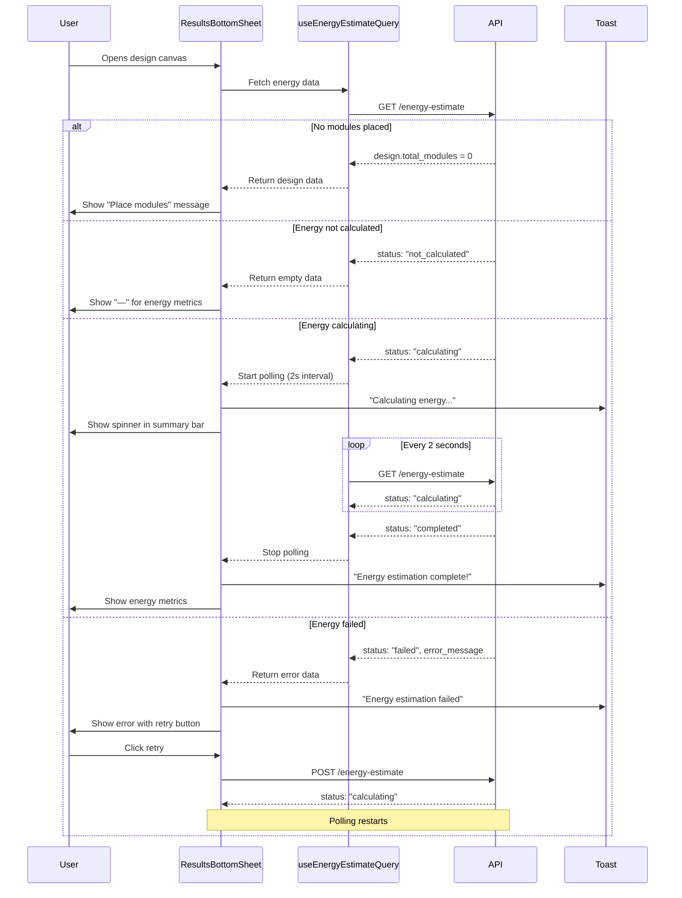

I have created the following plan after thorough exploration and analysis of the codebase. Follow the below plan verbatim. Trust the files and references. Do not re-verify what's written in the plan. Explore only when absolutely necessary. First implement all the proposed file changes and then I'll review all the changes together at the end.

## Observations

The `ResultsBottomSheet` component already has most of the async calculation states and error handling implemented. The polling logic is working via `useEnergyEstimateQuery` with a 2-second interval when status is "calculating". Loading skeletons are present for all data types, and error states with retry functionality exist in the expanded view. However, several edge cases and UX improvements are missing: no visual feedback in the collapsed summary bar for calculating/failed states, no toast notifications for state transitions, and insufficient handling of edge cases like missing modules, missing BOQ data, or invalid tender locations.

## Approach

The implementation will focus on enhancing the existing `ResultsBottomSheet` component with comprehensive edge case handling and improved user feedback. We'll add visual states to the collapsed summary bar to show calculating/failed states, implement toast notifications for energy calculation transitions (similar to the placement monitor pattern), add validation checks for missing prerequisites (modules, BOQ, tender location), and enhance error messaging with actionable guidance. The approach maintains the existing architecture while filling gaps in user experience and error handling.

## Implementation Steps

### 1. Enhance Summary Bar with Calculation States

**File:** `file:frontend/src/components/DesignCanvas/ResultsBottomSheet.tsx`

Add visual feedback in the collapsed summary bar for energy calculation states:

- Modify the `EnergySpecialState` component to be reusable in both summary and expanded views
- Update the summary bar's Annual Energy metric to show calculating spinner or failed icon when appropriate
- Add a subtle background color change to the summary bar when energy is calculating (e.g., amber tint)
- Ensure the "View Details" button text changes to "View Status" when energy is calculating or failed

### 2. Add Toast Notifications for Energy State Transitions

**File:** `file:frontend/src/components/DesignCanvas/ResultsBottomSheet.tsx`

Implement state transition monitoring similar to `usePlacementMonitor`:

- Add a `useRef` to track the previous energy status
- Add a `useEffect` that watches `energyData?.status` changes
- Show `toast.success("Energy estimation complete!")` when transitioning from "calculating" to "completed"
- Show `toast.error(energyData?.error_message || "Energy estimation failed")` when transitioning to "failed"
- Show `toast.info("Calculating energy production...")` when transitioning to "calculating"

### 3. Add Edge Case Validation and Messaging

**File:** `file:frontend/src/components/DesignCanvas/ResultsBottomSheet.tsx`

Implement comprehensive edge case handling:

- **No Modules Placed:** Instead of returning `null` when `total_modules === 0`, show a minimal summary bar with a message: "Place modules to see energy and financial results" with a disabled "View Details" button
- **Missing Tender Location:** Check if `design` has valid tender location data; if missing, show warning in energy tab: "Location data required for energy estimation"
- **Zero System Size:** If `system_size_kwp === 0`, show warning: "System size is 0 kWp - cannot estimate energy"
- **Missing BOQ Data:** Add a check for BOQ data availability; if financial analysis returns null and BOQ is missing, show: "Add BOQ items to enable financial analysis"
- **Stale Energy Data:** If energy data exists but `calculated_at` is older than design's `updated_at`, show a warning badge: "Energy data may be outdated" with a "Recalculate" button

### 4. Enhance Error State UI with Actionable Guidance

**File:** `file:frontend/src/components/DesignCanvas/ResultsBottomSheet.tsx`

Improve error messaging with specific guidance:

- Parse common error messages from the backend (e.g., "Invalid location", "PVWatts API unavailable", "System capacity too low")
- Provide specific guidance for each error type:
  - Invalid location → "Check tender location coordinates"
  - API unavailable → "PVWatts service is temporarily unavailable. Please try again later."
  - System capacity too low → "Increase system size by placing more modules"
- Add a "Contact Support" link for unknown errors
- Show the retry count if `energyData` has retry information (backend tracks `retry_count`)

### 5. Add Loading States for Initial Data Fetch

**File:** `file:frontend/src/components/DesignCanvas/ResultsBottomSheet.tsx`

Improve loading experience when component first mounts:

- Add a check for `isDesignLoading || isEnergyLoading || isFinancialLoading` at the component level
- Show a full-width skeleton summary bar during initial load instead of individual metric skeletons
- Add a fade-in animation when data loads successfully
- Ensure the component doesn't flash between states (use `isFetching` vs `isLoading` appropriately)

### 6. Handle Polling Lifecycle Edge Cases

**File:** `file:frontend/src/components/DesignCanvas/ResultsBottomSheet.tsx`

Add safeguards for polling behavior:

- Stop polling if the component unmounts while energy is calculating (React Query handles this, but verify)
- Add a maximum polling duration (e.g., 5 minutes) after which show: "Calculation is taking longer than expected. Please check back later."
- Handle the case where polling returns a 404 (design deleted) - show appropriate message and stop polling
- Add a manual "Check Status" button if polling is stopped due to timeout

### 7. Add Graceful Degradation for Partial Data

**File:** `file:frontend/src/components/DesignCanvas/ResultsBottomSheet.tsx`

Handle scenarios where some data is available but incomplete:

- If `monthly_energy_kwh` array has fewer than 12 values, show a warning: "Incomplete monthly data"
- If `capacity_factor` is 0 or null but `annual_energy_kwh` exists, still show annual energy
- If financial data is missing but energy data exists, show a prompt: "Add BOQ items to see financial analysis"
- If PV design data is missing, show "—" for DC:AC ratio instead of crashing

### 8. Optimize Re-renders and Performance

**File:** `file:frontend/src/components/DesignCanvas/ResultsBottomSheet.tsx`

Ensure efficient rendering during polling:

- Wrap `MetricItem` and `MetricCard` in `React.memo` to prevent unnecessary re-renders
- Use `useMemo` for all derived calculations (already done for `monthlyChartData`, verify others)
- Ensure `formatCurrency`, `formatRate`, etc. are defined outside the component or memoized
- Add `refetchOnWindowFocus: false` to the energy query to prevent unnecessary refetches

### 9. Add Accessibility Improvements

**File:** `file:frontend/src/components/DesignCanvas/ResultsBottomSheet.tsx`

Enhance accessibility for loading and error states:

- Add `aria-live="polite"` to the energy metric area so screen readers announce status changes
- Add `aria-busy="true"` when energy is calculating
- Ensure the retry button has proper `aria-label`: "Retry energy estimation"
- Add keyboard shortcuts: `Escape` to minimize expanded sheet, `Enter` on summary to expand

### 10. Update Mock Handlers for Testing

**File:** `file:frontend/src/test/mocks/handlers.ts`

Add mock handlers for energy and financial endpoints:

- Add `GET /api/site-designs/:id/energy-estimate` handler with configurable status (calculating, completed, failed)
- Add `POST /api/site-designs/:id/energy-estimate` handler to trigger estimation
- Add `GET /api/site-designs/:id/financial-analysis` handler
- Create test fixtures for different energy states in `file:frontend/src/test/fixtures/siteDesign.ts`
- Add fixtures for error scenarios (missing location, zero capacity, API failure)

## Visual Diagram

## Edge Cases Handled

| Edge Case | Handling Strategy |
|-----------|------------------|
| No modules placed (`total_modules = 0`) | Show minimal summary bar with "Place modules to see results" message |
| Missing tender location | Show warning in energy tab: "Location data required for energy estimation" |
| Zero system size (`system_size_kwp = 0`) | Show warning: "System size is 0 kWp - cannot estimate energy" |
| Missing BOQ data | Show in financial tab: "Add BOQ items to enable financial analysis" |
| Energy calculation timeout (>5 min) | Stop polling, show "Taking longer than expected" with manual refresh button |
| Stale energy data | Show badge: "Energy data may be outdated" with recalculate button |
| Incomplete monthly data | Show warning: "Incomplete monthly data" but still render available data |
| PVWatts API unavailable | Show specific error: "PVWatts service temporarily unavailable" |
| Design deleted during polling | Handle 404, stop polling, show "Design no longer exists" |
| Component unmounts during calculation | React Query automatically cancels polling |
| Network error during polling | React Query retries, show "Connection lost" if persistent |
| Missing PV design data | Show "—" for DC:AC ratio instead of error |