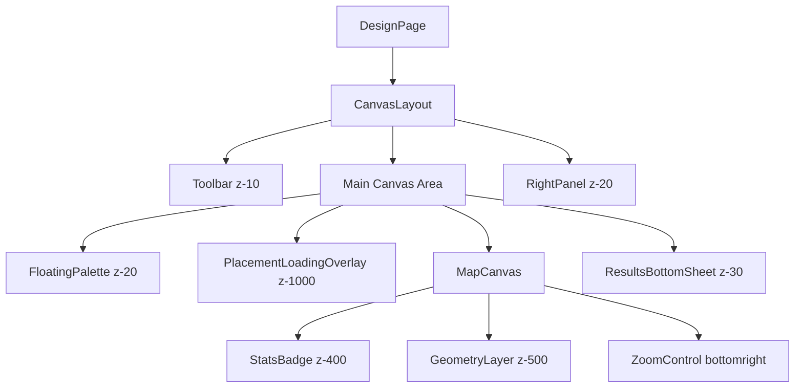

I have created the following plan after thorough exploration and analysis of the codebase. Follow the below plan verbatim. Trust the files and references. Do not re-verify what's written in the plan. Explore only when absolutely necessary. First implement all the proposed file changes and then I'll review all the changes together at the end.

## Observations

The `ResultsBottomSheet` component is **already fully integrated** into the design canvas layout. The component exists at `file:frontend/src/components/DesignCanvas/ResultsBottomSheet.tsx` and is imported and rendered in `file:frontend/src/components/DesignCanvas/CanvasLayout.tsx` (line 7 import, line 30 render). The z-index hierarchy is properly configured with the bottom sheet at `z-30`, positioned above the base canvas (`z-20` for FloatingPalette and RightPanel) but below critical overlays (`z-[1000]` for PlacementLoadingOverlay). The component already responds to right panel state changes with dynamic margin adjustments (`md:mr-[320px]` when panel is open).

## Approach

Since the integration is already complete, this plan focuses on **validation and optimization** rather than new implementation. The approach verifies that all integration requirements are met, tests responsive behavior across different viewport sizes and panel states, ensures proper z-index layering prevents overlap issues, and validates that the bottom sheet correctly receives and displays the `designId` prop. Additionally, we'll document the integration architecture for team reference and identify any edge cases that need handling.

## Implementation Steps

### 1. Verify Current Integration Status

**Confirm Component Rendering:**
- Open `file:frontend/src/app/tenders/[id]/design/[designId]/page.tsx` in your browser
- Verify that the `ResultsBottomSheet` appears at the bottom of the screen
- Check that the collapsed summary bar shows: Total Modules, System Size, Annual Energy, and Payback Period
- Click "View Details" button to expand the sheet and verify tabs (System Overview, Energy Production, Financial Metrics) are accessible

**Validate Props Flow:**
- In `file:frontend/src/components/DesignCanvas/CanvasLayout.tsx`, confirm `designId` prop is passed to `ResultsBottomSheet` (line 30)
- In `file:frontend/src/app/tenders/[id]/design/[designId]/page.tsx`, verify `designId` is extracted from `params.designId` (line 37) and passed to `CanvasLayout` (line 118)
- Use React DevTools to inspect the `ResultsBottomSheet` component and confirm `designId` prop value matches the URL parameter

### 2. Test Z-Index Layering and Overlap Prevention

**Map Controls Positioning:**
- Verify Leaflet zoom controls are positioned at `bottomright` in `file:frontend/src/components/DesignCanvas/MapCanvas.tsx` (line 65)
- With bottom sheet collapsed, ensure zoom controls are visible and not obscured
- With bottom sheet expanded (75vh height), confirm zoom controls remain accessible or are appropriately covered by the sheet overlay

**Component Stacking Order:**
- Test that `PlacementLoadingOverlay` (`z-[1000]`) appears above the bottom sheet when placement is running
- Verify `StatsBadge` (`z-[400]`) and map status indicator remain visible above the bottom sheet
- Confirm `FloatingPalette` (`z-20`) and `RightPanel` (`z-20`) are below the bottom sheet (`z-30`)
- Check that UI dialogs and tooltips (`z-50`) appear above the bottom sheet when triggered

**Overlap Edge Cases:**
- Test with very small viewport heights (e.g., 600px) to ensure the expanded sheet doesn't completely cover the map
- Verify the sheet's `max-h-[85vh]` constraint prevents full-screen takeover
- Check that the collapsed summary bar doesn't overlap with the `GeometryLayer` visibility controls at `bottom-6 left-6` (`z-[500]`)

### 3. Validate Responsive Behavior with Panel States

**Right Panel Open/Closed:**
- Toggle the right panel using the chevron button in `file:frontend/src/components/DesignCanvas/RightPanel.tsx`
- When panel is **open** (320px width), verify bottom sheet applies `md:mr-[320px]` margin on medium+ screens
- When panel is **closed**, verify bottom sheet spans full width with `mr-0`
- Check transition smoothness (300ms duration) when toggling panel state

**Viewport Size Testing:**
- Test on mobile viewport (<768px): bottom sheet should span full width regardless of panel state
- Test on tablet viewport (768px-1024px): verify margin adjustment works correctly
- Test on desktop viewport (>1024px): confirm right panel and bottom sheet coexist without overlap
- Verify the summary bar grid layout switches from 4 columns to 2 columns on small screens (line 306-307 in ResultsBottomSheet)

**Window Resize Handling:**
- Open the design canvas and resize the browser window from desktop to mobile size
- Verify the `isSmallScreen` state updates correctly (line 195-199 in ResultsBottomSheet)
- Confirm the bottom sheet layout adapts without visual glitches or layout shifts

### 4. Test Data Flow and API Integration

**Energy Estimate Polling:**
- Place modules on the canvas to trigger energy estimation
- Verify the bottom sheet shows "Calculating..." state with spinner when `status="calculating"`
- Confirm polling occurs every 2 seconds (configured in `useEnergyEstimateQuery` hook)
- Check that polling stops when status changes to "completed" or "failed"
- Test the 5-minute timeout safeguard (line 182-191) by simulating a long-running calculation

**Financial Analysis Display:**
- Ensure BOQ data exists for the design (required for financial analysis)
- Verify financial metrics (System Cost, Annual Savings, Payback, ROI) display correctly in the Financial Metrics tab
- Check that assumptions (electricity rate, escalation rate) are shown at the bottom of the tab

**Error Handling:**
- Simulate API failure by disconnecting network or using invalid `designId`
- Verify error state UI appears with appropriate message and "Retry" button
- Test the retry functionality by clicking the "Retry" button
- Confirm graceful degradation when energy data is unavailable (shows "Energy estimation unavailable" message)

### 5. Verify Edge Cases and Special States

**Zero Capacity Warning:**
- Create a design with no modules placed (`total_modules = 0`, `system_size_kwp = 0`)
- Verify the summary bar shows "Design is empty. Place modules to see results." message
- Confirm the "View Details" button is disabled when no modules are placed
- Check that the expanded view shows "No Modules Placed" warning with guidance

**Stale Energy Data:**
- Modify the design (add/remove modules) after energy estimation completes
- Verify the "Outdated" indicator appears with clock icon when `calculated_at < updated_at`
- Confirm the "Recalculate" button appears in the Energy Production tab
- Test that clicking "Recalculate" triggers a new energy estimation

**Missing Location Data:**
- Create a tender without latitude/longitude coordinates
- Verify the warning alert appears in the Energy Production tab: "Missing Location Data"
- Confirm energy estimation is skipped or shows appropriate error

### 6. Performance and Accessibility Validation

**Component Optimization:**
- Verify memoized components (`MetricItem`, `MetricCard`) prevent unnecessary re-renders
- Check that `monthlyChartData` is memoized and only recalculates when `monthly_energy_kwh` changes
- Confirm formatting helpers (`formatCurrency`, `formatEnergy`, etc.) are defined outside the component to avoid recreation

**Accessibility:**
- Test keyboard navigation: Tab through the summary bar and "View Details" button
- Verify the expanded sheet can be closed with Escape key (Sheet component default behavior)
- Check that `aria-live="polite"` and `aria-busy` attributes work correctly for screen readers (line 694)
- Confirm all buttons have proper `aria-label` attributes (e.g., "Minimize design results" on line 384)

**Toast Notifications:**
- Verify toast appears when calculation starts: "Calculating energy production..."
- Confirm success toast on completion: "Energy estimation complete!"
- Check error toast on failure with error message
- Test that toasts use unique IDs (`energy-calc-${designId}`) to prevent duplicates

### 7. Documentation and Team Handoff

**Architecture Documentation:**
Create a brief integration summary in the codebase (e.g., in `file:frontend/src/components/DesignCanvas/README.md`):

```markdown
## ResultsBottomSheet Integration

**Location:** Rendered in `CanvasLayout.tsx` (line 30)
**Z-Index:** `z-30` (above base canvas, below overlays)
**Responsive Behavior:** Adjusts margin when right panel is open (`md:mr-[320px]`)
**Data Dependencies:** Requires `designId` prop to fetch energy and financial data
**States:** Collapsed (summary bar) / Expanded (tabbed details)
```

**Component Diagram:**
Document the component hierarchy and z-index stacking:



**Known Limitations:**
- Bottom sheet requires BOQ data for financial analysis
- Energy estimation depends on valid tender location coordinates
- Polling timeout is set to 5 minutes (may need adjustment for large systems)
- Chart rendering requires at least 1 month of data (warns if incomplete)

### 8. Final Validation Checklist

Before marking this phase complete, verify:

- [ ] Bottom sheet renders correctly on page load
- [ ] `designId` prop flows from URL params → CanvasLayout → ResultsBottomSheet
- [ ] Z-index layering prevents overlap with map controls and other UI elements
- [ ] Right panel open/closed states trigger correct margin adjustments
- [ ] Responsive behavior works on mobile, tablet, and desktop viewports
- [ ] Energy estimation polling works with 2-second interval
- [ ] Financial analysis displays when BOQ data is available
- [ ] Error states show appropriate messages and retry options
- [ ] Zero capacity and stale data warnings appear correctly
- [ ] Toast notifications fire on state transitions
- [ ] Keyboard navigation and accessibility features work
- [ ] Performance optimizations (memoization) are in place
- [ ] Documentation is updated for team reference

## Visual Reference

**Z-Index Hierarchy:**

| Layer | Component | Z-Index | Purpose |
|-------|-----------|---------|---------|
| Overlay | PlacementLoadingOverlay | 1000 | Blocks interaction during placement |
| Controls | GeometryLayer visibility | 500 | Layer toggle controls |
| Badges | StatsBadge, Status indicator | 400 | Always-visible metrics |
| Modals | Sheet, Dialog, Tooltip | 50 | User interactions |
| Bottom Sheet | ResultsBottomSheet | 30 | Design results display |
| Panels | FloatingPalette, RightPanel | 20 | Tool selection and settings |
| Header | Toolbar | 10 | Navigation and actions |

**Responsive Margin Adjustment:**

```
Desktop (>768px):
┌─────────────────────────────────────┬──────────┐
│                                     │  Right   │
│         Map Canvas                  │  Panel   │
│                                     │  320px   │
└─────────────────────────────────────┴──────────┘
└─────────────────────────────────────┘
        Bottom Sheet (mr-[320px])

Mobile (<768px):
┌─────────────────────────────────────┐
│         Map Canvas                  │
│                                     │
└─────────────────────────────────────┘
└─────────────────────────────────────┘
        Bottom Sheet (full width)
```