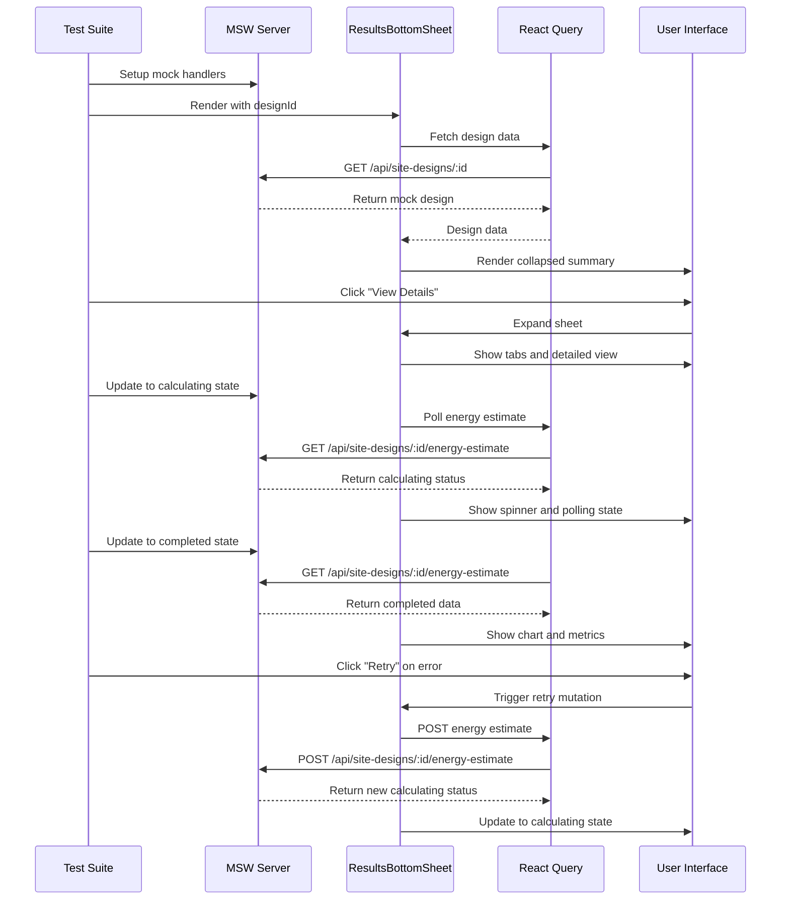

I have created the following plan after thorough exploration and analysis of the codebase. Follow the below plan verbatim. Trust the files and references. Do not re-verify what's written in the plan. Explore only when absolutely necessary. First implement all the proposed file changes and then I'll review all the changes together at the end.

## Observations

The `ResultsBottomSheet` component is a complex, feature-rich component with multiple states, polling logic, and data visualizations. It uses React Query hooks for data fetching, Recharts for charts, and Radix UI components (Sheet, Tabs, Tooltip). The existing test suite uses Vitest, React Testing Library, MSW for API mocking, and has established patterns for testing components with async data fetching. The component handles multiple edge cases including zero capacity systems, stale data, polling timeouts, and graceful degradation.

## Approach

Create comprehensive unit tests following the established testing patterns in the codebase. Use MSW handlers to mock API responses for different states (calculating, completed, failed), test user interactions with userEvent, verify polling behavior with fake timers, and ensure all UI states render correctly. Tests will cover the full lifecycle of energy estimation, financial data loading, chart rendering, error handling, and state transitions. The tests will be organized into logical groups matching the component's features.

## Implementation Steps

### 1. Create Test File Structure and Basic Setup

Create `file:frontend/src/components/DesignCanvas/__tests__/ResultsBottomSheet.test.tsx` with necessary imports and test setup:

- Import testing utilities: `describe`, `it`, `expect`, `vi`, `beforeEach`, `afterEach` from Vitest
- Import React Testing Library utilities: `screen`, `waitFor`, `within` from `@testing-library/react`
- Import `userEvent` from `@testing-library/user-event` for user interactions
- Import `renderWithProviders` from `@/test/utils`
- Import MSW utilities: `server`, `http`, `HttpResponse`, `delay` from MSW
- Import component: `ResultsBottomSheet` from `../ResultsBottomSheet`
- Import fixtures: `mockSiteDesign`, `mockEnergyEstimate`, `mockFinancialAnalysis` from `@/test/fixtures/siteDesign`
- Import `useDesignCanvasStore` from `@/stores/useDesignCanvasStore`
- Mock `sonner` toast library with `vi.mock('sonner')`
- Mock Recharts components to avoid rendering issues in tests (mock `ResponsiveContainer`, `BarChart`, etc.)

### 2. Test Initial Rendering and Loading States

Create test cases for initial component rendering:

- **Test: "should render loading skeleton initially"** - Mock delayed API responses using MSW `delay()`, verify skeleton components appear, wait for actual content to load
- **Test: "should render collapsed summary bar by default"** - Verify component renders in collapsed state, check that summary metrics are visible, ensure "View Details" button is present
- **Test: "should show empty state when no modules are placed"** - Mock design with `total_modules: 0`, verify empty state message appears, check that "View Details" button is disabled
- **Test: "should display summary metrics correctly"** - Verify all four summary metrics render (Total Modules, System Size, Annual Energy, Payback Period), check formatting of values

### 3. Test Collapsed/Expanded State Transitions

Create test cases for sheet expansion/collapse:

- **Test: "should expand sheet when View Details button is clicked"** - Click "View Details" button, verify sheet opens with tabs visible, check that "Minimize" button appears
- **Test: "should collapse sheet when Minimize button is clicked"** - Expand sheet first, click "Minimize" button, verify sheet closes and summary bar reappears
- **Test: "should show tabs when expanded"** - Expand sheet, verify all three tabs are present (System Overview, Energy Production, Financial Metrics)
- **Test: "should switch between tabs correctly"** - Expand sheet, click each tab, verify correct content displays for each tab

### 4. Test Polling Logic with Different States

Create test cases for energy estimation polling:

- **Test: "should show calculating state with spinner"** - Mock energy estimate with `status: 'calculating'`, verify spinner and "Calculating..." message appear, check polling indicator in summary bar
- **Test: "should poll every 2 seconds when status is calculating"** - Use `vi.useFakeTimers()`, mock calculating status, advance timers by 2 seconds multiple times, verify API is called repeatedly
- **Test: "should stop polling when status changes to completed"** - Start with calculating status, update to completed after 2 polls, verify polling stops, check success toast appears
- **Test: "should stop polling when status changes to failed"** - Start with calculating status, update to failed, verify polling stops, check error toast appears
- **Test: "should show timeout warning after 5 minutes of polling"** - Use fake timers, advance by 5 minutes while status is calculating, verify timeout warning appears, check "Check Status" button is shown
- **Test: "should not poll when system size is 0 kWp"** - Mock design with `system_size_kwp: 0`, verify no polling occurs, check warning message about zero capacity

### 5. Test Energy Estimation States and Transitions

Create test cases for different energy estimation states:

- **Test: "should display completed energy data correctly"** - Mock completed energy estimate, verify annual energy displays correctly, check capacity factor is shown
- **Test: "should show failed state with error message"** - Mock failed energy estimate with error message, verify error UI appears, check error message is displayed, verify "Retry" button is present
- **Test: "should show unavailable state when no energy data exists"** - Mock null energy data, verify "Energy estimation unavailable" message, check "Recalculate Now" button appears
- **Test: "should show stale data warning"** - Mock energy data with `calculated_at` older than design `updated_at`, verify stale data indicator appears, check "Recalculate" button is shown
- **Test: "should show toast notifications on state transitions"** - Mock state transition from calculating to completed, verify success toast is called, test failed transition shows error toast

### 6. Test Chart Rendering with Monthly Energy Data

Create test cases for monthly energy chart:

- **Test: "should render monthly energy chart with 12 months of data"** - Mock complete monthly data (12 values), expand sheet and go to Energy Production tab, verify chart renders, check all 12 month labels appear
- **Test: "should show incomplete data warning for partial monthly data"** - Mock monthly data with only 6 values, verify warning message appears, check chart still renders available data
- **Test: "should format chart data correctly"** - Mock monthly energy data, verify data is transformed to MWh (divided by 1000), check month names are correct (Jan, Feb, etc.)
- **Test: "should show empty chart state when no monthly data"** - Mock energy estimate without monthly data, verify placeholder message appears
- **Test: "should display PVWatts attribution"** - Expand to Energy Production tab, verify "Powered by NREL PVWatts®" link is present

### 7. Test Error States and Retry Functionality

Create test cases for error handling:

- **Test: "should call retry mutation when Retry button is clicked"** - Mock failed energy estimate, click "Retry Estimation" button, verify `triggerEnergyEstimate` mutation is called
- **Test: "should show loading state during retry"** - Mock retry mutation as pending, verify button shows loading spinner, check button is disabled during retry
- **Test: "should display error guidance based on error message"** - Test different error messages (location error, capacity error, service error), verify appropriate guidance text appears for each
- **Test: "should handle retry from stale data state"** - Mock stale energy data, click "Recalculate" button, verify mutation is called
- **Test: "should handle retry from unavailable state"** - Mock unavailable energy data, click "Recalculate Now" button, verify mutation is called

### 8. Test Financial Metrics Tab

Create test cases for financial data display:

- **Test: "should display financial metrics correctly"** - Mock financial data, switch to Financial Metrics tab, verify all metrics display (System Cost, Annual Savings, Payback, ROI)
- **Test: "should format currency values correctly"** - Verify currency formatting matches expected format (USD with no decimals for large values)
- **Test: "should show financial assumptions"** - Verify electricity rate and escalation rate are displayed in assumptions section
- **Test: "should show unavailable state when no financial data"** - Mock null financial data, verify "Financial Analysis Unavailable" message, check BOQ prompt appears
- **Test: "should show loading skeletons while financial data loads"** - Mock delayed financial data, verify skeleton components appear, wait for data to load

### 9. Test System Overview Tab

Create test cases for system overview:

- **Test: "should display system overview metrics"** - Switch to System Overview tab, verify Total Modules, System Size, DC:AC Ratio, Site Area cards appear
- **Test: "should fetch and display PV design data for DC:AC ratio"** - Mock PV design data, verify DC:AC ratio displays correctly
- **Test: "should show placeholder when PV design is not linked"** - Mock design without `pv_design_id`, verify DC:AC ratio shows "—"
- **Test: "should format system size with correct units"** - Verify system size displays with "kWp" suffix

### 10. Test Responsive Behavior and Layout

Create test cases for responsive design:

- **Test: "should adjust layout for right panel open state"** - Set `rightPanelOpen: true` in store, verify component adjusts margin (`md:mr-[320px]`)
- **Test: "should adjust layout for right panel closed state"** - Set `rightPanelOpen: false`, verify no right margin is applied
- **Test: "should adjust summary grid for small screens"** - Mock small screen size (< 768px), verify summary grid changes to 2 columns
- **Test: "should adjust summary grid for large screens"** - Mock large screen size, verify summary grid uses 4 columns

### 11. Test Graceful Degradation Scenarios

Create test cases for edge cases:

- **Test: "should handle missing tender location gracefully"** - Mock design without `tender_id`, verify warning about missing location data appears in Energy tab
- **Test: "should handle zero capacity system"** - Mock `system_size_kwp: 0`, verify warning icon appears, check "N/A" displays for energy, verify no polling occurs
- **Test: "should handle missing BOQ data"** - Mock null financial data, verify prompt to complete BOQ appears
- **Test: "should handle polling timeout gracefully"** - Use fake timers, advance past 5-minute timeout, verify "Polling Paused" state, check "Check Status" button functionality

### 12. Test Accessibility and ARIA Attributes

Create test cases for accessibility:

- **Test: "should have proper ARIA labels"** - Verify "Minimize" button has `aria-label`, check summary bar has `aria-live="polite"` and `aria-busy` when calculating
- **Test: "should announce state changes to screen readers"** - Verify `aria-busy` attribute changes based on calculation state
- **Test: "should have accessible button labels"** - Check all buttons have descriptive text or aria-labels

### 13. Update MSW Handlers for Test Scenarios

Extend `file:frontend/src/test/mocks/handlers.ts` with additional handlers for test scenarios:

- Add handler for calculating state: Return energy estimate with `status: 'calculating'`
- Add handler for failed state: Return energy estimate with `status: 'failed'` and error message
- Add handler for stale data: Return energy estimate with old `calculated_at` timestamp
- Add handler for retry mutation: `POST /api/site-designs/:id/energy-estimate` returns calculating status
- Add handler for PV design: `GET /api/pv-designs/:id` returns mock PV design with DC:AC ratio
- Add handler for delayed responses: Use MSW `delay()` for testing loading states

### 14. Add Test Fixtures for Additional Scenarios

Extend `file:frontend/src/test/fixtures/siteDesign.ts` with additional mock data:

- `mockEnergyEstimateCalculating`: Energy estimate with `status: 'calculating'`
- `mockEnergyEstimateFailed`: Energy estimate with `status: 'failed'` and error message
- `mockEnergyEstimateStale`: Energy estimate with old `calculated_at` timestamp
- `mockEnergyEstimateIncomplete`: Energy estimate with only 6 months of data
- `mockSiteDesignZeroCapacity`: Site design with `system_size_kwp: 0` and `total_modules: 0`
- `mockSiteDesignNoLocation`: Site design without `tender_id`

### 15. Test Cleanup and Edge Cases

Create final test cases for cleanup and edge cases:

- **Test: "should cleanup polling on unmount"** - Render component with calculating status, unmount, verify no memory leaks or continued polling
- **Test: "should handle rapid state changes"** - Trigger multiple state changes quickly, verify component handles them correctly
- **Test: "should handle concurrent data fetching"** - Mock all queries loading simultaneously, verify loading states don't conflict
- **Test: "should reset timeout state when recalculating"** - Trigger timeout, click "Check Status", verify timeout state resets

## Testing Utilities and Helpers

Create helper functions within the test file:

```typescript
// Helper to setup component with specific store state
const renderWithStore = (designId: string, storeState = {}) => {
  useDesignCanvasStore.setState(storeState);
  return renderWithProviders(<ResultsBottomSheet designId={designId} />);
};

// Helper to advance timers and wait for updates
const advanceTimersAndWait = async (ms: number) => {
  vi.advanceTimersByTime(ms);
  await waitFor(() => expect(screen.queryByText(/calculating/i)).toBeInTheDocument());
};

// Helper to expand sheet
const expandSheet = async (user: any) => {
  const viewDetailsButton = screen.getByRole('button', { name: /view details/i });
  await user.click(viewDetailsButton);
  await waitFor(() => expect(screen.getByText(/Design Performance & Analysis/i)).toBeInTheDocument());
};
```

## Test Organization

Organize tests into logical describe blocks:

- `describe('ResultsBottomSheet')` - Main test suite
  - `describe('Initial Rendering')` - Loading and initial states
  - `describe('State Transitions')` - Expand/collapse behavior
  - `describe('Energy Estimation Polling')` - Polling logic tests
  - `describe('Energy States')` - Different energy estimation states
  - `describe('Chart Rendering')` - Monthly energy chart tests
  - `describe('Error Handling')` - Error states and retry
  - `describe('Financial Metrics')` - Financial tab tests
  - `describe('System Overview')` - Overview tab tests
  - `describe('Responsive Layout')` - Layout and responsive tests
  - `describe('Graceful Degradation')` - Edge cases and fallbacks
  - `describe('Accessibility')` - A11y tests

## Mermaid Diagram: Test Flow

