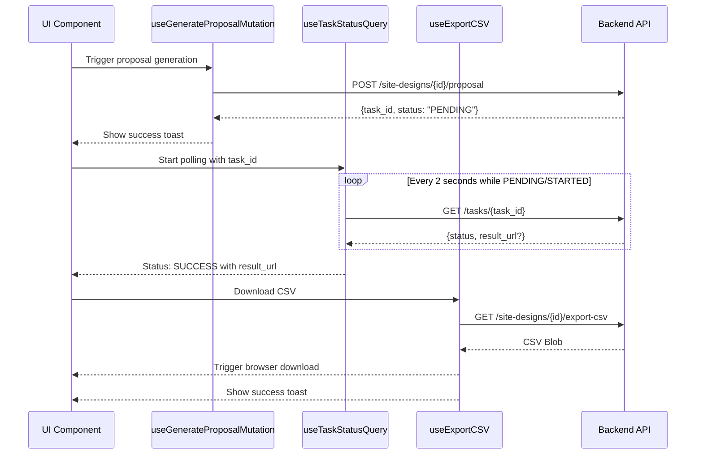

I have created the following plan after thorough exploration and analysis of the codebase. Follow the below plan verbatim. Trust the files and references. Do not re-verify what's written in the plan. Explore only when absolutely necessary. First implement all the proposed file changes and then I'll review all the changes together at the end.

## Observations

The proposal API integration and type definitions have already been implemented in the previous phase. The API methods (`generateProposal`, `getTaskStatus`, `exportCSV`) exist in file:frontend/src/lib/api.ts, types are defined in file:frontend/src/types/index.ts, and query keys are configured in file:frontend/src/lib/queryKeys.ts. The backend returns task statuses as PENDING, STARTED, SUCCESS, or FAILURE, with a `result_url` field when successful.

## Approach

Create a new file:frontend/src/hooks/useProposal.ts following the established patterns from file:frontend/src/hooks/useSiteDesigns.ts. Implement three custom hooks: `useGenerateProposalMutation` for triggering proposal generation, `useTaskStatusQuery` for polling task status with automatic 2-second intervals when tasks are in progress, and `useExportCSV` for CSV downloads. Include retry logic (3 retries in production, 0 in test), toast notifications, proper cache invalidation, and error handling consistent with existing hooks.

## Implementation Steps

### 1. Create useProposal.ts Hook File

Create file:frontend/src/hooks/useProposal.ts with the following structure and imports:

- Import `useQuery`, `useMutation`, `useQueryClient` from `@tanstack/react-query`
- Import `proposalsApi` from `@/lib/api`
- Import `queryKeys` from `@/lib/queryKeys`
- Import types: `ProposalGenerateRequest`, `ProposalTaskResponse`, `ProposalStatusResponse` from `@/types`
- Import `toast` from `sonner` (or `@/lib/toast` if it's a wrapper)

### 2. Implement useGenerateProposalMutation Hook

Create mutation hook for triggering proposal generation:

- Accept `designId: string` parameter
- Use `useMutation` with `mutationFn` calling `proposalsApi.generateProposal(designId, options)`
- Set `retry` to `process.env.NODE_ENV === 'test' ? 0 : 3`
- In `onSuccess`:
  - Show success toast: "Proposal generation started"
  - Return the task response containing `task_id` and `status`
- In `onError`:
  - Show error toast with error message
  - Handle `ApiError` type from file:frontend/src/lib/api.ts

### 3. Implement useTaskStatusQuery Hook

Create query hook with automatic polling for task status:

- Accept `taskId: string` and optional `enabled: boolean` parameters
- Use `useQuery` with:
  - `queryKey`: `queryKeys.proposals.task(taskId)`
  - `queryFn`: `() => proposalsApi.getTaskStatus(taskId)`
  - `enabled`: `!!taskId && enabled !== false`
  - `refetchInterval`: Implement conditional polling logic:
    ```typescript
    refetchInterval: (query) => {
      const data = query.state.data;
      if (data?.status === 'PENDING' || data?.status === 'STARTED') {
        return 2000; // Poll every 2 seconds
      }
      return false; // Stop polling when SUCCESS or FAILURE
    }
    ```
  - `retry`: Set to `false` to avoid retrying failed tasks
  - `staleTime`: Set to `0` to ensure fresh data during polling

### 4. Implement useExportCSV Hook

Create mutation hook for CSV export with file download handling:

- Accept `designId: string` parameter
- Use `useMutation` with `mutationFn` calling `proposalsApi.exportCSV(designId)`
- In `onSuccess`:
  - Handle blob response and trigger browser download:
    ```typescript
    const blob = data; // Response is already a Blob
    const url = window.URL.createObjectURL(blob);
    const link = document.createElement('a');
    link.href = url;
    link.download = `bom_design_${designId}_${new Date().toISOString().split('T')[0]}.csv`;
    document.body.appendChild(link);
    link.click();
    document.body.removeChild(link);
    window.URL.revokeObjectURL(url);
    ```
  - Show success toast: "CSV exported successfully"
- In `onError`:
  - Show error toast with error message
  - Handle `ApiError` type
- Set `retry` to `process.env.NODE_ENV === 'test' ? 0 : 1` (fewer retries for file downloads)

### 5. Add Cache Invalidation Logic

Ensure proper cache management:

- In `useGenerateProposalMutation`:
  - No cache invalidation needed (task status is polled separately)
- In `useTaskStatusQuery`:
  - When status becomes SUCCESS, invalidate `queryKeys.siteDesigns.detail(designId)` if design data might have changed
- In `useExportCSV`:
  - No cache invalidation needed (export doesn't modify data)

### 6. Export Hooks from Index File

Update file:frontend/src/hooks/index.ts to export the new hooks:

- Add export statement: `export * from './useProposal';`
- Ensure consistency with other hook exports in the file

### 7. Add Error Handling and Edge Cases

Implement robust error handling:

- Handle network errors in all hooks
- Handle invalid task IDs in `useTaskStatusQuery`
- Handle blob download failures in `useExportCSV`
- Add proper TypeScript types for all parameters and return values
- Handle cases where `result_url` might be missing in SUCCESS status
- Add JSDoc comments for each hook explaining parameters and usage

## Visual Flow

