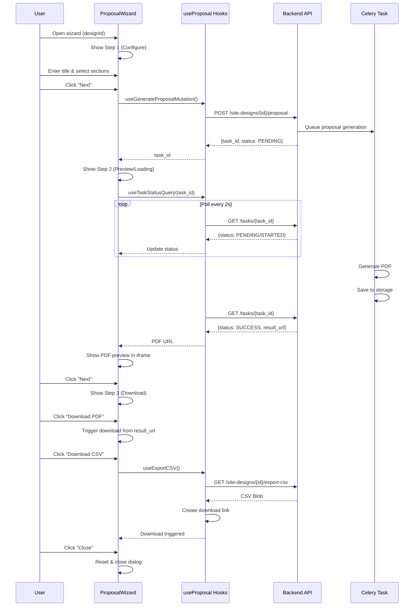

I have created the following plan after thorough exploration and analysis of the codebase. Follow the below plan verbatim. Trust the files and references. Do not re-verify what's written in the plan. Explore only when absolutely necessary. First implement all the proposed file changes and then I'll review all the changes together at the end.

## Observations

The codebase uses a well-structured pattern for async operations with task polling (similar to placement algorithm). The `useProposal` hook provides three functions: `useGenerateProposalMutation` for triggering generation, `useTaskStatusQuery` for polling with 2-second intervals, and `useExportCSV` for CSV downloads. The backend supports 6 configurable proposal sections (cover, site_map, specs, energy, financials, equipment) and returns a `result_url` for PDF download when the task succeeds. The UI follows shadcn/ui patterns with Dialog components and consistent loading/error states as seen in ResultsBottomSheet.

## Approach

The ProposalWizard will be a three-step modal dialog using the existing Dialog component. Step 1 (Configure) collects proposal title and section selections via checkboxes. Step 2 (Preview) triggers generation, polls task status, and displays the PDF in an iframe when ready. Step 3 (Download) provides download buttons for both PDF and CSV with proper file handling. The wizard will use local React state for step navigation and form data, integrate with the existing `useProposal` hooks, and follow established patterns for loading states, error handling, and retry functionality seen in ResultsBottomSheet and PlacementLoadingOverlay.

## Implementation Steps

### 1. Create ProposalWizard Component Structure

Create `file:frontend/src/components/DesignCanvas/ProposalWizard.tsx` with the following structure:

**Component Props Interface:**
- `designId: string` - The site design ID for proposal generation
- `open: boolean` - Controls dialog visibility
- `onOpenChange: (open: boolean) => void` - Callback for dialog state changes

**State Management:**
- `currentStep: number` - Track current wizard step (1, 2, or 3)
- `proposalTitle: string` - User-entered proposal title
- `selectedSections: object` - Boolean flags for 6 sections (include_cover, include_site_map, include_specs, include_energy, include_financials, include_equipment)
- `taskId: string | null` - Task ID from generation API
- `pdfUrl: string | null` - Result URL for PDF preview/download
- `error: string | null` - Error message if generation fails

**Dialog Structure:**
Use `Dialog`, `DialogContent`, `DialogHeader`, `DialogTitle`, `DialogDescription`, `DialogFooter` from `file:frontend/src/components/ui/dialog.tsx`. Set `max-w-3xl` for wider dialog to accommodate preview.

### 2. Implement Step 1: Configure Proposal

**UI Elements:**
- `Input` component for proposal title with label "Proposal Title" and placeholder "e.g., Solar Installation Proposal - [Client Name]"
- Section selection using `Checkbox` components with `Label` for each of the 6 sections:
  - "Cover Page" (include_cover)
  - "Site Map" (include_site_map)
  - "Technical Specifications" (include_specs)
  - "Energy Production Analysis" (include_energy)
  - "Financial Analysis" (include_financials)
  - "Equipment Details" (include_equipment)
- Display checkboxes in a 2-column grid layout using `grid grid-cols-2 gap-4`

**Footer Actions:**
- "Cancel" button (variant="outline") to close dialog
- "Next: Preview" button (variant="default") to proceed to step 2
- Disable "Next" if no sections are selected (validate at least one checkbox is checked)

**Default Values:**
- Initialize all sections to `true` by default
- Proposal title defaults to empty string

### 3. Implement Step 2: Preview & Generation

**Generation Trigger:**
- On step transition from 1 to 2, call `useGenerateProposalMutation` with `designId` and `selectedSections`
- Store returned `task_id` in state
- Enable `useTaskStatusQuery` with the `task_id`

**Polling Logic:**
- Use `useTaskStatusQuery(taskId, designId, enabled)` which polls every 2 seconds when status is PENDING or STARTED
- Monitor `query.data.status` for state changes

**UI States:**

*Loading State (PENDING/STARTED):*
- Display centered loading overlay similar to `PlacementLoadingOverlay`
- Show `Loader2` icon with spin animation
- Display message: "Generating your proposal..."
- Show secondary text: "This may take 30-60 seconds depending on the content selected"
- Add animated progress bar (indeterminate shimmer effect)

*Success State (SUCCESS):*
- Extract `result_url` from `query.data.result_url`
- Store in `pdfUrl` state
- Display PDF preview using iframe: `<iframe src={pdfUrl} className="w-full h-[500px] border rounded-md" />`
- Show success message above iframe: "Proposal generated successfully!"
- If iframe fails to load, show fallback message: "PDF preview not available. You can download the file below."

*Error State (FAILURE):*
- Display error message from `query.data.error` or generic "Failed to generate proposal"
- Show error icon (`AlertCircle` from lucide-react)
- Provide "Retry" button to go back to step 1 and try again
- Show "Cancel" button to close dialog

**Footer Actions:**
- "Back" button to return to step 1 (disabled during loading)
- "Next: Download" button to proceed to step 3 (enabled only when status is SUCCESS)
- "Retry" button (visible only on error) to reset to step 1

### 4. Implement Step 3: Download Options

**UI Elements:**
- Success confirmation message: "Your proposal is ready for download"
- Display proposal metadata:
  - Design ID
  - Generation timestamp (current date/time)
  - Selected sections count

**Download Buttons:**
- "Download PDF" button (variant="default", icon: `FileText`)
  - On click: Create anchor element with `href={pdfUrl}` and `download` attribute
  - Trigger programmatic click to download PDF
  - Show toast notification: "PDF downloaded successfully"
  
- "Download CSV (BOM)" button (variant="outline", icon: `FileSpreadsheet`)
  - Use `useExportCSV(designId)` mutation
  - On success: File download handled by hook (creates blob URL and triggers download)
  - Show loading state with `Loader2` icon while downloading
  - Toast notifications handled by hook

**Footer Actions:**
- "Generate Another" button to reset wizard to step 1 with cleared form
- "Close" button to close dialog

### 5. Add Step Navigation & Progress Indicator

**Progress Indicator:**
- Display step indicator at top of dialog content
- Show "Step 1 of 3: Configure", "Step 2 of 3: Preview", "Step 3 of 3: Download"
- Use visual breadcrumb or numbered circles to show progress
- Highlight current step with primary color

**Navigation Functions:**
- `goToStep(step: number)` - Navigate to specific step with validation
- `nextStep()` - Advance to next step
- `previousStep()` - Go back to previous step
- `resetWizard()` - Reset all state to initial values

**Step Transition Logic:**
- Step 1 → 2: Validate at least one section selected, trigger proposal generation
- Step 2 → 3: Only allow when task status is SUCCESS
- Step 3 → 1: Reset all state for new generation

### 6. Implement Error Handling & Retry Logic

**Error Scenarios:**
- API error during generation (handled by `useGenerateProposalMutation`)
- Task polling timeout (implement 5-minute timeout)
- Task failure status from backend
- PDF preview load failure
- CSV download failure (handled by `useExportCSV`)

**Retry Mechanisms:**
- "Retry" button on step 2 error state returns to step 1
- "Generate Another" on step 3 resets wizard
- Automatic retry for API calls (configured in hooks: 3 retries for generation, 1 for CSV)

**Timeout Handling:**
- Implement `useEffect` with timeout on step 2
- If polling exceeds 5 minutes, show timeout error
- Provide "Check Status" button to manually refresh task status
- Allow user to cancel and return to step 1

### 7. Add Loading Overlays & Progress Indicators

**Step 2 Loading Overlay:**
- Full-height overlay within dialog content area
- Semi-transparent dark background (`bg-slate-950/60 backdrop-blur-[2px]`)
- Centered card with loading animation
- Pulsing glow effect around spinner (similar to `PlacementLoadingOverlay`)
- Animated progress bar with shimmer effect
- Status text updates based on task status:
  - PENDING: "Queuing your request..."
  - STARTED: "Generating proposal..."

**Button Loading States:**
- Disable buttons during async operations
- Show `Loader2` icon with spin animation
- Update button text: "Generating...", "Downloading..."

**Skeleton Loaders:**
- Use `Skeleton` component from `file:frontend/src/components/ui/skeleton.tsx` for PDF preview placeholder while loading

### 8. Integrate with Existing UI Components

**Import Required Components:**
```typescript
import { Dialog, DialogContent, DialogHeader, DialogTitle, DialogDescription, DialogFooter } from "@/components/ui/dialog"
import { Button } from "@/components/ui/button"
import { Input } from "@/components/ui/input"
import { Label } from "@/components/ui/label"
import { Checkbox } from "@/components/ui/checkbox"
import { LoadingSpinner } from "@/components/common/LoadingSpinner"
import { Loader2, FileText, FileSpreadsheet, AlertCircle, CheckCircle } from "lucide-react"
```

**Use Existing Hooks:**
```typescript
import { useGenerateProposalMutation, useTaskStatusQuery, useExportCSV } from "@/hooks/useProposal"
```

**Toast Notifications:**
```typescript
import { toast } from "sonner"
```
- Show success toast when generation starts
- Show error toast on failures (handled by hooks)
- Show success toast on downloads

### 9. Add Accessibility & UX Enhancements

**Accessibility:**
- Proper ARIA labels for all form inputs
- Keyboard navigation support (Tab, Enter, Escape)
- Focus management between steps
- Screen reader announcements for status changes
- Semantic HTML structure

**UX Improvements:**
- Auto-focus on proposal title input when dialog opens
- Prevent dialog close during generation (step 2 loading)
- Confirm dialog close if user tries to exit during generation
- Preserve form data if user navigates back from step 2
- Clear visual feedback for all interactive elements
- Responsive design for smaller screens (adjust iframe height, button layout)

**Visual Polish:**
- Smooth transitions between steps (fade in/out)
- Consistent spacing and alignment
- Use design system colors and typography
- Add subtle animations for state changes
- Success checkmark animation on step 3

### 10. Component Export & Documentation

**Export Component:**
```typescript
export { ProposalWizard }
```

**Add JSDoc Comments:**
- Document component purpose and usage
- Document all props with types and descriptions
- Document state management approach
- Add usage example in comments

**File Location:**
Create at `file:frontend/src/components/DesignCanvas/ProposalWizard.tsx`

## Sequence Diagram

