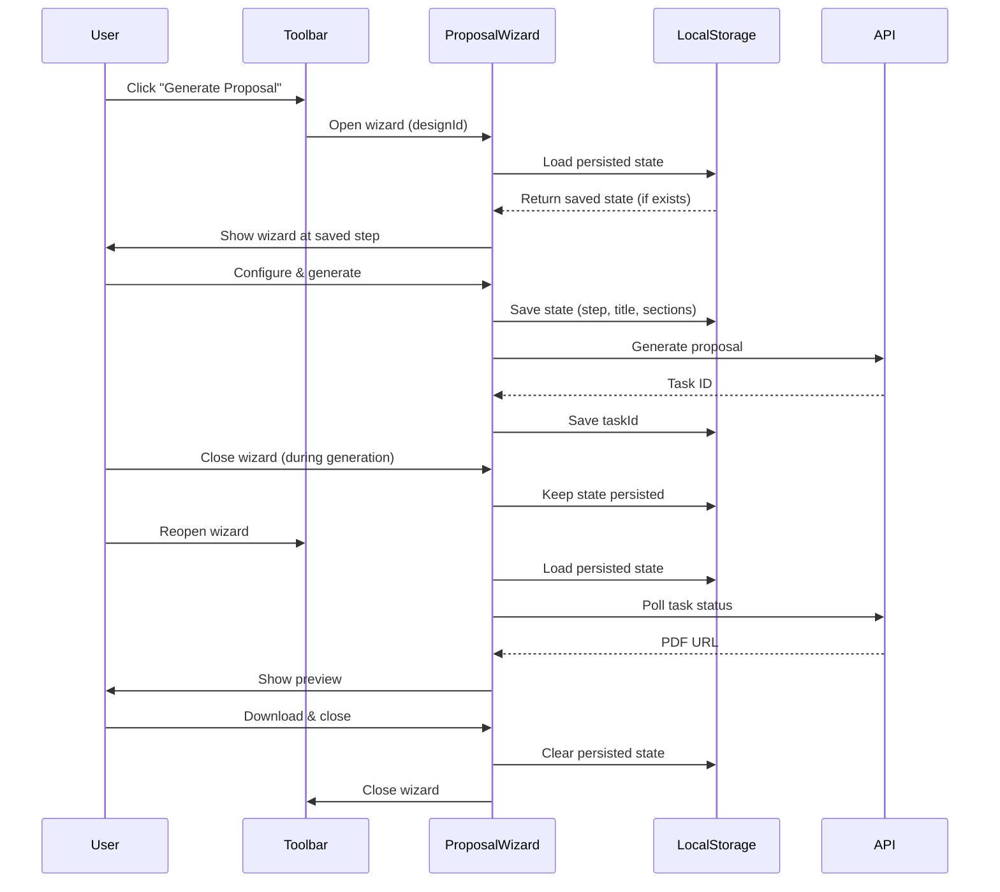

I have created the following plan after thorough exploration and analysis of the codebase. Follow the below plan verbatim. Trust the files and references. Do not re-verify what's written in the plan. Explore only when absolutely necessary. First implement all the proposed file changes and then I'll review all the changes together at the end.

## Observations

The Toolbar component currently has a placeholder "Generate Proposal" button that only logs to console. The ProposalWizard component is already implemented with three steps (Configure, Preview, Download) and expects `designId`, `open`, and `onOpenChange` props. The CanvasLayout receives `designId` but doesn't pass it to Toolbar. The codebase uses React `useState` for dialog state management and doesn't currently use localStorage or Zustand persist middleware.

## Approach

Implement wizard integration by passing `designId` from CanvasLayout to Toolbar, adding React state for wizard open/close, and implementing custom localStorage-based session persistence. The wizard state (step, title, selectedSections, taskId, pdfUrl) will be saved to localStorage on changes and restored when the wizard reopens, allowing users to resume their proposal generation workflow. Cleanup logic will clear persisted state when the wizard completes or is explicitly reset.

## Implementation Steps

### 1. Update CanvasLayout to Pass designId to Toolbar

**File:** `file:frontend/src/components/DesignCanvas/CanvasLayout.tsx`

- Modify the `Toolbar` component instantiation to include `designId` prop
- Update line 21: `<Toolbar title={title} tenderId={tenderId} designId={designId} />`

### 2. Update Toolbar Component Interface and State

**File:** `file:frontend/src/components/DesignCanvas/Toolbar.tsx`

- Add `designId: string` to the `ToolbarProps` interface
- Import necessary dependencies:
  - `useState` and `useEffect` from React
  - `ProposalWizard` component
- Add state for wizard open/close: `const [isWizardOpen, setIsWizardOpen] = useState(false)`
- Update the "Generate Proposal" button onClick handler to open the wizard: `onClick={() => setIsWizardOpen(true)}`
- Render the `ProposalWizard` component at the end of the Toolbar component with props: `designId`, `open={isWizardOpen}`, `onOpenChange={setIsWizardOpen}`

### 3. Create Session Persistence Hook

**File:** `file:frontend/src/hooks/useProposalWizardPersistence.ts` (new file)

Create a custom hook to manage wizard state persistence:

- Define interface for persisted wizard state:
  - `step: number`
  - `title: string`
  - `selectedSections: Record<string, boolean>`
  - `taskId: string | null`
  - `pdfUrl: string | null`
  - `timestamp: number` (for expiration)
- Implement `useProposalWizardPersistence(designId: string)` hook that returns:
  - `loadPersistedState(): PersistedWizardState | null` - loads from localStorage with key `proposal-wizard-${designId}`
  - `savePersistedState(state: PersistedWizardState): void` - saves to localStorage
  - `clearPersistedState(): void` - removes from localStorage
- Add expiration logic: discard persisted state older than 24 hours
- Handle JSON parse errors gracefully with try-catch

### 4. Integrate Session Persistence into ProposalWizard

**File:** `file:frontend/src/components/DesignCanvas/ProposalWizard.tsx`

- Import the `useProposalWizardPersistence` hook
- Initialize the hook: `const { loadPersistedState, savePersistedState, clearPersistedState } = useProposalWizardPersistence(designId)`
- Add `useEffect` to load persisted state when wizard opens:
  - Check if `open` is true and state hasn't been loaded yet
  - Call `loadPersistedState()` and restore `step`, `title`, `selectedSections`, `taskId`, `pdfUrl` if available
- Add `useEffect` to save state whenever it changes:
  - Dependencies: `[step, title, selectedSections, taskId, pdfUrl, open]`
  - Only save when `open` is true
  - Debounce saves to avoid excessive localStorage writes (use existing `useDebounce` hook or implement simple debounce)
- Update `handleReset` function to call `clearPersistedState()`
- Update `handleClose` function to call `clearPersistedState()` when wizard is successfully completed (step 3 and user closes)
- Add cleanup in the existing close effect to clear persisted state when dialog is closed after successful completion

### 5. Add Cleanup on Wizard Completion

**File:** `file:frontend/src/components/DesignCanvas/ProposalWizard.tsx`

- Modify the `handleClose` function to detect successful completion:
  - If `step === 3` and `hasPdfUrl`, call `clearPersistedState()` before closing
  - This ensures completed proposals don't persist in localStorage
- Add a "Start New Proposal" action that clears both component state and persisted state
- Ensure `handleReset` (Generate Another button) clears persisted state

### 6. Add Loading State Indicator for Persisted Sessions

**File:** `file:frontend/src/components/DesignCanvas/ProposalWizard.tsx`

- When loading persisted state, show a brief loading indicator or toast notification
- Use `toast.info("Resuming your proposal...")` from `sonner` when restoring state
- This provides user feedback that their previous session was recovered

## Visual Flow

## Key Considerations

- **Persistence Scope**: Use `designId` in localStorage key to ensure each design has independent wizard state
- **Expiration**: Implement 24-hour expiration to prevent stale state accumulation
- **Error Handling**: Gracefully handle localStorage quota exceeded errors and JSON parse failures
- **State Cleanup**: Clear persisted state on successful completion to avoid confusion on next open
- **User Experience**: Show toast notification when resuming from persisted state
- **Debouncing**: Debounce localStorage writes to avoid performance issues during rapid state changes