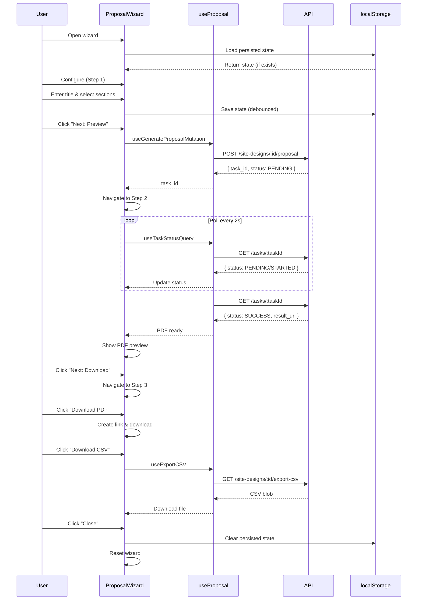

I have created the following plan after thorough exploration and analysis of the codebase. Follow the below plan verbatim. Trust the files and references. Do not re-verify what's written in the plan. Explore only when absolutely necessary. First implement all the proposed file changes and then I'll review all the changes together at the end.

## Observations

The codebase follows a well-established testing pattern using Vitest, React Testing Library, and MSW (Mock Service Worker) for API mocking. The existing `ResultsBottomSheet.test.tsx` demonstrates comprehensive testing including polling logic with fake timers, error handling, accessibility, and state transitions. The `ProposalWizard` component implements a 3-step wizard with task polling, localStorage persistence, and file downloads. The `useProposal` hooks provide mutation and query functionality with automatic polling when task status is PENDING or STARTED.

## Approach

Create two comprehensive test files following the established patterns from `ResultsBottomSheet.test.tsx`. For `ProposalWizard.test.tsx`, test all three wizard steps, navigation, error states, polling behavior, and persistence. For `useProposal.test.tsx`, test the hooks in isolation using `renderHook` from React Testing Library, focusing on mutation behavior, polling logic with fake timers, and CSV download functionality. Mock API responses using MSW handlers with state transitions (PENDING → STARTED → SUCCESS/FAILURE) to simulate real-world async task behavior.

## Implementation Steps

### 1. Create MSW Handlers for Proposal API Endpoints

**File**: `file:frontend/src/test/mocks/handlers.ts`

Add handlers for proposal-related endpoints to the existing handlers array:

- `POST /api/site-designs/:id/proposal` - Returns `ProposalTaskResponse` with task_id
- `GET /api/tasks/:taskId` - Returns `ProposalStatusResponse` with status transitions
- `GET /api/site-designs/:id/export-csv` - Returns CSV blob

Implement stateful handlers using the existing `testState` pattern to simulate task status transitions:
- Track poll count per task ID
- Return PENDING on first call, STARTED on second, SUCCESS with result_url on third
- Support failure scenarios for specific test IDs
- Support timeout scenarios

**Example handler pattern**:
```typescript
// Track task state
testState.proposalTaskCount = {} as Record<string, number>;

// POST proposal generation
http.post('*/api/site-designs/:id/proposal', ({ params }) => {
  const taskId = `task-${params.id}-${Date.now()}`;
  testState.proposalTaskCount[taskId] = 0;
  return HttpResponse.json({ task_id: taskId, status: 'PENDING' });
});

// GET task status with transitions
http.get('*/api/tasks/:taskId', ({ params }) => {
  const taskId = params.taskId as string;
  const count = ++testState.proposalTaskCount[taskId];
  
  if (taskId.includes('fail')) {
    return HttpResponse.json({ 
      task_id: taskId, 
      status: 'FAILURE', 
      error: 'Generation failed' 
    });
  }
  
  if (count === 1) return HttpResponse.json({ task_id: taskId, status: 'PENDING' });
  if (count === 2) return HttpResponse.json({ task_id: taskId, status: 'STARTED' });
  return HttpResponse.json({ 
    task_id: taskId, 
    status: 'SUCCESS', 
    result_url: `http://localhost/proposals/${taskId}.pdf` 
  });
});

// CSV export
http.get('*/api/site-designs/:id/export-csv', () => {
  return HttpResponse.blob(new Blob(['mock,csv,data'], { type: 'text/csv' }));
});
```

---

### 2. Create Proposal Test Fixtures

**File**: `file:frontend/src/test/fixtures/proposal.ts` (new file)

Create mock data for proposal-related responses:

```typescript
export const mockProposalTaskResponse: ProposalTaskResponse = {
  task_id: 'task-123',
  status: 'PENDING'
};

export const mockProposalStatusPending: ProposalStatusResponse = {
  task_id: 'task-123',
  status: 'PENDING'
};

export const mockProposalStatusStarted: ProposalStatusResponse = {
  task_id: 'task-123',
  status: 'STARTED'
};

export const mockProposalStatusSuccess: ProposalStatusResponse = {
  task_id: 'task-123',
  status: 'SUCCESS',
  result_url: 'http://localhost/proposals/task-123.pdf'
};

export const mockProposalStatusFailure: ProposalStatusResponse = {
  task_id: 'task-123',
  status: 'FAILURE',
  error: 'PDF generation failed'
};
```

---

### 3. Create useProposal Hook Tests

**File**: `file:frontend/src/hooks/__tests__/useProposal.test.tsx` (new file)

Test the three hooks in isolation using `renderHook` from `@testing-library/react`:

#### Test Structure:
```typescript
describe('useProposal Hooks', () => {
  describe('useGenerateProposalMutation', () => {
    // Test successful proposal generation
    // Test error handling
    // Test toast notifications
    // Test retry logic (3 retries in production, 0 in test)
  });

  describe('useTaskStatusQuery', () => {
    // Test polling behavior with fake timers
    // Test status transitions (PENDING → STARTED → SUCCESS)
    // Test polling stops on SUCCESS
    // Test polling stops on FAILURE
    // Test cache invalidation on success
    // Test disabled state
    // Test error handling
  });

  describe('useExportCSV', () => {
    // Test successful CSV download
    // Test file download trigger (createElement, click, remove)
    // Test error handling
    // Test toast notifications
    // Test retry logic (1 retry in production, 0 in test)
  });
});
```

#### Key Test Cases:

**useGenerateProposalMutation**:
- Verify mutation calls correct API endpoint with options
- Verify success toast on successful generation
- Verify error toast on failure
- Verify returned task_id

**useTaskStatusQuery**:
- Use `vi.useFakeTimers()` to control polling intervals
- Verify polling occurs every 2 seconds when status is PENDING/STARTED
- Verify polling stops when status is SUCCESS or FAILURE
- Verify `refetchInterval` returns false for terminal states
- Verify cache invalidation of site design details on success
- Mock `useQueryClient` to verify `invalidateQueries` is called

**useExportCSV**:
- Mock `document.createElement`, `document.body.appendChild`, `document.body.removeChild`
- Mock `window.URL.createObjectURL` and `window.URL.revokeObjectURL`
- Verify blob download flow
- Verify filename format includes designId and date
- Verify success toast

**Example test**:
```typescript
it('should poll task status every 2 seconds until SUCCESS', async () => {
  vi.useFakeTimers();
  const { result } = renderHook(
    () => useTaskStatusQuery('task-poll-test', 'design-1'),
    { wrapper: createWrapper() }
  );

  // Initial fetch
  await waitFor(() => expect(result.current.data?.status).toBe('PENDING'));

  // Advance 2 seconds
  await act(async () => {
    await vi.advanceTimersByTimeAsync(2000);
  });

  await waitFor(() => expect(result.current.data?.status).toBe('STARTED'));

  // Advance 2 more seconds
  await act(async () => {
    await vi.advanceTimersByTimeAsync(2000);
  });

  await waitFor(() => expect(result.current.data?.status).toBe('SUCCESS'));
  expect(result.current.data?.result_url).toBeDefined();

  vi.useRealTimers();
});
```

---

### 4. Create ProposalWizard Component Tests

**File**: `file:frontend/src/components/DesignCanvas/__tests__/ProposalWizard.test.tsx` (new file)

Test the wizard component comprehensively following patterns from `ResultsBottomSheet.test.tsx`:

#### Mock Dependencies:
```typescript
// Mock sonner
vi.mock('sonner', () => ({
  toast: {
    info: vi.fn(),
    success: vi.fn(),
    error: vi.fn(),
  }
}));

// Mock Dialog Portal (similar to Sheet Portal mock)
vi.mock('@/components/ui/dialog', async () => {
  const Actual = await vi.importActual('@/components/ui/dialog');
  return {
    ...Actual,
    DialogPortal: ({ children }: any) => <div data-testid="dialog-portal">{children}</div>,
  };
});

// Mock localStorage
const localStorageMock = (() => {
  let store: Record<string, string> = {};
  return {
    getItem: (key: string) => store[key] || null,
    setItem: (key: string, value: string) => { store[key] = value; },
    removeItem: (key: string) => { delete store[key]; },
    clear: () => { store = {}; },
  };
})();
Object.defineProperty(window, 'localStorage', { value: localStorageMock });

// Mock window.confirm
window.confirm = vi.fn(() => true);
```

#### Test Structure:
```typescript
describe('ProposalWizard', () => {
  describe('Step 1: Configure', () => {
    // Test initial render with step 1
    // Test proposal title input
    // Test section checkboxes (all 6 sections)
    // Test "Next: Preview" button disabled when no sections selected
    // Test "Next: Preview" button enabled when at least one section selected
    // Test "Cancel" button closes dialog
    // Test navigation to step 2 on "Next" click
  });

  describe('Step 2: Preview & Generation', () => {
    // Test loading state during generation
    // Test polling task status
    // Test success state with PDF preview (iframe)
    // Test error state with retry button
    // Test "Back" button navigation
    // Test "Next: Download" button disabled until success
    // Test prevent close during generation (window.confirm)
  });

  describe('Step 3: Download', () => {
    // Test download buttons for PDF and CSV
    // Test PDF download triggers file download
    // Test CSV download triggers file download
    // Test "Generate Another" resets wizard
    // Test "Close" button closes dialog
    // Test design ID and timestamp display
  });

  describe('Navigation & State Management', () => {
    // Test step progression (1 → 2 → 3)
    // Test back navigation (2 → 1)
    // Test progress indicator updates
    // Test step descriptions update
  });

  describe('Error Handling', () => {
    // Test generation failure shows error message
    // Test retry button resets to step 1
    // Test task status FAILURE
    // Test success without result_url (edge case)
    // Test network errors
  });

  describe('Polling with Fake Timers', () => {
    // Test polling starts on step 2
    // Test polling every 2 seconds
    // Test polling stops on SUCCESS
    // Test polling stops on FAILURE
    // Test status transitions (PENDING → STARTED → SUCCESS)
  });

  describe('Session Persistence', () => {
    // Test state saves to localStorage
    // Test state loads from localStorage on reopen
    // Test expired state is cleared (24 hours)
    // Test state clears on completion
    // Test resume toast notification
  });

  describe('File Downloads', () => {
    // Test PDF download creates link element
    // Test CSV download mutation
    // Test filename generation
    // Test success toasts
  });
});
```

#### Key Test Cases:

**Step 1 - Configure**:
```typescript
it('should render step 1 with title input and section checkboxes', async () => {
  const { user } = renderWithDesign('design-1');
  
  expect(screen.getByText(/Step 1 of 3: Configure/i)).toBeInTheDocument();
  expect(screen.getByLabelText(/Proposal Title/i)).toBeInTheDocument();
  
  // Verify all 6 sections
  expect(screen.getByLabelText(/Cover Page/i)).toBeInTheDocument();
  expect(screen.getByLabelText(/Site Map/i)).toBeInTheDocument();
  expect(screen.getByLabelText(/Technical Specifications/i)).toBeInTheDocument();
  expect(screen.getByLabelText(/Energy Production Analysis/i)).toBeInTheDocument();
  expect(screen.getByLabelText(/Financial Analysis/i)).toBeInTheDocument();
  expect(screen.getByLabelText(/Equipment Details/i)).toBeInTheDocument();
});

it('should enable Next button only when at least one section is selected', async () => {
  const { user } = renderWithDesign('design-1');
  
  const nextBtn = screen.getByRole('button', { name: /Next: Preview/i });
  expect(nextBtn).not.toBeDisabled(); // All sections checked by default
  
  // Uncheck all sections
  const coverCheckbox = screen.getByLabelText(/Cover Page/i);
  await user.click(coverCheckbox);
  // ... uncheck all others
  
  expect(nextBtn).toBeDisabled();
});
```

**Step 2 - Preview with Polling**:
```typescript
it('should show loading state and poll task status', async () => {
  vi.useFakeTimers();
  const { user } = renderWithDesign('design-1');
  
  // Navigate to step 2
  await user.click(screen.getByRole('button', { name: /Next: Preview/i }));
  
  // Should show loading
  expect(screen.getByText(/Queuing your request/i)).toBeInTheDocument();
  
  // Advance timers to trigger polling
  await act(async () => {
    await vi.advanceTimersByTimeAsync(2000);
  });
  
  expect(screen.getByText(/Generating proposal/i)).toBeInTheDocument();
  
  // Advance to success
  await act(async () => {
    await vi.advanceTimersByTimeAsync(2000);
  });
  
  await waitFor(() => {
    expect(screen.getByText(/Proposal generated successfully/i)).toBeInTheDocument();
  });
  
  // Verify iframe with PDF
  const iframe = screen.getByTitle(/Proposal Preview/i);
  expect(iframe).toHaveAttribute('src', expect.stringContaining('.pdf'));
  
  vi.useRealTimers();
});
```

**Error Handling**:
```typescript
it('should show error state and allow retry', async () => {
  server.use(
    http.post('*/api/site-designs/fail-design/proposal', () => {
      return HttpResponse.json({ task_id: 'task-fail', status: 'PENDING' });
    }),
    http.get('*/api/tasks/task-fail', () => {
      return HttpResponse.json({ 
        task_id: 'task-fail', 
        status: 'FAILURE', 
        error: 'PDF generation failed' 
      });
    })
  );
  
  const { user } = renderWithDesign('fail-design');
  await user.click(screen.getByRole('button', { name: /Next: Preview/i }));
  
  await waitFor(() => {
    expect(screen.getByText(/Generation Failed/i)).toBeInTheDocument();
    expect(screen.getByText(/PDF generation failed/i)).toBeInTheDocument();
  });
  
  const retryBtn = screen.getByRole('button', { name: /Try Again/i });
  await user.click(retryBtn);
  
  // Should return to step 1
  expect(screen.getByText(/Step 1 of 3: Configure/i)).toBeInTheDocument();
});
```

**Persistence**:
```typescript
it('should persist wizard state to localStorage', async () => {
  const { user } = renderWithDesign('design-1');
  
  // Enter title
  const titleInput = screen.getByLabelText(/Proposal Title/i);
  await user.type(titleInput, 'Test Proposal');
  
  // Wait for debounced save (500ms)
  await act(async () => {
    await vi.advanceTimersByTimeAsync(500);
  });
  
  const saved = localStorage.getItem('proposal-wizard-design-1');
  expect(saved).toBeTruthy();
  const data = JSON.parse(saved!);
  expect(data.title).toBe('Test Proposal');
  expect(data.step).toBe(1);
});

it('should load persisted state on reopen', async () => {
  // Set persisted state
  const persistedState = {
    step: 2,
    title: 'Resumed Proposal',
    selectedSections: { include_cover: true, include_site_map: false },
    taskId: 'task-123',
    pdfUrl: null,
    timestamp: Date.now()
  };
  localStorage.setItem('proposal-wizard-design-1', JSON.stringify(persistedState));
  
  renderWithDesign('design-1');
  
  await waitFor(() => {
    expect(toast.info).toHaveBeenCalledWith(expect.stringContaining('Resuming'));
  });
  
  expect(screen.getByText(/Step 2 of 3: Preview/i)).toBeInTheDocument();
});
```

**File Downloads**:
```typescript
it('should download PDF when download button clicked', async () => {
  const createElementSpy = vi.spyOn(document, 'createElement');
  const appendChildSpy = vi.spyOn(document.body, 'appendChild');
  const removeChildSpy = vi.spyOn(document.body, 'removeChild');
  
  const { user } = renderWithDesign('design-1');
  
  // Navigate to step 3 (assume success state)
  // ... navigation logic
  
  const downloadBtn = screen.getByRole('button', { name: /Download PDF/i });
  await user.click(downloadBtn);
  
  expect(createElementSpy).toHaveBeenCalledWith('a');
  expect(appendChildSpy).toHaveBeenCalled();
  expect(removeChildSpy).toHaveBeenCalled();
  expect(toast.success).toHaveBeenCalledWith(expect.stringContaining('PDF downloaded'));
});
```

---

### 5. Add Test Helper Utilities

**File**: `file:frontend/src/test/utils.tsx`

Add helper function for rendering ProposalWizard with common props:

```typescript
export const renderProposalWizard = (
  designId: string,
  open: boolean = true,
  onOpenChange: (open: boolean) => void = vi.fn()
) => {
  const user = userEvent.setup({ delay: null });
  return {
    user,
    onOpenChange,
    ...renderWithProviders(
      <ProposalWizard 
        designId={designId} 
        open={open} 
        onOpenChange={onOpenChange} 
      />
    )
  };
};
```

---

### 6. Update Test Configuration

**File**: `file:frontend/vitest.config.ts`

Ensure test environment is configured correctly:
- Verify `environment: 'jsdom'` is set
- Verify `setupFiles` includes test setup
- Verify coverage configuration includes new test files

---

## Testing Checklist

### ProposalWizard.test.tsx
- [ ] All three steps render correctly
- [ ] Step navigation (forward and backward)
- [ ] Title input and section checkboxes work
- [ ] Validation prevents empty section selection
- [ ] Loading states during generation
- [ ] Task polling with fake timers (2s interval)
- [ ] Status transitions (PENDING → STARTED → SUCCESS)
- [ ] Success state shows PDF preview iframe
- [ ] Error state shows error message and retry button
- [ ] Retry resets wizard to step 1
- [ ] PDF download creates link and triggers download
- [ ] CSV download calls mutation
- [ ] localStorage persistence saves state
- [ ] localStorage persistence loads state on reopen
- [ ] Expired persistence is cleared (24 hours)
- [ ] Prevent close during generation (window.confirm)
- [ ] Progress indicator updates
- [ ] Toast notifications (success, error, info)
- [ ] Accessibility attributes

### useProposal.test.tsx
- [ ] useGenerateProposalMutation calls correct endpoint
- [ ] useGenerateProposalMutation shows success toast
- [ ] useGenerateProposalMutation shows error toast
- [ ] useGenerateProposalMutation retry logic (0 in test, 3 in prod)
- [ ] useTaskStatusQuery polls every 2 seconds
- [ ] useTaskStatusQuery stops polling on SUCCESS
- [ ] useTaskStatusQuery stops polling on FAILURE
- [ ] useTaskStatusQuery invalidates cache on success
- [ ] useTaskStatusQuery can be disabled
- [ ] useTaskStatusQuery handles errors
- [ ] useExportCSV downloads blob as file
- [ ] useExportCSV creates proper filename
- [ ] useExportCSV shows success toast
- [ ] useExportCSV shows error toast
- [ ] useExportCSV retry logic (0 in test, 1 in prod)

---

## Mermaid Diagram

