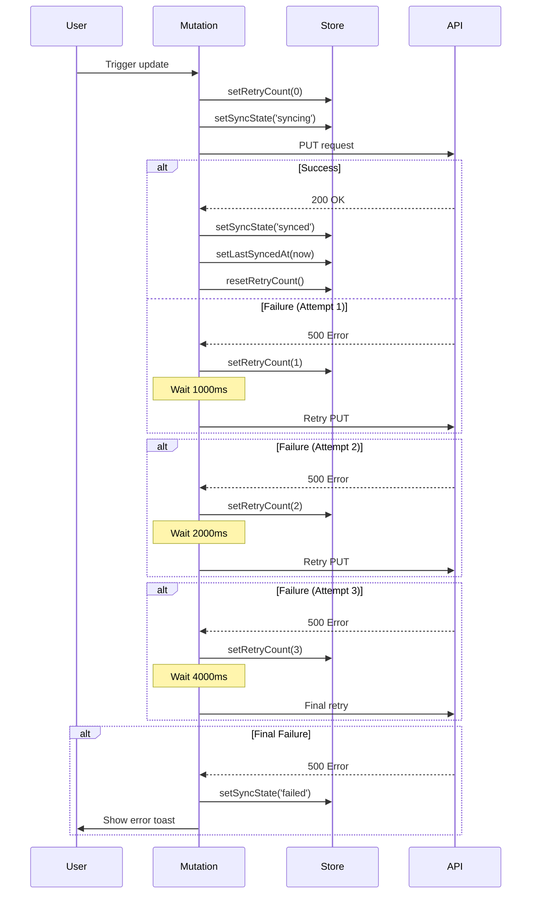

I have created the following plan after thorough exploration and analysis of the codebase. Follow the below plan verbatim. Trust the files and references. Do not re-verify what's written in the plan. Explore only when absolutely necessary. First implement all the proposed file changes and then I'll review all the changes together at the end.

## Observations

The codebase uses React Query v5 for data fetching with Zustand for state management. The `useUpdateSiteDesignMutation` currently implements basic retry logic (3 attempts) without exponential backoff. The `useDesignCanvasStore` tracks sync state but lacks retry count and timestamp tracking. Existing tests verify sync state transitions and optimistic updates with rollback on failure.

## Approach

Enhance the retry mechanism by implementing exponential backoff (1s, 2s, 4s delays) using React Query's `retryDelay` option. Extend the Zustand store to track retry attempts and last successful sync timestamp. Update mutation callbacks to maintain these metrics, enabling better visibility into sync operations and supporting future features like manual retry and timestamp display.

## Implementation Steps

### 1. Enhance Zustand Store Schema

Update `file:frontend/src/stores/useDesignCanvasStore.ts`:

**Add new state fields:**
- `retryCount: number` - tracks current retry attempt (0-3)
- `lastSyncedAt: Date | null` - timestamp of last successful sync

**Add new actions:**
- `setRetryCount(count: number)` - updates retry attempt counter
- `setLastSyncedAt(timestamp: Date)` - records successful sync timestamp
- `resetRetryCount()` - resets counter to 0

**Update existing actions:**
- Modify `setSyncState` to reset `retryCount` when state changes to 'synced'
- Set `lastSyncedAt` when transitioning to 'synced' state

### 2. Implement Exponential Backoff in Update Mutation

Update `file:frontend/src/hooks/useSiteDesigns.ts` in the `useUpdateSiteDesignMutation` function:

**Configure retryDelay:**
```typescript
retryDelay: (attemptIndex) => {
  const delays = [1000, 2000, 4000]; // 1s, 2s, 4s
  return delays[attemptIndex] || 4000;
}
```

**Update retry configuration:**
- Keep `retry: 3` for maximum attempts
- Add `retryDelay` function as shown above

**Enhance mutation callbacks:**

In `onMutate`:
- Call `setRetryCount(0)` to reset counter at mutation start

In `onError`:
- Extract `failureCount` from error context
- Call `setRetryCount(failureCount)` to track current attempt
- Keep existing rollback and toast logic

In `onSuccess`:
- Call `setLastSyncedAt(new Date())` to record timestamp
- Call `resetRetryCount()` to clear retry counter
- Keep existing cache updates and toast

### 3. Apply Same Pattern to Other Mutations

Update `useCreateSiteDesignMutation` and `useDeleteSiteDesignMutation` with identical retry logic:

- Add `retryDelay` with exponential backoff [1000, 2000, 4000]
- Update callbacks to track `retryCount` and `lastSyncedAt`
- Maintain consistency with update mutation pattern

### 4. Update Store Tests

Enhance `file:frontend/src/stores/__tests__/useDesignCanvasStore.test.ts`:

**Add test cases:**
- Verify `retryCount` initializes to 0
- Test `setRetryCount` updates counter correctly
- Test `resetRetryCount` clears to 0
- Verify `lastSyncedAt` initializes to null
- Test `setLastSyncedAt` stores timestamp
- Verify `setSyncState('synced')` resets retry count automatically

### 5. Update Hook Tests

Enhance `file:frontend/src/hooks/__tests__/useSiteDesigns.test.tsx`:

**Add retry behavior tests:**
- Mock network failures to trigger retries
- Verify exponential backoff delays (1s, 2s, 4s) using `vi.useFakeTimers()`
- Assert `retryCount` increments on each failure (0 → 1 → 2 → 3)
- Verify `retryCount` resets to 0 on success
- Test `lastSyncedAt` updates only on successful sync
- Verify final 'failed' state after exhausting all retries

**Test structure:**
```typescript
it('should retry with exponential backoff on failure', async () => {
  // Setup fake timers
  // Mock API to fail 2 times, succeed on 3rd
  // Trigger mutation
  // Assert retryCount increments: 0 → 1 → 2
  // Advance timers by 1000ms, 2000ms
  // Verify successful sync and retryCount reset
});
```

### 6. Type Safety Updates

Update `file:frontend/src/stores/useDesignCanvasStore.ts` interface:

Add to `DesignCanvasState`:
```typescript
retryCount: number;
lastSyncedAt: Date | null;
setRetryCount: (count: number) => void;
setLastSyncedAt: (timestamp: Date) => void;
resetRetryCount: () => void;
```

## Visual Flow



## Key Considerations

- **Retry count tracking**: Increment on each failure, reset on success or new mutation
- **Timestamp precision**: Use `Date` object for `lastSyncedAt` to support relative time formatting
- **Test environment**: Disable retries in tests (`retry: 0`) unless specifically testing retry behavior
- **Exponential backoff array**: Use fixed delays [1000, 2000, 4000] instead of exponential formula for predictability
- **State consistency**: Ensure `retryCount` resets when `syncState` becomes 'synced' to prevent stale data
- **Error context**: React Query provides `failureCount` in error callbacks for tracking attempts