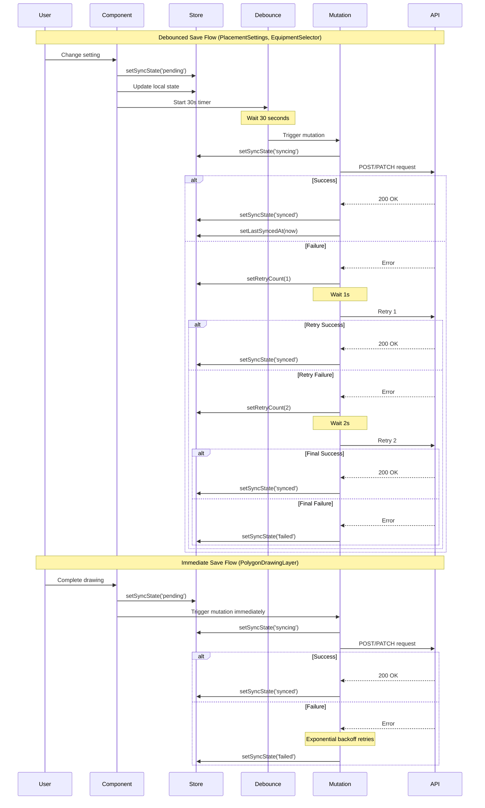

I have created the following plan after thorough exploration and analysis of the codebase. Follow the below plan verbatim. Trust the files and references. Do not re-verify what's written in the plan. Explore only when absolutely necessary. First implement all the proposed file changes and then I'll review all the changes together at the end.

## Observations

The codebase already has exponential backoff retry logic and sync state tracking implemented from the previous phase. The current implementation uses a 3-second debounce for placement settings in file:frontend/src/components/DesignCanvas/PlacementSettings.tsx. The `EquipmentSelector` and `PolygonDrawingLayer` components save changes immediately without debouncing. The Zustand store (`useDesignCanvasStore`) already tracks `syncState`, `retryCount`, and `lastSyncedAt` fields, and the mutation hooks in `useSiteDesigns` already implement exponential backoff (1s, 2s, 4s).

## Approach

The implementation will update the debounce delay from 3 seconds to 30 seconds for placement settings, add debounced auto-save to equipment selection changes, and ensure immediate sync state updates for user feedback. Critical operations like boundary/exclusion drawing will continue to save immediately but will properly set sync state to 'pending' before the save operation. This approach balances reducing server load (30s debounce) with maintaining responsiveness for critical operations and providing immediate visual feedback to users.

## Implementation Steps

### 1. Update PlacementSettings Debounce Delay

**File:** file:frontend/src/components/DesignCanvas/PlacementSettings.tsx

- Change the debounce delay on line 39 from `3000` to `30000` (30 seconds)
- Update the comment to reflect the new delay: `// 30s debounce for auto-save`
- The component already sets sync state to 'pending' immediately via `handleSettingChange` (line 51), so no additional changes needed for sync state management

### 2. Add Immediate Sync State Update to PolygonDrawingLayer

**File:** file:frontend/src/components/DesignCanvas/PolygonDrawingLayer.tsx

- Import `setSyncState` from the Zustand store at the top of the component (line 21)
- In the `completeDrawing` function, add `setSyncState('pending')` immediately before calling `updateMutation.mutate` (before line 75)
- This ensures the UI shows pending state even though the save happens immediately for this critical operation
- No debouncing should be added here as boundary/exclusion drawing is a critical operation that requires immediate save

### 3. Implement Debounced Auto-Save for EquipmentSelector

**File:** file:frontend/src/components/DesignCanvas/EquipmentSelector.tsx

- Import `useDebounce` hook from `@/hooks/useDebounce` at the top
- Import `useEffect` and `useCallback` from React
- Import `setSyncState` from `useDesignCanvasStore`
- Add local state to track equipment changes: `const [localModuleId, setLocalModuleId] = useState<string | null>(null)` and `const [localInverterId, setLocalInverterId] = useState<string | null>(null)`
- Initialize local state from design data in a `useEffect` when design loads
- Create debounced values: `const debouncedModuleId = useDebounce(localModuleId, 30000)` and `const debouncedInverterId = useDebounce(localInverterId, 30000)`
- Add `useEffect` hooks to trigger mutations when debounced values change (similar to PlacementSettings pattern)
- Update `handleModuleChange` to: set local state, call `setSyncState('pending')`, and call `setEquipmentSelection` immediately for UI updates
- Update `handleInverterChange` similarly
- This ensures immediate UI feedback while deferring the actual API call by 30 seconds

### 4. Verify Sync State Transitions

**Files:** file:frontend/src/hooks/useSiteDesigns.tsx, file:frontend/src/stores/useDesignCanvasStore.ts

- Verify that `useUpdateSiteDesignMutation` properly transitions sync state from 'pending' → 'syncing' → 'synced'/'failed'
- Confirm that the mutation's `onMutate` callback sets sync state to 'syncing' (line 61 in useSiteDesigns.ts)
- Confirm that `onSuccess` sets it to 'synced' (line 94) and `onError` sets it to 'failed' (line 101)
- Verify that the store's `setSyncState` action updates `lastSyncedAt` when state becomes 'synced' (line 58 in useDesignCanvasStore.ts)
- No code changes needed if verification passes; this step ensures the existing implementation is correct

### 5. Test Sync State Flow

Create manual test scenarios to verify:

- **Placement Settings:** Change a slider → sync state shows 'pending' immediately → after 30s, state changes to 'syncing' → then 'synced' or 'failed'
- **Equipment Selection:** Select a module → sync state shows 'pending' immediately → after 30s, state changes to 'syncing' → then 'synced' or 'failed'
- **Polygon Drawing:** Complete a boundary → sync state shows 'pending' → immediately changes to 'syncing' → then 'synced' or 'failed' (no 30s delay)
- **Multiple Rapid Changes:** Make multiple slider adjustments within 30s → only the final value should be saved after 30s from the last change
- **Failed Sync:** Simulate network failure → verify retry attempts occur with exponential backoff → verify final state is 'failed' after 3 retries

