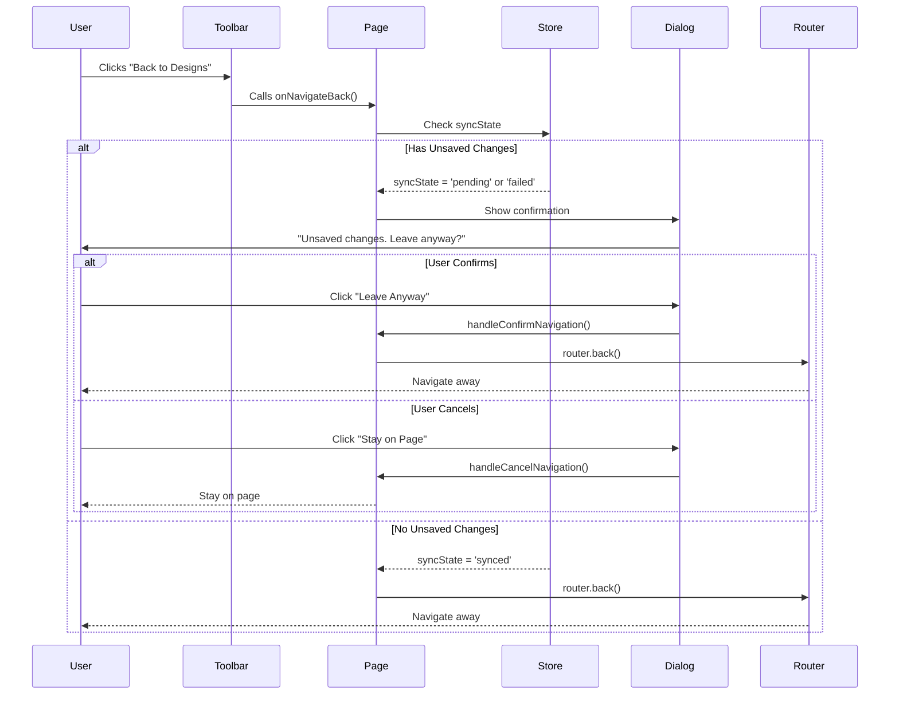

I have created the following plan after thorough exploration and analysis of the codebase. Follow the below plan verbatim. Trust the files and references. Do not re-verify what's written in the plan. Explore only when absolutely necessary. First implement all the proposed file changes and then I'll review all the changes together at the end.

## Observations

The codebase already has robust sync state management with `syncState`, `retryCount`, and `lastSyncedAt` in the Zustand store. The design canvas page file exists but is empty and needs to be created following the Next.js App Router pattern. The `Toolbar` component has a "Back to Designs" button using `router.back()` that needs unsaved changes protection. The `ConfirmDialog` component is available for custom modal warnings.

## Approach

Implement a multi-layered unsaved changes protection system: (1) browser-native `beforeunload` event for page refreshes and tab closes, (2) custom modal dialog for Next.js router navigation interception, and (3) Toolbar button enhancement to check sync state before navigation. The implementation will check if `syncState` is 'pending' or 'failed' to determine if there are unsaved changes, providing a seamless user experience across all navigation scenarios.

## Implementation Steps

### 1. Create Design Canvas Page Component

Create the main page component at `file:frontend/src/app/tenders/[id]/design/[designId]/page.tsx`:

- Add `"use client"` directive at the top
- Import required dependencies: `useParams`, `useRouter` from `next/navigation`, `useEffect`, `useState`
- Import `CanvasLayout` from `@/components/DesignCanvas/CanvasLayout`
- Import `MapCanvas` from `@/components/DesignCanvas/MapCanvas`
- Import `useSiteDesignQuery` from `@/hooks/useSiteDesigns`
- Import `useDesignCanvasStore` from `@/stores/useDesignCanvasStore`
- Import `ConfirmDialog` from `@/components/common/ConfirmDialog`
- Import `LoadingSpinner` and `ErrorMessage` from `@/components/common`

**Page Structure:**
- Extract `id` (tenderId) and `designId` from `useParams`
- Fetch design data using `useSiteDesignQuery(designId)`
- Subscribe to `syncState` from `useDesignCanvasStore`
- Add state for navigation confirmation dialog: `isNavigationWarningOpen` and `pendingNavigation`
- Calculate center coordinates from design data or use default `[0, 0]`
- Render loading state while fetching design
- Render error state if design not found
- Render `CanvasLayout` with `MapCanvas` as children when design is loaded

### 2. Implement beforeunload Event Handler

Add browser-native warning for page refreshes and tab closes in the page component:

- Create `useEffect` hook that runs when `syncState` changes
- Check if `syncState` is 'pending' or 'failed'
- Define `handleBeforeUnload` function that sets `event.preventDefault()` and `event.returnValue = ''` (required for Chrome)
- Add event listener: `window.addEventListener('beforeunload', handleBeforeUnload)`
- Return cleanup function to remove listener: `window.removeEventListener('beforeunload', handleBeforeUnload)`
- Only attach listener when there are unsaved changes (`syncState === 'pending' || syncState === 'failed'`)

**Browser Behavior:**
- Modern browsers will show their own generic warning message
- Custom messages are not supported for security reasons
- The warning only appears when navigating away from the page (refresh, close tab, external navigation)

### 3. Implement Next.js Router Navigation Interception

Add custom modal warning for internal Next.js navigation:

- Create state: `const [isNavigationWarningOpen, setIsNavigationWarningOpen] = useState(false)`
- Create state: `const [pendingNavigation, setPendingNavigation] = useState<(() => void) | null>(null)`
- Create `handleNavigationAttempt` function that checks sync state:
  - If `syncState === 'pending' || syncState === 'failed'`, show confirmation dialog
  - Store the navigation callback in `pendingNavigation` state
  - Set `isNavigationWarningOpen` to true
  - Return early to prevent navigation
  - If sync state is clean, execute navigation immediately
- Create `handleConfirmNavigation` function:
  - Execute the stored `pendingNavigation` callback
  - Close the dialog
  - Clear pending navigation state
- Create `handleCancelNavigation` function:
  - Close the dialog
  - Clear pending navigation state

**Note:** Next.js App Router doesn't provide a built-in navigation guard hook, so this will be handled at the component level through the Toolbar update.

### 4. Add Unsaved Changes Confirmation Dialog

Render the `ConfirmDialog` component in the page:

- Place it at the bottom of the component JSX
- Set `open={isNavigationWarningOpen}`
- Set `onOpenChange={setIsNavigationWarningOpen}`
- Set `title="Unsaved Changes"`
- Set `description="You have unsaved changes that haven't been synced. Are you sure you want to leave? Your changes may be lost."`
- Set `confirmLabel="Leave Anyway"`
- Set `cancelLabel="Stay on Page"`
- Set `onConfirm={handleConfirmNavigation}`
- Set `variant="danger"`

### 5. Update Toolbar Component

Modify `file:frontend/src/components/DesignCanvas/Toolbar.tsx` to add unsaved changes warning:

**Add Props:**
- Add optional prop: `onNavigateBack?: () => void` to allow parent to control navigation

**Update Back Button Handler:**
- Replace direct `router.back()` call with conditional logic
- Create `handleBackClick` function:
  - Check if `syncState === 'pending' || syncState === 'failed'`
  - If unsaved changes exist and `onNavigateBack` is provided, call `onNavigateBack()`
  - If unsaved changes exist and no `onNavigateBack`, show inline confirmation (alternative approach)
  - If no unsaved changes, call `router.back()` directly
- Update the back button's `onClick` to use `handleBackClick`

**Alternative Approach (if parent control is preferred):**
- Keep the Toolbar simple and let the parent page component handle all navigation logic
- Pass `handleNavigationAttempt` as `onNavigateBack` prop from the page component
- The Toolbar just calls the callback without knowing about sync state

### 6. Wire Up Page and Toolbar Integration

Connect the page component with the Toolbar through CanvasLayout:

- In the page component, create `handleBackNavigation` function:
  - Check sync state
  - If unsaved changes, show confirmation dialog with `pendingNavigation` set to `() => router.back()`
  - If clean, execute `router.back()` immediately
- Pass this function to `CanvasLayout` as a prop
- Update `CanvasLayout` to accept `onNavigateBack` prop
- Pass it through to the `Toolbar` component

**Flow Diagram:**

### 7. Handle Edge Cases

**Multiple Navigation Attempts:**
- Ensure only one confirmation dialog can be open at a time
- Clear `pendingNavigation` when dialog closes to prevent stale callbacks

**Sync State Transitions:**
- If sync completes while dialog is open, the user can still choose to leave
- Don't auto-close the dialog on sync state change to avoid confusing UX

**Browser Back Button:**
- The `beforeunload` event doesn't fire for browser back/forward navigation
- This is a browser limitation and cannot be intercepted
- Document this limitation in code comments

**New Design Creation:**
- When `designId === 'new'`, handle the creation flow separately
- May need to check if this is a new design and skip some validations

### 8. Testing Considerations

**Manual Testing Scenarios:**
- Make a change and try to refresh the page → should show browser warning
- Make a change and click "Back to Designs" → should show custom modal
- Make a change, wait for auto-save to complete, then navigate → should navigate without warning
- Make a change that fails to save, then try to navigate → should show warning
- Click "Stay on Page" in the dialog → should remain on the page
- Click "Leave Anyway" in the dialog → should navigate away

**Unit Test Coverage (for future implementation):**
- Test `beforeunload` event listener attachment and cleanup
- Test sync state detection logic
- Test navigation confirmation dialog flow
- Test Toolbar back button behavior with different sync states

### 9. File Structure Summary

**Files to Create:**
- `file:frontend/src/app/tenders/[id]/design/[designId]/page.tsx` (main implementation)

**Files to Modify:**
- `file:frontend/src/components/DesignCanvas/Toolbar.tsx` (add navigation callback)
- `file:frontend/src/components/DesignCanvas/CanvasLayout.tsx` (pass through navigation callback)

**Files Referenced (no changes needed):**
- `file:frontend/src/stores/useDesignCanvasStore.ts` (already has syncState)
- `file:frontend/src/hooks/useSiteDesigns.ts` (already has retry logic)
- `file:frontend/src/components/common/ConfirmDialog.tsx` (reusable component)