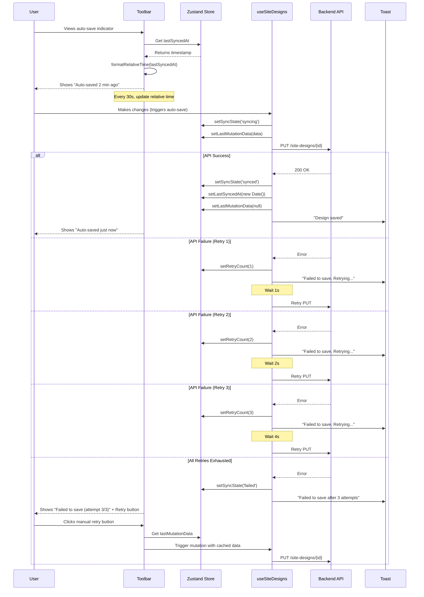

I have created the following plan after thorough exploration and analysis of the codebase. Follow the below plan verbatim. Trust the files and references. Do not re-verify what's written in the plan. Explore only when absolutely necessary. First implement all the proposed file changes and then I'll review all the changes together at the end.

## Observations

The codebase already has the foundational infrastructure in place for auto-save functionality. The Zustand store (`useDesignCanvasStore`) includes `retryCount` and `lastSyncedAt` fields, and the `useSiteDesigns` hook implements exponential backoff retry logic (1s, 2s, 4s) for mutations. The Toolbar component displays sync states ('syncing', 'synced', 'failed') but lacks timestamp display and manual retry functionality. The project uses `date-fns` for date formatting and `sonner` for toast notifications. The `RefreshCw` icon from lucide-react is the established pattern for retry actions across the codebase.

## Approach

Enhance the auto-save indicator in the Toolbar to provide better user feedback by displaying relative timestamps and manual retry options. Add a relative time formatting utility using `date-fns` to show "Auto-saved X min ago" messages. Update the Toolbar to display the last sync timestamp when the state is 'synced', and add a manual retry button that appears when the sync state is 'failed' after automatic retries are exhausted. Implement toast notifications for failed syncs that inform users about retry attempts. This approach leverages existing infrastructure while adding user-friendly feedback mechanisms.

## Implementation Steps

### 1. Add Relative Time Formatting Utility

Update `file:frontend/src/lib/utils.ts` to add a relative time formatting function:

- Import `formatDistanceToNow` from `date-fns`
- Create a `formatRelativeTime` function that accepts a `Date` object and returns a formatted string
- Handle edge cases: return "just now" for timestamps less than 10 seconds ago
- Use `formatDistanceToNow` with `addSuffix: true` option for other cases (e.g., "2 minutes ago", "1 hour ago")
- Export the function for use across components

### 2. Update Toolbar Component to Display Last Sync Timestamp

Modify `file:frontend/src/components/DesignCanvas/Toolbar.tsx`:

- Import `formatRelativeTime` from `@/lib/utils`
- Import `RefreshCw` icon from `lucide-react` for the manual retry button
- Access `lastSyncedAt` and `retryCount` from the Zustand store using `useDesignCanvasStore`
- Access the `useUpdateSiteDesignMutation` hook to enable manual retry functionality
- Update the sync state display section (lines 42-61):
  - For 'syncing' state: Keep existing "Saving..." message
  - For 'synced' state: Display "Auto-saved" followed by the relative time using `formatRelativeTime(lastSyncedAt)` if `lastSyncedAt` exists, otherwise show "Saved"
  - For 'failed' state: Keep existing "Failed to save" message
- Use `useEffect` with an interval to update the relative time display every 30 seconds when `syncState === 'synced'` and `lastSyncedAt` exists

### 3. Add Manual Retry Button for Failed Syncs

Continue updating `file:frontend/src/components/DesignCanvas/Toolbar.tsx`:

- Add a manual retry button that appears when `syncState === 'failed'`
- Position the retry button next to the "Failed to save" message
- Use the `RefreshCw` icon with appropriate styling (red color to match the error state)
- Implement `handleManualRetry` function that:
  - Retrieves the last failed mutation data from the query client or store
  - Calls the `useUpdateSiteDesignMutation` mutation with the cached data
  - Shows a toast notification: "Retrying save..."
- Disable the retry button while a retry is in progress (`syncState === 'syncing'`)
- Add a spinning animation to the `RefreshCw` icon when retry is in progress

### 4. Enhance Toast Notifications for Failed Syncs

Update the mutation hooks in `file:frontend/src/hooks/useSiteDesigns.ts`:

- In `useUpdateSiteDesignMutation`, modify the `onError` callback (line 100):
  - Check the `retryCount` from the store
  - If `retryCount < 3`, show toast: "Failed to save changes. Retrying..." using `toast.error()`
  - If `retryCount >= 3`, show toast: "Failed to save changes after 3 attempts. Click retry to try again." using `toast.error()`
- Ensure the toast messages are informative and guide users on next steps

### 5. Store Last Mutation Data for Manual Retry

Update `file:frontend/src/stores/useDesignCanvasStore.ts`:

- Add a new field `lastMutationData: SiteDesignUpdate | null` to the state interface
- Add a new action `setLastMutationData: (data: SiteDesignUpdate | null) => void`
- Initialize `lastMutationData` to `null` in the store
- Update the implementation to store mutation data when a mutation is triggered

Update `file:frontend/src/hooks/useSiteDesigns.ts`:

- In `useUpdateSiteDesignMutation`, access `setLastMutationData` from the store
- In the `mutationFn`, call `setLastMutationData(data)` before making the API call
- In the `onSuccess` callback, call `setLastMutationData(null)` to clear the cached data

### 6. Add Visual Feedback for Retry Attempts

Update `file:frontend/src/components/DesignCanvas/Toolbar.tsx`:

- When `syncState === 'failed'` and `retryCount > 0`, display the retry count
- Show message: "Failed to save (attempt X/3)" where X is the `retryCount`
- This provides transparency about how many automatic retries have been attempted

## Visual Representation

## Summary Table

| Component | Changes | Purpose |
|-----------|---------|---------|
| `file:frontend/src/lib/utils.ts` | Add `formatRelativeTime` utility | Format timestamps as "X min ago" |
| `file:frontend/src/components/DesignCanvas/Toolbar.tsx` | Display last sync timestamp, add manual retry button, update sync messages | Improve user feedback and provide manual retry option |
| `file:frontend/src/hooks/useSiteDesigns.ts` | Enhance toast notifications based on retry count, store last mutation data | Inform users about retry progress and enable manual retry |
| `file:frontend/src/stores/useDesignCanvasStore.ts` | Add `lastMutationData` field and action | Cache mutation data for manual retry |