I have created the following plan after thorough exploration and analysis of the codebase. Follow the below plan verbatim. Trust the files and references. Do not re-verify what's written in the plan. Explore only when absolutely necessary. First implement all the proposed file changes and then I'll review all the changes together at the end.

## Observations

The auto-save functionality has been implemented across multiple components with exponential backoff retry logic (1s, 2s, 4s), 30-second debounced saves, sync state tracking, and unsaved changes warnings. The codebase uses Vitest with React Testing Library and MSW for API mocking. Existing tests demonstrate patterns for testing hooks, Zustand stores, debounced behavior, and React Query mutations. The test infrastructure includes fixtures, utilities, and MSW handlers. Some basic tests exist but need enhancement to comprehensively cover all auto-save scenarios including edge cases, state transitions, and user interactions.

## Approach

The testing strategy follows the project's established patterns using Vitest, React Testing Library, and MSW. Tests will be organized by component/module with focus on both happy paths and failure scenarios as required by the testing strategy document. The approach includes: (1) enhancing existing test files with additional test cases for exponential backoff edge cases and 30-second debounce validation, (2) adding comprehensive sync state transition tests to the store tests, (3) creating new test files for page-level functionality like beforeunload handlers and navigation warnings, (4) testing UI components like Toolbar for auto-save indicators and manual retry, and (5) ensuring all tests use fake timers appropriately to avoid flakiness while testing time-dependent behavior.

## Implementation Steps

### 1. Enhance Exponential Backoff Retry Tests

**File:** `file:frontend/src/hooks/__tests__/useSiteDesigns.test.tsx`

Add comprehensive test cases for exponential backoff retry logic:

- **Test: All retry attempts exhausted with correct delays**
  - Mock API to fail 3 times, then succeed on 4th attempt
  - Verify `retryCount` increments correctly (1, 2, 3)
  - Verify delays are 1000ms, 2000ms, 4000ms using fake timers
  - Verify `syncState` transitions: syncing → failed → syncing → failed → syncing → synced
  - Verify toast notifications show "Failed to save changes. Retrying..." on each retry
  - Verify final success toast shows "Design saved"

- **Test: Final failure after 3 retries**
  - Mock API to fail all 4 attempts (initial + 3 retries)
  - Verify `retryCount` reaches 3
  - Verify `syncState` ends at 'failed'
  - Verify toast shows "Failed to save changes after 3 attempts. Click retry to try again."
  - Verify `lastMutationData` is preserved for manual retry

- **Test: Retry count resets on successful mutation**
  - Set initial `retryCount` to 2
  - Trigger successful mutation
  - Verify `retryCount` resets to 0
  - Verify `lastSyncedAt` is updated to current timestamp

- **Test: Optimistic updates rollback on all retry failures**
  - Seed cache with original data
  - Trigger mutation that fails all retries
  - Verify optimistic update occurs during first attempt
  - Verify rollback to original data after final failure
  - Verify cache invalidation is called in `onSettled`

### 2. Enhance Sync State Transition Tests

**File:** `file:frontend/src/stores/__tests__/useDesignCanvasStore.test.ts`

Add comprehensive sync state transition tests:

- **Test: Complete successful sync flow**
  - Set initial state: `syncState: 'pending'`, `retryCount: 0`
  - Call `setSyncState('syncing')`
  - Verify `syncState` is 'syncing', `retryCount` unchanged
  - Call `setSyncState('synced')`
  - Verify `syncState` is 'synced', `retryCount` is 0, `lastSyncedAt` is set to Date instance

- **Test: Failed sync flow with retry tracking**
  - Set initial state: `syncState: 'syncing'`, `retryCount: 1`
  - Call `setSyncState('failed')`
  - Verify `syncState` is 'failed', `retryCount` remains 1 (not reset)
  - Call `setRetryCount(2)`
  - Verify `retryCount` is 2
  - Call `setSyncState('syncing')` (retry attempt)
  - Verify `syncState` is 'syncing', `retryCount` still 2

- **Test: lastSyncedAt only updates on synced state**
  - Set initial `lastSyncedAt` to null
  - Call `setSyncState('pending')`
  - Verify `lastSyncedAt` is still null
  - Call `setSyncState('syncing')`
  - Verify `lastSyncedAt` is still null
  - Call `setSyncState('synced')`
  - Verify `lastSyncedAt` is a Date instance
  - Store the timestamp
  - Call `setSyncState('pending')` then `setSyncState('syncing')`
  - Verify `lastSyncedAt` hasn't changed (still the stored timestamp)

- **Test: lastMutationData persistence for manual retry**
  - Call `setLastMutationData({ name: 'Test' })`
  - Verify `lastMutationData` is set
  - Call `setSyncState('failed')`
  - Verify `lastMutationData` is still preserved
  - Call `setLastMutationData(null)`
  - Verify `lastMutationData` is null

### 3. Update PlacementSettings Tests for 30-Second Debounce

**File:** `file:frontend/src/components/DesignCanvas/__tests__/PlacementSettings.test.tsx`

Update existing debounce tests to verify 30-second delay:

- **Update: "should debounce API calls" test**
  - Change timer advancement from 3000ms to 30000ms
  - Verify no API call before 30 seconds
  - Verify API call occurs after 30 seconds
  - Verify `syncState` transitions: pending → syncing → synced

- **Update: "should coalesce rapid changes into single API call" test**
  - Make multiple rapid changes within 30-second window
  - Advance timers by 29000ms - verify no API call
  - Advance timers by additional 1000ms - verify single API call with latest value
  - Verify only 1 API call made despite multiple changes

- **Test: Immediate sync state update to pending**
  - Change a setting value
  - Immediately verify `syncState` is 'pending' (before debounce completes)
  - Verify no API call yet
  - Advance timers by 30000ms
  - Verify API call occurs and `syncState` becomes 'synced'

### 4. Add EquipmentSelector Debounced Save Tests

**File:** `file:frontend/src/components/DesignCanvas/__tests__/EquipmentSelector.test.tsx`

Enhance existing tests or add new ones for debounced equipment changes:

- **Test: Module selection triggers 30-second debounced save**
  - Use fake timers
  - Render EquipmentSelector with mock equipment data
  - Select a module from dropdown
  - Verify `syncState` immediately becomes 'pending'
  - Verify `setEquipmentSelection` called with new module ID
  - Verify no API call before 30 seconds
  - Advance timers by 30000ms
  - Verify API call with `equipment_module_id` update
  - Verify `syncState` becomes 'synced'

- **Test: Inverter selection triggers 30-second debounced save**
  - Similar to module test but for inverter selection
  - Verify debounce works independently for inverter changes

- **Test: Rapid equipment changes coalesce into single save**
  - Select module A
  - Advance 10 seconds
  - Select module B
  - Advance 10 seconds
  - Select module C
  - Advance 30 seconds from last change
  - Verify only 1 API call made with module C

- **Test: Equipment selection updates store immediately**
  - Select module and inverter
  - Verify `hasEquipmentSelected` becomes true immediately
  - Verify `equipmentModuleId` and `equipmentInverterId` updated in store
  - Verify `syncState` is 'pending'

### 5. Add beforeunload Handler Tests

**File:** `file:frontend/src/app/tenders/[id]/design/[designId]/__tests__/page.test.tsx` (new file)

Create comprehensive tests for unsaved changes warning:

- **Test: beforeunload event triggered when syncState is pending**
  - Mock `useSiteDesignQuery` to return design data
  - Set `syncState` to 'pending' in store
  - Render page component
  - Create and dispatch beforeunload event
  - Verify `event.preventDefault()` was called
  - Verify `event.returnValue` is set to empty string

- **Test: beforeunload event triggered when syncState is failed**
  - Set `syncState` to 'failed'
  - Render page component
  - Dispatch beforeunload event
  - Verify event is prevented

- **Test: beforeunload event NOT triggered when syncState is synced**
  - Set `syncState` to 'synced'
  - Render page component
  - Dispatch beforeunload event
  - Verify `event.preventDefault()` was NOT called

- **Test: Navigation warning dialog shows on back navigation with unsaved changes**
  - Set `syncState` to 'pending'
  - Render page component
  - Get Toolbar component and click "Back to Designs" button
  - Verify ConfirmDialog opens with correct title and description
  - Verify dialog shows "Unsaved Changes" title
  - Verify dialog shows warning message about losing changes

- **Test: Navigation proceeds when user confirms in dialog**
  - Set `syncState` to 'pending'
  - Render page component
  - Trigger back navigation
  - Verify dialog opens
  - Click "Leave Anyway" button
  - Verify `router.back()` was called
  - Verify dialog closes

- **Test: Navigation cancelled when user cancels in dialog**
  - Set `syncState` to 'pending'
  - Render page component
  - Trigger back navigation
  - Verify dialog opens
  - Click "Stay on Page" button
  - Verify `router.back()` was NOT called
  - Verify dialog closes

- **Test: Navigation proceeds immediately when no unsaved changes**
  - Set `syncState` to 'synced'
  - Render page component
  - Trigger back navigation
  - Verify dialog does NOT open
  - Verify `router.back()` was called immediately

### 6. Add Toolbar Auto-Save Indicator Tests

**File:** `file:frontend/src/components/DesignCanvas/__tests__/Toolbar.test.tsx` (new file)

Create tests for auto-save indicator and manual retry:

- **Test: Shows "Saving..." when syncState is syncing**
  - Set `syncState` to 'syncing'
  - Render Toolbar
  - Verify Loader2 icon is visible
  - Verify text "Saving..." is displayed

- **Test: Shows "Saved" with checkmark when syncState is synced**
  - Set `syncState` to 'synced', `lastSyncedAt` to null
  - Render Toolbar
  - Verify Check icon is visible
  - Verify text "Saved" is displayed (no relative time)

- **Test: Shows relative time after successful sync**
  - Set `syncState` to 'synced'
  - Set `lastSyncedAt` to 2 minutes ago
  - Render Toolbar
  - Verify text "Auto-saved 2 minutes ago" is displayed
  - Use fake timers to advance 30 seconds
  - Verify text updates to "Auto-saved 3 minutes ago"

- **Test: Shows "just now" for recent syncs**
  - Set `syncState` to 'synced'
  - Set `lastSyncedAt` to 5 seconds ago
  - Render Toolbar
  - Verify text "Auto-saved just now" is displayed

- **Test: Shows failed state with retry count**
  - Set `syncState` to 'failed', `retryCount` to 2
  - Render Toolbar
  - Verify AlertCircle icon is visible
  - Verify text "Failed to save (attempt 2/3)" is displayed
  - Verify manual retry button is visible

- **Test: Manual retry button triggers mutation**
  - Set `syncState` to 'failed'
  - Set `lastMutationData` to `{ name: 'Test Design' }`
  - Mock `useUpdateSiteDesignMutation` to return mutation function
  - Render Toolbar
  - Click manual retry button (RefreshCw icon)
  - Verify mutation was called with `lastMutationData`
  - Verify toast.info shows "Retrying save..."

- **Test: Manual retry button disabled during mutation**
  - Set `syncState` to 'failed'
  - Mock mutation with `isPending: true`
  - Render Toolbar
  - Verify retry button is disabled
  - Verify RefreshCw icon has animate-spin class

- **Test: Relative time updates every 30 seconds**
  - Use fake timers
  - Set `syncState` to 'synced'
  - Set `lastSyncedAt` to 1 minute ago
  - Render Toolbar
  - Verify initial text "Auto-saved 1 minute ago"
  - Advance timers by 30000ms
  - Verify text updates to "Auto-saved 2 minutes ago"
  - Advance timers by 30000ms
  - Verify text updates to "Auto-saved 2 minutes ago" (still 2 min)

### 7. Add Integration Test for Complete Auto-Save Flow

**File:** `file:frontend/src/components/DesignCanvas/__tests__/autoSaveIntegration.test.tsx` (new file)

Create end-to-end integration test for auto-save:

- **Test: Complete auto-save flow with retry and recovery**
  - Use fake timers
  - Mock API to fail twice, then succeed
  - Render PlacementSettings component
  - Change azimuth setting
  - Verify `syncState` immediately becomes 'pending'
  - Advance 30 seconds - first save attempt
  - Verify `syncState` becomes 'syncing'
  - Wait for failure - verify `syncState` becomes 'failed', `retryCount` is 1
  - Verify toast shows "Failed to save changes. Retrying..."
  - Advance 1 second - first retry
  - Wait for failure - verify `retryCount` is 2
  - Advance 2 seconds - second retry
  - Wait for success - verify `syncState` becomes 'synced'
  - Verify `retryCount` resets to 0
  - Verify `lastSyncedAt` is set
  - Verify toast shows "Design saved"

- **Test: Manual retry after all automatic retries exhausted**
  - Mock API to fail 4 times (initial + 3 retries), then succeed
  - Change setting and wait for all retries to fail
  - Verify `syncState` is 'failed', `retryCount` is 3
  - Verify manual retry button appears in Toolbar
  - Click manual retry button
  - Verify mutation called with preserved `lastMutationData`
  - Wait for success
  - Verify `syncState` becomes 'synced'

### 8. Add Test Utilities and Helpers

**File:** `file:frontend/src/test/utils.tsx`

Add helper functions for common test scenarios:

- **Helper: `setupAutoSaveTest()`**
  - Returns configured QueryClient with retry disabled for tests
  - Returns wrapper component with QueryClientProvider
  - Resets Zustand store to initial state
  - Sets up fake timers

- **Helper: `mockSyncState(state, options)`**
  - Sets `syncState`, `retryCount`, `lastSyncedAt` in store
  - Accepts options for custom values

- **Helper: `advanceDebounceTimer(ms = 30000)`**
  - Advances fake timers by specified milliseconds
  - Flushes promises
  - Returns promise for async operations

**File:** `file:frontend/src/test/fixtures/siteDesign.ts`

Add additional mock data:

- **Mock: `mockSiteDesignWithPendingSync`**
  - Site design with recent `updated_at` timestamp
  - For testing sync state scenarios

### 9. Update MSW Handlers for Retry Testing

**File:** `file:frontend/src/test/mocks/handlers.ts`

Add handlers for testing retry scenarios:

- **Handler: PUT `/api/site-designs/:id` with retry simulation**
  - Add query parameter support for `?retry-test=true`
  - Track call count per design ID
  - Fail first N attempts, succeed on Nth+1
  - Return appropriate error responses for failures

- **Handler: GET `/api/site-designs/:id` with stale data**
  - Support query parameter `?stale=true`
  - Return design with old `updated_at` timestamp
  - For testing sync state detection

### 10. Add Test Documentation

**File:** `file:frontend/src/components/DesignCanvas/__tests__/README.md` (new file)

Document testing patterns and conventions:

- Overview of auto-save testing strategy
- How to use fake timers for debounce testing
- How to mock sync state transitions
- Common test utilities and helpers
- Examples of testing exponential backoff
- Guidelines for testing React Query mutations with MSW

## Visual Test Coverage Map

```mermaid
graph TD
    A[Auto-Save Tests] --> B[Hooks Tests]
    A --> C[Store Tests]
    A --> D[Component Tests]
    A --> E[Integration Tests]
    
    B --> B1[useSiteDesigns.test.tsx]
    B1 --> B1a[Exponential Backoff]
    B1 --> B1b[Retry Exhaustion]
    B1 --> B1c[Optimistic Updates]
    
    C --> C1[useDesignCanvasStore.test.ts]
    C1 --> C1a[State Transitions]
    C1 --> C1b[Retry Tracking]
    C1 --> C1c[Timestamp Updates]
    
    D --> D1[PlacementSettings.test.tsx]
    D --> D2[EquipmentSelector.test.tsx]
    D --> D3[Toolbar.test.tsx]
    D --> D4[page.test.tsx]
    
    D1 --> D1a[30s Debounce]
    D1 --> D1b[Immediate Pending State]
    
    D2 --> D2a[Equipment Debounce]
    D2 --> D2b[Store Updates]
    
    D3 --> D3a[Auto-Save Indicator]
    D3 --> D3b[Manual Retry]
    D3 --> D3c[Relative Time]
    
    D4 --> D4a[beforeunload Handler]
    D4 --> D4b[Navigation Warning]
    
    E --> E1[autoSaveIntegration.test.tsx]
    E1 --> E1a[Complete Flow]
    E1 --> E1b[Retry & Recovery]
```



## Test Execution Strategy

1. **Run tests individually during development:**
   ```bash
   npm test -- useSiteDesigns.test.tsx
   ```

2. **Run all auto-save tests:**
   ```bash
   npm test -- __tests__
   ```

3. **Run with coverage:**
   ```bash
   npm run test:coverage
   ```

4. **Verify coverage thresholds met:**
   - Lines: 80%
   - Functions: 80%
   - Branches: 75%
   - Statements: 80%