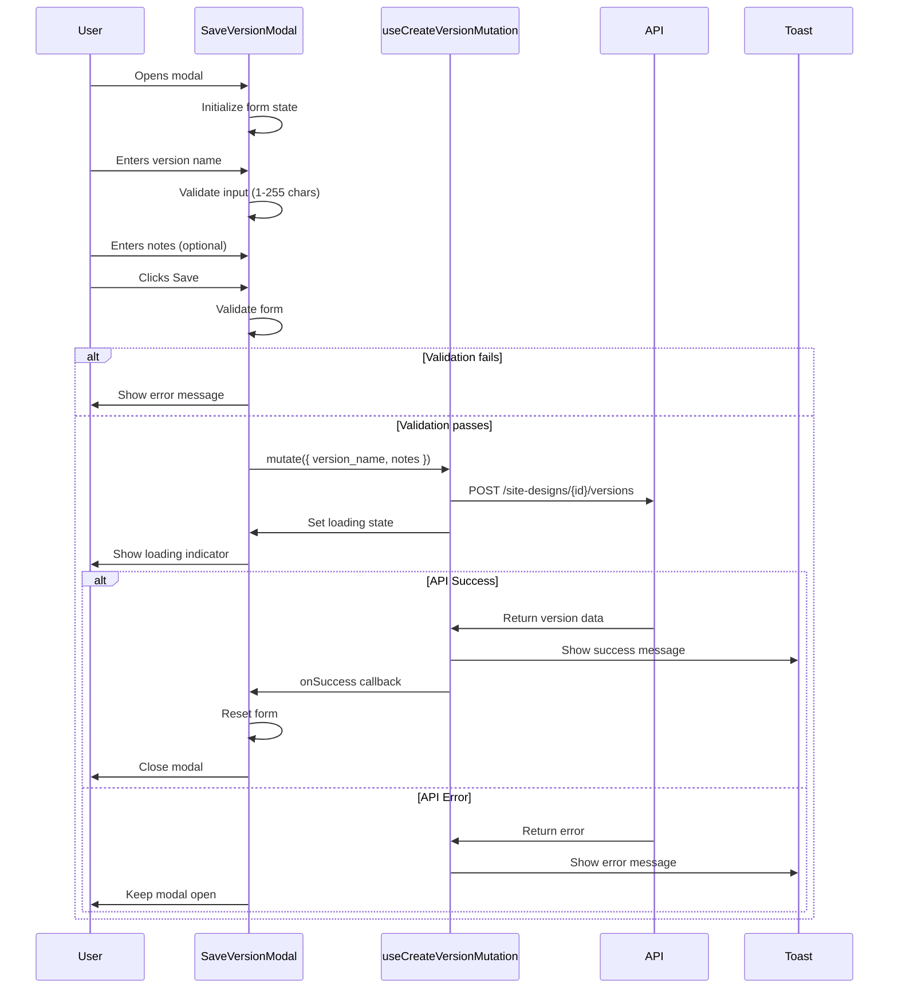

I have created the following plan after thorough exploration and analysis of the codebase. Follow the below plan verbatim. Trust the files and references. Do not re-verify what's written in the plan. Explore only when absolutely necessary. First implement all the proposed file changes and then I'll review all the changes together at the end.

## Observations

The codebase follows a well-structured pattern with Radix UI Dialog components, React Query for data fetching, and Zustand for state management. The `useCreateVersionMutation` hook has been implemented with optimistic updates, retry logic, and toast notifications. The ProposalWizard component provides an excellent reference for multi-step modal patterns, form validation, and loading states. All necessary types and API methods for version management are in place.

## Approach

Create a controlled modal component using the Dialog primitive from `file:frontend/src/components/ui/dialog.tsx`. Implement a simple form with version name (required) and notes (optional) fields. Integrate the `useCreateVersionMutation` hook from `file:frontend/src/hooks/useSiteDesigns.ts` for saving versions. Add client-side validation for the version name field (1-255 characters). Display loading states during save operations and show success/error toast notifications. Follow the modal pattern from `file:frontend/src/components/DesignCanvas/ProposalWizard.tsx` for consistent UX.

## Implementation Steps

### 1. Create SaveVersionModal Component File

Create `file:frontend/src/components/DesignCanvas/SaveVersionModal.tsx` as a new component file in the DesignCanvas directory.

### 2. Import Required Dependencies

Import the following dependencies:
- Dialog components from `file:frontend/src/components/ui/dialog.tsx` (Dialog, DialogContent, DialogHeader, DialogTitle, DialogDescription, DialogFooter)
- UI components: Button from `file:frontend/src/components/ui/button.tsx`, Input from `file:frontend/src/components/ui/input.tsx`, Label from `file:frontend/src/components/ui/label.tsx`, Textarea from `file:frontend/src/components/ui/textarea.tsx`
- Icons from `lucide-react`: Loader2, Save, AlertCircle
- `useCreateVersionMutation` hook from `file:frontend/src/hooks/useSiteDesigns.ts`
- `toast` from `file:frontend/src/lib/toast.ts`
- `cn` utility from `file:frontend/src/lib/utils.ts`
- React hooks: useState, useEffect

### 3. Define Component Props Interface

Define `SaveVersionModalProps` interface with:
- `designId: string` - The ID of the design to create a version for
- `open: boolean` - Controls modal visibility
- `onOpenChange: (open: boolean) => void` - Callback for modal state changes

### 4. Implement Component State Management

Initialize local state variables:
- `versionName: string` - Controlled input for version name (default: empty string)
- `notes: string` - Controlled input for optional notes (default: empty string)
- `validationError: string | null` - Stores validation error message

### 5. Integrate useCreateVersionMutation Hook

Call `useCreateVersionMutation(designId)` to get the mutation object. The hook already handles:
- Optimistic updates to the versions list
- Toast notifications on success/error
- Retry logic with exponential backoff (1s, 2s, 4s)
- Sync state management via Zustand store
- Query cache invalidation

### 6. Implement Form Validation Logic

Create a `validateVersionName` function that:
- Checks if version name is empty (minimum 1 character)
- Checks if version name exceeds 255 characters
- Returns validation error message or null if valid
- Updates `validationError` state

Add validation on input change and before submission.

### 7. Implement Form Submission Handler

Create `handleSave` function that:
- Validates the version name using the validation function
- If validation fails, set error state and return early
- If valid, call `mutation.mutate()` with `{ version_name: versionName, notes: notes || undefined }`
- On success callback: reset form state (clear inputs), close modal via `onOpenChange(false)`
- Error handling is managed by the mutation hook (toast notifications)

### 8. Implement Form Reset on Modal Close

Add `useEffect` hook that watches the `open` prop:
- When modal closes (`open === false`), reset form state
- Clear `versionName`, `notes`, and `validationError`
- Reset mutation state using `mutation.reset()` if available

### 9. Build Dialog Structure

Structure the modal with:
- **DialogHeader**: Title "Save as Version", Description "Create a snapshot of the current design state"
- **Form Content**: 
  - Version Name field with Label, Input, and error message display
  - Notes field with Label, Textarea (optional, placeholder: "Add notes about this version...")
  - Character count indicator for version name (e.g., "0/255")
- **DialogFooter**: Cancel button (variant: outline) and Save button (variant: default)

### 10. Add Loading State UI

Implement loading state indicators:
- Disable form inputs when `mutation.isPending` is true
- Show Loader2 icon with spin animation in Save button during submission
- Change button text to "Saving..." during mutation
- Prevent modal close during save operation

### 11. Add Validation Error Display

Display validation errors:
- Show error message below version name input when `validationError` is not null
- Style error text with red color and small font size
- Add AlertCircle icon next to error message
- Add error border styling to Input component when validation fails

### 12. Add Success State Handling

Handle successful version creation:
- The mutation hook already shows success toast
- Reset form state and close modal in the `onSuccess` callback
- Clear any validation errors

### 13. Style the Component

Apply Tailwind CSS classes for:
- Proper spacing between form fields (space-y-4)
- Input field focus states (already handled by UI components)
- Error state styling (border-destructive, text-destructive)
- Loading state opacity (opacity-50 for disabled inputs)
- Responsive design (sm: breakpoints for mobile)

### 14. Add Accessibility Features

Ensure accessibility:
- Proper label associations using `htmlFor` and `id` attributes
- ARIA attributes for error messages (`aria-invalid`, `aria-describedby`)
- Focus management: auto-focus version name input when modal opens
- Keyboard navigation support (Tab, Enter to submit, Escape to close)
- Screen reader announcements for validation errors

### 15. Export Component

Export the `SaveVersionModal` component as a named export for use in the Toolbar component.

---

## Component Structure Diagram

