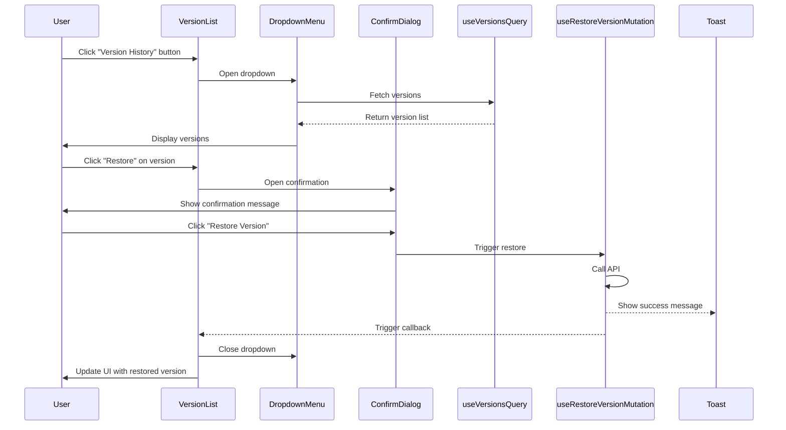

I have created the following plan after thorough exploration and analysis of the codebase. Follow the below plan verbatim. Trust the files and references. Do not re-verify what's written in the plan. Explore only when absolutely necessary. First implement all the proposed file changes and then I'll review all the changes together at the end.

## Observations

The codebase already has comprehensive version management infrastructure in place:
- Version hooks (`useVersionsQuery`, `useRestoreVersionMutation`) are implemented in `file:frontend/src/hooks/useSiteDesigns.ts`
- Version types (`DesignVersionResponse`, `DesignVersionDetail`) are defined in `file:frontend/src/types/index.ts`
- Version API methods are integrated in `file:frontend/src/lib/api.ts`
- SaveVersionModal component exists in `file:frontend/src/components/DesignCanvas/SaveVersionModal.tsx`
- UI components (Dialog, DropdownMenu, Sheet, Card, Badge) are available from shadcn/ui
- ConfirmDialog component exists for confirmation workflows

## Approach

The implementation will create a `VersionList` component that displays versions in a dropdown menu format, accessible from the toolbar. The component will use the existing `useVersionsQuery` hook to fetch versions and `useRestoreVersionMutation` for restoration. A confirmation dialog will be integrated using the existing `ConfirmDialog` component. The design will follow the established patterns from `DesignsList` for card-based layouts and `ProposalWizard` for modal interactions. The component will be self-contained with proper loading states, error handling, and toast notifications.

## Implementation Steps

### 1. Create VersionList Component Structure

Create `file:frontend/src/components/DesignCanvas/VersionList.tsx` with the following structure:

**Component Props:**
- `designId: string` - The site design ID
- `open: boolean` - Control dropdown visibility
- `onOpenChange: (open: boolean) => void` - Callback for open state changes
- `onVersionRestored?: (versionName: string) => void` - Optional callback after successful restore

**State Management:**
- `selectedVersionId: string | null` - Track version selected for restoration
- `isRestoreDialogOpen: boolean` - Control restore confirmation dialog
- `versionToRestore: DesignVersionResponse | null` - Store version details for confirmation

**Hooks Integration:**
- Use `useVersionsQuery(designId)` to fetch version list
- Use `useRestoreVersionMutation(designId)` for restoration
- Import `ConfirmDialog` from `file:frontend/src/components/common/ConfirmDialog.tsx`

### 2. Implement Version List UI

**Dropdown Structure using DropdownMenu:**
```
DropdownMenu
├── DropdownMenuTrigger (Button with History icon)
└── DropdownMenuContent
    ├── DropdownMenuLabel ("Version History")
    ├── DropdownMenuSeparator
    ├── Empty State (if no versions)
    └── Version Items (mapped from versions array)
```

**Version Item Display:**
Each version item should show:
- Version name (bold, truncated at 30 chars)
- Created date (formatted using `date-fns` format: "MMM d, yyyy 'at' h:mm a")
- Notes preview (if available, truncated at 50 chars, muted text)
- System stats badge: `{total_modules} modules • {system_size_kwp} kWp`
- Restore button (small, secondary variant)

**Loading State:**
- Show `DropdownMenuLabel` with "Loading versions..."
- Display 3 skeleton items using `Skeleton` component from `file:frontend/src/components/ui/skeleton.tsx`

**Empty State:**
- Display message: "No versions saved yet"
- Show subtitle: "Save a version to create snapshots of your design"
- Use muted text styling

**Error State:**
- Display error message in red text
- Show retry button if query failed

### 3. Implement Restore Confirmation Dialog

**Dialog Configuration:**
- Use `ConfirmDialog` component
- Title: "Restore Version?"
- Description: "This will restore the design to '{versionName}'. Current unsaved changes will be lost. The system will automatically recalculate placement and energy estimates."
- Confirm button label: "Restore Version"
- Variant: "default" (not destructive, as it's a recoverable action)
- Show loading state during restoration

**Restore Flow:**
1. User clicks "Restore" button on version item
2. Set `versionToRestore` state and open confirmation dialog
3. On confirm, call `restoreMutation.mutate(versionId)`
4. On success:
   - Show toast: "Restored to version: {versionName}"
   - Call `onVersionRestored?.(versionName)` callback
   - Close dropdown menu
5. On error:
   - Toast notification handled by mutation hook
   - Keep dialog open for retry

### 4. Add Version List Styling and Interactions

**Dropdown Menu Styling:**
- Max height: `max-h-[400px]` with overflow-y-auto
- Min width: `min-w-[320px]`
- Proper z-index to avoid conflicts with map canvas

**Version Item Styling:**
- Hover effect: `hover:bg-accent/50`
- Padding: `p-3`
- Border bottom: `border-b` (except last item)
- Cursor: `cursor-default` for item, `cursor-pointer` for restore button

**Restore Button:**
- Size: `sm`
- Variant: `outline`
- Icon: `RotateCcw` from lucide-react
- Position: Aligned to right side of item
- Disabled state when mutation is pending

### 5. Integrate Loading and Error States

**Loading State:**
- Show spinner in dropdown trigger button when `isLoading`
- Disable trigger button during restore operation
- Show skeleton items in dropdown content

**Error Handling:**
- Display error message from `useVersionsQuery` error
- Show inline error in dropdown with retry button
- Toast notifications for restore errors (handled by mutation hook)

**Polling/Refetch:**
- No polling needed (versions are static once created)
- Invalidate queries on successful restore (handled by mutation hook)

### 6. Add Accessibility Features

**ARIA Labels:**
- `aria-label="Version history"` on trigger button
- `aria-label="Restore to version {versionName}"` on restore buttons
- `aria-busy={isLoading}` on dropdown content during loading

**Keyboard Navigation:**
- Dropdown menu handles keyboard navigation automatically (Radix UI)
- Focus management for confirmation dialog
- Escape key closes dropdown

**Screen Reader Support:**
- Announce loading state: "Loading version history"
- Announce empty state: "No versions available"
- Announce restore action: "Restoring version {versionName}"

### 7. Add Visual Enhancements

**Icons:**
- `History` icon for dropdown trigger button
- `RotateCcw` icon for restore buttons
- `Calendar` icon for created date
- `FileText` icon for notes indicator
- `Layers` icon for modules count
- `Zap` icon for system size

**Badges:**
- Use `Badge` component from `file:frontend/src/components/ui/badge.tsx`
- Variant: `outline` for system stats
- Small size with compact padding

**Tooltips:**
- Add tooltip to trigger button: "View and restore previous versions"
- Add tooltip to restore button: "Restore this version"
- Use `Tooltip` component from `file:frontend/src/components/ui/tooltip.tsx`

### 8. Implement Data Formatting

**Date Formatting:**
- Use `format` from `date-fns` library
- Format: `"MMM d, yyyy 'at' h:mm a"` (e.g., "Jan 15, 2024 at 2:30 PM")
- Show relative time for recent versions (< 24 hours): "2 hours ago"

**Text Truncation:**
- Version name: Max 30 characters with ellipsis
- Notes: Max 50 characters with ellipsis
- Use CSS `truncate` class or `text-overflow: ellipsis`

**Number Formatting:**
- System size: `toFixed(1)` for kWp (e.g., "125.5 kWp")
- Modules: Integer display (e.g., "450 modules")

### 9. Add Component Documentation

**JSDoc Comments:**
```typescript
/**
 * VersionList component displays a dropdown menu of saved design versions
 * and allows users to restore previous versions.
 * 
 * @param designId - The site design ID
 * @param open - Controls dropdown visibility
 * @param onOpenChange - Callback when dropdown open state changes
 * @param onVersionRestored - Optional callback after successful version restore
 */
```

**Inline Comments:**
- Document restore flow logic
- Explain confirmation dialog behavior
- Note recalculation trigger on restore

### 10. Export Component

Add export to `file:frontend/src/components/DesignCanvas/index.ts` (create if doesn't exist):
```typescript
export { VersionList } from './VersionList';
```

## Component Architecture Diagram



## Key Implementation Details

**File Location:** `file:frontend/src/components/DesignCanvas/VersionList.tsx`

**Dependencies:**
- `useVersionsQuery`, `useRestoreVersionMutation` from `file:frontend/src/hooks/useSiteDesigns.ts`
- `DesignVersionResponse` type from `file:frontend/src/types/index.ts`
- `DropdownMenu` components from `file:frontend/src/components/ui/dropdown-menu.tsx`
- `ConfirmDialog` from `file:frontend/src/components/common/ConfirmDialog.tsx`
- `Button`, `Badge`, `Skeleton` from respective UI component files
- `toast` from `file:frontend/src/lib/toast.ts`
- Icons from `lucide-react`: `History`, `RotateCcw`, `Calendar`, `FileText`, `Layers`, `Zap`, `Loader2`, `AlertCircle`
- `format` from `date-fns` for date formatting

**State Management:**
- Local component state for dialog visibility and selected version
- No global state needed (hooks manage query cache)

**Error Boundaries:**
- Component handles its own errors gracefully
- No need for error boundary wrapper (errors are displayed inline)

**Performance Considerations:**
- Versions list is typically small (< 50 items), no virtualization needed
- Memoize version items if performance issues arise
- Dropdown closes on restore to prevent stale UI