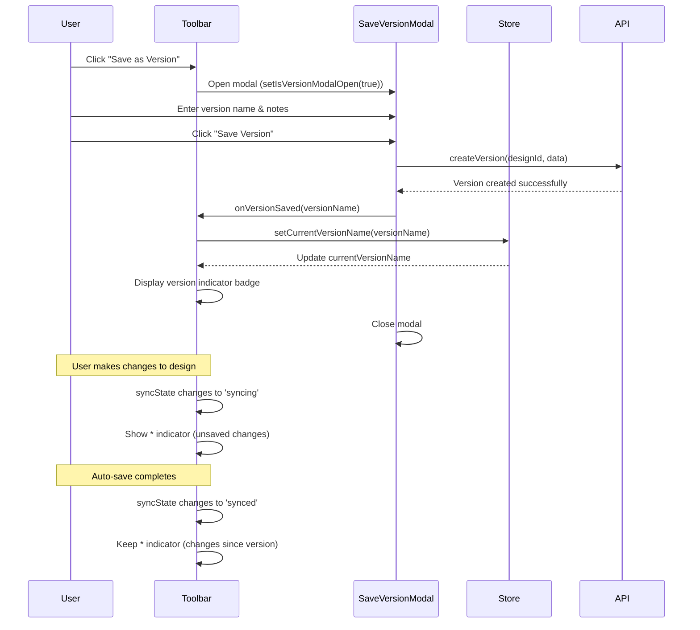

I have created the following plan after thorough exploration and analysis of the codebase. Follow the below plan verbatim. Trust the files and references. Do not re-verify what's written in the plan. Explore only when absolutely necessary. First implement all the proposed file changes and then I'll review all the changes together at the end.

## Observations

The Toolbar component currently has a "Save Copy" button that needs to be replaced with "Save as Version" functionality. The SaveVersionModal component is already implemented with proper form validation and integration with `useCreateVersionMutation`. The toolbar uses the `useDesignCanvasStore` for tracking sync state and displays auto-save indicators. The current implementation lacks version tracking (which version the design was loaded from) and unsaved changes indicators relative to the last saved version.

## Approach

Extend the `useDesignCanvasStore` to track the current version context (version name if loaded from a version). Update the Toolbar component to integrate the SaveVersionModal with state management, replace the "Save Copy" button with "Save as Version", add a version indicator badge showing the current version name, and implement an unsaved changes indicator (*) that appears when the design has been modified since the last version save. Follow existing patterns from ProposalWizard integration and sync state management.

## Implementation Steps

### 1. Extend Store to Track Current Version Context

Update `file:frontend/src/stores/useDesignCanvasStore.ts`:

- Add `currentVersionName: string | null` to the state interface
- Add `setCurrentVersionName: (name: string | null) => void` action
- Initialize `currentVersionName` to `null` in the initial state
- The action should update the state and reset when set to null

### 2. Update Toolbar Component Structure

Modify `file:frontend/src/components/DesignCanvas/Toolbar.tsx`:

**Import additions:**
- Import `SaveVersionModal` component
- Import `History` icon from `lucide-react` for version indicator
- Import `useCreateVersionMutation` hook (already available via SaveVersionModal)

**State management:**
- Add `const [isVersionModalOpen, setIsVersionModalOpen] = useState(false)` for modal control
- Add `const currentVersionName = useDesignCanvasStore((state) => state.currentVersionName)` to access version context
- Track if there are unsaved changes since last version save by comparing `syncState` and `currentVersionName`

**Replace "Save Copy" button:**
- Remove the existing "Save Copy" button (lines 105-108)
- Add new "Save as Version" button with:
  - Icon: `<History className="h-4 w-4 mr-2" />`
  - Label: "Save as Version"
  - onClick handler: `() => setIsVersionModalOpen(true)`
  - Variant: `"outline"`
  - Size: `"sm"`

**Add version indicator badge:**
- Position between the title section and action buttons
- Display when `currentVersionName` is not null
- Show format: `"Version: {currentVersionName}"`
- Add unsaved changes indicator (*) when `syncState !== 'synced'` and `currentVersionName` exists
- Use subtle styling: small text, muted color, with a version icon
- Example structure:
  ```tsx
  {currentVersionName && (
    <div className="flex items-center gap-1.5 text-xs text-muted-foreground">
      <History className="h-3.5 w-3.5" />
      <span>Version: {currentVersionName}</span>
      {syncState !== 'synced' && <span className="text-orange-500">*</span>}
    </div>
  )}
  ```

**Integrate SaveVersionModal:**
- Add `<SaveVersionModal>` component at the end of the Toolbar return statement (similar to ProposalWizard integration)
- Pass props: `designId={designId}`, `open={isVersionModalOpen}`, `onOpenChange={setIsVersionModalOpen}`
- On successful version save, update the store's `currentVersionName` using the mutation's onSuccess callback

### 3. Update SaveVersionModal Success Callback

Modify `file:frontend/src/components/DesignCanvas/SaveVersionModal.tsx`:

- Accept optional `onVersionSaved` callback prop: `onVersionSaved?: (versionName: string) => void`
- In the `handleSave` function's `onSuccess` callback, call `onVersionSaved?.(versionName.trim())` before closing the modal
- This allows the Toolbar to update the store's current version name

### 4. Initialize Current Version on Design Load

Update `file:frontend/src/app/tenders/[id]/design/[designId]/page.tsx`:

- Import `useDesignCanvasStore` (already imported)
- Add `const setCurrentVersionName = useDesignCanvasStore((state) => state.setCurrentVersionName)`
- Add `useEffect` to reset version context when design loads:
  ```tsx
  useEffect(() => {
    // Reset version context when loading a fresh design
    // In future, this could be set if design was loaded from a specific version
    setCurrentVersionName(null);
  }, [designId, setCurrentVersionName]);
  ```
- Add comment noting that future enhancement could detect if design was loaded from a version and set the name accordingly

### 5. Update Toolbar Layout and Styling

Adjust the toolbar layout in `file:frontend/src/components/DesignCanvas/Toolbar.tsx`:

**Restructure the right section:**
- Group auto-save indicator, version indicator, and action buttons
- Ensure proper spacing and alignment
- Version indicator should be positioned between auto-save status and action buttons
- Use flexbox with appropriate gaps for clean layout

**Example structure:**
```tsx
<div className="flex items-center gap-4">
  {/* Auto-save indicator */}
  <div className="flex items-center gap-2 text-sm text-muted-foreground min-w-[150px] justify-end">
    {/* existing sync state indicators */}
  </div>

  {/* Version indicator */}
  {currentVersionName && (
    <div className="flex items-center gap-1.5 px-2 py-1 bg-slate-100 rounded-md border border-slate-200">
      <History className="h-3.5 w-3.5 text-slate-500" />
      <span className="text-xs font-medium text-slate-700">
        {currentVersionName}
        {syncState !== 'synced' && <span className="ml-1 text-orange-500">*</span>}
      </span>
    </div>
  )}

  {/* Action buttons */}
  <Button variant="outline" size="sm" onClick={() => setIsVersionModalOpen(true)}>
    <History className="h-4 w-4 mr-2" />
    Save as Version
  </Button>

  <Button variant="default" size="sm" onClick={() => setIsWizardOpen(true)}>
    <FileText className="h-4 w-4 mr-2" />
    Generate Proposal
  </Button>
</div>
```

### 6. Handle Version Save Success in Toolbar

Update the Toolbar component to handle version save success:

- When SaveVersionModal successfully saves a version, update the store's `currentVersionName`
- Pass `onVersionSaved` callback to SaveVersionModal:
  ```tsx
  const handleVersionSaved = (versionName: string) => {
    useDesignCanvasStore.getState().setCurrentVersionName(versionName);
  };
  ```
- This ensures the version indicator updates immediately after saving

### 7. Add Tooltip for Version Indicator

Enhance the version indicator with a tooltip:

- Import `Tooltip`, `TooltipContent`, `TooltipProvider`, `TooltipTrigger` from `file:frontend/src/components/ui/tooltip.tsx`
- Wrap the version indicator in a Tooltip component
- Tooltip content should show: "Current version. * indicates unsaved changes"
- This provides better UX for understanding the indicator

## Visual Representation



## Key Considerations

1. **Unsaved Changes Logic**: The unsaved changes indicator (*) should appear when `syncState !== 'synced'` OR when the design has been modified since the last version save. Since we don't track modification timestamps, we can use a simpler approach: show * when `syncState !== 'synced'` to indicate pending auto-save changes.

2. **Version Context Persistence**: Currently, the version context resets on page load. Future enhancement could involve URL parameters or design metadata to persist which version was loaded.

3. **Button Placement**: The "Save as Version" button replaces "Save Copy" to avoid confusion and maintain a clean toolbar layout.

4. **Accessibility**: Ensure the version indicator has proper ARIA labels and the tooltip provides context for screen readers.

5. **Responsive Design**: The toolbar should handle smaller screens gracefully, potentially hiding the version indicator text on mobile and showing only the icon with a tooltip.