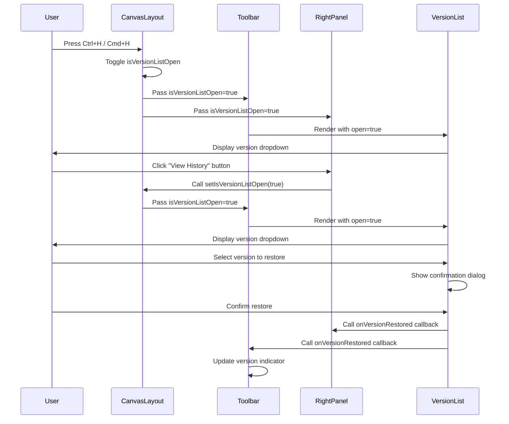

I have created the following plan after thorough exploration and analysis of the codebase. Follow the below plan verbatim. Trust the files and references. Do not re-verify what's written in the plan. Explore only when absolutely necessary. First implement all the proposed file changes and then I'll review all the changes together at the end.

## Observations

The version management UI is already well-integrated into the Toolbar with a split button pattern combining "Save as Version" and a version history dropdown. The VersionList component is fully implemented with restore functionality, loading states, and proper error handling. However, the version list is currently only accessible from the Toolbar and not from the RightPanel. The codebase uses a consistent pattern for keyboard event handling with `useEffect` and `window.addEventListener`. The dropdown menu component already has z-50 for proper layering, and the RightPanel uses Card components for organizing sections.

## Approach

The implementation will focus on making the version list accessible from both the Toolbar and RightPanel as required. A new "Version History" section will be added to the RightPanel using the existing Card component pattern, maintaining visual consistency with Equipment and Placement Settings sections. Keyboard shortcuts (Ctrl+H / Cmd+H) will be added to provide quick access to version history, following the existing keyboard event handling pattern from PolygonDrawingLayer. The version list state will be managed at the CanvasLayout level to enable synchronized open/close behavior between toolbar and panel instances.

## Implementation Steps

### 1. Add Keyboard Shortcut Support to CanvasLayout

Update `file:frontend/src/components/DesignCanvas/CanvasLayout.tsx`:

- Add state management for version list open/close at the layout level: `const [isVersionListOpen, setIsVersionListOpen] = useState(false)`
- Add keyboard event handler using `useEffect` to listen for Ctrl+H (Windows/Linux) or Cmd+H (Mac) to toggle version list
- Follow the keyboard event pattern from `PolygonDrawingLayer.tsx` with proper cleanup
- Pass `isVersionListOpen` and `setIsVersionListOpen` as props to both Toolbar and RightPanel components
- Add keyboard shortcut detection: check `e.ctrlKey || e.metaKey` and `e.key === 'h'`
- Prevent default browser behavior when shortcut is triggered

### 2. Update Toolbar to Use Shared Version List State

Update `file:frontend/src/components/DesignCanvas/Toolbar.tsx`:

- Remove local `isVersionListOpen` state
- Accept `isVersionListOpen` and `setIsVersionListOpen` as props from CanvasLayout
- Update ToolbarProps interface to include these new props
- Pass the shared state to the VersionList component
- No visual changes needed - maintain existing split button layout

### 3. Add Version History Section to RightPanel

Update `file:frontend/src/components/DesignCanvas/RightPanel.tsx`:

- Import VersionList component and History icon from lucide-react
- Accept `isVersionListOpen` and `setIsVersionListOpen` as props from CanvasLayout
- Update RightPanelProps interface to include these new props
- Add a new Card section after Placement Settings with CardHeader showing "Version History" title and History icon
- In CardContent, render a simplified version access UI with a Button to open the version list
- Integrate VersionList component with the shared open/close state
- Use the same VersionList component but trigger it from a button in the panel
- Add `onVersionRestored` callback to update the toolbar's version indicator

### 4. Enhance VersionList with Keyboard Shortcut Display

Update `file:frontend/src/components/DesignCanvas/VersionList.tsx`:

- Import DropdownMenuShortcut from `@/components/ui/dropdown-menu`
- Add keyboard shortcut hint in the DropdownMenuLabel section
- Display "Ctrl+H" or "⌘H" based on platform detection using `navigator.platform` or `navigator.userAgent`
- Use DropdownMenuShortcut component to show the shortcut in a visually consistent way
- Add aria-label for accessibility: "Version history (keyboard shortcut: Ctrl+H)"

### 5. Update Z-Index Management

Review and ensure proper z-index layering in `file:frontend/src/components/DesignCanvas/CanvasLayout.tsx`:

- Verify RightPanel has z-20 (already set)
- Verify Toolbar has z-10 (already set)
- Verify dropdown menu content has z-50 (already set in dropdown-menu.tsx)
- Ensure FloatingPalette and other overlays don't conflict
- Add CSS comment documenting z-index hierarchy: Toolbar (z-10), RightPanel (z-20), Dropdowns (z-50)

### 6. Add Accessibility Enhancements

Update keyboard shortcut implementation:

- Add visual indicator in the UI showing the keyboard shortcut is available
- Add tooltip to the version history button in RightPanel showing "View version history (Ctrl+H)"
- Ensure focus management: when keyboard shortcut is triggered, focus should move to the version list dropdown
- Add ARIA labels for screen readers
- Test keyboard navigation within the version list dropdown

## Visual Representation



## Component Hierarchy

```
CanvasLayout (manages isVersionListOpen state)
├── Toolbar (receives isVersionListOpen as prop)
│   ├── Save as Version Button
│   └── VersionList (split button dropdown)
│       └── Version history items with restore
├── RightPanel (receives isVersionListOpen as prop)
│   ├── Equipment Card
│   ├── Placement Settings Card
│   └── Version History Card (NEW)
│       ├── "View History" Button
│       └── VersionList (triggered from button)
└── Keyboard Handler (Ctrl+H / Cmd+H)
```

## Files to Modify

- `file:frontend/src/components/DesignCanvas/CanvasLayout.tsx` - Add keyboard shortcut handler and shared state
- `file:frontend/src/components/DesignCanvas/Toolbar.tsx` - Use shared version list state from props
- `file:frontend/src/components/DesignCanvas/RightPanel.tsx` - Add Version History section with VersionList
- `file:frontend/src/components/DesignCanvas/VersionList.tsx` - Add keyboard shortcut display hint