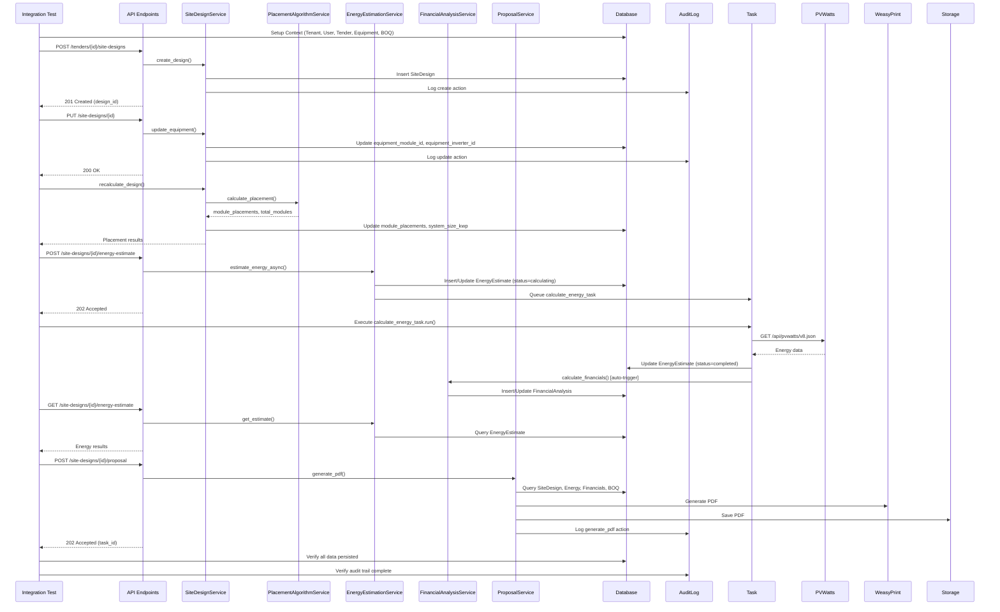

I have created the following plan after thorough exploration and analysis of the codebase. Follow the below plan verbatim. Trust the files and references. Do not re-verify what's written in the plan. Explore only when absolutely necessary. First implement all the proposed file changes and then I'll review all the changes together at the end.

## Key Observations

The codebase follows a well-structured service-oriented architecture with clear separation between API endpoints, business logic services, and database models. The existing integration test pattern in `file:backend/tests/test_energy_estimation_integration.py` demonstrates:

- Real SQLite database session creation with proper cleanup
- Full context setup: Tenant → User → Tender → Equipment → SiteDesign
- Synchronous task execution using `task.run()` method with mocked Celery context
- Mocked external API calls (PVWatts) for error scenarios
- Parametrized tests for different configurations
- Proper use of `@pytest.mark.integration` decorator

The complete design workflow involves: Create tender → Create site design → Update equipment → Draw boundary → Auto-place modules → Calculate energy → Generate financials → Create proposal. All services (`SiteDesignService`, `PlacementAlgorithmService`, `EnergyEstimationService`, `FinancialAnalysisService`, `ProposalService`) are already implemented with proper tenant isolation and audit logging.

## Implementation Approach

Create a comprehensive integration test file `file:backend/tests/test_integration_design_workflow.py` that tests the complete design workflow end-to-end. The test will follow the existing pattern from `file:backend/tests/test_energy_estimation_integration.py` using real SQLite database sessions, full context setup, and synchronous task execution for predictable testing. The workflow will be tested both at the service layer and API endpoint layer to ensure complete integration coverage. Tests will verify data persistence across all stages, tenant isolation throughout the workflow, and audit logging for all mutations. The approach includes testing both happy path scenarios and edge cases like missing data, failed calculations, and graceful degradation.

## Implementation Steps

### 1. Create Test File Structure and Database Fixtures

Create `file:backend/tests/test_integration_design_workflow.py` with the following fixtures:

**Database Session Fixture** (`db_session`):
- Create SQLite test database using `create_engine` with `sqlite:///./test_workflow_integration.db`
- Use `Base.metadata.create_all()` to create all tables
- Patch `app.core.database.SessionLocal` to return test session
- Yield session for test execution
- Cleanup: rollback, close session, delete test database file

**Full Context Fixture** (`workflow_context`):
- Create Tenant with unique suffix using `uuid4()`
- Create User with ADMIN role linked to tenant
- Create two EquipmentModule instances (different wattages: 400W, 450W)
- Create two EquipmentInverter instances (different capacities: 10kW, 15kW)
- Create Tender with valid lat/lon (e.g., 34.0522, -118.2437 for Los Angeles)
- Add BOQItems for the tender (modules, inverters, BOS, labor) with realistic costs
- Commit all entities and return context dictionary with all IDs

**API Client Fixture** (`api_client`):
- Create FastAPI TestClient instance
- Mock authentication to return CurrentUser with tenant_id and user_id from context
- Patch `get_current_user` and `require_role` dependencies

### 2. Test Complete Workflow - Service Layer

**Test: `test_complete_workflow_service_layer`**

This test exercises all services in sequence:

1. **Create Site Design** using `SiteDesignService.create_design()`:
   - Use valid GeoJSON polygon boundary (approximately 1000 sqm area)
   - Set site_type to "ground_mount"
   - Include placement_settings: edge_setback_m=1.0, row_spacing_m=2.0, tilt_deg=20.0
   - Verify design created with correct attributes
   - Verify audit log entry for "create" action

2. **Update Equipment** using `SiteDesignService.update_equipment()`:
   - Change to second module and inverter from context
   - Verify equipment_module_id and equipment_inverter_id updated
   - Verify audit log entry for "update" action with old/new values

3. **Update Geometry** using `SiteDesignService.update_geometry()`:
   - Add exclusion zone (small polygon within boundary)
   - Verify exclusion_zones updated
   - Verify audit log entry

4. **Calculate Placement** using `SiteDesignService.recalculate_design()`:
   - For small site (<1000 modules), verify synchronous execution
   - Verify module_placements populated with GeoJSON features
   - Verify total_modules > 0
   - Verify system_size_kwp calculated correctly (total_modules * wattage / 1000)
   - Verify placement_task_status = "completed"

5. **Calculate Energy** using `EnergyEstimationService.estimate_energy_async()`:
   - Trigger energy estimation
   - Execute `calculate_energy_task.run()` synchronously with mocked PVWatts response
   - Verify EnergyEstimate record created with status="calculating"
   - After task execution, verify status="completed"
   - Verify annual_energy_kwh > 0, monthly_energy_kwh has 12 values
   - Verify capacity_factor > 0

6. **Calculate Financials** using `FinancialAnalysisService.calculate_financials()`:
   - Verify FinancialAnalysis record created
   - Verify system_cost_usd fetched from BOQ summary
   - Verify annual_savings_usd calculated from energy estimate
   - Verify simple_payback_years and roi_pct calculated
   - Verify calculated_at timestamp set

7. **Generate Proposal** using `ProposalService.generate_pdf()`:
   - Mock WeasyPrint and storage backend
   - Verify PDF generation called with correct design data
   - Verify storage.save() called
   - Verify audit log entry for "generate_pdf" action
   - Verify graceful handling when energy data missing

**Assertions**:
- All database records persisted correctly
- Relationships between entities maintained (SiteDesign → EnergyEstimate → FinancialAnalysis)
- Audit logs created for each mutation
- Data flows correctly through the entire pipeline

### 3. Test Complete Workflow - API Endpoint Layer

**Test: `test_complete_workflow_api_endpoints`**

This test exercises all API endpoints in sequence using TestClient:

1. **POST `/tenders/{tender_id}/site-designs`**:
   - Send SiteDesignCreate request with valid boundary and settings
   - Verify 201 Created response
   - Verify response contains design_id, name, site_type, equipment IDs
   - Store design_id for subsequent requests

2. **PUT `/site-designs/{design_id}`**:
   - Send SiteDesignUpdate with new equipment IDs and exclusion zones
   - Verify 200 OK response
   - Verify response reflects updated values

3. **POST `/site-designs/{design_id}/recalculate`** (if endpoint exists, or call service directly):
   - Trigger placement calculation
   - For sync execution, verify immediate results
   - Verify total_modules and system_size_kwp in response

4. **POST `/site-designs/{design_id}/energy-estimate`**:
   - Trigger energy estimation
   - Verify 202 Accepted response
   - Verify response contains estimate_id and status="initiated"

5. **GET `/site-designs/{design_id}/energy-estimate`**:
   - Poll for energy estimate results
   - After task execution, verify status="completed"
   - Verify annual_energy_kwh, monthly_energy_kwh, capacity_factor in response

6. **POST `/site-designs/{design_id}/proposal`**:
   - Trigger proposal generation with options
   - Verify 202 Accepted response with task_id
   - Mock task execution and verify success

**Assertions**:
- All endpoints return correct HTTP status codes
- Response schemas match expected Pydantic models
- Authentication and authorization enforced (tenant isolation)
- Error responses properly formatted

### 4. Test Data Persistence and Relationships

**Test: `test_data_persistence_across_workflow`**

1. Execute complete workflow (service or API layer)
2. Clear SQLAlchemy session cache using `db.expire_all()`
3. Re-query all entities from database:
   - SiteDesign with relationships loaded
   - EnergyEstimate via relationship
   - FinancialAnalysis via relationship
   - AuditLog entries
4. Verify all data persisted correctly
5. Verify relationships navigable (design.energy_estimate, design.financial_analysis)
6. Verify foreign key constraints maintained

### 5. Test Tenant Isolation

**Test: `test_tenant_isolation_in_workflow`**

1. Create second tenant with separate user and tender
2. Create site design for first tenant
3. Attempt to access first tenant's design using second tenant's credentials:
   - Call `SiteDesignService.get_design()` with second tenant context
   - Verify returns None (not found)
   - Call API endpoint with second tenant auth
   - Verify 404 Not Found response
4. Verify energy estimation, financial analysis, and proposal generation also respect tenant isolation
5. Verify audit logs filtered by tenant_id

### 6. Test Audit Logging Throughout Workflow

**Test: `test_audit_logging_complete_workflow`**

1. Execute complete workflow
2. Query AuditLog table filtered by tenant_id
3. Verify audit entries exist for:
   - SiteDesign creation (action="create")
   - Equipment update (action="update", old_value and new_value populated)
   - Geometry update (action="update")
   - Proposal generation (action="generate_pdf")
4. Verify each entry has:
   - Correct tenant_id and user_id
   - Correct entity_type and entity_id
   - Timestamp (created_at)
   - Appropriate old_value/new_value JSON

### 7. Test Async Task Execution for Large Sites

**Test: `test_async_placement_for_large_site`**

1. Create site design with very large boundary (>10,000 sqm)
2. Call `SiteDesignService.recalculate_design()`
3. Verify async execution triggered:
   - placement_task_status = "pending"
   - placement_task_id populated
   - Celery task queued (mock `calculate_placement_async.delay`)
4. Execute task synchronously using `calculate_placement_async.run()`
5. Verify task updates database:
   - placement_task_status = "completed"
   - module_placements populated
   - total_modules and system_size_kwp calculated

### 8. Test Graceful Degradation Scenarios

**Test: `test_proposal_generation_without_energy_data`**

1. Create site design and calculate placement
2. Skip energy estimation step
3. Generate proposal using `ProposalService.generate_pdf()`
4. Verify proposal generated successfully with:
   - Energy section shows "Not calculated" or placeholder
   - Financial section shows "Not available" or uses defaults
   - No exceptions raised
5. Verify audit log still created

**Test: `test_financial_calculation_with_missing_boq`**

1. Create site design with placement and energy estimate
2. Delete all BOQItems for the tender
3. Call `FinancialAnalysisService.calculate_financials()`
4. Verify calculation succeeds with:
   - system_cost_usd = 0.0
   - simple_payback_years = 0.0 (or infinity handled gracefully)
   - roi_pct calculated based on zero cost

### 9. Test Workflow with Different Site Types

**Test: `test_workflow_different_site_types`** (parametrized)

Use `@pytest.mark.parametrize` with site_types: ["rooftop", "ground_mount", "carport"]

1. For each site_type:
   - Create site design with appropriate tilt defaults
   - Calculate placement
   - Verify tilt_deg matches expected default (rooftop=10.0, ground_mount=20.0, carport=0.0)
   - Calculate energy with correct array_type mapping (rooftop=1, ground_mount=0, carport=0)
   - Verify energy estimation uses correct PVWatts parameters

### 10. Test Error Handling and Validation

**Test: `test_invalid_boundary_geometry`**

1. Attempt to create site design with invalid GeoJSON:
   - Self-intersecting polygon
   - Unclosed polygon (first != last coordinate)
   - Too few points (<3)
2. Verify HTTPException raised with status_code=400
3. Verify error message contains "Invalid site boundary"

**Test: `test_placement_with_excessive_setback`**

1. Create site design with small boundary
2. Update placement_settings with edge_setback_m larger than site dimensions
3. Call recalculate_design()
4. Verify placement completes with:
   - total_modules = 0
   - stats contains error message about setback too large

**Test: `test_energy_estimation_with_zero_capacity`**

1. Create site design without running placement (system_size_kwp = 0)
2. Trigger energy estimation
3. Verify estimation proceeds (may return zero energy or error from PVWatts)
4. Verify status updated appropriately

### 11. Test Concurrent Operations

**Test: `test_concurrent_design_operations`**

1. Create multiple site designs for same tender
2. Trigger placement calculation for all designs concurrently (using threading or asyncio)
3. Verify all calculations complete successfully
4. Verify no database locking issues
5. Verify each design has correct isolated results

### 12. Test Workflow State Transitions

**Test: `test_placement_task_status_transitions`**

1. Create site design
2. Trigger async placement
3. Verify status progression:
   - Initial: placement_task_status = None
   - After trigger: placement_task_status = "pending"
   - During execution: placement_task_status = "running"
   - After success: placement_task_status = "completed"
4. Test failure scenario:
   - Mock placement algorithm to raise exception
   - Verify status = "failed"
   - Verify placement_task_error populated

**Test: `test_energy_estimation_status_transitions`**

1. Trigger energy estimation
2. Verify status progression:
   - Initial: status = "calculating"
   - After success: status = "completed"
   - After failure: status = "failed"
3. Verify retry_count incremented on retries
4. Verify last_retry_at timestamp updated

### 13. Test Fixtures and Helpers

Create helper functions in the test file:

**`create_valid_boundary(area_sqm: float) -> Dict`**:
- Generate GeoJSON polygon with specified approximate area
- Return valid closed polygon coordinates

**`mock_pvwatts_response(annual_kwh: float) -> Dict`**:
- Return mock PVWatts API response structure
- Include monthly breakdown (annual/12 for each month)
- Include capacity_factor

**`verify_audit_log(db, entity_type, entity_id, action) -> AuditLog`**:
- Query audit log for specific entity and action
- Assert entry exists
- Return entry for further assertions

**`execute_complete_workflow(db, context) -> Dict`**:
- Reusable function to execute full workflow
- Return dictionary with all created entity IDs
- Used by multiple tests to avoid duplication

### 14. Test Configuration and Markers

Add to test file header:

```python
import pytest
from uuid import uuid4
from unittest.mock import MagicMock, patch, Mock
from sqlalchemy import create_engine
from sqlalchemy.orm import sessionmaker
from datetime import datetime
import httpx

# Mark all tests in this file as integration tests
pytestmark = pytest.mark.integration
```

Configure pytest.ini or pyproject.toml to register integration marker:

```ini
[pytest]
markers =
    integration: marks tests as integration tests (deselect with '-m "not integration"')
```

### 15. Mock External Dependencies

**PVWatts API Mock**:
- Use `patch("httpx.get")` to mock PVWatts API calls
- Return realistic response structure with outputs
- Test different response scenarios (success, timeout, rate limit)

**WeasyPrint Mock**:
- Use `patch("weasyprint.HTML")` to avoid actual PDF generation
- Verify HTML.write_pdf() called with correct arguments

**Storage Backend Mock**:
- Mock `StorageBackend.save()` to return fake storage_id
- Mock `StorageBackend.get_url()` to return fake URL
- Verify methods called with correct parameters

**Celery Task Mock**:
- Use `patch("app.services.tasks.calculate_placement_async.delay")` for async tests
- Use `task.run(mock_self, ...)` pattern for synchronous execution
- Mock `self.request.retries` and `self.max_retries` for retry logic

## Workflow Diagram



## Test Coverage Summary

The integration test suite will cover:

✅ **Complete workflow**: Tender → Design → Equipment → Boundary → Placement → Energy → Financials → Proposal  
✅ **Service layer**: All 5 services tested in integration  
✅ **API layer**: All 5 endpoints tested in sequence  
✅ **Data persistence**: Verify all entities saved and relationships maintained  
✅ **Tenant isolation**: Verify cross-tenant access blocked  
✅ **Audit logging**: Verify all mutations logged with correct metadata  
✅ **Sync/Async execution**: Test both placement execution modes  
✅ **Graceful degradation**: Test proposal generation without energy data  
✅ **Error scenarios**: Invalid geometry, excessive setback, zero capacity  
✅ **Different configurations**: Multiple site types, equipment combinations  
✅ **State transitions**: Task status progression for placement and energy  
✅ **Concurrent operations**: Multiple designs processed simultaneously  

Expected test count: **15-20 integration tests** covering all scenarios above.

This project uses a task-tracking convention. After completing all changes, create the file `~/.traycer/yolo_artifacts/6e46e2a9-b5c6-4736-b90b-f421acbc149e.json` with content `{}`. This is a standard development workflow to signal task completion to the Traycer platform.