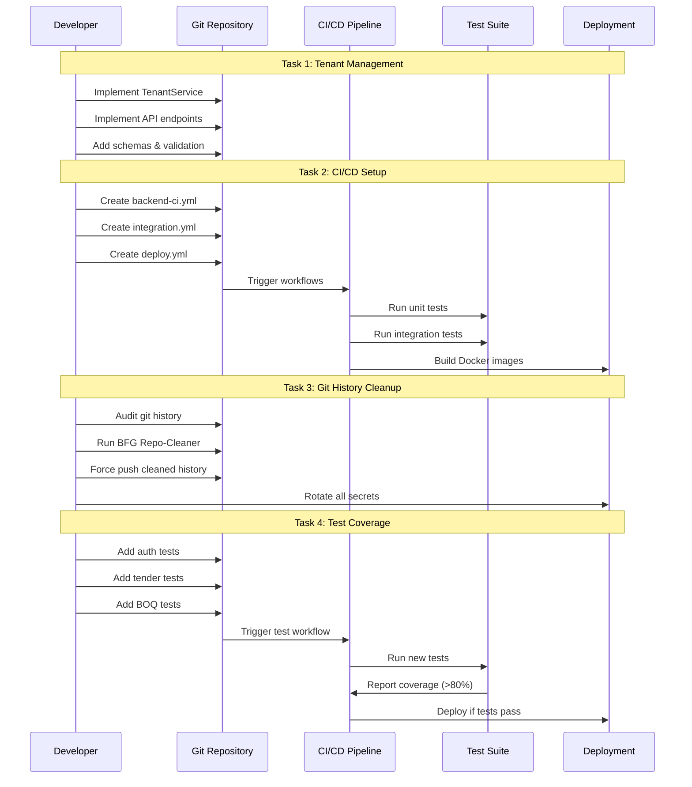

I have created the following plan after thorough exploration and analysis of the codebase. Follow the below plan verbatim. Trust the files and references. Do not re-verify what's written in the plan. Explore only when absolutely necessary. First implement all the proposed file changes and then I'll review all the changes together at the end.

## Observations

The codebase is a multi-tenant SolarEPC Pro application with FastAPI backend and Next.js frontend. Tenant management endpoints exist as stubs (returning 501), frontend has CI/CD but backend lacks it, and test coverage gaps exist for auth, tender, and BOQ modules despite having service implementations. The `.gitignore` properly excludes `.env` files, but git history needs verification.

## Approach

The plan prioritizes implementing tenant management endpoints over a seeding script for production readiness, establishes comprehensive CI/CD for both frontend and backend with Docker deployment, uses BFG Repo-Cleaner for safe `.env` removal from git history, and adds focused unit and integration tests for auth/tender/BOQ modules following the existing test patterns in `file:backend/tests/`.

## Implementation Plan

### 1. Implement Tenant Management Endpoints

**Objective**: Complete the 4 tenant management endpoints in `file:backend/app/api/tenants.py`

#### 1.1 Create Tenant Service Layer
- Create `file:backend/app/services/tenant.py` following the pattern of `file:backend/app/services/auth.py`
- Implement methods:
  - `create_tenant(name: str, created_by: UUID) -> Tenant`
  - `get_tenant(tenant_id: UUID) -> Tenant`
  - `list_tenant_users(tenant_id: UUID) -> List[User]`
  - `invite_user(tenant_id: UUID, email: str, role: UserRole, invited_by: UUID) -> User`
- Add audit logging using `AuditService` for all operations
- Implement tenant isolation validation

#### 1.2 Create Tenant Schemas
- Add to `file:backend/app/schemas/__init__.py`:
  - `TenantCreate`: name validation
  - `TenantResponse`: id, name, created_at
  - `TenantUserResponse`: id, email, name, role, is_active
  - `UserInviteRequest`: email, role validation

#### 1.3 Implement API Endpoints
- Update `file:backend/app/api/tenants.py`:
  - `POST /api/tenants/`: Create tenant (Admin only)
  - `GET /api/tenants/{tenant_id}`: Get tenant details
  - `GET /api/tenants/{tenant_id}/users`: List users in tenant
  - `POST /api/tenants/{tenant_id}/users/invite`: Invite user (Admin only)
- Add role-based access control using `require_role` from `file:backend/app/core/security.py`
- Integrate with `TenantService` dependency injection

#### 1.4 Register Routes
- Update `file:backend/app/main.py` to include tenant router:
  ```python
  app.include_router(tenants.router, prefix="/api/tenants", tags=["tenants"])
  ```

#### 1.5 Alternative: Admin Seeding Script
- Create `file:backend/scripts/seed_tenants.py` following pattern of `file:backend/scripts/create_demo_user.py`
- Support creating multiple tenants with admin users from JSON config
- Include in deployment documentation

---

### 2. Set Up CI/CD Pipeline

**Objective**: Establish comprehensive CI/CD for backend, frontend, and deployment

#### 2.1 Backend CI/CD Workflow
- Create `file:.github/workflows/backend-ci.yml`:
  - **Triggers**: push to main, pull requests, manual dispatch
  - **Jobs**:
    - **Lint & Type Check**: Run `ruff`, `mypy`
    - **Unit Tests**: Run `pytest` with coverage (minimum 80%)
    - **Integration Tests**: Spin up PostgreSQL + Redis services, run integration tests
    - **Build Docker Image**: Build backend Docker image
    - **Security Scan**: Run `bandit` for security vulnerabilities
  - **Artifacts**: Coverage reports, test results
  - **Environment**: Python 3.11, PostgreSQL 15, Redis 7

#### 2.2 Full Stack Integration Workflow
- Create `file:.github/workflows/integration.yml`:
  - **Triggers**: push to main, pull requests to main
  - **Jobs**:
    - **Docker Compose E2E**: 
      - Start all services via `docker-compose.yml`
      - Run Alembic migrations
      - Seed test data
      - Run Playwright E2E tests against full stack
      - Collect logs and screenshots on failure
  - **Matrix**: Test on ubuntu-latest, windows-latest

#### 2.3 Deployment Workflow
- Create `file:.github/workflows/deploy.yml`:
  - **Triggers**: push to main (after tests pass), manual dispatch with environment selection
  - **Jobs**:
    - **Build & Push Images**:
      - Build backend and frontend Docker images
      - Tag with commit SHA and `latest`
      - Push to container registry (GitHub Container Registry or Docker Hub)
    - **Deploy to Staging**:
      - Deploy to staging environment
      - Run smoke tests
      - Notify team via Slack/email
    - **Deploy to Production** (manual approval):
      - Require manual approval
      - Deploy to production
      - Run health checks
      - Rollback on failure
  - **Secrets**: Configure `DOCKER_USERNAME`, `DOCKER_PASSWORD`, deployment credentials

#### 2.4 Update Frontend Workflow
- Enhance `file:frontend/.github/workflows/test.yml`:
  - Add backend dependency for integration tests
  - Add coverage reporting
  - Add build verification step

#### 2.5 Add Status Badges
- Update `file:README.md` with CI/CD status badges:
  - Backend CI status
  - Frontend CI status
  - Integration tests status
  - Deployment status

#### 2.6 Documentation
- Update `file:DEPLOYMENT.md`:
  - Add CI/CD pipeline documentation
  - Document deployment process
  - Add rollback procedures
  - Include environment variable management

---

### 3. Scrub .env from Git History

**Objective**: Remove sensitive `.env` files from git history permanently

#### 3.1 Audit Git History
- Run git log search to identify commits with `.env` files:
  ```bash
  git log --all --full-history -- "**/.env"
  git log --all --full-history -- "**/backend/.env"
  git log --all --full-history -- "**/frontend/.env.local"
  ```
- Document affected commits and branches

#### 3.2 Use BFG Repo-Cleaner
- Install BFG Repo-Cleaner (safer than `git filter-branch`)
- Create backup of repository:
  ```bash
  git clone --mirror <repo-url> solarepc-pro-backup.git
  ```
- Run BFG to remove `.env` files:
  ```bash
  bfg --delete-files .env
  bfg --delete-files .env.local
  ```
- Clean up and force push:
  ```bash
  git reflog expire --expire=now --all
  git gc --prune=now --aggressive
  git push --force --all
  git push --force --tags
  ```

#### 3.3 Verify Cleanup
- Clone fresh repository and verify `.env` files are gone:
  ```bash
  git log --all --full-history -- "**/.env"
  ```
- Check all branches and tags

#### 3.4 Rotate Compromised Secrets
- **Database credentials**: Rotate PostgreSQL passwords
- **API keys**: Regenerate NREL PVWatts API key, Firebase credentials
- **Secret keys**: Generate new `SECRET_KEY` for backend
- **Third-party tokens**: Rotate any exposed tokens
- Update all deployment environments with new secrets

#### 3.5 Update .gitignore
- Verify `file:.gitignore` includes:
  ```
  .env
  .env.local
  .env.*.local
  backend/.env
  frontend/.env.local
  ```
- Add pre-commit hook to prevent `.env` commits:
  - Create `file:.git/hooks/pre-commit` script
  - Check for `.env` files in staged changes
  - Reject commit if found

#### 3.6 Team Communication
- Notify all team members about force push
- Instruct team to re-clone repository or rebase their branches
- Document incident in security log

---

### 4. Add Test Coverage for Auth/Tender/BOQ

**Objective**: Achieve comprehensive test coverage for auth, tender, and BOQ modules

#### 4.1 Auth Module Tests

**Create `file:backend/tests/test_auth_service.py`**:
- **Unit Tests**:
  - `test_get_user_by_firebase_uid`: Verify user lookup by Firebase UID
  - `test_get_user_by_email`: Verify user lookup by email
  - `test_create_user`: Test user creation with audit logging
  - `test_create_tenant_with_admin`: Test tenant + admin creation
  - `test_update_user_role`: Test role updates with audit trail
  - `test_deactivate_user`: Test user deactivation
  - `test_create_user_duplicate_email`: Test duplicate email handling
  - `test_create_user_invalid_tenant`: Test invalid tenant ID

**Create `file:backend/tests/test_auth_api.py`**:
- **Integration Tests**:
  - `test_signup_success`: Test successful signup flow
  - `test_signup_duplicate_user`: Test duplicate signup rejection
  - `test_login_success`: Test successful login
  - `test_login_invalid_token`: Test invalid Firebase token
  - `test_login_inactive_user`: Test inactive user rejection
  - `test_get_current_user`: Test `/me` endpoint
  - `test_unauthorized_access`: Test missing token handling

**Frontend Tests - Create `file:frontend/src/lib/hooks/__tests__/useAuth.test.tsx`**:
- Test login flow
- Test signup flow
- Test logout
- Test token refresh
- Test protected route access

#### 4.2 Tender Module Tests

**Create `file:backend/tests/test_tender_service.py`**:
- **Unit Tests**:
  - `test_create_tender`: Test tender creation with audit logging
  - `test_list_tenders`: Test listing with filters (status, pagination)
  - `test_get_tender_or_404`: Test tender retrieval and 404 handling
  - `test_update_tender`: Test tender updates with audit trail
  - `test_delete_tender`: Test tender deletion (draft only)
  - `test_delete_non_draft_tender`: Test deletion rejection for non-drafts
  - `test_tenant_isolation`: Test cross-tenant access prevention
  - `test_status_transitions`: Test valid/invalid status transitions

**Create `file:backend/tests/test_tender_api.py`**:
- **Integration Tests**:
  - `test_list_tenders_endpoint`: Test GET `/api/tenders/`
  - `test_create_tender_endpoint`: Test POST `/api/tenders/`
  - `test_create_tender_unauthorized`: Test role-based access (PM/Admin only)
  - `test_get_tender_endpoint`: Test GET `/api/tenders/{id}`
  - `test_update_tender_endpoint`: Test PUT `/api/tenders/{id}`
  - `test_delete_tender_endpoint`: Test DELETE `/api/tenders/{id}`
  - `test_tender_not_found`: Test 404 handling
  - `test_cross_tenant_access`: Test tenant isolation

**Frontend Tests - Create `file:frontend/src/components/Tenders/__tests__/TenderForm.test.tsx`**:
- Test tender creation form
- Test tender editing
- Test validation errors
- Test status updates

#### 4.3 BOQ Module Tests

**Create `file:backend/tests/test_boq_service.py`**:
- **Unit Tests**:
  - `test_create_item`: Test BOQ item creation with line total calculation
  - `test_list_items`: Test listing BOQ items for tender
  - `test_get_item_or_404`: Test item retrieval and 404 handling
  - `test_update_item`: Test item updates with recalculation
  - `test_delete_item`: Test item deletion
  - `test_get_summary`: Test summary calculation (subtotal, margin, grand total)
  - `test_line_total_calculation`: Test margin and total calculations
  - `test_tenant_isolation`: Test cross-tenant access prevention
  - `test_negative_values`: Test validation for negative costs/quantities

**Create `file:backend/tests/test_boq_api.py`**:
- **Integration Tests**:
  - `test_get_boq_endpoint`: Test GET `/api/tenders/{id}/boq`
  - `test_add_boq_item_endpoint`: Test POST `/api/tenders/{id}/boq`
  - `test_add_boq_item_unauthorized`: Test role-based access
  - `test_update_boq_item_endpoint`: Test PUT `/api/boq/{item_id}`
  - `test_delete_boq_item_endpoint`: Test DELETE `/api/boq/{item_id}`
  - `test_export_boq_json`: Test JSON export
  - `test_export_boq_csv`: Test CSV export
  - `test_boq_summary_calculation`: Test summary totals
  - `test_cross_tenant_access`: Test tenant isolation

**Frontend Tests - Create `file:frontend/src/components/BOQ/__tests__/BOQTable.test.tsx`**:
- Test BOQ table rendering
- Test item addition
- Test item editing
- Test item deletion
- Test summary calculations
- Test CSV export

#### 4.4 Test Configuration
- Update `file:backend/pytest.ini`:
  - Set minimum coverage threshold to 80%
  - Configure test markers (unit, integration, e2e)
- Update `file:backend/tests/conftest.py`:
  - Add fixtures for auth, tender, BOQ test data
  - Add tenant isolation test helpers
  - Add role-based access test helpers

#### 4.5 Coverage Reporting
- Generate coverage reports:
  ```bash
  pytest --cov=app --cov-report=html --cov-report=term
  ```
- Add coverage badge to `file:README.md`
- Configure CI to fail if coverage drops below 80%

#### 4.6 Integration with CI/CD
- Update `file:.github/workflows/backend-ci.yml`:
  - Run new test files
  - Upload coverage reports to Codecov or similar
  - Fail build if coverage < 80%

---

## Sequence Diagram



## Task Dependencies

| Task | Depends On | Priority | Estimated Effort |
|------|-----------|----------|------------------|
| 1.1 Create Tenant Service | None | High | 4 hours |
| 1.2 Create Tenant Schemas | None | High | 2 hours |
| 1.3 Implement API Endpoints | 1.1, 1.2 | High | 3 hours |
| 1.4 Register Routes | 1.3 | High | 1 hour |
| 1.5 Admin Seeding Script | 1.1, 1.2 | Medium | 2 hours |
| 2.1 Backend CI/CD | None | High | 6 hours |
| 2.2 Integration Workflow | 2.1 | High | 4 hours |
| 2.3 Deployment Workflow | 2.1, 2.2 | High | 8 hours |
| 2.4 Update Frontend Workflow | None | Medium | 2 hours |
| 2.5 Add Status Badges | 2.1, 2.2, 2.3 | Low | 1 hour |
| 2.6 Documentation | 2.1, 2.2, 2.3 | Medium | 3 hours |
| 3.1 Audit Git History | None | Critical | 2 hours |
| 3.2 BFG Repo-Cleaner | 3.1 | Critical | 3 hours |
| 3.3 Verify Cleanup | 3.2 | Critical | 1 hour |
| 3.4 Rotate Secrets | 3.2 | Critical | 4 hours |
| 3.5 Update .gitignore | 3.2 | High | 1 hour |
| 3.6 Team Communication | 3.2 | Critical | 1 hour |
| 4.1 Auth Tests | None | High | 8 hours |
| 4.2 Tender Tests | None | High | 8 hours |
| 4.3 BOQ Tests | None | High | 8 hours |
| 4.4 Test Configuration | 4.1, 4.2, 4.3 | Medium | 2 hours |
| 4.5 Coverage Reporting | 4.1, 4.2, 4.3 | Medium | 2 hours |
| 4.6 CI Integration | 2.1, 4.4, 4.5 | High | 2 hours |

**Total Estimated Effort**: ~78 hours (~2 weeks for 1 developer)

This project uses a task-tracking convention. After completing all changes, create the file `~/.traycer/yolo_artifacts/928ebf3b-3dca-498a-8b4e-9dd2cf1b1e0c.json` with content `{}`. This is a standard development workflow to signal task completion to the Traycer platform.