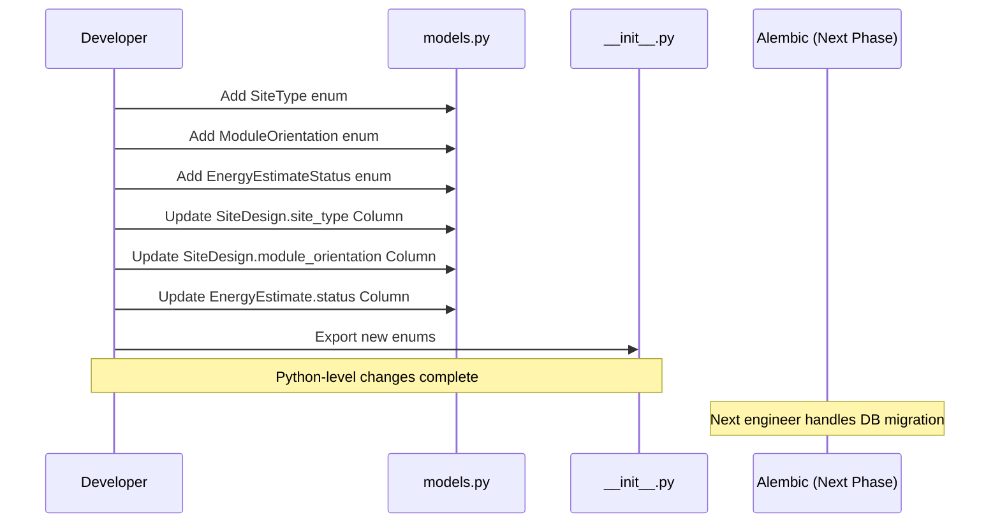

I have created the following plan after thorough exploration and analysis of the codebase. Follow the below plan verbatim. Trust the files and references. Do not re-verify what's written in the plan. Explore only when absolutely necessary. First implement all the proposed file changes and then I'll review all the changes together at the end.

## Observations

The codebase already contains all required SQLAlchemy models (`EquipmentModule`, `EquipmentInverter`, `SiteDesign`, `DesignVersion`, `EnergyEstimate`, `FinancialAnalysis`) in `file:backend/app/models/models.py`. JSONB columns for GeoJSON data exist using the `JSON_TYPE` helper. The `Tender.site_designs` relationship is established. However, three enums (`SiteType`, `ModuleOrientation`, `EnergyEstimateStatus`) are currently implemented as string fields rather than Python enums. Pydantic schema enums exist in `file:backend/app/schemas/site_design.py` but are not mirrored in the models layer.

## Approach

Add Python enum definitions to `file:backend/app/models/models.py` for type safety and consistency with the schema layer. Convert existing string Column definitions to use SQLAlchemy's `Enum()` type with these Python enums. Update `file:backend/app/models/__init__.py` to export the new enums. This approach maintains backward compatibility at the Python level while preparing for the database migration that will be handled in the subsequent phase.

## Implementation Steps

### 1. Add Enum Definitions to models.py

In `file:backend/app/models/models.py`, after the existing `TenderStatus` enum (around line 34):

- Define `SiteType` enum with values: `ROOFTOP = "rooftop"`, `GROUND_MOUNT = "ground_mount"`, `CARPORT = "carport"`
- Define `ModuleOrientation` enum with values: `PORTRAIT = "portrait"`, `LANDSCAPE = "landscape"`
- Define `EnergyEstimateStatus` enum with values: `CALCULATING = "calculating"`, `COMPLETED = "completed"`, `FAILED = "failed"`
- Follow the existing pattern: inherit from `str, PyEnum` for JSON serialization compatibility
- Add docstrings describing each enum's purpose

### 2. Update SiteDesign Model Column Definitions

In the `SiteDesign` class (starting line 244):

- Change `site_type = Column(String(50), nullable=False)` to `site_type = Column(Enum(SiteType), nullable=False)`
- Change `module_orientation = Column(String(20), default="portrait")` to `module_orientation = Column(Enum(ModuleOrientation), default=ModuleOrientation.PORTRAIT)`
- Update the comment on line 258 to reference the enum instead of listing values

### 3. Update EnergyEstimate Model Column Definition

In the `EnergyEstimate` class (starting line 321):

- Change `status = Column(String(20), default="calculating")` to `status = Column(Enum(EnergyEstimateStatus), default=EnergyEstimateStatus.CALCULATING)`

### 4. Update Model Exports in __init__.py

In `file:backend/app/models/__init__.py`:

- Add imports for the three new enums: `SiteType`, `ModuleOrientation`, `EnergyEstimateStatus`
- Add them to the `__all__` list in alphabetical order with existing exports
- Maintain consistency with existing enum export pattern (e.g., `UserRole`, `TenderStatus`)

### 5. Verification Points

After implementation, verify:

- All enum values match those used in `file:backend/app/schemas/site_design.py`
- Enum string values match existing database data patterns (lowercase with underscores)
- Default values use enum members (e.g., `ModuleOrientation.PORTRAIT`) not strings
- Import statements in models.py include `Enum` from `sqlalchemy`
- No breaking changes to existing service layer code that uses string comparisons

This project uses a task-tracking convention. After completing all changes, create the file `~/.traycer/yolo_artifacts/35b1be67-b2be-4cb3-8aff-abf7095bac1f.json` with content `{}`. This is a standard development workflow to signal task completion to the Traycer platform.