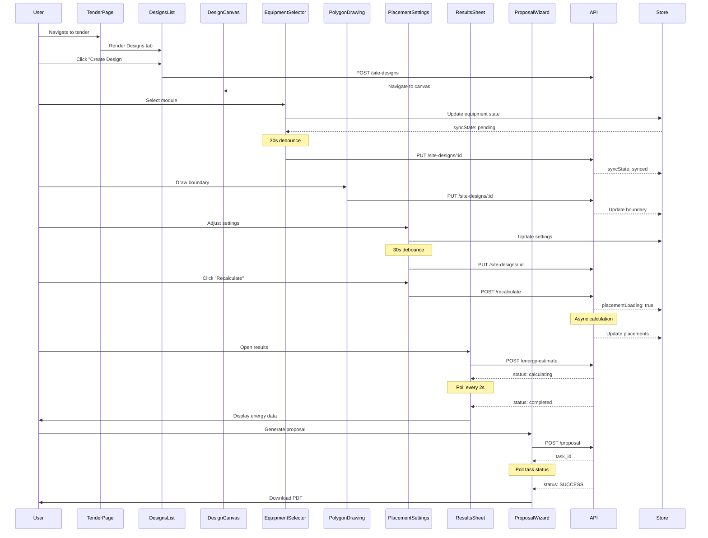

I have created the following plan after thorough exploration and analysis of the codebase. Follow the below plan verbatim. Trust the files and references. Do not re-verify what's written in the plan. Explore only when absolutely necessary. First implement all the proposed file changes and then I'll review all the changes together at the end.

## Observations

The codebase follows a well-structured testing pattern using Vitest, React Testing Library, and MSW for API mocking. Existing integration tests demonstrate comprehensive coverage of auto-save functionality, debounced updates, and retry logic. The design canvas workflow integrates multiple components (DesignsList, CanvasLayout, EquipmentSelector, PolygonDrawingLayer, PlacementSettings, ResultsBottomSheet, ProposalWizard) with Zustand state management and React Query hooks. MSW handlers in `file:frontend/src/test/mocks/handlers.ts` provide stateful mocking with transition tracking, and fixtures in `file:frontend/src/test/fixtures` offer reusable test data.

## Approach

Create a comprehensive end-to-end integration test file that simulates the complete user journey through the design canvas workflow. The test will verify component integration, state management synchronization, auto-save functionality, and error recovery. Following existing patterns from `file:frontend/src/components/DesignCanvas/__tests__/autoSaveIntegration.test.tsx`, use MSW handlers for API mocking, Vitest fake timers for debounce testing, and the existing test utilities. The test will cover the full flow: navigating to Designs tab → creating a design → selecting equipment → drawing boundaries → configuring placement → viewing results → generating proposals, while verifying sync state transitions and data persistence throughout.

## Implementation Steps

### 1. Create E2E Design Workflow Test File

**File**: `file:frontend/src/components/DesignCanvas/__tests__/e2eDesignWorkflow.test.tsx`

Create a comprehensive integration test covering the complete design canvas user journey:

```typescript
// Test structure:
describe('E2E Design Canvas Workflow', () => {
  // Test 1: Complete happy path workflow
  // Test 2: Equipment selection gating (cannot draw without equipment)
  // Test 3: Auto-save during equipment changes
  // Test 4: Drawing boundary and auto-placement trigger
  // Test 5: Energy estimation polling and results display
  // Test 6: Proposal generation workflow
  // Test 7: Version save and restore
})
```

**Test Setup**:
- Import all required components: `DesignsList`, `CanvasLayout`, `EquipmentSelector`, `PolygonDrawingLayer`, `PlacementSettings`, `ResultsBottomSheet`, `ProposalWizard`
- Use `renderWithProviders` from `file:frontend/src/test/utils.tsx`
- Mock MSW handlers from `file:frontend/src/test/mocks/handlers.ts`
- Use fixtures from `file:frontend/src/test/fixtures/siteDesign.ts`, `file:frontend/src/test/fixtures/equipment.ts`, `file:frontend/src/test/fixtures/proposal.ts`
- Reset `useDesignCanvasStore` state in `beforeEach`
- Use `vi.useFakeTimers()` for debounce testing

### 2. Test 1: Complete Happy Path Workflow

**Scenario**: User navigates through entire design workflow successfully

**Steps**:
1. Render `DesignsList` component with mock tender ID
2. Verify designs list displays with "Create New Design" button
3. Click "Create New Design" button
4. Verify navigation to design canvas page (mock router.push)
5. Render `CanvasLayout` with all child components
6. Verify initial state: `syncState: 'synced'`, no equipment selected
7. Select module from `EquipmentSelector`
8. Verify sync state transitions: `synced` → `pending` → `syncing` → `synced`
9. Advance timers by 30s to trigger debounced save
10. Verify PUT request to `/api/site-designs/:id` with equipment data
11. Select inverter from `EquipmentSelector`
12. Verify both equipment selections saved together (debounce coalescing)
13. Simulate drawing boundary via `PolygonDrawingLayer` (mock map interactions)
14. Verify boundary saved to backend
15. Trigger auto-placement via `PlacementSettings`
16. Verify placement loading state and polling
17. Open `ResultsBottomSheet` and verify energy estimate display
18. Click "Generate Proposal" in `ProposalWizard`
19. Verify proposal task polling and completion
20. Verify final state: all data persisted, sync state is `synced`

**Assertions**:
- Verify each component renders correctly
- Verify state management updates (`useDesignCanvasStore`)
- Verify React Query cache updates (`useSiteDesigns`, `useEquipment`, `useProposal`)
- Verify API calls made in correct sequence
- Verify data persistence across workflow steps

### 3. Test 2: Equipment Selection Gating

**Scenario**: User cannot access drawing tools without selecting equipment

**Steps**:
1. Render `CanvasLayout` with `FloatingPalette` and `PolygonDrawingLayer`
2. Verify drawing tools are disabled (check `hasEquipmentSelected` state)
3. Attempt to click "Draw Boundary" tool
4. Verify tool remains inactive and no drawing mode activated
5. Select module and inverter from `EquipmentSelector`
6. Verify drawing tools become enabled
7. Click "Draw Boundary" tool
8. Verify mode changes to `draw` and tool activates
9. Clear equipment selection
10. Verify drawing mode resets to `select` and tools disabled

**Assertions**:
- Verify `hasEquipmentSelected` state controls tool availability
- Verify mode transitions: `select` → `draw` (only when equipment selected)
- Verify UI feedback (disabled state, tooltips)

### 4. Test 3: Auto-Save During Equipment Changes

**Scenario**: Rapid equipment changes coalesce into single save operation

**Steps**:
1. Render `EquipmentSelector` component
2. Select module A
3. Verify `syncState: 'pending'`
4. Advance timers by 10s (before debounce completes)
5. Change to module B
6. Verify debounce timer resets
7. Advance timers by 10s
8. Change to module C
9. Advance timers by 30s (complete debounce)
10. Verify only ONE PUT request made with final module C
11. Verify `syncState: 'synced'`

**Assertions**:
- Verify debounce coalescing (only 1 API call)
- Verify final state reflects last change
- Verify sync state transitions correctly

### 5. Test 4: Drawing Boundary and Auto-Placement

**Scenario**: User draws site boundary and triggers auto-placement

**Steps**:
1. Render `CanvasLayout` with `MapCanvas` and `PolygonDrawingLayer`
2. Select equipment (prerequisite)
3. Activate drawing mode
4. Simulate drawing polygon points (mock Leaflet map events)
5. Complete polygon (close shape)
6. Verify boundary saved via PUT `/api/site-designs/:id`
7. Verify `site_boundary` GeoJSON in request body
8. Open `PlacementSettings` panel
9. Adjust placement settings (azimuth, tilt, spacing)
10. Verify debounced save (30s)
11. Click "Recalculate Layout" button
12. Verify POST `/api/site-designs/:id/recalculate`
13. Verify `placementLoading: true` state
14. Mock async placement completion
15. Verify `placementLoading: false` and results updated

**Assertions**:
- Verify GeoJSON validation before save
- Verify placement settings debounce
- Verify loading states during recalculation
- Verify module placements updated in design data

### 6. Test 5: Energy Estimation Polling and Results Display

**Scenario**: User triggers energy estimation and views results

**Steps**:
1. Render `ResultsBottomSheet` component
2. Verify initial state: no energy estimate
3. Click "Calculate Energy" button
4. Verify POST `/api/site-designs/:id/energy-estimate`
5. Mock energy estimate status: `calculating`
6. Verify polling starts (every 2s)
7. Advance timers and mock status transitions: `calculating` → `completed`
8. Verify polling stops when status is `completed`
9. Verify energy data displayed in bottom sheet
10. Verify charts render with monthly energy data
11. Test "Outdated" indicator when design changes
12. Trigger recalculation and verify estimate marked stale
13. Verify retry button appears on estimation failure
14. Click retry and verify re-trigger

**Assertions**:
- Verify polling interval (2s)
- Verify polling stops on completion/failure
- Verify energy data display (annual, monthly, capacity factor)
- Verify stale detection logic
- Verify error handling and retry

### 7. Test 6: Proposal Generation Workflow

**Scenario**: User generates proposal PDF and exports CSV

**Steps**:
1. Render `ProposalWizard` component
2. Verify wizard opens with design summary
3. Configure proposal options (sections to include)
4. Click "Generate Proposal" button
5. Verify POST `/api/site-designs/:id/proposal`
6. Verify task polling starts
7. Mock task status transitions: `PENDING` → `STARTED` → `SUCCESS`
8. Verify polling stops on `SUCCESS`
9. Verify download link appears
10. Click "Export CSV" button
11. Verify GET `/api/site-designs/:id/export-csv`
12. Verify file download triggered
13. Test graceful degradation: proposal without energy data
14. Verify warning message displayed
15. Verify proposal still generates with available data

**Assertions**:
- Verify task polling (2s interval)
- Verify proposal options passed to API
- Verify download link generation
- Verify CSV export functionality
- Verify graceful degradation when energy data missing

### 8. Test 7: Version Save and Restore

**Scenario**: User saves design version and restores it later

**Steps**:
1. Render `CanvasLayout` with `SaveVersionModal` and `VersionList`
2. Make changes to design (equipment, settings)
3. Click "Save Version" button
4. Enter version name and notes in modal
5. Submit version save
6. Verify POST `/api/site-designs/:id/versions`
7. Verify version appears in version list
8. Make additional changes to design
9. Verify `isModifiedSinceVersion: true`
10. Open version list
11. Click "Restore" on previous version
12. Verify POST `/api/site-designs/:id/restore/:versionId`
13. Verify design data reverts to version snapshot
14. Verify automatic recalculation triggered
15. Verify `isModifiedSinceVersion: false`

**Assertions**:
- Verify version creation with metadata
- Verify version list updates
- Verify modification tracking
- Verify restore triggers recalculation
- Verify design state matches version snapshot

### 9. Test 8: Sync State Transitions and Error Recovery

**Scenario**: Test complete sync state lifecycle with failures

**Steps**:
1. Render `CanvasLayout` with `Toolbar` (shows sync indicator)
2. Make change to trigger save
3. Verify state: `synced` → `pending`
4. Advance debounce timer (30s)
5. Verify state: `pending` → `syncing`
6. Mock API failure (500 error)
7. Verify state: `syncing` → `failed`
8. Verify retry count increments
9. Verify retry delay (1s for first retry)
10. Mock second failure
11. Verify retry count: 2, delay: 2s
12. Mock third failure
13. Verify retry count: 3, delay: 4s
14. Verify final state: `failed` with retry count 3
15. Verify manual retry button appears
16. Click manual retry
17. Mock success
18. Verify state: `failed` → `syncing` → `synced`
19. Verify retry count resets to 0

**Assertions**:
- Verify all sync state transitions
- Verify exponential backoff delays (1s, 2s, 4s)
- Verify retry count tracking
- Verify manual retry functionality
- Verify toast notifications at each stage

### 10. Test 9: Unsaved Changes Warning

**Scenario**: User attempts to navigate away with unsaved changes

**Steps**:
1. Render design canvas page with navigation context
2. Make changes to design
3. Verify `syncState: 'pending'`
4. Attempt to navigate back to tender page
5. Verify `ConfirmDialog` appears with warning
6. Click "Stay on Page"
7. Verify navigation cancelled
8. Verify still on design canvas page
9. Attempt navigation again
10. Click "Leave Anyway"
11. Verify navigation proceeds
12. Test `beforeunload` event handler
13. Trigger browser navigation (mock)
14. Verify browser warning appears

**Assertions**:
- Verify dialog appears only when unsaved changes exist
- Verify navigation blocked until confirmed
- Verify `beforeunload` handler attached/removed correctly
- Verify no warning when `syncState: 'synced'`

### 11. Test 10: Component Integration and Data Flow

**Scenario**: Verify data flows correctly between all components

**Steps**:
1. Render complete `CanvasLayout` with all child components
2. Select equipment in `EquipmentSelector`
3. Verify `useDesignCanvasStore` updates
4. Verify `PlacementSettings` reflects equipment selection
5. Verify `FloatingPalette` enables drawing tools
6. Draw boundary in `PolygonDrawingLayer`
7. Verify `PlacementSettings` shows boundary area
8. Trigger placement calculation
9. Verify `ResultsBottomSheet` updates with results
10. Verify `Toolbar` shows correct sync state
11. Open `ProposalWizard`
12. Verify wizard displays current design data
13. Verify all components share same design state

**Assertions**:
- Verify state synchronization across components
- Verify React Query cache consistency
- Verify Zustand store updates propagate
- Verify no stale data displayed
- Verify optimistic updates work correctly

### 12. Add Test Utilities and Helpers

**File**: `file:frontend/src/test/utils.tsx`

Add helper functions for common test scenarios:

```typescript
// Helper to simulate complete equipment selection
export const selectEquipment = async (user, moduleId, inverterId) => { ... }

// Helper to simulate drawing polygon
export const drawPolygon = async (coordinates) => { ... }

// Helper to advance through debounce and verify save
export const advanceAndVerifySave = async (ms, expectedData) => { ... }

// Helper to wait for polling completion
export const waitForPollingComplete = async (queryKey) => { ... }

// Helper to simulate proposal generation flow
export const generateProposal = async (user, options) => { ... }
```

### 13. Extend MSW Handlers for Integration Tests

**File**: `file:frontend/src/test/mocks/handlers.ts`

Add additional handlers or enhance existing ones:

- Add handler for `/api/tenders/:id` to return tender with designs
- Enhance `/api/site-designs/:id` handler to support complex state transitions
- Add handler for `/api/site-designs/:id/recalculate` with async task simulation
- Ensure handlers support stateful transitions for polling scenarios
- Add handlers for version management endpoints (already exist, verify completeness)

### 14. Create Additional Test Fixtures

**File**: `file:frontend/src/test/fixtures/tender.ts`

Create tender fixtures for integration tests:

```typescript
export const mockTender = {
  id: 'tender-1',
  name: 'Test Tender',
  client_name: 'Test Client',
  target_capacity_kw: 1000,
  latitude: 37.7749,
  longitude: -122.4194,
  status: 'active',
  created_at: new Date().toISOString(),
  updated_at: new Date().toISOString()
}
```

### 15. Update Test Configuration

**File**: `file:frontend/vitest.config.ts`

Ensure configuration supports integration tests:

- Verify `include` pattern covers `__tests__` directories
- Verify coverage thresholds (80% lines, functions, statements)
- Verify timeout settings for async tests
- Add test name pattern for integration tests if needed

### 16. Documentation

**File**: `file:frontend/src/components/DesignCanvas/__tests__/README.md`

Update test documentation:

- Document e2e test structure and purpose
- Explain test scenarios covered
- Provide guidance on running integration tests
- Document MSW handler usage patterns
- Explain debounce testing with fake timers
- Document common test utilities

## Visual Workflow Diagram



## Test Coverage Summary

| Component | Test Coverage |
|-----------|--------------|
| DesignsList | Navigation, creation flow |
| CanvasLayout | Component integration, layout |
| EquipmentSelector | Selection, debounce, gating |
| PolygonDrawingLayer | Drawing, validation, save |
| PlacementSettings | Settings update, recalculation |
| ResultsBottomSheet | Energy polling, display |
| ProposalWizard | Generation, polling, export |
| State Management | Sync states, retry logic |
| Auto-save | Debounce, coalescing, recovery |
| Navigation | Unsaved changes warning |

## Success Criteria

- ✅ All 10 integration test scenarios pass
- ✅ Complete workflow tested from tender page to proposal generation
- ✅ State management verified across all components
- ✅ Auto-save functionality with debounce tested
- ✅ Error recovery and retry logic validated
- ✅ Sync state transitions verified
- ✅ Polling mechanisms tested (energy, proposal)
- ✅ Graceful degradation scenarios covered
- ✅ Unsaved changes warnings tested
- ✅ Test coverage meets 80% threshold
- ✅ All tests use existing patterns and utilities
- ✅ MSW handlers provide realistic API simulation
- ✅ Documentation updated with test guidance

This project uses a task-tracking convention. After completing all changes, create the file `~/.traycer/yolo_artifacts/618939fc-7b44-445c-9d2a-69b61fc4b588.json` with content `{}`. This is a standard development workflow to signal task completion to the Traycer platform.