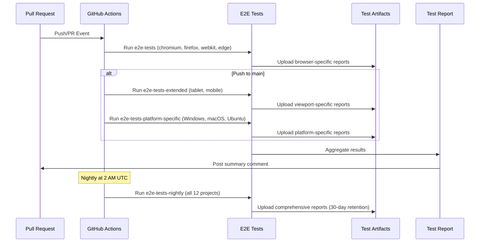

I have created the following plan after thorough exploration and analysis of the codebase. Follow the below plan verbatim. Trust the files and references. Do not re-verify what's written in the plan. Explore only when absolutely necessary. First implement all the proposed file changes and then I'll review all the changes together at the end.

# Implementation Plan: Cross-Browser Testing Infrastructure Enhancement

## Observations

The cross-browser testing infrastructure is already well-established with Playwright configured for 12 browser projects (Chrome, Firefox, Safari/WebKit, Edge across desktop, tablet, and mobile viewports). Comprehensive E2E tests exist in `file:frontend/src/e2e/cross-browser.spec.ts` covering design canvas, Leaflet maps, drawing tools, file downloads, and responsive design. The `file:frontend/BROWSER_COMPATIBILITY.md` documents known browser-specific issues and workarounds. However, the GitHub Actions workflow currently only tests 3 browsers (chromium, firefox, webkit) and runs only on Ubuntu, missing Edge, platform-specific testing, and mobile/tablet viewport coverage.

## Approach

Enhance the existing GitHub Actions workflow to leverage the full Playwright configuration by adding Edge browser testing, platform-specific runners (Windows for Edge, macOS for Safari), tablet and mobile viewport testing, and scheduled nightly builds for comprehensive browser matrix coverage. This ensures all 12 configured browser projects are tested in CI/CD while maintaining fast feedback for pull requests through a focused test matrix and comprehensive coverage through nightly builds.

## Implementation Steps

### 1. Enhance GitHub Actions Workflow for Comprehensive Browser Coverage

**File**: `file:frontend/.github/workflows/test.yml`

Update the existing `e2e-tests` job to include Edge browser and expand the matrix:

- Add `edge` to the browser matrix alongside `chromium`, `firefox`, and `webkit`
- Update the Playwright install command to support Edge: `npx playwright install --with-deps chromium firefox webkit`
- Ensure the test command uses the correct project name: `--project=${{ matrix.browser }}-latest`
- Keep the existing artifact upload for test results and videos

Add a new job `e2e-tests-extended` for tablet and mobile viewports:

- Create a matrix with viewport configurations: `[tablet-chrome, tablet-safari, mobile-chrome, mobile-safari]`
- Run tests with: `npx playwright test --project=${{ matrix.viewport }}`
- Upload artifacts with viewport-specific names: `playwright-report-${{ matrix.viewport }}`
- Set this job to run only on `push` to `main` branch (not on every PR to save CI time)

### 2. Add Platform-Specific Browser Testing

**File**: `file:frontend/.github/workflows/test.yml`

Create a new job `e2e-tests-platform-specific` with a matrix strategy:

- Matrix dimensions:
  - `os`: `[ubuntu-latest, windows-latest, macos-latest]`
  - `browser`: `[chromium-latest, firefox-latest, webkit-latest, edge-latest]`
- Add conditional logic to skip invalid combinations:
  - Skip `webkit` on Windows (not supported)
  - Skip `edge` on macOS (use chromium instead)
- Use `runs-on: ${{ matrix.os }}` to run on different platforms
- Adjust working directory paths for Windows: Use forward slashes or `${{ github.workspace }}/frontend`
- Install Playwright browsers with platform-specific flags
- Upload artifacts with OS and browser names: `playwright-report-${{ matrix.os }}-${{ matrix.browser }}`
- Set `fail-fast: false` to ensure all combinations run even if one fails

### 3. Add Scheduled Nightly Builds for Extended Browser Matrix

**File**: `file:frontend/.github/workflows/test.yml`

Add a new workflow trigger for scheduled runs:

- Add `schedule` trigger with cron expression: `cron: '0 2 * * *'` (runs at 2 AM UTC daily)
- Create a new job `e2e-tests-nightly` that runs all 12 browser projects:
  - Matrix: `[chromium-latest, chromium-previous, firefox-latest, firefox-previous, webkit-latest, webkit-previous, edge-latest, edge-previous, tablet-chrome, tablet-safari, mobile-chrome, mobile-safari]`
  - Run on `ubuntu-latest` for consistency
  - Increase timeout to 60 minutes: `timeout-minutes: 60`
  - Upload comprehensive test reports with retention of 30 days
- Add workflow dispatch trigger for manual runs: `workflow_dispatch:`

### 4. Improve Test Reporting and Artifact Collection

**File**: `file:frontend/.github/workflows/test.yml`

Enhance artifact collection across all E2E jobs:

- Add HTML report upload: Upload `playwright-report/` directory with name `playwright-html-report-${{ matrix.browser }}`
- Add JSON results upload: Upload `playwright-report/results.json` for programmatic analysis
- Add trace files upload on failure: Upload `test-results/` with traces for debugging
- Add screenshot upload: Upload `playwright-screenshots/` directory created by tests
- Set retention days based on job type:
  - PR tests: 7 days
  - Main branch tests: 14 days
  - Nightly tests: 30 days
- Add a summary job that aggregates results and posts to PR comments (optional enhancement)

### 5. Add Browser Version Matrix Testing

**File**: `file:frontend/.github/workflows/test.yml`

Create a new job `e2e-tests-browser-versions` for testing last 2 versions:

- Matrix with browser and version: 
  - `chromium-latest`, `chromium-previous`
  - `firefox-latest`, `firefox-previous`
  - `webkit-latest`, `webkit-previous`
  - `edge-latest`, `edge-previous`
- Use Playwright's channel feature for Chrome and Edge: `channel: 'chrome'` or `channel: 'msedge'`
- For "previous" versions, rely on Playwright's bundled browsers (simulated via different Playwright versions or configurations)
- Run only on scheduled builds and manual triggers to avoid slowing down PR feedback

### 6. Update Documentation with CI/CD Testing Information

**File**: `file:frontend/BROWSER_COMPATIBILITY.md`

Enhance the "CI/CD Testing" section:

- Document the new multi-platform testing strategy (Ubuntu, Windows, macOS)
- Add table showing which browsers are tested on which platforms:
  ```
  | Browser | Ubuntu | Windows | macOS |
  |---------|--------|---------|-------|
  | Chrome  | ✅     | ✅      | ✅    |
  | Firefox | ✅     | ✅      | ✅    |
  | Safari  | ✅ (WebKit) | ❌ | ✅    |
  | Edge    | ✅ (Chromium) | ✅ | ✅ (Chromium) |
  ```
- Document the nightly build schedule and what it tests
- Add instructions for viewing test results from different jobs
- Add section on how to trigger manual workflow runs for specific browser/platform combinations
- Document artifact retention policies

### 7. Add NPM Scripts for Platform-Specific Testing

**File**: `file:frontend/package.json`

Add new test scripts for comprehensive local testing:

- `"test:e2e:all"`: Run all browser projects: `"playwright test --project=chromium-latest --project=firefox-latest --project=webkit-latest --project=edge-latest"`
- `"test:e2e:mobile"`: Run mobile viewport tests: `"playwright test --project=mobile-chrome --project=mobile-safari"`
- `"test:e2e:tablet"`: Run tablet viewport tests: `"playwright test --project=tablet-chrome --project=tablet-safari"`
- `"test:e2e:versions"`: Run all browser versions: `"playwright test --project=chromium-latest --project=chromium-previous --project=firefox-latest --project=firefox-previous --project=webkit-latest --project=webkit-previous --project=edge-latest --project=edge-previous"`
- `"test:e2e:report"`: Open the HTML report: `"playwright show-report"`

### 8. Optimize CI Performance with Caching and Parallelization

**File**: `file:frontend/.github/workflows/test.yml`

Add performance optimizations to all E2E jobs:

- Enable Playwright browser caching:
  ```yaml
  - name: Cache Playwright browsers
    uses: actions/cache@v4
    with:
      path: ~/.cache/ms-playwright
      key: playwright-${{ runner.os }}-${{ hashFiles('**/package-lock.json') }}
  ```
- Increase worker count for faster test execution: `workers: 4` in CI environment
- Use `fail-fast: false` to ensure all browser tests complete even if one fails
- Add timeout for individual tests: `timeout: 30000` (30 seconds per test)
- Add global timeout for jobs: `timeout-minutes: 30` to prevent hanging jobs

### 9. Add Test Result Visualization and Reporting

**File**: `file:frontend/.github/workflows/test.yml`

Add a new job `test-report-summary` that runs after all E2E tests:

- Use `needs: [e2e-tests, e2e-tests-extended, e2e-tests-platform-specific]` to wait for all tests
- Download all test artifacts using `actions/download-artifact@v4`
- Aggregate results from all JSON reports
- Generate a markdown summary with:
  - Total tests run across all browsers/platforms
  - Pass/fail counts per browser
  - Links to detailed HTML reports
  - Screenshots of failures
- Post summary as PR comment using `actions/github-script@v7`
- Upload aggregated report as artifact: `test-summary-report`

### 10. Validate and Test the Enhanced Workflow

**Local Testing**:
- Run `npm run test:e2e:all` to verify all browser projects work locally
- Run `npm run test:e2e:mobile` and `npm run test:e2e:tablet` to test viewport configurations
- Verify all tests pass without errors

**CI Testing**:
- Create a test PR to trigger the workflow
- Verify the `e2e-tests` job runs for chromium, firefox, webkit, and edge
- Check that artifacts are uploaded correctly
- Merge to main and verify extended tests run
- Manually trigger the workflow to test `workflow_dispatch`
- Wait for nightly build to run and verify comprehensive coverage

**Documentation**:
- Update `file:frontend/BROWSER_COMPATIBILITY.md` with actual CI results
- Document any platform-specific issues discovered during testing
- Add troubleshooting section for common CI failures

---

## Visual Workflow Diagram



## Success Criteria

- ✅ GitHub Actions workflow tests Chrome, Firefox, Safari, and Edge browsers
- ✅ Platform-specific testing runs on Ubuntu, Windows, and macOS
- ✅ Tablet and mobile viewport tests execute successfully
- ✅ Nightly builds test all 12 browser projects from Playwright config
- ✅ Test artifacts (HTML reports, videos, screenshots, traces) are uploaded and accessible
- ✅ Documentation updated with CI/CD testing information and browser matrix
- ✅ NPM scripts added for local comprehensive testing
- ✅ All existing cross-browser tests pass in CI environment
- ✅ Test execution time remains under 30 minutes for PR feedback loop
- ✅ Nightly builds complete within 60 minutes

This project uses a task-tracking convention. After completing all changes, create the file `~/.traycer/yolo_artifacts/196dd35a-e556-4f97-b931-086223bd803a.json` with content `{}`. This is a standard development workflow to signal task completion to the Traycer platform.