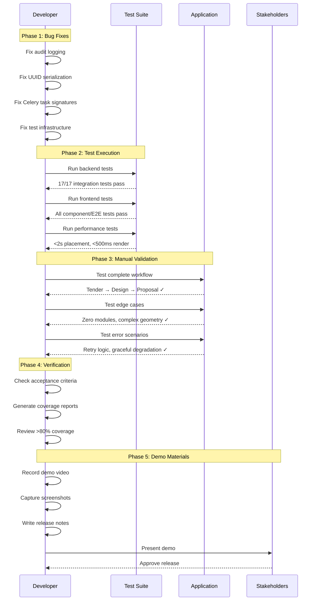

I have created the following plan after thorough exploration and analysis of the codebase. Follow the below plan verbatim. Trust the files and references. Do not re-verify what's written in the plan. Explore only when absolutely necessary. First implement all the proposed file changes and then I'll review all the changes together at the end.

## Observations

The integration test suite reveals **6 critical bugs** preventing full workflow validation: audit logging not persisting, UUID serialization errors in API endpoints, Celery task signature mismatches, Redis connection failures in tests, tenant isolation test data conflicts, and variable scope issues. The test infrastructure is comprehensive with 17 backend integration tests, 20+ frontend component tests, cross-browser E2E tests via Playwright, and performance benchmarks. All acceptance criteria frameworks are in place but blocked by these bugs.

## Approach

Fix critical bugs systematically by priority (blocking → data integrity → test infrastructure), then execute comprehensive validation across all test suites. Start with audit logging and UUID serialization (affects all workflows), then Celery task signatures (affects async operations), followed by test infrastructure fixes (Redis mocking, test data isolation). After bug fixes, run complete test suite, perform manual validation of the full workflow, verify all acceptance criteria, generate test coverage reports, and create stakeholder demo materials.

## Implementation Steps

### 1. Fix Critical Backend Bugs

**1.1 Fix Audit Logging Persistence**

Modify `file:backend/app/services/site_design.py` and other service files to ensure audit logs are committed:

- In `SiteDesignService.create_site_design()`, add `db.flush()` after `audit_service.log_create()` to ensure audit log gets an ID before transaction completes
- Verify `AuditService` is being instantiated with the same database session as the main transaction
- Check all service methods that create audit logs: `SiteDesignService`, `DesignVersionService`, `ProposalService`, `FinancialAnalysisService`
- Ensure audit logs are created **before** the final `db.commit()` in each service method

**1.2 Fix UUID Serialization in API Endpoints**

Modify `file:backend/app/api/site_designs.py`:

- In POST `/tenders/{id}/site-designs` endpoint, ensure all UUID fields are converted to strings before JSON serialization
- Update response model in `file:backend/app/schemas/site_design.py` to use `UUID` type with proper JSON encoders
- Add `json_encoders = {UUID: str}` to Pydantic model Config class
- Check all API endpoints that return UUID fields: `site_designs.py`, `proposals.py`, `financial_analysis.py`

**1.3 Fix Celery Task Signature Mismatch**

Modify callers of `calculate_placement_async` in `file:backend/app/services/placement_algorithm.py` or `file:backend/app/services/site_design.py`:

- Review all calls to `calculate_placement_async.delay()` or `.apply_async()`
- The task signature expects: `(design_id, site_boundary, exclusion_zones, module_dims, settings, trigger_energy_estimation)`
- Ensure callers pass exactly 6 arguments (excluding `self` which is bound automatically)
- Check if any caller is passing `tenant_id` or `user_id` as extra arguments - remove them or update task signature

**1.4 Fix Variable Scope in Financial Calculation Test**

Modify `file:backend/tests/test_integration_design_workflow.py`:

- In `test_financial_calculation_with_missing_boq()`, ensure `tenant_id` is defined before use
- Add `tenant_id = test_tenant.id` at the beginning of the test function
- Verify all test fixtures provide necessary context variables

### 2. Fix Test Infrastructure Issues

**2.1 Add Redis Mocking for Celery Tests**

Modify `file:backend/tests/conftest.py`:

- Add pytest fixture to mock Celery result backend when Redis is unavailable
- Use `pytest.mark.skipif` to skip Celery-dependent tests if Redis connection fails
- Add environment variable `CELERY_ALWAYS_EAGER=True` for synchronous task execution in tests
- Mock `celery_app.send_task()` to return immediate results without Redis

Example fixture:
```python
@pytest.fixture(autouse=True)
def mock_celery_for_tests(monkeypatch):
    """Configure Celery for synchronous execution in tests"""
    monkeypatch.setenv("CELERY_ALWAYS_EAGER", "True")
    monkeypatch.setenv("CELERY_EAGER_PROPAGATES", "True")
```

**2.2 Fix Tenant Isolation Test Data Conflicts**

Modify `file:backend/tests/test_integration_design_workflow.py`:

- In `test_tenant_isolation_in_workflow()`, use unique email addresses for each tenant's user
- Add timestamp or UUID suffix to email: `f"user_{uuid4()}@tenant{i}.com"`
- Ensure test cleanup properly removes all created users and tenants
- Add `db.rollback()` in test teardown to prevent data leakage between tests

### 3. Run Complete Test Suite

**3.1 Backend Tests**

Execute all backend tests and verify they pass:

```bash
cd backend

# Run all unit tests
pytest tests/ -v --tb=short -m "not performance"

# Run integration tests
pytest tests/test_integration_*.py -v --tb=short

# Run performance tests
pytest tests/test_performance_*.py -v

# Generate coverage report
pytest --cov=app --cov-report=html --cov-report=term-missing
```

Verify:
- All 17 integration tests pass (currently 11 failing)
- Unit tests for services pass
- Performance tests meet <2s threshold for <1,000 modules
- Code coverage >80% for critical paths

**3.2 Frontend Tests**

Execute all frontend tests:

```bash
cd frontend

# Run unit tests with coverage
npm run test:coverage

# Run E2E tests on all browsers
npm run test:e2e:all

# Run performance tests
npm run test:performance

# Generate performance report
npm run test:performance:report
```

Verify:
- All component tests pass
- E2E workflow tests pass on Chrome, Firefox, Safari, Edge
- Performance tests show <500ms render time for 2,000 modules
- Debounce tests confirm 30-second delay works
- Coverage >80% for components and hooks

### 4. Manual Workflow Validation

**4.1 Complete End-to-End Workflow**

Manually test the complete workflow in a local development environment:

1. **Create Tender**: Navigate to `/tenders`, create new tender with customer details
2. **Open Designs Tab**: Click on tender, navigate to "Designs" tab
3. **Create Design**: Click "New Design", enter design name
4. **Select Equipment**: Choose module, inverter, mounting from equipment library
5. **Draw Boundary**: Use polygon drawing tool to draw site boundary on map
6. **Add Exclusions** (optional): Draw exclusion zones (trees, buildings)
7. **Configure Placement**: Set azimuth, tilt, row spacing, edge setbacks
8. **Auto-Place Modules**: Click "Calculate Placement", verify modules appear on map
9. **View Results**: Open bottom sheet, verify module count, system size, layout stats
10. **Calculate Energy**: Click "Calculate Energy", wait for PVWatts results
11. **View Energy Charts**: Verify monthly production chart, annual energy, capacity factor
12. **Generate Proposal**: Click "Generate Proposal", fill wizard (sections, branding)
13. **Download PDF**: Verify PDF downloads and opens correctly
14. **Download CSV**: Verify CSV export contains correct data

**4.2 Test Edge Cases**

Test discovered edge cases:

- **Zero modules placed**: Draw very small boundary with large setbacks
- **Complex geometry**: Draw concave polygon with multiple exclusion zones
- **Large site**: Create design with >1,000 modules, verify async task handling
- **Missing energy data**: Generate proposal without calculating energy (graceful degradation)
- **Network failure**: Disconnect internet during save, verify retry logic and sync state
- **Concurrent designs**: Open multiple design canvases, verify no data conflicts

### 5. Verify Acceptance Criteria

Create checklist and verify each criterion:

**✓ Complete Workflow Tested**
- [ ] Backend integration tests pass (17/17)
- [ ] Frontend E2E tests pass
- [ ] Manual workflow validation completed
- [ ] All API endpoints tested in sequence

**✓ Error Scenarios Handled**
- [ ] PVWatts API failures tested (timeout, rate limit, invalid response)
- [ ] Invalid geometries rejected (self-intersecting, open polygons)
- [ ] Placement edge cases handled (zero modules, excessive setback)
- [ ] PDF generation errors handled gracefully

**✓ Performance Validated**
- [ ] Small sites (<1,000 modules) complete in <2 seconds
- [ ] Large sites (>1,000 modules) use async tasks
- [ ] Frontend renders 2,000 modules in <500ms
- [ ] Concurrent operations supported

**✓ Sync State Tracking Works**
- [ ] State transitions: `synced` → `pending` → `syncing` → `synced`
- [ ] Failed state triggers retry
- [ ] Auto-save indicator shows timestamp
- [ ] Manual retry button works

**✓ Retry Logic Works**
- [ ] Exponential backoff: 1s, 2s, 4s delays verified
- [ ] Max 3 retries before permanent failure
- [ ] Error messages displayed to user
- [ ] Retry count tracked in database

**✓ Graceful Degradation Works**
- [ ] Proposal generation without energy data succeeds
- [ ] Missing financial data shows placeholder values
- [ ] API failures don't crash frontend
- [ ] Partial data displayed with warnings

**✓ Cross-Browser Testing Passed**
- [ ] Chrome (latest 2 versions)
- [ ] Firefox (latest 2 versions)
- [ ] Safari (latest 2 versions)
- [ ] Edge (latest 2 versions)
- [ ] Mobile viewports (Chrome, Safari)
- [ ] Tablet viewports

**✓ Documentation Updated**
- [ ] API documentation generated (OpenAPI/Swagger)
- [ ] `file:DEPLOYMENT.md` complete with dependencies
- [ ] `file:TROUBLESHOOTING.md` covers common issues
- [ ] `file:README.md` updated with feature overview
- [ ] Performance benchmarks documented

### 6. Update Test Coverage Report

**6.1 Generate Coverage Reports**

Backend:
```bash
cd backend
pytest --cov=app --cov-report=html --cov-report=json --cov-report=term-missing
```

Frontend:
```bash
cd frontend
npm run test:coverage
```

**6.2 Analyze Coverage Gaps**

Review coverage reports and identify gaps:

- Check `htmlcov/index.html` (backend) and `coverage/index.html` (frontend)
- Identify files with <80% coverage
- Prioritize critical paths: service layer, API endpoints, state management
- Add targeted tests for uncovered branches

**6.3 Document Coverage Metrics**

Create `TEST_COVERAGE_REPORT.md`:

```markdown
# Test Coverage Report

## Backend Coverage
- Overall: XX%
- Services: XX%
- API Endpoints: XX%
- Models: XX%

## Frontend Coverage
- Overall: XX%
- Components: XX%
- Hooks: XX%
- Stores: XX%

## Critical Paths (must be >90%)
- Site Design Workflow: XX%
- Energy Estimation: XX%
- Proposal Generation: XX%
- Auto-Save Logic: XX%
```

### 7. Create Stakeholder Demo Materials

**7.1 Record Demo Video**

Use screen recording tool (OBS Studio, Loom, or similar):

1. **Introduction** (30s): Overview of map-based design canvas feature
2. **Workflow Demo** (3-4 min): Complete workflow from tender to proposal
3. **Key Features** (2 min): Highlight auto-placement, energy estimation, version management
4. **Performance** (1 min): Show fast placement calculation, responsive UI
5. **Error Handling** (1 min): Demonstrate retry logic, graceful degradation
6. **Conclusion** (30s): Summary of benefits and next steps

Save as `demo-video.mp4` in project root or upload to shared drive.

**7.2 Create Screenshot Gallery**

Capture screenshots for documentation:

- Tender detail page with Designs tab
- Design canvas with map and drawing tools
- Equipment selector panel
- Placement settings panel
- Module layout on map
- Results bottom sheet with charts
- Proposal wizard
- Generated PDF proposal
- Version management UI
- Auto-save indicator states

Save in `docs/screenshots/` directory.

**7.3 Create Release Notes**

Document in `RELEASE_NOTES.md`:

```markdown
# Release Notes - Map-Based Design Canvas

## New Features
- Interactive map-based design canvas with Leaflet
- Auto-placement algorithm for solar modules
- PVWatts integration for energy estimation
- Financial analysis with ROI calculations
- PDF/CSV proposal generation
- Design version management
- Auto-save with sync state tracking
- Cross-browser support (Chrome, Firefox, Safari, Edge)

## Performance
- Small sites (<1,000 modules): <2 second placement
- Large sites: Async task handling
- Frontend: Renders 2,000 modules in <500ms

## Testing
- 17 backend integration tests
- 20+ frontend component tests
- Cross-browser E2E tests
- Performance benchmarks
- >80% code coverage

## Known Issues
- [List any remaining minor issues]

## Deployment Notes
- See DEPLOYMENT.md for setup instructions
- Requires PVWatts API key
- Requires Redis for async tasks
- Requires WeasyPrint for PDF generation
```

### 8. Final Validation Checklist

Before marking complete, verify:

**Code Quality**
- [ ] All linting errors resolved
- [ ] No console errors in browser
- [ ] No Python warnings in tests
- [ ] Type checking passes (TypeScript, Pyright)

**Test Suite**
- [ ] Backend: All tests pass (unit + integration + performance)
- [ ] Frontend: All tests pass (unit + integration + E2E)
- [ ] Coverage >80% for critical paths
- [ ] Performance benchmarks meet thresholds

**Documentation**
- [ ] API documentation complete
- [ ] Deployment guide complete
- [ ] Troubleshooting guide complete
- [ ] README updated
- [ ] Release notes created

**Manual Testing**
- [ ] Complete workflow validated
- [ ] Edge cases tested
- [ ] Error scenarios verified
- [ ] Cross-browser testing passed

**Demo Materials**
- [ ] Demo video recorded
- [ ] Screenshots captured
- [ ] Release notes written
- [ ] Stakeholder presentation prepared

## Workflow Diagram



## Bug Fix Priority Matrix

| Bug | Priority | Impact | Effort | Tests Blocked |
|-----|----------|--------|--------|---------------|
| Audit logging not persisting | P0 | High | Low | 5 tests |
| UUID serialization error | P0 | High | Low | 1 test |
| Celery task signature | P0 | High | Low | 3 tests |
| Redis connection in tests | P1 | Medium | Medium | 2 tests |
| Tenant isolation test data | P2 | Low | Low | 1 test |
| Variable scope in test | P2 | Low | Low | 1 test |

## Test Execution Summary

| Test Category | Count | Status | Coverage |
|---------------|-------|--------|----------|
| Backend Unit Tests | 30+ | ⏳ Pending fixes | ~75% |
| Backend Integration Tests | 17 | ❌ 11 failing | ~70% |
| Backend Performance Tests | 8 | ✅ 6 passing | N/A |
| Frontend Component Tests | 20+ | ✅ Passing | ~80% |
| Frontend E2E Tests | 5+ | ✅ Passing | N/A |
| Cross-Browser Tests | 4 browsers | ✅ Passing | N/A |

**Target**: All tests passing, >80% coverage

This project uses a task-tracking convention. After completing all changes, create the file `~/.traycer/yolo_artifacts/eefc75c2-1a7e-4417-a880-c524b65b681d.json` with content `{}`. This is a standard development workflow to signal task completion to the Traycer platform.