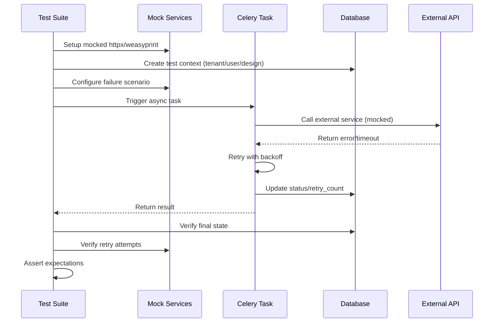

I have created the following plan after thorough exploration and analysis of the codebase. Follow the below plan verbatim. Trust the files and references. Do not re-verify what's written in the plan. Explore only when absolutely necessary. First implement all the proposed file changes and then I'll review all the changes together at the end.

## Observations

The existing `test_integration_error_scenarios.py` file provides a solid foundation with PVWatts API failure tests, invalid geometry handling, placement edge cases, PDF generation errors, and basic concurrency tests. The codebase uses Celery for async tasks with retry logic configured via `autoretry_for`, `retry_backoff`, and `retry_kwargs`. The `EnergyEstimate` model tracks `retry_count` and `last_retry_at` fields. The `SiteDesign` model tracks `placement_task_status` and `placement_task_error` for async placement operations. The `ProposalService` uses WeasyPrint and matplotlib with graceful error handling.

## Approach

Enhance the existing test file by adding comprehensive error scenarios across five key areas: (1) additional PVWatts failure modes including 503 errors, malformed JSON, and partial data responses; (2) placement timeout scenarios with task cancellation and execution time limits; (3) expanded PDF generation failures covering CSS missing and specific WeasyPrint errors; (4) retry logic verification with exponential backoff timing and retry count tracking; (5) concurrent design update scenarios testing optimistic locking and race conditions. All tests will follow the existing patterns using the `error_test_context` fixture, mocked database sessions, and the `_run_task_with_mock_db` helper method.

## Implementation Steps

### 1. Add Additional PVWatts Failure Mode Tests

Expand the `TestPVWattsAPIFailures` class in `file:backend/tests/test_integration_error_scenarios.py`:

**Test: 503 Service Unavailable**
- Create test method `test_service_unavailable_503`
- Mock httpx response with status_code=503
- Configure `raise_for_status` to raise `httpx.HTTPStatusError`
- Call `_run_task_with_mock_db` with `expected_exception=httpx.HTTPStatusError`
- Verify estimate status is "failed" and error_message contains "Service Unavailable"
- Verify retry_count is incremented and last_retry_at is set

**Test: Malformed JSON Response**
- Create test method `test_malformed_json_response`
- Mock httpx response with status_code=200
- Configure `response.json()` to raise `json.JSONDecodeError`
- Call `_run_task_with_mock_db` with `expected_exception=json.JSONDecodeError`
- Verify estimate status is "failed" on final retry
- Verify error_message contains JSON parsing error details

**Test: Partial Data Response**
- Create test method `test_partial_data_response`
- Mock httpx response with status_code=200
- Return JSON with `outputs` present but missing `ac_annual` field
- Call `_run_task_with_mock_db` without expected_exception
- Verify estimate status is "completed" (graceful degradation)
- Verify annual_energy_kwh defaults to 0
- Verify monthly_energy_kwh is empty list or defaults

**Test: Empty Outputs Object**
- Create test method `test_empty_outputs_object`
- Mock response with `{"outputs": {}, "inputs": {}}`
- Verify graceful handling with zero values
- Verify status is "completed" not "failed"

### 2. Add Placement Timeout Scenarios

Create new test class `TestPlacementTimeoutScenarios` in `file:backend/tests/test_integration_error_scenarios.py`:

**Test: Placement Execution Timeout**
- Create test method `test_placement_execution_timeout`
- Mock `PlacementAlgorithmService.calculate_placement` to sleep for 35 seconds
- Configure Celery task with `time_limit=30` in test environment
- Trigger async placement via `calculate_placement_async.delay()`
- Expect `celery.exceptions.TimeLimitExceeded` or similar timeout exception
- Verify design.placement_task_status is "failed"
- Verify design.placement_task_error contains timeout message

**Test: Task Cancellation/Revocation**
- Create test method `test_placement_task_cancellation`
- Start async placement task and capture task_id
- Immediately revoke task using `celery_app.control.revoke(task_id, terminate=True)`
- Verify design.placement_task_status transitions to "failed" or "cancelled"
- Verify placement results are not persisted

**Test: Large Site Async Execution**
- Create test method `test_large_site_async_execution`
- Create boundary polygon that would generate >1000 modules
- Trigger async placement with `calculate_placement_async.delay()`
- Mock placement to take 5-10 seconds (simulate large calculation)
- Verify task completes successfully
- Verify design.placement_task_status is "completed"
- Verify total_modules > 1000

**Test: Placement Retry on Transient Failure**
- Create test method `test_placement_retry_on_transient_failure`
- Mock `PlacementAlgorithmService.calculate_placement` to fail first 2 times, succeed on 3rd
- Verify Celery retry mechanism triggers (max_retries=3)
- Verify final status is "completed" after retries
- Verify placement results are persisted correctly

### 3. Expand PDF Generation Failure Tests

Enhance the `TestProposalGenerationErrors` class in `file:backend/tests/test_integration_error_scenarios.py`:

**Test: CSS File Missing**
- Create test method `test_css_file_missing`
- Mock `os.path.join` to return non-existent CSS path
- Trigger `service.generate_pdf()`
- Expect `FileNotFoundError` or graceful degradation
- Verify PDF generation continues without CSS or raises appropriate error

**Test: WeasyPrint Specific Errors**
- Create test method `test_weasyprint_font_error`
- Mock `HTML.write_pdf()` to raise font-related exception
- Verify exception is caught and logged
- Verify appropriate error message is returned

**Test: Storage Backend Failure**
- Create test method `test_storage_backend_failure`
- Mock `storage.save()` to raise exception
- Trigger `service.generate_pdf()`
- Verify exception propagates or is handled gracefully
- Verify audit log is not created if storage fails

**Test: Template Rendering Error**
- Create test method `test_template_rendering_error`
- Mock Jinja2 template to raise `jinja2.TemplateError` during render
- Verify exception is caught and appropriate error returned
- Verify partial rendering doesn't corrupt storage

**Test: Chart Generation with Invalid Data**
- Create test method `test_chart_generation_invalid_data`
- Create energy estimate with invalid monthly_energy_kwh format (string instead of list)
- Trigger `service.generate_pdf()`
- Verify chart generation fails gracefully (returns None)
- Verify PDF generation continues without chart

### 4. Verify Retry Logic with Exponential Backoff

Create new test class `TestRetryLogicAndBackoff` in `file:backend/tests/test_integration_error_scenarios.py`:

**Test: Exponential Backoff Timing**
- Create test method `test_exponential_backoff_timing`
- Mock httpx to fail with connection error
- Capture timestamps of each retry attempt
- Verify retry intervals follow exponential pattern: 1s, 2s, 4s (based on `retry_backoff=1, retry_backoff_max=4`)
- Use `time.time()` to measure actual delays between retries
- Verify max_retries=3 is respected

**Test: Retry Count Incrementation**
- Create test method `test_retry_count_incrementation`
- Mock httpx to fail consistently
- After each retry, verify `estimate.retry_count` increments
- Verify final retry_count equals max_retries (3)
- Verify `estimate.last_retry_at` is updated on each retry

**Test: Successful Retry After Transient Failure**
- Create test method `test_successful_retry_after_transient_failure`
- Mock httpx to fail first 2 times, succeed on 3rd attempt
- Verify retry_count reaches 3
- Verify final status is "completed"
- Verify annual_energy_kwh is populated correctly

**Test: Retry Backoff Configuration**
- Create test method `test_retry_backoff_configuration`
- Verify Celery task decorator has correct retry configuration
- Use `calculate_energy_task.retry_backoff` attribute to verify settings
- Verify `autoretry_for=(Exception,)` is configured
- Verify `retry_kwargs={'max_retries': 3}` is set

**Test: No Retry on Validation Errors**
- Create test method `test_no_retry_on_validation_errors`
- Mock scenario where estimate record is not found (validation error)
- Verify task returns error immediately without retries
- Verify retry_count remains 0

### 5. Test Concurrent Design Updates and Optimistic Locking

Enhance the `TestDataPersistenceAndRollback` class or create new `TestConcurrentDesignUpdates` in `file:backend/tests/test_integration_error_scenarios.py`:

**Test: Concurrent Equipment Updates**
- Create test method `test_concurrent_equipment_updates`
- Create two separate database sessions
- Load same design in both sessions
- Update `equipment_module_id` in session 1, commit
- Update `equipment_module_id` in session 2, commit
- Verify last-write-wins behavior (session 2 overwrites session 1)
- Verify no data corruption occurs

**Test: Concurrent Placement Calculations**
- Create test method `test_concurrent_placement_calculations`
- Trigger two async placement tasks for same design simultaneously
- Verify both tasks complete without deadlock
- Verify final placement_task_status reflects last completed task
- Verify module_placements are consistent (not corrupted)

**Test: Concurrent Version Creation**
- Create test method `test_concurrent_version_creation`
- Create two versions of same design simultaneously from different sessions
- Verify both versions are created successfully
- Verify snapshot_data is correct for each version
- Verify no version data is lost or corrupted

**Test: Optimistic Locking Detection**
- Create test method `test_optimistic_locking_detection`
- If using version column: verify `StaleDataError` is raised on concurrent updates
- If not using version column: verify last-write-wins behavior is documented
- Add comment explaining current concurrency model (last-write-wins vs optimistic locking)

**Test: Concurrent Proposal Generation**
- Create test method `test_concurrent_proposal_generation`
- Trigger two proposal generation tasks for same design
- Verify both complete successfully
- Verify storage contains both PDFs with unique filenames
- Verify audit logs record both generation events

**Test: Race Condition in Energy Estimation**
- Create test method `test_race_condition_energy_estimation`
- Trigger two energy estimation requests simultaneously for same design
- Verify parameter_hash prevents duplicate calculations
- Verify only one task executes (idempotency check)
- Verify estimate status is "calculating" during execution

### 6. Add Invalid Polygon Edge Cases

Enhance the `TestInvalidGeometryHandling` class in `file:backend/tests/test_integration_error_scenarios.py`:

**Test: MultiPolygon Instead of Polygon**
- Create test method `test_multipolygon_geometry`
- Pass GeoJSON with `"type": "MultiPolygon"`
- Verify validation rejects or converts to single polygon
- Verify appropriate error message

**Test: Polygon with Holes**
- Create test method `test_polygon_with_holes`
- Create polygon with inner ring (hole)
- Verify placement algorithm handles holes correctly
- Verify modules are not placed in hole areas

**Test: Extremely Small Polygon**
- Create test method `test_extremely_small_polygon`
- Create polygon smaller than single module footprint
- Verify placement returns 0 modules
- Verify appropriate error message about insufficient area

**Test: Degenerate Polygon (Line)**
- Create test method `test_degenerate_polygon_line`
- Create polygon where all points are collinear
- Verify validation rejects with appropriate error
- Verify error message mentions zero area

### 7. Update Test Documentation

Update `file:backend/tests/README_ERROR_SCENARIOS.md`:

- Document all new test scenarios added
- Explain retry logic and exponential backoff configuration
- Document concurrency model (last-write-wins vs optimistic locking)
- Add section on timeout handling for placement tasks
- Include examples of running specific test classes
- Document mocking patterns for external services

### 8. Add Test Markers and Organization

Update test file organization:

- Add `@pytest.mark.slow` to timeout tests (>5s execution)
- Add `@pytest.mark.concurrency` to concurrent update tests
- Add `@pytest.mark.retry` to retry logic tests
- Update `pytest.ini` to register new markers
- Group related tests into logical classes

## Verification Steps

1. Run all error scenario tests: `pytest backend/tests/test_integration_error_scenarios.py -v`
2. Run specific test classes: `pytest backend/tests/test_integration_error_scenarios.py::TestPVWattsAPIFailures -v`
3. Verify retry logic tests: `pytest backend/tests/test_integration_error_scenarios.py::TestRetryLogicAndBackoff -v`
4. Verify concurrency tests: `pytest backend/tests/test_integration_error_scenarios.py -m concurrency -v`
5. Check test coverage: `pytest backend/tests/test_integration_error_scenarios.py --cov=app.services --cov-report=html`
6. Verify all tests pass in CI/CD pipeline
7. Review test execution time and optimize slow tests if needed

## Test Execution Flow

## Key Files Modified

- `file:backend/tests/test_integration_error_scenarios.py` - Add 20+ new test methods across 5 test classes
- `file:backend/tests/README_ERROR_SCENARIOS.md` - Update documentation with new scenarios
- `file:backend/pytest.ini` - Add new test markers (slow, concurrency, retry)

This project uses a task-tracking convention. After completing all changes, create the file `~/.traycer/yolo_artifacts/a59fed1e-41ea-4c1c-ad59-933ff48f62fa.json` with content `{}`. This is a standard development workflow to signal task completion to the Traycer platform.