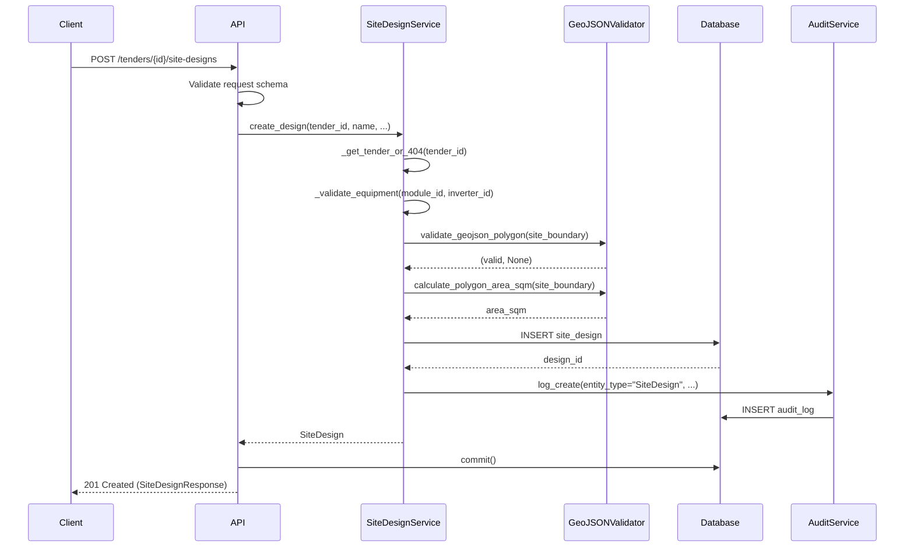

I have created the following plan after thorough exploration and analysis of the codebase. Follow the below plan verbatim. Trust the files and references. Do not re-verify what's written in the plan. Explore only when absolutely necessary. First implement all the proposed file changes and then I'll review all the changes together at the end.

## Observations

The codebase already has the database models for `SiteDesign`, `EquipmentModule`, `EquipmentInverter`, `DesignVersion`, `EnergyEstimate`, and `FinancialAnalysis` defined in `file:backend/app/models/models.py`. The migration file `file:backend/alembic/versions/01b88ee7b6fa_add_equipment_library_and_site_designs.py` exists to create these tables. However, there are no service layer implementations or API endpoints for site designs yet. The existing service pattern follows a consistent structure with tenant isolation, audit logging, and dependency injection. The project uses FastAPI with Pydantic for validation, SQLAlchemy for ORM, and does not currently have GeoJSON validation libraries like Shapely installed.

## Approach

The implementation will follow the established patterns in the codebase by creating a `SiteDesignService` that mirrors the structure of `file:backend/app/services/tender.py` and `file:backend/app/services/pv_design.py`. The service will handle CRUD operations, GeoJSON validation using Shapely (to be added to dependencies), geometric calculations for site area, tenant isolation, and audit logging. API endpoints will be created following the pattern in `file:backend/app/api/tenders.py`, with Pydantic schemas for request/response validation. The implementation will focus solely on the service layer and API endpoints as specified in the ticket, deferring auto-placement algorithms, energy estimation, and versioning to separate tickets.

## Implementation Steps

### 1. Update Dependencies

**File: `file:backend/requirements.txt`**

Add the following libraries for GeoJSON validation and geometric calculations:
- `shapely>=2.0.0` - For geometric operations and area calculations
- `geojson>=3.0.0` - For GeoJSON validation and parsing

### 2. Create Pydantic Schemas for SiteDesign

**File: `file:backend/app/schemas/site_design.py` (new file)**

Create request/response schemas following the pattern in `file:backend/app/schemas/equipment.py`:

- `SiteTypeEnum` - Enum for site types (rooftop, ground_mount, carport)
- `ModuleOrientationEnum` - Enum for module orientation (portrait, landscape)
- `GeoJSONPolygon` - Schema for GeoJSON polygon validation
- `PlacementSettings` - Schema for placement configuration (edge_setback_m, row_spacing_m, module_orientation, azimuth_deg, tilt_deg)
- `SiteDesignCreate` - Request schema for creating a design (tender_id, name, site_type, equipment_module_id, equipment_inverter_id, site_boundary, placement_settings)
- `SiteDesignUpdate` - Request schema for updating geometry and settings (site_boundary, exclusion_zones, placement_settings)
- `SiteDesignResponse` - Response schema with all fields including calculated results (id, name, site_type, equipment_module_id, equipment_inverter_id, site_boundary, exclusion_zones, module_placements, placement_settings, total_modules, system_size_kwp, site_area_sqm, created_at, updated_at)

**File: `file:backend/app/schemas/__init__.py`**

Import and export the new schemas to make them available throughout the application.

### 3. Create GeoJSON Validation Utility

**File: `file:backend/app/utils/geojson_validator.py` (new file)**

Create a utility module for GeoJSON validation using Shapely:

- `validate_geojson_polygon(geojson_data: dict) -> tuple[bool, Optional[str]]` - Validates GeoJSON polygon structure and geometry
  - Check if type is "Polygon"
  - Verify coordinates array structure
  - Ensure polygon is closed (first and last coordinates match)
  - Verify minimum 3 unique vertices (4 coordinates including closing point)
  - Check for valid coordinate ranges (longitude: -180 to 180, latitude: -90 to 90)
  - Use Shapely to check for self-intersections
  - Return (True, None) if valid, (False, error_message) if invalid

- `calculate_polygon_area_sqm(geojson_polygon: dict) -> float` - Calculates area in square meters
  - Convert GeoJSON to Shapely Polygon
  - Use geodesic area calculation (accounting for Earth's curvature)
  - Return area in square meters

### 4. Create SiteDesignService

**File: `file:backend/app/services/site_design.py` (new file)**

Implement the service following the pattern in `file:backend/app/services/tender.py` and `file:backend/app/services/pv_design.py`:

**Class: `SiteDesignService`**

Constructor:
- `__init__(self, db: Session, tenant_id: UUID, user_id: UUID)` - Initialize with database session, tenant context, and user context
- Create `AuditService` instance for logging

**Methods:**

- `list_designs(self, tender_id: UUID) -> List[SiteDesign]`
  - Verify tender access using `_get_tender_or_404(tender_id)`
  - Query all site designs for the tender
  - Return list of designs

- `get_design(self, design_id: UUID) -> Optional[SiteDesign]`
  - Query design by ID
  - Verify tenant access through tender relationship
  - Return design or None

- `get_design_or_404(self, design_id: UUID) -> SiteDesign`
  - Call `get_design(design_id)`
  - Raise HTTP 404 if not found
  - Return design

- `create_design(self, tender_id: UUID, name: str, site_type: str, equipment_module_id: UUID, equipment_inverter_id: UUID, site_boundary: dict, placement_settings: dict) -> SiteDesign`
  - Verify tender access using `_get_tender_or_404(tender_id)`
  - Validate equipment references exist using `_validate_equipment(equipment_module_id, equipment_inverter_id)`
  - Validate site_boundary GeoJSON using `validate_geojson_polygon` from utility
  - Calculate site area using `calculate_polygon_area_sqm` from utility
  - Determine tilt_deg based on site_type (ground_mount: 20°, rooftop: 10°, carport: 0°)
  - Create SiteDesign instance with all fields
  - Add to database and flush
  - Log creation using `audit.log_create()`
  - Return created design

- `update_geometry(self, design: SiteDesign, site_boundary: Optional[dict] = None, exclusion_zones: Optional[List[dict]] = None) -> SiteDesign`
  - Track old and new values for audit
  - If site_boundary provided, validate using `validate_geojson_polygon`
  - If site_boundary changed, recalculate site_area_sqm
  - If exclusion_zones provided, validate each polygon
  - Update design fields
  - Log update using `audit.log_update()`
  - Return updated design

- `update_settings(self, design: SiteDesign, edge_setback_m: Optional[float] = None, row_spacing_m: Optional[float] = None, module_orientation: Optional[str] = None, azimuth_deg: Optional[float] = None) -> SiteDesign`
  - Track old and new values for audit
  - Update placement settings if provided
  - Log update using `audit.log_update()`
  - Return updated design

- `update_equipment(self, design: SiteDesign, equipment_module_id: Optional[UUID] = None, equipment_inverter_id: Optional[UUID] = None) -> SiteDesign`
  - Validate new equipment references if provided
  - Track old and new values for audit
  - Update equipment IDs
  - Log update using `audit.log_update()`
  - Return updated design

- `delete_design(self, design: SiteDesign) -> None`
  - Log deletion using `audit.log_delete()`
  - Delete design from database

**Private Helper Methods:**

- `_get_tender_or_404(self, tender_id: UUID) -> Tender`
  - Query tender with tenant_id filter
  - Raise HTTP 404 if not found
  - Return tender

- `_validate_equipment(self, module_id: UUID, inverter_id: UUID) -> None`
  - Query EquipmentModule with tenant isolation (is_global=True OR tenant_id=current_tenant)
  - Query EquipmentInverter with tenant isolation (is_global=True OR tenant_id=current_tenant)
  - Raise HTTP 400 if either not found or not accessible
  - Ensure equipment is active (is_active=True)

**Factory Function:**

- `get_site_design_service(db: Session, tenant_id: UUID, user_id: UUID) -> SiteDesignService`
  - Return new SiteDesignService instance

### 5. Create API Endpoints

**File: `file:backend/app/api/site_designs.py` (new file)**

Create FastAPI router following the pattern in `file:backend/app/api/tenders.py`:

**Router Setup:**
- Create APIRouter instance
- Define dependency `get_site_design_service` that injects database session and current user context

**Endpoints:**

- `GET /tenders/{tender_id}/site-designs` - List all designs for a tender
  - Response: `List[SiteDesignResponse]`
  - Call `site_design_service.list_designs(tender_id)`
  - Return list of designs

- `POST /tenders/{tender_id}/site-designs` - Create new design
  - Request: `SiteDesignCreate`
  - Response: `SiteDesignResponse` (201 Created)
  - Requires: Admin or PM role (use `require_role` dependency)
  - Call `site_design_service.create_design()`
  - Commit transaction
  - Return created design

- `GET /site-designs/{design_id}` - Get design by ID
  - Response: `SiteDesignResponse`
  - Call `site_design_service.get_design_or_404(design_id)`
  - Return design

- `PUT /site-designs/{design_id}` - Update design geometry and settings
  - Request: `SiteDesignUpdate`
  - Response: `SiteDesignResponse`
  - Requires: Admin or PM role
  - Get design using `get_design_or_404(design_id)`
  - If site_boundary or exclusion_zones in request, call `update_geometry()`
  - If placement settings in request, call `update_settings()`
  - If equipment IDs in request, call `update_equipment()`
  - Commit transaction
  - Return updated design

- `DELETE /site-designs/{design_id}` - Delete design
  - Response: 204 No Content
  - Requires: Admin role
  - Get design using `get_design_or_404(design_id)`
  - Call `site_design_service.delete_design(design)`
  - Commit transaction

### 6. Register Router in Main Application

**File: `file:backend/app/main.py`**

- Import the new router: `from app.api import site_designs`
- Register router: `app.include_router(site_designs.router, prefix="/api", tags=["Site Designs"])`

### 7. Update Tenant Isolation

**File: `file:backend/app/core/tenant.py`**

Add `SiteDesign` to the `TENANT_SCOPED_MODELS` set to ensure automatic tenant filtering is applied. Note that SiteDesign doesn't have a direct tenant_id column, so tenant isolation is enforced through the tender relationship in the service layer.

### 8. Create Unit Tests

**File: `file:backend/tests/test_site_design_service.py` (new file)**

Create comprehensive unit tests following the pattern in `file:backend/tests/test_equipment.py`:

**Test Cases for SiteDesignService:**

- `test_create_design_success` - Verify design creation with valid data
- `test_create_design_invalid_geojson` - Verify validation rejects invalid GeoJSON (not closed, <3 vertices, self-intersecting)
- `test_create_design_invalid_equipment` - Verify validation rejects non-existent equipment IDs
- `test_create_design_tenant_isolation` - Verify equipment from other tenants is not accessible
- `test_list_designs` - Verify listing designs for a tender
- `test_get_design_or_404` - Verify getting design by ID and 404 handling
- `test_update_geometry` - Verify geometry updates and area recalculation
- `test_update_settings` - Verify placement settings updates
- `test_update_equipment` - Verify equipment updates with validation
- `test_delete_design` - Verify design deletion
- `test_audit_logging` - Verify all mutations are logged

**File: `file:backend/tests/test_site_design_api.py` (new file)**

Create API endpoint tests:

- `test_list_designs_endpoint` - Test GET /tenders/{id}/site-designs
- `test_create_design_endpoint` - Test POST /tenders/{id}/site-designs
- `test_get_design_endpoint` - Test GET /site-designs/{id}
- `test_update_design_endpoint` - Test PUT /site-designs/{id}
- `test_delete_design_endpoint` - Test DELETE /site-designs/{id}
- `test_authorization` - Verify role-based access control
- `test_tenant_isolation_api` - Verify designs from other tenants are not accessible

### 9. Documentation

**File: `file:backend/app/api/site_designs.py`**

Add comprehensive docstrings to all endpoints with:
- Description of functionality
- Request/response schema details
- Required permissions
- Example usage
- Error responses

## Data Flow Diagram



## Key Implementation Details

### GeoJSON Validation Rules

| Validation | Check | Error Message |
|------------|-------|---------------|
| Type | Must be "Polygon" | "GeoJSON type must be 'Polygon'" |
| Coordinates | Must be array of arrays | "Invalid coordinates structure" |
| Closed Polygon | First and last coordinates must match | "Polygon must be closed" |
| Minimum Vertices | At least 3 unique vertices (4 coordinates) | "Polygon must have at least 3 vertices" |
| Coordinate Range | Longitude: -180 to 180, Latitude: -90 to 90 | "Invalid coordinate values" |
| Self-Intersection | No self-intersecting edges | "Polygon must not self-intersect" |

### Tenant Isolation Strategy

Equipment validation ensures tenant isolation by filtering:
```
WHERE (is_global = TRUE OR tenant_id = current_tenant_id) AND is_active = TRUE
```

This allows designs to use:
- Global equipment (is_global=True, tenant_id=NULL)
- Tenant-specific equipment (is_global=False, tenant_id=current_tenant)

### Audit Logging Events

| Action | Entity Type | Old Value | New Value |
|--------|-------------|-----------|-----------|
| Create | SiteDesign | None | {name, site_type, equipment_ids} |
| Update Geometry | SiteDesign | {site_boundary, exclusion_zones} | {site_boundary, exclusion_zones} |
| Update Settings | SiteDesign | {placement_settings} | {placement_settings} |
| Update Equipment | SiteDesign | {equipment_module_id, equipment_inverter_id} | {equipment_module_id, equipment_inverter_id} |
| Delete | SiteDesign | {name, site_type} | None |

### Tilt Angle Defaults

| Site Type | Default Tilt |
|-----------|--------------|
| ground_mount | 20° |
| rooftop | 10° |
| carport | 0° |