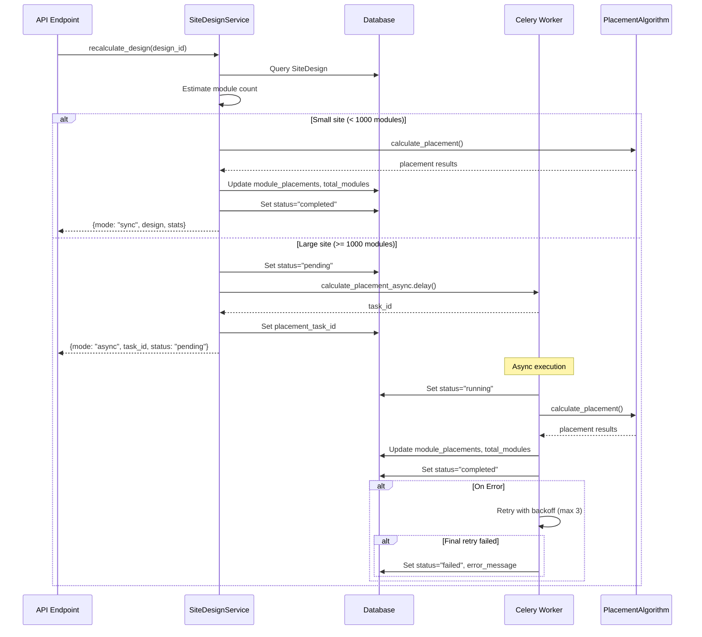

I have created the following plan after thorough exploration and analysis of the codebase. Follow the below plan verbatim. Trust the files and references. Do not re-verify what's written in the plan. Explore only when absolutely necessary. First implement all the proposed file changes and then I'll review all the changes together at the end.

## Observations

The codebase currently has a hybrid sync/async placement calculation system where async tasks return results to Celery's backend but don't persist to the database. The `EnergyEstimate` model demonstrates the established pattern for async task status tracking with `status` and `error_message` fields. The `calculate_energy_task` in file:backend/app/services/tasks.py shows the proper pattern for retry logic, error handling, and database persistence. The `SiteDesign` model lacks task tracking fields, causing async placement results to be lost after Celery's result expiration.

## Approach

Following the established `EnergyEstimate` pattern, add task status tracking fields directly to the `SiteDesign` model rather than creating a separate table. This maintains consistency with the existing codebase architecture. Enhance `calculate_placement_async` to mirror the robust error handling and retry logic from `calculate_energy_task`, including database session management, result persistence, and comprehensive logging. Update the service layer to initialize task status when triggering async execution and provide a mechanism for result retrieval.

## Implementation Steps

### 1. Database Schema Migration

Create a new Alembic migration to add task tracking fields to the `site_designs` table:

- Add `placement_task_id` (String, nullable) - stores Celery task ID
- Add `placement_task_status` (String, nullable) - values: "pending", "running", "completed", "failed"
- Add `placement_task_error` (Text, nullable) - stores error messages for failed tasks
- Add `placement_calculated_at` (DateTime, nullable) - timestamp of last successful calculation

Migration file pattern should follow file:backend/alembic/versions/01b88ee7b6fa_add_equipment_library_and_site_designs.py structure.

### 2. Update SiteDesign Model

Modify file:backend/app/models/models.py `SiteDesign` class (lines 244-296):

- Add the four new columns defined above after line 278 (after `site_area_sqm`)
- Ensure proper defaults: `placement_task_status` defaults to None, `placement_task_error` defaults to None

### 3. Enhance Async Task with Result Persistence

Refactor `calculate_placement_async` in file:backend/app/services/tasks.py (lines 5-20) following the pattern from `calculate_energy_task` (lines 50-147):

**Task signature changes:**
- Change from simple `@celery_app.task` to `@celery_app.task(bind=True, autoretry_for=(Exception,), retry_backoff=True, retry_kwargs={'max_retries': 3})`
- Add `self` parameter and `design_id: str` as first parameter
- Accept `site_boundary`, `exclusion_zones`, `module_dims`, `settings` as before

**Implementation logic:**
- Import `SessionLocal` from `app.core.database`
- Import `SiteDesign`, `EquipmentModule` from `app.models.models`
- Create database session using `SessionLocal()`
- Wrap entire logic in try/except/finally block
- Query `SiteDesign` by `design_id` at start
- Update `placement_task_status` to "running" before calculation
- Call `PlacementAlgorithmService.calculate_placement()` with existing parameters
- On success:
  - Update `design.module_placements` with result["module_placements"]
  - Update `design.total_modules` with result["total_modules"]
  - Calculate and update `design.system_size_kwp` using module wattage from `EquipmentModule`
  - Set `design.placement_task_status` to "completed"
  - Set `design.placement_calculated_at` to current UTC timestamp
  - Clear `design.placement_task_error`
  - Commit transaction
- On exception:
  - Rollback transaction
  - If on final retry (`self.request.retries >= self.max_retries`):
    - Update `design.placement_task_status` to "failed"
    - Set `design.placement_task_error` to truncated error message (max 500 chars)
    - Commit transaction
  - Re-raise exception to let Celery handle retry
- Always close database session in finally block

**Logging:**
- Add logging at key points: task start, calculation complete, error occurred
- Use Python's `logging` module with appropriate log levels (INFO for success, ERROR for failures)

### 4. Update Service Layer to Track Task Status

Modify `recalculate_design` method in file:backend/app/services/site_design.py (lines 296-378):

**For async execution path (lines 366-378):**
- Before calling `calculate_placement_async.delay()`, update design fields:
  - Set `design.placement_task_status` to "pending"
  - Clear `design.placement_task_error`
  - Commit these changes
- After receiving task object, update:
  - Set `design.placement_task_id` to `task.id`
  - Commit this change
- Modify return dict to include `task_status: "pending"` and `task_id`

**For sync execution path (lines 342-364):**
- After successful calculation, set:
  - `design.placement_task_status` to "completed"
  - `design.placement_calculated_at` to current UTC timestamp
  - Clear `design.placement_task_id` and `design.placement_task_error`

### 5. Update Pydantic Schemas

Modify file:backend/app/schemas/site_design.py to include new fields in `SiteDesignResponse`:

- Add `placement_task_id: Optional[str]`
- Add `placement_task_status: Optional[str]`
- Add `placement_task_error: Optional[str]`
- Add `placement_calculated_at: Optional[datetime]`

These fields allow API consumers to track async task progress.

### 6. Error Handling Patterns

Implement comprehensive error handling in the async task:

**Specific exception handling:**
- Catch `HTTPException` for validation errors (invalid geometry, missing equipment)
- Catch `ValueError` for calculation errors (setback too large, invalid parameters)
- Catch `Exception` as fallback for unexpected errors

**Error message formatting:**
- Include error type and brief description
- Truncate to 500 characters for database storage
- Log full stack trace to application logs for debugging

**Retry strategy:**
- Use exponential backoff (Celery's `retry_backoff=True`)
- Maximum 3 retries (`max_retries: 3`)
- Only mark as "failed" on final retry to allow transient errors to recover

### 7. Audit Logging Integration

Add audit log entries in file:backend/app/services/site_design.py:

- When async task is initiated: log action "placement_calculation_started"
- When sync calculation completes: log action "placement_calculation_completed" with module count
- Consider adding audit logging in the async task itself for completion/failure events

Use existing `AuditService` instance (`self.audit`) following patterns from other service methods.

