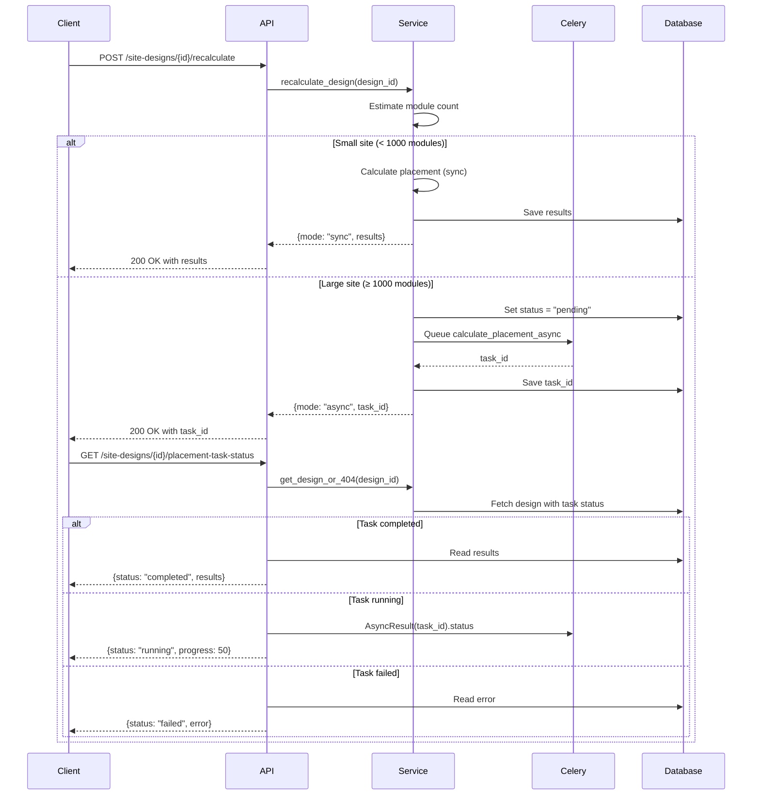

I have created the following plan after thorough exploration and analysis of the codebase. Follow the below plan verbatim. Trust the files and references. Do not re-verify what's written in the plan. Explore only when absolutely necessary. First implement all the proposed file changes and then I'll review all the changes together at the end.

## Observations

The codebase already has task tracking infrastructure in place from the previous phase. The `SiteDesign` model includes `placement_task_id`, `placement_task_status`, `placement_task_error`, and `placement_calculated_at` fields. The async task `calculate_placement_async` updates these fields during execution. An existing pattern for task status polling exists in file:backend/app/api/proposals.py using Celery's `AsyncResult`. The implementation should leverage both Celery's task backend and database-persisted status for robustness.

## Approach

Create a dedicated endpoint for checking placement task status that combines Celery task state with database-persisted results. This dual-source approach ensures status availability even after Celery results expire. The endpoint will return task status, progress information, and placement results when complete. New Pydantic schemas will be added to file:backend/app/schemas/site_design.py following the existing pattern from file:backend/app/schemas/proposal.py. Edge cases like missing tasks, expired Celery results, and database-only status will be handled gracefully by prioritizing database state.

## Implementation Steps

### 1. Add Pydantic Response Schemas

**File:** file:backend/app/schemas/site_design.py

Add the following schemas after the existing `SiteDesignResponse` class:

```python
class PlacementTaskStatusResponse(BaseModel):
    """Response for placement task status polling."""
    task_id: Optional[str] = None
    status: str  # pending, running, completed, failed
    progress_percentage: Optional[float] = Field(None, ge=0.0, le=100.0)
    
    # Results (when completed)
    total_modules: Optional[int] = None
    system_size_kwp: Optional[float] = None
    placement_calculated_at: Optional[datetime] = None
    
    # Error information (when failed)
    error: Optional[str] = None
    
    # Metadata
    estimated_modules: Optional[int] = None
    mode: Optional[str] = None  # sync or async
```

Update the imports at the top of the file to include `Field` if not already present.

### 2. Create Task Status Endpoint

**File:** file:backend/app/api/site_designs.py

Add the following endpoint after the existing `recalculate_site_design` endpoint (around line 268):

**Endpoint:** `GET /site-designs/{design_id}/placement-task-status`

**Implementation logic:**
- Accept `design_id` as path parameter
- Use `get_site_design_service` dependency to retrieve the design
- Call `site_design_service.get_design_or_404(design_id)` to fetch the design
- Check if `design.placement_task_id` exists
- If task_id exists, query Celery using `AsyncResult(design.placement_task_id)`
- Combine Celery task state with database-persisted status
- Return `PlacementTaskStatusResponse` with appropriate data

**Status mapping logic:**
- If `design.placement_task_status == "completed"`: Return completed status with results from database (`total_modules`, `system_size_kwp`, `placement_calculated_at`)
- If `design.placement_task_status == "failed"`: Return failed status with `placement_task_error`
- If `design.placement_task_status == "running"`: Check Celery task state; if available, return running with progress estimation
- If `design.placement_task_status == "pending"`: Return pending status
- If `design.placement_task_id` is None: Return status indicating no task has been initiated

**Edge case handling:**
- **Task not found in Celery:** Rely on database status (Celery results may expire after TTL)
- **Celery task exists but database status is None:** Use Celery status as fallback
- **Task ID mismatch:** Prioritize database status as source of truth
- **Design has no task:** Return response with `status: "not_started"` and `task_id: None`

**Progress calculation:**
- For "pending" status: `progress_percentage = 0`
- For "running" status: `progress_percentage = 50` (indeterminate, as placement algorithm doesn't report incremental progress)
- For "completed" status: `progress_percentage = 100`
- For "failed" status: `progress_percentage = None`

**Import additions:**
```python
from celery.result import AsyncResult
from app.schemas.site_design import PlacementTaskStatusResponse
```

### 3. Update Recalculate Endpoint Response

**File:** file:backend/app/api/site_designs.py

Modify the `recalculate_site_design` endpoint (line 258) to return a more structured response:

**Current behavior:** Returns a dict with `mode`, `task_id`, etc.

**Enhancement:** Create a response schema for consistency:

Add to file:backend/app/schemas/site_design.py:
```python
class RecalculateResponse(BaseModel):
    """Response from recalculate endpoint."""
    mode: str  # sync or async
    task_id: Optional[str] = None
    estimated_modules: Optional[int] = None
    status: Optional[str] = None
    
    # Sync mode results
    total_modules: Optional[int] = None
    system_size_kwp: Optional[float] = None
```

Update the endpoint signature to use `response_model=RecalculateResponse`.

### 4. Handle Celery Result Expiration

**File:** file:backend/app/api/site_designs.py

In the task status endpoint implementation, wrap `AsyncResult` queries in try-except blocks:

```python
try:
    task_result = AsyncResult(design.placement_task_id)
    celery_status = task_result.status
except Exception:
    # Celery result expired or unavailable, rely on DB
    celery_status = None
```

Prioritize database status when Celery status is unavailable.

### 5. Add Endpoint Documentation

**File:** file:backend/app/api/site_designs.py

Add comprehensive docstring to the new endpoint:

```python
"""
Get the status of an async placement calculation task.

This endpoint checks both Celery task state and database-persisted status.
Use this to poll for completion after triggering recalculation on large sites.

Returns:
- task_id: Celery task identifier (if async mode was used)
- status: pending | running | completed | failed | not_started
- progress_percentage: Estimated completion (0-100)
- total_modules: Final module count (when completed)
- system_size_kwp: System capacity (when completed)
- error: Error message (when failed)

Edge cases:
- If no task has been initiated: status = "not_started"
- If Celery result expired: Falls back to database status
- If task not found: Returns 404
"""
```

### 6. Update API Router Registration

**File:** file:backend/app/api/site_designs.py

Ensure the new endpoint is registered with the router (it will be automatically registered if using the `@router.get` decorator).

### 7. Integration with Existing Flow

**Sequence of operations:**



### 8. Testing Considerations

While unit tests are handled by other engineers, ensure the endpoint implementation supports:

- **Sync path verification:** Design with < 1000 estimated modules returns immediate results
- **Async path verification:** Design with ≥ 1000 estimated modules returns task_id
- **Status polling:** Multiple calls to status endpoint reflect task progression
- **Celery expiration:** Status endpoint works even when Celery result is unavailable
- **Error scenarios:** Invalid design_id returns 404, failed tasks return error message
- **Not started state:** Designs without recalculation return "not_started"

### 9. Error Response Standards

Follow FastAPI conventions for error responses:

- **404 Not Found:** Design ID doesn't exist or user lacks access
- **200 OK:** Always return 200 for status endpoint (even if task failed, the status query succeeded)
- **Error details:** Include descriptive messages in response body

### 10. Security Considerations

- Endpoint uses `get_site_design_service` dependency which enforces tenant scoping
- Task status is only accessible to users within the same tenant
- No additional role restrictions needed (all authenticated users can check status)