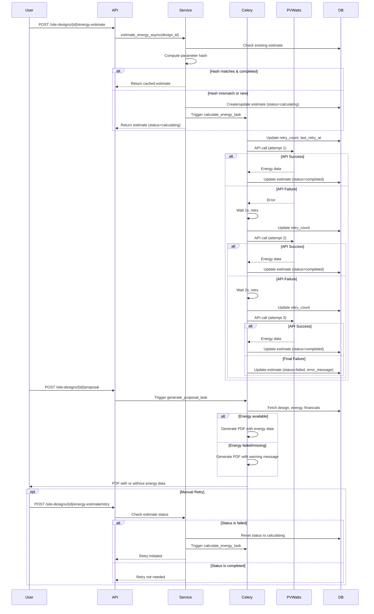

I have created the following plan after thorough exploration and analysis of the codebase. Follow the below plan verbatim. Trust the files and references. Do not re-verify what's written in the plan. Explore only when absolutely necessary. First implement all the proposed file changes and then I'll review all the changes together at the end.

## Observations

The energy estimation service is already substantially implemented with hash-based caching (SHA256), async Celery tasks, and basic retry logic. The proposal template gracefully handles missing energy/financial data by displaying warning messages. However, several enhancements are needed: explicit retry backoff configuration (1s, 2s, 4s), manual retry endpoint, retry metadata tracking in the database, and verification that the entire proposal generation flow doesn't break when energy estimation fails.

## Approach

The implementation will focus on four key enhancements: (1) configuring explicit retry intervals in the Celery task, (2) adding a manual retry API endpoint, (3) extending the `EnergyEstimate` model with retry metadata fields, and (4) ensuring the proposal generation flow handles missing energy data gracefully. This approach maintains the existing architecture while adding the missing acceptance criteria components without over-engineering.

## Implementation Steps

### 1. Verify and Enhance Retry Logic in Celery Task

**File: `backend/app/services/tasks.py`**

Modify the `calculate_energy_task` decorator (line 109) to explicitly configure retry backoff intervals:

- Change `retry_backoff=True` to `retry_backoff=1` (base delay of 1 second)
- Add `retry_backoff_max=4` to cap the maximum delay at 4 seconds
- This ensures exponential backoff: 1s (2^0), 2s (2^1), 4s (2^2) for the 3 retry attempts
- Keep `max_retries=3` and `autoretry_for=(Exception,)`

Update the retry failure handling (lines 197-203) to increment retry count in the database before marking as failed.

### 2. Add Retry Metadata to EnergyEstimate Model

**File: `backend/app/models/models.py`**

Extend the `EnergyEstimate` model (lines 321-342) with retry tracking fields:

- Add `retry_count` column (Integer, default=0) to track number of retry attempts
- Add `last_retry_at` column (DateTime, nullable=True) to track when last retry occurred
- These fields enable monitoring retry behavior and debugging API issues

Create a database migration using Alembic to add these columns to the `energy_estimates` table.

### 3. Update Energy Estimation Service to Track Retries

**File: `backend/app/services/energy_estimation.py`**

Modify the `estimate_energy_async` method (lines 27-128):

- When resetting an existing estimate due to hash mismatch (lines 88-100), also reset `retry_count` to 0 and `last_retry_at` to None
- When creating a new estimate (lines 102-118), initialize `retry_count=0` and `last_retry_at=None`

Update the Celery task invocation to pass the current retry count if needed for logging.

### 4. Update Celery Task to Track Retry Metadata

**File: `backend/app/services/tasks.py`**

In `calculate_energy_task` (lines 109-206):

- At the start of each retry attempt, update the `EnergyEstimate` record with incremented `retry_count` and current timestamp in `last_retry_at`
- On successful completion (line 168), ensure `retry_count` remains at its final value for audit purposes
- On final failure (lines 197-203), the `retry_count` will reflect the total number of attempts made

### 5. Add Manual Retry Endpoint

**File: `backend/app/api/site_designs.py`**

Add a new POST endpoint after the existing energy estimate endpoints (after line 258):

```
POST /site-designs/{design_id}/energy-estimate/retry
```

Implementation details:
- Verify the design exists using `SiteDesignService.get_design_or_404`
- Check if an energy estimate exists for this design
- If estimate status is "failed" or "calculating" (stuck), reset status to "calculating" and trigger a new task
- If estimate status is "completed", return an error indicating retry is not needed
- Return response similar to the initial estimate endpoint with task status
- Require role: Admin, PM, or Engineer (same as initial estimate endpoint)

### 6. Verify Graceful Degradation in Proposal Generation

**File: `backend/app/services/proposal.py`**

Review the `generate_pdf` method (lines 26-74):

- Confirm that lines 40-41 fetch energy and financials with `.first()` which returns None if not found ✓
- Confirm that lines 46-47 only generate chart if energy exists ✓
- Confirm that the template receives None values gracefully ✓

**File: `backend/templates/proposal.html`**

Verify template handles missing data (already implemented):
- Lines 65-85: Shows warning message when `energy` is None ✓
- Lines 93-114: Shows warning message when `financials` is None ✓

**File: `backend/app/services/tasks.py`**

In `generate_proposal_task` (lines 82-105):
- Ensure the task doesn't fail if energy/financials are missing
- The current implementation calls `service.generate_pdf()` which handles None values
- No changes needed, but add error handling to catch and log any template rendering errors

### 7. Add Response Schema for Manual Retry

**File: `backend/app/schemas/site_design.py`**

Add a new response schema after `RecalculateResponse` (after line 112):

```python
class EnergyEstimateRetryResponse(BaseModel):
    status: str
    estimate_id: str
    current_status: str
    retry_count: int
    message: str
```

This schema provides clear feedback about the retry operation including how many retries have been attempted.

### 8. Update Energy Estimate GET Endpoint Response

**File: `backend/app/api/site_designs.py`**

Enhance the `get_energy_estimate` endpoint (lines 244-258) to include retry metadata in the response:

- Return `retry_count` and `last_retry_at` fields along with existing data
- This helps frontend display retry status to users
- Consider creating a proper Pydantic schema for the response instead of returning the raw model

### 9. Verification Testing Checklist

After implementation, verify the following scenarios:

**Hash-based Cache Invalidation:**
- Trigger energy estimation with specific parameters
- Verify estimate is cached with computed hash
- Change a parameter (e.g., tilt angle) and trigger again
- Verify new hash is computed and new API call is made
- Revert parameter and verify cached result is returned

**Retry Logic:**
- Mock PVWatts API to fail on first 2 attempts, succeed on 3rd
- Verify retry intervals are approximately 1s, 2s between attempts
- Verify `retry_count` increments correctly in database
- Verify estimate status becomes "completed" after successful retry

**Graceful Degradation:**
- Mock PVWatts API to fail all 3 attempts
- Verify estimate status becomes "failed" with error message
- Trigger proposal generation for the same design
- Verify PDF is generated with warning message instead of energy data
- Verify proposal generation doesn't throw errors

**Manual Retry:**
- Create a failed energy estimate
- Call the manual retry endpoint
- Verify new task is triggered and estimate status resets to "calculating"
- Verify retry succeeds and estimate is updated

## Database Migration

Create Alembic migration for `EnergyEstimate` model changes:

**Migration file:** `backend/alembic/versions/XXXXXX_add_retry_metadata_to_energy_estimates.py`

- Add `retry_count` column: `sa.Column('retry_count', sa.Integer(), nullable=False, server_default='0')`
- Add `last_retry_at` column: `sa.Column('last_retry_at', sa.DateTime(), nullable=True)`
- Include both upgrade and downgrade operations

## Sequence Diagram



## Files Modified

- `backend/app/models/models.py` - Add retry metadata fields to EnergyEstimate
- `backend/app/services/energy_estimation.py` - Initialize retry metadata
- `backend/app/services/tasks.py` - Configure explicit retry backoff, update retry metadata
- `backend/app/api/site_designs.py` - Add manual retry endpoint, enhance GET response
- `backend/app/schemas/site_design.py` - Add EnergyEstimateRetryResponse schema
- `backend/alembic/versions/XXXXXX_add_retry_metadata_to_energy_estimates.py` - Database migration

## Files Verified (No Changes Needed)

- `backend/app/services/proposal.py` - Already handles None energy/financials gracefully
- `backend/templates/proposal.html` - Already displays warnings for missing data
- `backend/app/core/celery_app.py` - Basic configuration sufficient