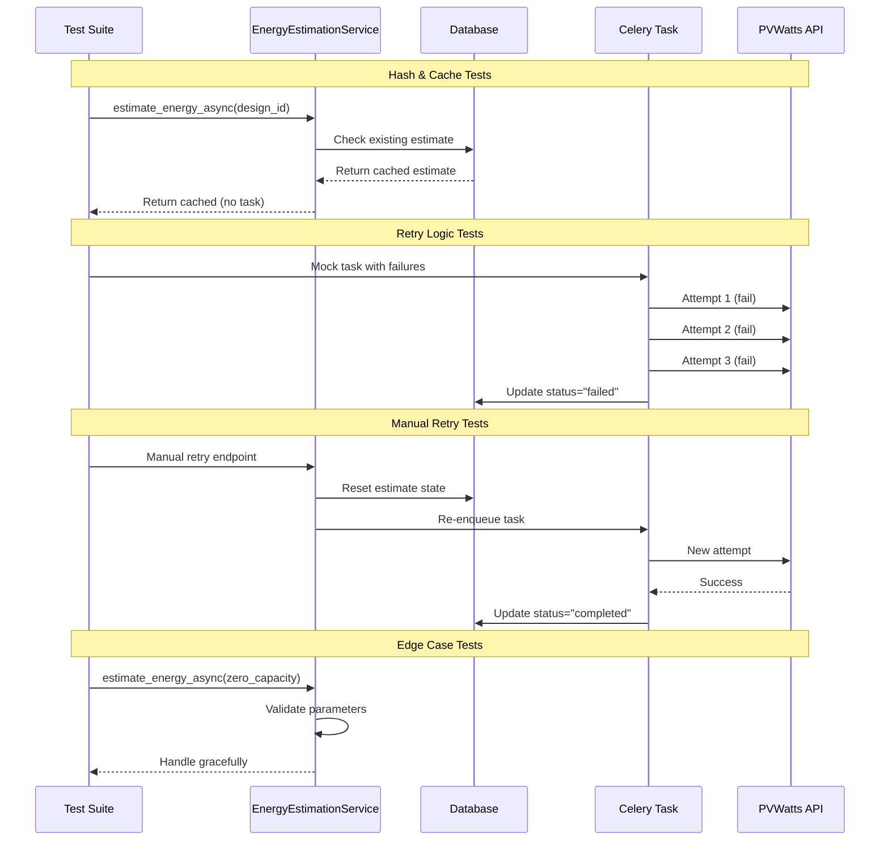

I have created the following plan after thorough exploration and analysis of the codebase. Follow the below plan verbatim. Trust the files and references. Do not re-verify what's written in the plan. Explore only when absolutely necessary. First implement all the proposed file changes and then I'll review all the changes together at the end.

## Observations

The current test file `file:backend/tests/test_energy_estimation.py` has basic coverage for hash computation, cache hit/miss scenarios, and async task triggering. The implementation uses Celery tasks with automatic retry logic (3 attempts with exponential backoff: 1s, 2s, 4s), hash-based cache invalidation via SHA256, and includes error tracking fields (`status`, `error_message`, `retry_count`, `last_retry_at`). A manual retry endpoint exists at `/site-designs/{design_id}/energy-estimate/retry`. The proposal service demonstrates graceful degradation by handling `None` energy estimates.

## Approach

Expand the test suite to comprehensively cover all acceptance criteria by adding tests for retry logic with various failure scenarios, graceful degradation when the PVWatts API is unavailable, manual retry functionality, Celery task execution with parameter verification, and edge cases. Use mocking extensively to simulate API failures, Celery task behavior, and database states. Follow the existing testing patterns with in-memory SQLite, pytest fixtures, and MagicMock for external dependencies. Structure tests logically by grouping related scenarios together.

## Implementation Instructions

### 1. Add Comprehensive Hash and Cache Tests

Enhance existing hash tests in `file:backend/tests/test_energy_estimation.py`:

- **Test hash stability with different parameter orders**: Verify that changing the order of dictionary keys produces the same hash (already covered but ensure comprehensive)
- **Test hash changes with parameter modifications**: Test each parameter individually (system_capacity, tilt, azimuth, lat, lon, array_type, losses, module_type) to ensure hash changes when any parameter changes
- **Test cache invalidation on parameter change**: Create an estimate with status "completed", then call `estimate_energy_async` with modified parameters and verify the estimate is reset to "calculating" with a new hash
- **Test cache hit with identical parameters**: Verify multiple calls with identical parameters return the same estimate without triggering new tasks
- **Test cache behavior with "calculating" status**: Verify that calling `estimate_energy_async` while status is "calculating" returns the existing estimate without re-triggering the task (idempotency)

### 2. Add Retry Logic Tests

Create comprehensive retry scenario tests:

- **Test successful retry on second attempt**: Mock `calculate_energy_task` to raise an exception on first call, succeed on second call. Verify `retry_count` increments, `last_retry_at` is updated, and final status is "completed"
- **Test all retries fail**: Mock the task to fail all 3 attempts. Verify final status is "failed", `error_message` is populated, and `retry_count` equals 3
- **Test exponential backoff timing**: Mock Celery's retry mechanism and verify backoff values are 1s, 2s, 4s by inspecting the `retry_backoff` and `retry_backoff_max` configuration
- **Test retry count incrementation**: Verify that each retry increments `retry_count` and updates `last_retry_at` in the database
- **Test partial failure recovery**: Mock first attempt fails with network error, second attempt succeeds. Verify the estimate completes successfully with `retry_count=2`

### 3. Add Graceful Degradation Tests

Test proposal generation without energy data:

- **Test proposal generation with missing energy estimate**: Mock `ProposalService.generate_pdf` and verify it can be called when `EnergyEstimate` is `None` or has status "failed"
- **Test proposal generation with failed energy estimate**: Create a site design with a failed energy estimate and verify proposal generation proceeds without errors
- **Test proposal template rendering with None energy**: Verify the Jinja2 template handles `energy=None` gracefully without raising exceptions
- **Test chart generation skipped when energy unavailable**: Verify `_generate_monthly_chart` is not called when energy data is missing

### 4. Add Manual Retry Functionality Tests

Test the manual retry endpoint behavior:

- **Test manual retry resets estimate state**: Create a failed estimate, call the retry endpoint, verify status changes to "calculating", `retry_count` resets to 0, `error_message` is cleared, and `last_retry_at` is reset
- **Test manual retry re-enqueues task**: Mock `calculate_energy_task.delay` and verify it's called with correct parameters after manual retry
- **Test manual retry with non-failed status**: Attempt to retry an estimate with status "completed" and verify it returns a 400 error
- **Test manual retry with missing estimate**: Attempt to retry a non-existent estimate and verify it returns a 404 error
- **Test manual retry reconstructs parameters correctly**: Verify the retry endpoint correctly reconstructs PVWatts parameters from `SiteDesign` and `Tender` data

### 5. Add Celery Task Execution Tests

Mock and verify Celery task behavior:

- **Test task parameter passing**: Verify `calculate_energy_task.delay` is called with correct `estimate_id` and `params` dictionary containing all required PVWatts parameters
- **Test task updates estimate on success**: Mock successful PVWatts API response and verify the task updates `annual_energy_kwh`, `monthly_energy_kwh`, `capacity_factor`, and sets status to "completed"
- **Test task updates estimate on failure**: Mock API failure and verify the task sets status to "failed" and populates `error_message`
- **Test task triggers financial analysis on completion**: Mock successful energy calculation and verify `FinancialAnalysisService.calculate_financials` is called
- **Test task handles missing estimate record**: Pass invalid `estimate_id` to task and verify it returns error without crashing

### 6. Add Edge Case Tests

Test boundary conditions and error scenarios:

- **Test zero capacity**: Create a site design with `system_size_kwp=0` and verify energy estimation handles it gracefully (may return zero energy or specific error)
- **Test invalid coordinates**: Create a tender with `latitude=None` or `longitude=None` and verify appropriate error handling
- **Test missing tender data**: Mock `Tender` query to return `None` and verify `estimate_energy_async` raises `ValueError` with appropriate message
- **Test missing site design**: Call `estimate_energy_async` with non-existent `site_design_id` and verify it raises `ValueError`
- **Test extreme coordinate values**: Test with coordinates at boundaries (lat=90, lat=-90, lon=180, lon=-180) and verify API call is constructed correctly
- **Test different site types**: Verify `array_type` mapping is correct for "rooftop" (1), "ground_mount" (0), and "carport" (0)
- **Test PVWatts API timeout**: Mock `httpx.get` to raise timeout exception and verify retry logic is triggered
- **Test PVWatts API rate limiting**: Mock API to return 429 status code and verify retry logic handles it appropriately

### 7. Test Structure and Fixtures

Organize tests with proper fixtures:

- **Create fixture for complete test data**: Extend existing fixtures to include `Tender` with valid coordinates, `SiteDesign` with all required fields, and `EquipmentModule` for realistic testing
- **Create fixture for mock PVWatts response**: Create a fixture that returns a realistic PVWatts API response with monthly data
- **Create fixture for mock Celery task**: Create a fixture that mocks `calculate_energy_task` with configurable behavior (success, failure, retry scenarios)
- **Use parametrized tests**: Use `@pytest.mark.parametrize` for testing multiple site types, coordinate ranges, and failure scenarios

### 8. Mock Configuration

Set up comprehensive mocking:

- **Mock httpx.get**: Use `@patch("app.services.tasks.httpx.get")` to simulate PVWatts API responses
- **Mock Celery task**: Use `@patch("app.services.tasks.calculate_energy_task.delay")` and `@patch("app.services.tasks.calculate_energy_task.apply_async")` for task testing
- **Mock database session**: Use `MagicMock(spec=Session)` for unit tests, or in-memory SQLite for integration-style tests
- **Mock datetime**: Use `@patch("app.services.energy_estimation.datetime")` to control timestamp testing
- **Mock settings**: Use `@patch("app.core.config.settings")` to control API key and configuration

### 9. Assertion Patterns

Implement thorough assertions:

- **Verify database commits**: Assert `mock_db_session.commit.assert_called()` after state changes
- **Verify task calls**: Assert `mock_delay.assert_called_once()` with specific arguments
- **Verify state transitions**: Assert status changes from "calculating" → "completed" or "failed"
- **Verify error messages**: Assert error messages are truncated to 500 characters and contain relevant information
- **Verify retry metadata**: Assert `retry_count`, `last_retry_at` are updated correctly

### 10. Documentation and Comments

Add clear documentation:

- **Docstrings for each test**: Explain what scenario is being tested and why it matters
- **Comments for complex mocking**: Explain mock setup for retry scenarios and API failures
- **Group related tests**: Use test class organization or clear naming conventions (e.g., `test_retry_*`, `test_edge_case_*`, `test_manual_retry_*`)

