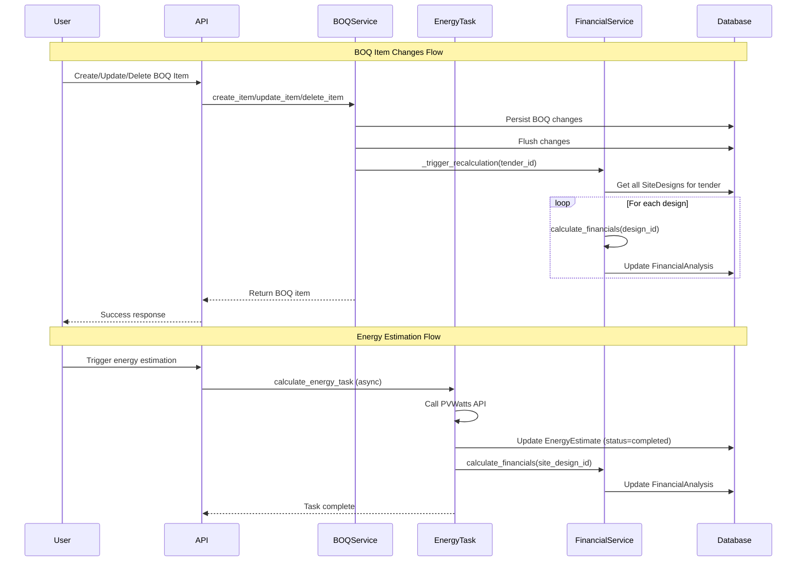

I have created the following plan after thorough exploration and analysis of the codebase. Follow the below plan verbatim. Trust the files and references. Do not re-verify what's written in the plan. Explore only when absolutely necessary. First implement all the proposed file changes and then I'll review all the changes together at the end.

## Observations

The financial recalculation trigger for energy estimation is **already implemented** in `file:backend/app/services/tasks.py` (lines 180-197). After the PVWatts API call completes successfully, the Celery task automatically triggers `FinancialAnalysisService.calculate_financials()` with proper error handling. However, the BOQ service has **unreachable code bugs** in both `create_item` and `update_item` methods where the recalculation trigger appears after return statements, preventing automatic financial updates when BOQ items change.

## Approach

Fix the unreachable code issues in the BOQ service by moving the recalculation triggers before the return statements. The energy estimation trigger is already correctly implemented in the async task completion handler. This ensures financial metrics automatically recalculate whenever BOQ items are modified or energy estimates complete, maintaining data consistency across the system.

## Implementation Steps

### 1. Fix BOQ Service `create_item` Method

In `file:backend/app/services/boq.py`, move the recalculation trigger before the return statement:

**Current structure (lines 87-106):**
- Line 87-88: Add item to DB and flush
- Lines 90-100: Audit logging
- Line 102: **Return item** ← First return
- Line 104: Trigger recalculation ← **UNREACHABLE**
- Line 106: Return item ← **UNREACHABLE**

**Required changes:**
- Remove lines 104-106 (unreachable code)
- Add `self.db.flush()` after line 88 to ensure item is persisted
- Add `self._trigger_recalculation(tender_id)` after audit logging (after line 100)
- Keep single return statement at the end

**Corrected flow:**
1. Create BOQ item and add to session
2. Flush to make item visible for recalculation
3. Log audit entry
4. Trigger financial recalculation for all designs in tender
5. Return the created item

### 2. Fix BOQ Service `update_item` Method

In `file:backend/app/services/boq.py`, move the flush and recalculation trigger before the return statement:

**Current structure (lines 108-170):**
- Lines 118-153: Update fields and recalculate line_total
- Lines 155-163: Audit logging if changes exist
- Line 165: **Return item** ← First return
- Line 167: Flush ← **UNREACHABLE**
- Line 168: Trigger recalculation ← **UNREACHABLE**
- Line 170: Return item ← **UNREACHABLE**

**Required changes:**
- Remove lines 167-170 (unreachable code)
- Add `self.db.flush()` after line 163 (after audit logging)
- Add `self._trigger_recalculation(item.tender_id)` after flush
- Keep single return statement at the end

**Corrected flow:**
1. Update BOQ item fields
2. Recalculate line_total if pricing fields changed
3. Log audit entry if changes exist
4. Flush to persist updates
5. Trigger financial recalculation for all designs in tender
6. Return the updated item

### 3. Verify Energy Estimation Trigger (Already Implemented)

**No changes needed** - the trigger is correctly implemented in `file:backend/app/services/tasks.py`:

**Location:** Lines 180-197 in `calculate_energy_task`

**Current implementation:**
- After PVWatts API call succeeds and estimate status is "completed"
- Fetches SiteDesign and Tender to get tenant_id and user_id
- Creates FinancialAnalysisService instance with proper context
- Calls `fin_service.calculate_financials(site_design.id)`
- Wrapped in try-except to prevent energy task from failing
- Errors are logged but don't propagate

**Why this is correct:**
- Energy estimation is asynchronous via Celery
- Completion happens in the worker task, not in `energy_estimation.py`
- The service method `estimate_energy_async()` only triggers the task and returns immediately
- Financial recalculation must happen in the task completion handler

### 4. Verify Delete Operation (Already Correct)

**No changes needed** - `delete_item` method in `file:backend/app/services/boq.py` (lines 172-187) correctly:
- Logs audit entry (lines 174-184)
- Deletes item (line 185)
- Flushes changes (line 186)
- Triggers recalculation (line 187)

### 5. Error Handling Verification

The `_trigger_recalculation` method (lines 22-35) already implements proper error handling:
- Wrapped in try-except block
- Catches all exceptions to prevent BOQ operations from failing
- Prints error message for debugging
- Prevents cascading failures when financial calculation encounters issues

## Flow Diagram

## Key Integration Points

| Component | Method | Trigger Point | Error Handling |
|-----------|--------|---------------|----------------|
| BOQ Create | `create_item` | After audit log, before return | Try-catch in `_trigger_recalculation` |
| BOQ Update | `update_item` | After audit log, before return | Try-catch in `_trigger_recalculation` |
| BOQ Delete | `delete_item` | After delete and flush | Try-catch in `_trigger_recalculation` |
| Energy Estimation | `calculate_energy_task` | After status=completed | Try-catch prevents task failure |

## Dependencies

- `file:backend/app/services/financial_analysis.py` - FinancialAnalysisService.calculate_financials()
- `file:backend/app/models/models.py` - SiteDesign, Tender, FinancialAnalysis models
- `file:backend/app/services/boq.py` - BOQService._trigger_recalculation()
- `file:backend/app/services/tasks.py` - calculate_energy_task Celery task