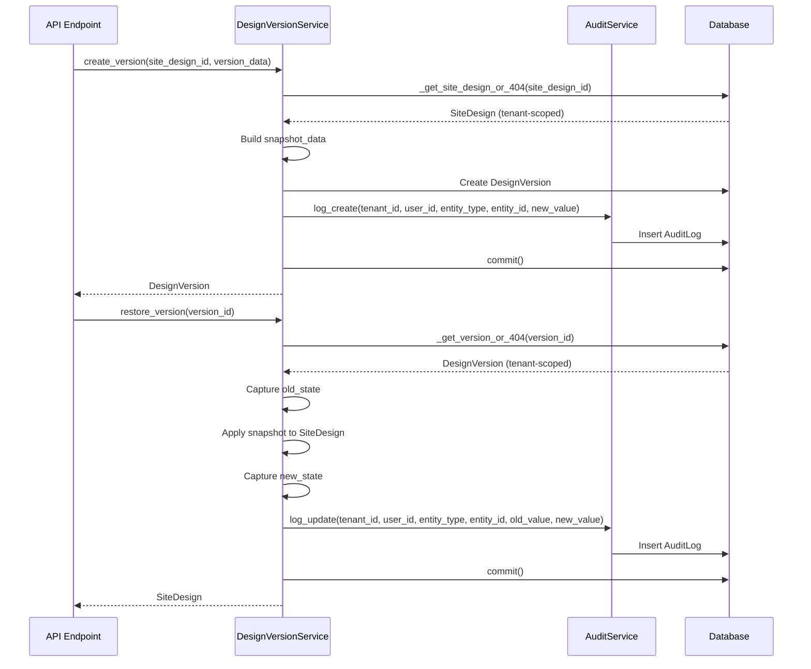

I have created the following plan after thorough exploration and analysis of the codebase. Follow the below plan verbatim. Trust the files and references. Do not re-verify what's written in the plan. Explore only when absolutely necessary. First implement all the proposed file changes and then I'll review all the changes together at the end.

## Observations

The current `DesignVersionService` uses static methods without tenant isolation or proper audit service integration. The codebase follows an instance-based service pattern (as seen in `SiteDesignService`) with constructor injection of `db`, `tenant_id`, and `user_id`. The `AuditService` provides dedicated methods (`log_create`, `log_update`, `log_delete`) for structured audit logging. Tenant access is achieved through the relationship chain: `DesignVersion.site_design.tender.tenant_id`.

## Approach

Refactor `DesignVersionService` to match the instance-based pattern used throughout the codebase. This involves converting static methods to instance methods, adding constructor-based dependency injection, integrating `AuditService` for comprehensive audit logging, and implementing tenant validation in all data access methods. The refactoring will improve security through proper tenant isolation and provide better audit trails with detailed old/new value tracking.

## Implementation Steps

### 1. Refactor Service Class Structure

**File**: `file:backend/app/services/design_version.py`

Transform the class from static methods to instance-based pattern:

- Add `__init__(self, db: Session, tenant_id: UUID, user_id: UUID)` constructor
- Store `self.db`, `self.tenant_id`, `self.user_id` as instance variables
- Initialize `self.audit = AuditService(db)` in constructor
- Remove all `@staticmethod` decorators from methods
- Update all method signatures to remove `db`, `user_id` parameters (use instance variables instead)
- Update method signatures: `site_design_id` parameter remains for `create_version()`, `version_id` remains for `restore_version()`

### 2. Add Tenant Isolation Helper Methods

**File**: `file:backend/app/services/design_version.py`

Create private helper methods for tenant-scoped data access:

- Add `_get_site_design_or_404(self, site_design_id: UUID) -> SiteDesign` method that queries `SiteDesign` joined with `Tender`, filtering by `SiteDesign.id == site_design_id` and `Tender.tenant_id == self.tenant_id`
- Add `_get_version_or_404(self, version_id: UUID) -> DesignVersion` method that queries `DesignVersion` joined with `SiteDesign` and `Tender`, filtering by `DesignVersion.id == version_id` and `Tender.tenant_id == self.tenant_id`
- Both methods should raise `HTTPException(status_code=404)` if entity not found
- Use eager loading with `joinedload()` for `site_design.tender` relationship to avoid N+1 queries

### 3. Update create_version() Method

**File**: `file:backend/app/services/design_version.py`

Refactor the version creation logic:

- Replace direct `db.query()` with `self._get_site_design_or_404(site_design_id)` for tenant-scoped access
- Keep existing snapshot_data construction logic (lines 30-47)
- Update `DesignVersion` instantiation to use `self.user_id` instead of `user_id` parameter
- Replace manual `AuditLog` creation (lines 62-70) with `self.audit.log_create()` call
- Pass `tenant_id=self.tenant_id`, `user_id=self.user_id`, `entity_type="DesignVersion"`, `entity_id=db_version.id`
- For `new_value` parameter, include comprehensive snapshot: `{"version_name": version_data.version_name, "notes": version_data.notes, "snapshot_keys": list(snapshot_data.keys())}`
- Remove manual `db.add(audit)` since `AuditService` handles it
- Keep `db.commit()` and `db.refresh(db_version)` at the end

### 4. Update list_versions() Method

**File**: `file:backend/app/services/design_version.py`

Add tenant isolation to version listing:

- Replace direct query with tenant-scoped query: join `DesignVersion` with `SiteDesign` and `Tender`
- Filter by `DesignVersion.site_design_id == site_design_id` AND `Tender.tenant_id == self.tenant_id`
- Maintain existing `order_by(DesignVersion.created_at.desc())`
- Add audit logging using `self.audit.log()` with `action="list"` to track version access (optional but recommended for compliance)

### 5. Update restore_version() Method

**File**: `file:backend/app/services/design_version.py`

Enhance restore logic with comprehensive audit logging:

- Replace direct `db.query()` calls with `self._get_version_or_404(version_id)` for tenant-scoped access
- Before updating `site_design`, capture comprehensive `old_state` dictionary including all fields that will be modified: `name`, `site_type`, `equipment_module_id`, `equipment_inverter_id`, `site_boundary`, `exclusion_zones`, `module_placements`, `edge_setback_m`, `row_spacing_m`, `module_orientation`, `azimuth_deg`, `tilt_deg`, `total_modules`, `system_size_kwp`, `site_area_sqm`
- After applying snapshot updates, capture `new_state` with same fields
- Replace manual `AuditLog` creation (lines 140-149) with `self.audit.log_update()` call
- Pass `tenant_id=self.tenant_id`, `user_id=self.user_id`, `entity_type="SiteDesign"`, `entity_id=site_design.id`, `old_value=old_state`, `new_value=new_state`
- Add metadata to `new_value`: include `{"restored_from_version_id": str(version_id), "restored_from_version_name": version.version_name, ...new_state}`
- Keep existing snapshot restoration logic (lines 117-137)

### 6. Add Factory Function

**File**: `file:backend/app/services/design_version.py`

Create dependency injection helper:

- Add function `get_design_version_service(db: Session, tenant_id: UUID, user_id: UUID) -> DesignVersionService`
- Return `DesignVersionService(db, tenant_id, user_id)`
- This enables FastAPI dependency injection pattern

### 7. Update API Endpoints

**File**: `file:backend/app/api/site_designs.py`

Refactor API layer to use instance-based service:

- Add dependency function `get_design_version_service()` similar to existing `get_site_design_service()` (lines 27-36)
- Update `create_design_version()` endpoint (lines 164-186): remove static method call, inject `DesignVersionService` via `Depends(get_design_version_service)`, call `service.create_version(site_design_id=design_id, version_data=request)`
- Update `list_design_versions()` endpoint (lines 189-201): inject service, call `service.list_versions(site_design_id=design_id)`
- Update `restore_design_version()` endpoint (lines 204-221): inject service, call `service.restore_version(version_id=version_id)`
- Remove all `from app.services.design_version import DesignVersionService` inline imports
- Add import at top of file: `from app.services.design_version import get_design_version_service`
- Ensure `db.commit()` is called after service operations where needed

### 8. Update Imports

**File**: `file:backend/app/services/design_version.py`

Add necessary imports:

- Add `from sqlalchemy.orm import joinedload` for eager loading relationships
- Ensure `from app.services.audit import AuditService` is present
- Verify all existing imports remain: `Session`, `HTTPException`, `status`, `UUID`, `List`, `Optional`, model imports

### 9. Error Handling Enhancement

**File**: `file:backend/app/services/design_version.py`

Improve error messages for tenant isolation:

- In `_get_site_design_or_404()`: raise `HTTPException(status_code=404, detail=f"Site design {site_design_id} not found or access denied")`
- In `_get_version_or_404()`: raise `HTTPException(status_code=404, detail=f"Design version {version_id} not found or access denied")`
- This prevents information leakage about existence of resources in other tenants

