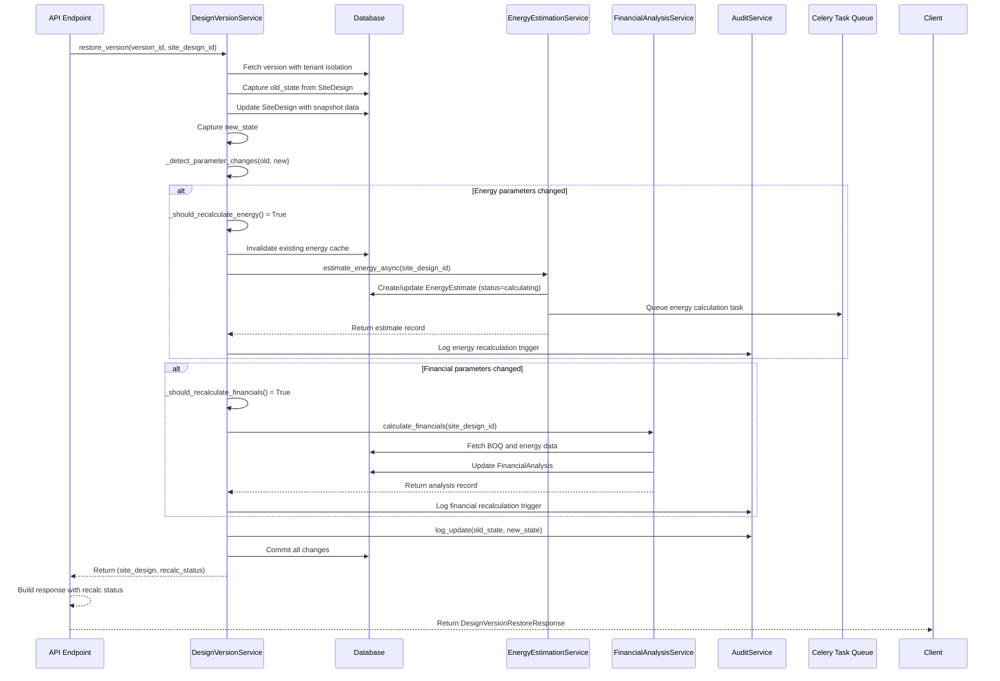

I have created the following plan after thorough exploration and analysis of the codebase. Follow the below plan verbatim. Trust the files and references. Do not re-verify what's written in the plan. Explore only when absolutely necessary. First implement all the proposed file changes and then I'll review all the changes together at the end.

## Observations

The current `DesignVersionService.restore_version()` successfully restores snapshot data to the `SiteDesign` but lacks intelligent recalculation triggers. The `EnergyEstimationService` uses parameter hashing for cache management, automatically detecting changes when `estimate_energy_async()` is called. The `FinancialAnalysisService` depends on BOQ data and energy estimates. The restoration process needs to compare old vs. restored states and trigger downstream recalculations when critical parameters change.

## Approach

Implement a change detection system within `restore_version()` that compares the current state with the restored snapshot to identify parameter changes affecting energy estimation and financial analysis. Create helper methods to categorize changes (equipment, geometry, placement settings) and conditionally trigger `EnergyEstimationService.estimate_energy_async()` and `FinancialAnalysisService.calculate_financials()`. Update the API response to include recalculation status flags, enabling the frontend to display appropriate feedback to users about ongoing background calculations.

## Implementation Steps

### 1. Add Change Detection Helper Methods to `DesignVersionService`

In file:backend/app/services/design_version.py, add private helper methods after `_get_version_or_404()`:

**Method: `_detect_parameter_changes()`**
- Accept `old_state` dict and `new_state` dict as parameters
- Return a dict with categorized changes: `{"equipment_changed": bool, "placement_settings_changed": bool, "geometry_changed": bool, "results_changed": bool}`
- Compare equipment IDs (`equipment_module_id`, `equipment_inverter_id`)
- Compare placement settings (`azimuth_deg`, `tilt_deg`, `edge_setback_m`, `row_spacing_m`, `module_orientation`)
- Compare geometry (`site_boundary`, `exclusion_zones`)
- Compare results (`total_modules`, `system_size_kwp`)

**Method: `_should_recalculate_energy()`**
- Accept `changes` dict from `_detect_parameter_changes()`
- Return `True` if any of these changed: equipment, placement settings (azimuth/tilt), or results (system_size_kwp)
- Energy estimation depends on system capacity, azimuth, tilt, and array_type (derived from site_type)

**Method: `_should_recalculate_financials()`**
- Accept `changes` dict and `site_design` object
- Return `True` if equipment or results changed (affects system cost and energy)
- Financial analysis depends on system cost (from BOQ) and annual energy

**Method: `_invalidate_energy_cache_if_needed()`**
- Accept `site_design_id` and `changes` dict
- If `_should_recalculate_energy()` returns `True`:
  - Query existing `EnergyEstimate` for the site_design_id
  - If exists and status is "completed", update status to "invalidated" or delete the record
  - This ensures fresh calculation on next energy estimation trigger

### 2. Update `restore_version()` Method

In file:backend/app/services/design_version.py, modify the `restore_version()` method:

**After capturing old_state (line 153-169):**
- Keep existing old_state capture logic

**After updating SiteDesign fields (line 172-186):**
- Keep existing field update logic

**After capturing new_state (line 189-205):**
- Keep existing new_state capture logic

**Before audit logging (before line 208):**
- Call `changes = self._detect_parameter_changes(old_state, new_state)`
- Initialize `recalculation_status = {"energy_triggered": False, "financial_triggered": False}`

**After audit logging (after line 219, before commit):**
- Check if energy recalculation needed:
  - If `self._should_recalculate_energy(changes)`:
    - Call `self._invalidate_energy_cache_if_needed(site_design.id, changes)`
    - Import and instantiate `EnergyEstimationService(self.db)`
    - Call `energy_service.estimate_energy_async(site_design.id)` wrapped in try-except
    - Set `recalculation_status["energy_triggered"] = True` on success
    - Log any errors but don't fail the restore operation

- Check if financial recalculation needed:
  - If `self._should_recalculate_financials(changes, site_design)`:
    - Import and instantiate `FinancialAnalysisService(self.db, self.tenant_id, self.user_id)`
    - Call `financial_service.calculate_financials(site_design.id)` wrapped in try-except
    - Set `recalculation_status["financial_triggered"] = True` on success
    - Log any errors but don't fail the restore operation

**Modify return statement:**
- Instead of returning just `site_design`, return a tuple: `(site_design, recalculation_status)`
- This allows the API endpoint to access recalculation status

### 3. Update API Endpoint Response

In file:backend/app/api/site_designs.py, modify the `restore_design_version()` endpoint (line 205-215):

**Update endpoint signature:**
- Keep existing parameters

**Update endpoint body:**
- Change `site_design = service.restore_version(...)` to `site_design, recalc_status = service.restore_version(...)`
- Create response dict combining `SiteDesignResponse` with recalculation status
- Return structure:
  ```python
  {
    "site_design": SiteDesignResponse.model_validate(site_design),
    "recalculation_status": {
      "energy_estimation_triggered": recalc_status["energy_triggered"],
      "financial_analysis_triggered": recalc_status["financial_triggered"],
      "message": "Recalculations triggered automatically based on parameter changes"
    }
  }
  ```

**Update response model:**
- Create new response schema in file:backend/app/schemas/design_version.py
- Add `DesignVersionRestoreResponse` class with fields:
  - `site_design: SiteDesignResponse`
  - `recalculation_status: Dict[str, Any]`

### 4. Add Logging for Recalculation Triggers

In file:backend/app/services/design_version.py, within the recalculation logic:

**When triggering energy estimation:**
- Use `self.audit.log()` to record the trigger event
- Entity type: "EnergyEstimate", action: "recalculation_triggered"
- Include reason in log: "Triggered by version restore due to parameter changes"

**When triggering financial analysis:**
- Use `self.audit.log()` to record the trigger event
- Entity type: "FinancialAnalysis", action: "recalculation_triggered"
- Include reason in log: "Triggered by version restore due to parameter changes"

### 5. Handle Edge Cases

**In `_invalidate_energy_cache_if_needed()`:**
- Handle case where no existing energy estimate exists (no action needed)
- Handle case where estimate is already "calculating" (don't interrupt)
- Handle case where estimate is "failed" (allow re-trigger)

**In recalculation trigger logic:**
- Wrap all service calls in try-except blocks
- Log errors using Python's logging module
- Don't fail the restore operation if recalculation fails
- Set appropriate status flags even on failure

**In change detection:**
- Handle None values gracefully (treat as no change)
- Handle UUID string vs UUID object comparisons
- Handle missing keys in snapshot_data (use .get() with defaults)

### 6. Import Required Services

At the top of file:backend/app/services/design_version.py:

- Add import: `from app.services.energy_estimation import EnergyEstimationService`
- Add import: `from app.services.financial_analysis import FinancialAnalysisService`
- Add import: `import logging`
- Create logger: `logger = logging.getLogger(__name__)`

## Sequence Diagram

