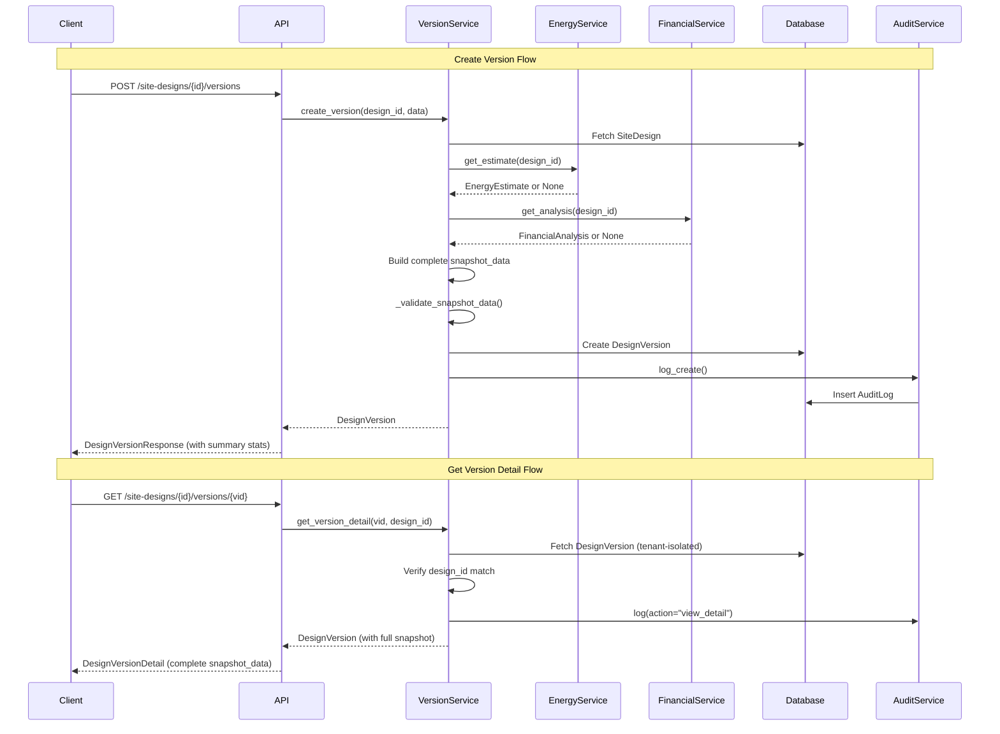

I have created the following plan after thorough exploration and analysis of the codebase. Follow the below plan verbatim. Trust the files and references. Do not re-verify what's written in the plan. Explore only when absolutely necessary. First implement all the proposed file changes and then I'll review all the changes together at the end.

## Observations

The current `DesignVersionService` successfully implements instance-based patterns with tenant isolation and audit logging. The `create_version()` method captures core design parameters but lacks energy estimation and financial analysis results. The schema defines `DesignVersionDetail` for full snapshots but it's not exposed via API. The `DesignVersionResponse` schema doesn't include summary statistics for quick list views. No validation exists to ensure snapshot completeness before version creation.

## Approach

Enhance snapshot data to include complete design state (energy estimates and financial analysis), add validation to ensure data completeness, expose detailed version data through a new API endpoint, and enrich list responses with summary statistics. This follows the existing service patterns for data retrieval, validation, and error handling while maintaining backward compatibility with existing version records.

## Implementation Steps

### 1. Enhance `create_version()` in `DesignVersionService`

**File**: `file:backend/app/services/design_version.py`

#### 1.1 Fetch Energy Estimate and Financial Analysis Data

After fetching the `site_design` (line 61), retrieve associated energy estimate and financial analysis:

- Use `EnergyEstimationService.get_estimate(site_design_id)` to fetch energy estimate
- Use `FinancialAnalysisService.get_analysis(site_design_id)` to fetch financial analysis
- Handle cases where these records don't exist (return `None` or empty dict)

#### 1.2 Expand `snapshot_data` Dictionary

Extend the existing `snapshot_data` dictionary (lines 64-80) to include:

**Energy Estimate Section**:
- `energy_estimate.status` - calculation status
- `energy_estimate.annual_energy_kwh` - annual production
- `energy_estimate.monthly_energy_kwh` - monthly breakdown
- `energy_estimate.capacity_factor` - system efficiency
- `energy_estimate.calculated_at` - timestamp (convert to ISO string)
- `energy_estimate.error_message` - if calculation failed

**Financial Analysis Section**:
- `financial_analysis.system_cost_usd` - total system cost
- `financial_analysis.electricity_rate_usd_per_kwh` - rate assumption
- `financial_analysis.annual_rate_escalation_pct` - escalation rate
- `financial_analysis.annual_savings_usd` - yearly savings
- `financial_analysis.simple_payback_years` - payback period
- `financial_analysis.roi_pct` - return on investment
- `financial_analysis.calculated_at` - timestamp (convert to ISO string)

Use conditional logic to handle `None` values gracefully (e.g., store empty dict or null values with clear keys like `"energy_estimate": None`)

#### 1.3 Add Snapshot Validation

Before creating the `DesignVersion` record (before line 83), add validation method:

- Create private method `_validate_snapshot_data(snapshot_data: dict) -> None`
- Check required fields exist: `site_boundary`, `equipment_module_id`, `equipment_inverter_id`, `total_modules`, `system_size_kwp`
- Validate data types and ranges (e.g., `total_modules >= 0`, `system_size_kwp >= 0`)
- Raise `HTTPException` with status 400 and descriptive message if validation fails
- Call this method before creating the version record

### 2. Add GET Endpoint for Individual Version Details

**File**: `file:backend/app/api/site_designs.py`

#### 2.1 Create New Endpoint

Add new route after the existing version endpoints (after line 219):

```python
@router.get("/site-designs/{design_id}/versions/{version_id}", response_model=DesignVersionDetail)
```

- Accept `design_id: UUID` and `version_id: UUID` as path parameters
- Use `DesignVersionService` dependency via `get_design_version_service`
- Call service method to retrieve version with tenant isolation
- Return `DesignVersionDetail` schema with full `snapshot_data`

#### 2.2 Add Service Method

**File**: `file:backend/app/services/design_version.py`

Add method `get_version_detail(version_id: UUID, site_design_id: UUID) -> DesignVersion`:

- Reuse `_get_version_or_404()` helper for tenant-isolated retrieval
- Verify `version.site_design_id == site_design_id` (similar to `restore_version` logic at line 144)
- Return the version object with full snapshot data
- Optionally log access via `AuditService.log()` with action "view_detail"

### 3. Update `DesignVersionResponse` Schema

**File**: `file:backend/app/schemas/design_version.py`

#### 3.1 Add Summary Statistics Fields

Extend `DesignVersionResponse` class (lines 20-32) with:

- `total_modules: Optional[int] = None` - extracted from snapshot_data
- `system_size_kwp: Optional[float] = None` - extracted from snapshot_data

#### 3.2 Add Field Extractors

Use Pydantic `@field_validator` or `@model_validator` to extract these values from the model's `snapshot_data`:

- Override `model_validate()` or use `@computed_field` decorator
- Extract `total_modules` from `snapshot_data.get("total_modules")`
- Extract `system_size_kwp` from `snapshot_data.get("system_size_kwp")`
- Handle missing keys gracefully (return `None` or 0)

Alternative approach: Add these as properties in the `DesignVersion` model itself, but schema-level extraction is cleaner for API responses.

### 4. Document Snapshot Data Structure

**File**: `file:backend/app/schemas/design_version.py`

#### 4.1 Add Comprehensive Docstring to `DesignVersionDetail`

Update the `DesignVersionDetail` class (lines 35-36) with detailed docstring:

```python
"""
Design version with complete snapshot data.

Snapshot Data Structure:
------------------------
Design Metadata:
  - name: str - Design name
  - site_type: str - Site type (rooftop, ground_mount, carport)
  
Equipment:
  - equipment_module_id: str (UUID) - Selected PV module
  - equipment_inverter_id: str (UUID) - Selected inverter
  
Geometry:
  - site_boundary: dict - GeoJSON polygon of site boundary
  - exclusion_zones: list[dict] - GeoJSON polygons of exclusion areas
  - module_placements: list[dict] - Calculated module positions
  - site_area_sqm: float - Total site area in square meters
  
Placement Settings:
  - edge_setback_m: float - Edge setback distance
  - row_spacing_m: float - Row spacing distance
  - module_orientation: str - Module orientation (portrait/landscape)
  - azimuth_deg: float - System azimuth angle
  - tilt_deg: float - Module tilt angle
  
Design Results:
  - total_modules: int - Total number of modules placed
  - system_size_kwp: float - Total system capacity in kWp
  
Energy Estimate (if calculated):
  - energy_estimate: dict or None
    - status: str - Calculation status (completed, calculating, failed)
    - annual_energy_kwh: float - Annual energy production
    - monthly_energy_kwh: dict - Monthly energy breakdown
    - capacity_factor: float - System capacity factor
    - calculated_at: str (ISO datetime) - Calculation timestamp
    - error_message: str or None - Error details if failed
    
Financial Analysis (if calculated):
  - financial_analysis: dict or None
    - system_cost_usd: float - Total system cost
    - electricity_rate_usd_per_kwh: float - Electricity rate assumption
    - annual_rate_escalation_pct: float - Annual rate escalation
    - annual_savings_usd: float - Annual electricity savings
    - simple_payback_years: float - Simple payback period
    - roi_pct: float - Return on investment percentage
    - calculated_at: str (ISO datetime) - Calculation timestamp
"""
```

#### 4.2 Add Docstring to `DesignVersionCreate`

Document expected usage and validation requirements:

```python
"""
Create a new design version snapshot.

Fields:
  - version_name: str (required, 1-255 chars) - Descriptive version name
  - notes: str (optional) - Additional notes or comments
  
Validation:
  The snapshot will automatically capture the current state of the design including:
  - All geometry and placement data
  - Equipment selections
  - Calculated results (modules, system size)
  - Energy estimates (if available)
  - Financial analysis (if available)
  
Required design state:
  - Site boundary must be defined
  - Equipment must be selected
  - At least one module placement calculation must exist
"""
```

### 5. Update API Response Serialization

**File**: `file:backend/app/api/site_designs.py`

#### 5.1 Update List Endpoint Response

The existing `list_design_versions` endpoint (lines 194-203) already uses `DesignVersionResponse`, so it will automatically include the new summary fields once the schema is updated.

#### 5.2 Ensure Proper Model Validation

Verify that `DesignVersionResponse.model_validate(v)` properly extracts the summary statistics from the database model's `snapshot_data` field.

### 6. Add Unit Tests

**File**: `file:backend/tests/test_design_version.py`

Add comprehensive test coverage:

#### 6.1 Test Snapshot Completeness

- `test_create_version_includes_energy_estimate()` - Verify energy data in snapshot
- `test_create_version_includes_financial_analysis()` - Verify financial data in snapshot
- `test_create_version_without_energy_estimate()` - Handle missing energy data gracefully
- `test_create_version_without_financial_analysis()` - Handle missing financial data gracefully

#### 6.2 Test Snapshot Validation

- `test_create_version_validates_required_fields()` - Ensure validation catches missing fields
- `test_create_version_rejects_invalid_data()` - Test validation error handling
- `test_create_version_with_minimal_valid_data()` - Test minimum required data

#### 6.3 Test New API Endpoint

- `test_get_version_detail_returns_full_snapshot()` - Verify full snapshot data returned
- `test_get_version_detail_tenant_isolation()` - Verify tenant cannot access other tenant's versions
- `test_get_version_detail_not_found()` - Test 404 handling
- `test_get_version_detail_wrong_design_id()` - Test version/design mismatch

#### 6.4 Test Schema Enhancements

- `test_version_response_includes_summary_stats()` - Verify summary fields in list response
- `test_version_response_handles_missing_stats()` - Test graceful handling of missing data
- `test_version_detail_schema_structure()` - Validate complete schema structure

Follow existing test patterns from `file:backend/tests/test_site_design_service.py` and `file:backend/tests/test_site_design_api.py` for fixtures, mocking, and assertions.

## Data Flow Diagram



## Snapshot Data Structure

| Category | Field | Type | Source | Required |
|----------|-------|------|--------|----------|
| **Metadata** | name | string | SiteDesign.name | Yes |
| | site_type | string | SiteDesign.site_type | Yes |
| **Equipment** | equipment_module_id | UUID | SiteDesign.equipment_module_id | Yes |
| | equipment_inverter_id | UUID | SiteDesign.equipment_inverter_id | Yes |
| **Geometry** | site_boundary | GeoJSON | SiteDesign.site_boundary | Yes |
| | exclusion_zones | GeoJSON[] | SiteDesign.exclusion_zones | No |
| | module_placements | Object[] | SiteDesign.module_placements | No |
| | site_area_sqm | float | SiteDesign.site_area_sqm | No |
| **Settings** | edge_setback_m | float | SiteDesign.edge_setback_m | Yes |
| | row_spacing_m | float | SiteDesign.row_spacing_m | Yes |
| | module_orientation | string | SiteDesign.module_orientation | Yes |
| | azimuth_deg | float | SiteDesign.azimuth_deg | Yes |
| | tilt_deg | float | SiteDesign.tilt_deg | Yes |
| **Results** | total_modules | int | SiteDesign.total_modules | Yes |
| | system_size_kwp | float | SiteDesign.system_size_kwp | Yes |
| **Energy** | energy_estimate | Object | EnergyEstimate | No |
| | ↳ status | string | EnergyEstimate.status | - |
| | ↳ annual_energy_kwh | float | EnergyEstimate.annual_energy_kwh | - |
| | ↳ monthly_energy_kwh | dict | EnergyEstimate.monthly_energy_kwh | - |
| | ↳ capacity_factor | float | EnergyEstimate.capacity_factor | - |
| | ↳ calculated_at | datetime | EnergyEstimate.calculated_at | - |
| **Financial** | financial_analysis | Object | FinancialAnalysis | No |
| | ↳ system_cost_usd | float | FinancialAnalysis.system_cost_usd | - |
| | ↳ annual_savings_usd | float | FinancialAnalysis.annual_savings_usd | - |
| | ↳ simple_payback_years | float | FinancialAnalysis.simple_payback_years | - |
| | ↳ roi_pct | float | FinancialAnalysis.roi_pct | - |
| | ↳ calculated_at | datetime | FinancialAnalysis.calculated_at | - |