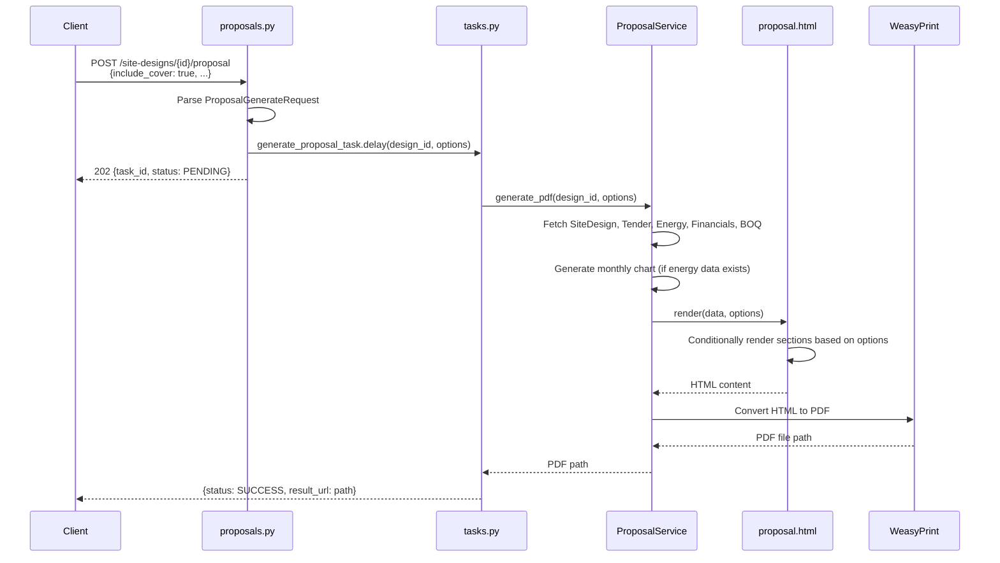

I have created the following plan after thorough exploration and analysis of the codebase. Follow the below plan verbatim. Trust the files and references. Do not re-verify what's written in the plan. Explore only when absolutely necessary. First implement all the proposed file changes and then I'll review all the changes together at the end.

## Observations

The current proposal generation system has a basic structure with hardcoded sections in the Jinja2 template. The `ProposalGenerateRequest` schema exists but isn't utilized in the API endpoint or service layer. The template includes cover page, project overview (specs), energy production, financial analysis, and BOM sections. No site map section currently exists. The service generates PDFs synchronously via Celery tasks but doesn't accept configuration options for section toggles.

## Approach

The implementation will add configurable section rendering by: (1) updating the schema to match the required section names, (2) modifying the service to accept and pass options through the rendering pipeline, (3) wrapping template sections in Jinja2 conditional blocks, (4) updating the Celery task to forward options, and (5) modifying the API endpoint to accept request body with section toggles. This approach maintains backward compatibility by defaulting all sections to `True`.

## Implementation Steps

### 1. Update Schema in `file:backend/app/schemas/proposal.py`

Modify the `ProposalGenerateRequest` class to include the six required section toggles:

- Replace existing fields with: `include_cover`, `include_site_map`, `include_specs`, `include_energy`, `include_financials`, `include_equipment`
- Set all fields to `bool` type with default value `True` for backward compatibility
- Keep `ProposalTaskResponse` and `ProposalStatusResponse` unchanged

**Mapping:**
- `include_cover` → Cover page section
- `include_site_map` → New section for site location map (to be added to template)
- `include_specs` → Project Overview/Site Details section
- `include_energy` → Energy Production section
- `include_financials` → Financial Analysis section
- `include_equipment` → Bill of Materials section

### 2. Modify Service in `file:backend/app/services/proposal.py`

Update `ProposalService.generate_pdf()` method signature and implementation:

- Add `options: Optional[Dict[str, bool]] = None` parameter to `generate_pdf()` method
- Create default options dictionary if `None`: `{"include_cover": True, "include_site_map": True, "include_specs": True, "include_energy": True, "include_financials": True, "include_equipment": True}`
- Pass `options` dictionary to the Jinja2 template rendering context in the `template.render()` call (line 51)
- No changes needed to `generate_bom_csv()` method
- No changes needed to `_generate_monthly_chart()` method

**Updated render call:**
```python
html_content = template.render(
    tender=tender,
    design=design,
    energy=energy,
    financials=financials,
    bom_items=bom_items,
    chart_image=chart_b64,
    date=datetime.now().strftime("%Y-%m-%d"),
    options=options  # Add this line
)
```

### 3. Update Template in `file:backend/templates/proposal.html`

Wrap each section with Jinja2 conditional blocks based on options:

**Cover Page (lines 10-21):**
- Wrap entire `<div class="page cover-page">` block with ` ... `

**Site Map Section (new):**
- Add new section after cover page (before Project Overview)
- Wrap with ` ... `
- Include static map image or placeholder text: "Site Location: {{ tender.latitude }}, {{ tender.longitude }}"
- Use similar structure to other pages with header "Site Location"
- Note: Actual map rendering (e.g., via Google Maps Static API) is out of scope for this phase

**Project Overview/Specs (lines 24-59):**
- Wrap entire `<div class="page">` block containing "Project Overview" with ` ... `

**Energy Production (lines 62-87):**
- Wrap entire `<div class="page">` block containing "Energy Production" with ` ... `

**Financial Analysis (lines 90-116):**
- Wrap entire `<div class="page">` block containing "Financial Analysis" with ` ... `

**Bill of Materials (lines 119-142):**
- Wrap entire `<div class="page">` block containing "Bill of Materials" with ` ... `

### 4. Update Task in `file:backend/app/services/tasks.py`

Modify `generate_proposal_task` to accept and forward options:

- Update function signature: `def generate_proposal_task(self, site_design_id: str, options: Optional[Dict[str, bool]] = None)`
- Pass `options` parameter to `service.generate_pdf()` call on line 95
- Update task invocation in API to include options parameter

**Updated service call:**
```python
pdf_path = service.generate_pdf(UUID(site_design_id), options=options)
```

### 5. Modify API Endpoint in `file:backend/app/api/proposals.py`

Update the `/site-designs/{design_id}/proposal` endpoint to accept request body:

- Change endpoint signature to accept `request: ProposalGenerateRequest` parameter
- Import `ProposalGenerateRequest` from `app.schemas.proposal`
- Convert Pydantic model to dictionary: `options = request.dict()`
- Pass options to Celery task: `tasks.generate_proposal_task.delay(str(design_id), options)`
- Keep endpoint as POST method (already correct)
- Maintain existing authentication and authorization

**Updated endpoint signature:**
```python
async def generate_proposal(
    design_id: UUID,
    request: ProposalGenerateRequest,
    db: Session = Depends(get_db),
    current_user: CurrentUser = Depends(require_role(UserRole.ADMIN, UserRole.PM, UserRole.ENGINEER)),
):
```

## Sequence Diagram



## Data Flow

| Component | Input | Output |
|-----------|-------|--------|
| API Endpoint | `ProposalGenerateRequest` (section toggles) | `ProposalTaskResponse` (task_id) |
| Celery Task | `site_design_id`, `options` dict | `{status, result_url}` |
| ProposalService | `site_design_id`, `options` dict | PDF file path (string) |
| Jinja2 Template | Data context + `options` dict | HTML string |
| WeasyPrint | HTML string + CSS | PDF binary file |

## Backward Compatibility

All section toggles default to `True`, ensuring existing API calls without request body continue to work. The `options` parameter is optional throughout the stack, with sensible defaults applied at the service layer.