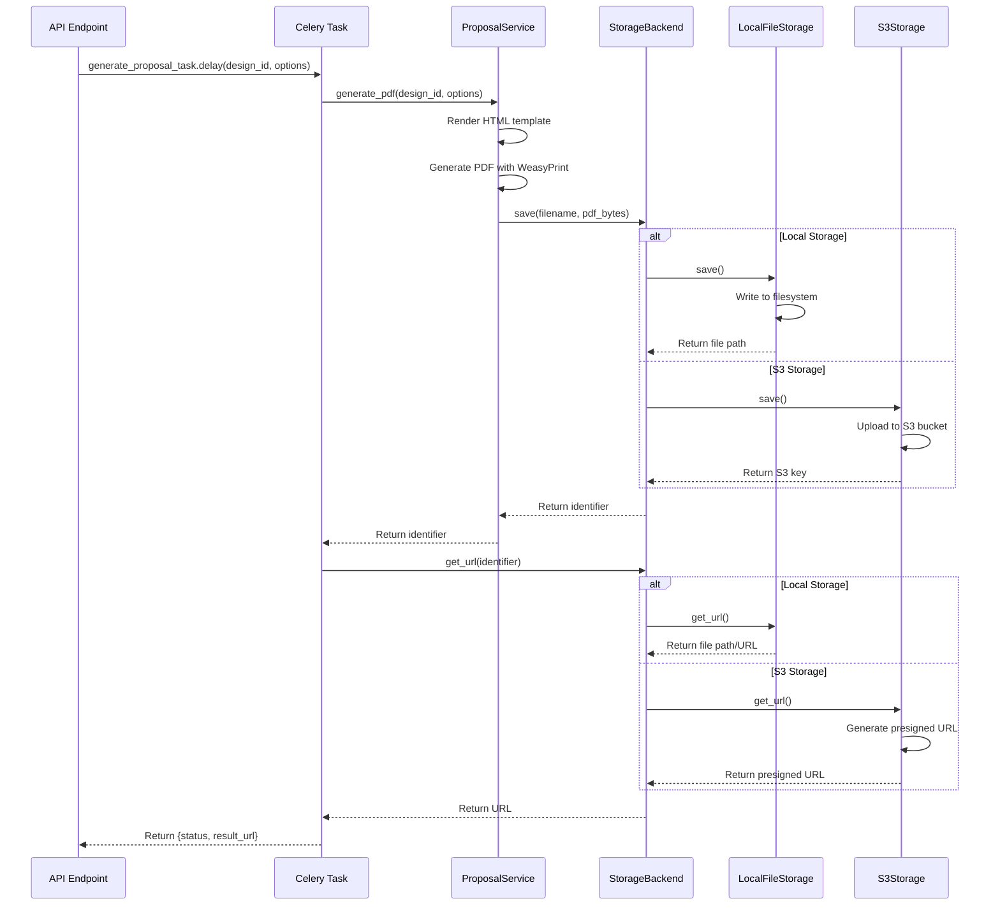

I have created the following plan after thorough exploration and analysis of the codebase. Follow the below plan verbatim. Trust the files and references. Do not re-verify what's written in the plan. Explore only when absolutely necessary. First implement all the proposed file changes and then I'll review all the changes together at the end.

## Observations

The current proposal generation system saves PDFs directly to a local `generated_proposals` directory with hardcoded file paths. The `ProposalService.generate_pdf()` method returns a local file path, and the Celery task passes this path as `result_url`. There's no abstraction for storage, making it difficult to switch between local and cloud storage. The codebase follows a service pattern without abstract base classes, using regular Python classes with dependency injection through `__init__` methods.

## Approach

Implement a pluggable storage backend system using a base class with concrete implementations for local filesystem and AWS S3. The storage backend will be selected via environment configuration, allowing seamless switching between storage types without code changes. The `ProposalService` will be refactored to use the storage backend abstraction, and the Celery task will generate appropriate URLs based on the configured storage type. This approach maintains backward compatibility while enabling cloud storage capabilities.

## Implementation Steps

### 1. Create Storage Backend Abstraction

Create new file `file:backend/app/services/storage.py` with the following components:

**Base Storage Class:**
- Create `StorageBackend` class with methods:
  - `save(file_path: str, content: bytes) -> str` - Save file and return storage identifier
  - `get_url(identifier: str) -> str` - Get accessible URL for the stored file
  - `delete(identifier: str) -> bool` - Delete file from storage
  - `exists(identifier: str) -> bool` - Check if file exists

**LocalFileStorage Implementation:**
- Inherit from `StorageBackend`
- Store files in configurable local directory (default: `generated_proposals`)
- `save()` should create directory if not exists, write file, return relative path
- `get_url()` should return file path or construct `/static/proposals/{filename}` URL
- `delete()` should remove file from filesystem
- `exists()` should check file existence using `os.path.exists()`

**S3Storage Implementation:**
- Inherit from `StorageBackend`
- Use boto3 client for S3 operations
- `save()` should upload to S3 bucket with proper content type, return S3 key
- `get_url()` should generate presigned URL with configurable expiration (default: 24 hours) or public URL if bucket is public
- `delete()` should delete object from S3
- `exists()` should check object existence using head_object
- Handle boto3 exceptions gracefully with proper error messages

**Storage Factory Function:**
- Create `get_storage_backend() -> StorageBackend` function
- Read `PROPOSAL_STORAGE_BACKEND` from settings
- Return appropriate storage instance based on configuration
- Raise `ValueError` if invalid backend specified

### 2. Update Configuration Settings

Modify `file:backend/app/core/config.py`:

**Add Storage Configuration Fields:**
- `PROPOSAL_STORAGE_BACKEND: str = "local"` - Options: "local" or "s3"
- `PROPOSAL_LOCAL_DIR: str = "generated_proposals"` - Local storage directory
- `S3_BUCKET_NAME: str = ""` - S3 bucket name for proposal storage
- `S3_REGION: str = "us-east-1"` - AWS region
- `S3_ACCESS_KEY_ID: str = ""` - AWS access key (optional, can use IAM roles)
- `S3_SECRET_ACCESS_KEY: str = ""` - AWS secret key (optional)
- `S3_PRESIGNED_URL_EXPIRATION: int = 86400` - Presigned URL expiration in seconds (24 hours)

**Add Validation:**
- Add validator to ensure S3 settings are provided when backend is "s3"

### 3. Update ProposalService

Modify `file:backend/app/services/proposal.py`:

**Update Constructor:**
- Add `storage_backend: Optional[StorageBackend] = None` parameter
- If not provided, call `get_storage_backend()` to get default backend
- Store as `self.storage_backend`

**Refactor generate_pdf() Method:**
- Keep existing PDF generation logic (WeasyPrint, template rendering)
- After generating PDF with WeasyPrint, read the file content into bytes
- Call `self.storage_backend.save(filename, pdf_bytes)` to store the PDF
- Return the storage identifier instead of local path
- Remove hardcoded `output_dir` creation - let storage backend handle it
- Update return type documentation to indicate it returns storage identifier

**Update Method Signature:**
- Change return type from `str` (path) to `str` (storage identifier)
- Update docstring to reflect this change

### 4. Update Celery Task

Modify `file:backend/app/services/tasks.py`:

**Update generate_proposal_task:**
- Import `get_storage_backend` from storage module
- After calling `service.generate_pdf()`, receive storage identifier
- Get storage backend instance using `get_storage_backend()`
- Call `storage_backend.get_url(identifier)` to get accessible URL
- Return `{"status": "success", "result_url": url, "storage_identifier": identifier}`
- Add error handling for storage operations
- Update task docstring to explain URL generation based on storage type

**Add Storage Context:**
- Ensure storage backend is properly initialized within task context
- Handle potential S3 credential errors gracefully

### 5. Update Dependencies

Modify `file:backend/requirements.txt`:

**Add boto3 Dependency:**
- Add `boto3>=1.34.0` to requirements
- Add comment indicating it's optional for S3 storage backend
- Consider creating separate `requirements-s3.txt` for optional S3 dependencies

**Alternative Approach:**
- Use `extras_require` in setup.py if project uses it
- Allow installation with `pip install .[s3]` for S3 support

### 6. Environment Configuration

**Update .env.example:**
- Add example configuration for both storage backends
- Document local storage configuration
- Document S3 storage configuration with all required fields
- Add comments explaining when each setting is needed

### 7. Error Handling and Logging

**Add Comprehensive Error Handling:**
- Wrap storage operations in try-except blocks
- Log storage errors with appropriate context
- Raise meaningful exceptions with user-friendly messages
- Handle S3-specific errors (credentials, permissions, bucket not found)
- Handle local storage errors (disk full, permissions)

**Add Logging:**
- Log storage backend initialization
- Log file save operations with size and identifier
- Log URL generation requests
- Use Python's logging module with appropriate log levels

### 8. Backward Compatibility

**Ensure Smooth Migration:**
- Default to "local" storage backend for existing deployments
- Existing local file paths should continue to work
- Add migration notes in documentation
- Consider adding a migration script to move existing PDFs to S3 if needed

## Architecture Diagram

## Storage Backend Class Structure

| Class | Methods | Responsibility |
|-------|---------|----------------|
| `StorageBackend` | `save()`, `get_url()`, `delete()`, `exists()` | Base interface for storage operations |
| `LocalFileStorage` | Implements all base methods | Handles local filesystem storage |
| `S3Storage` | Implements all base methods | Handles AWS S3 storage with boto3 |
| `get_storage_backend()` | Factory function | Returns configured storage backend instance |

## Configuration Matrix

| Setting | Local Backend | S3 Backend | Required |
|---------|---------------|------------|----------|
| `PROPOSAL_STORAGE_BACKEND` | "local" | "s3" | Yes |
| `PROPOSAL_LOCAL_DIR` | Used | Ignored | No (has default) |
| `S3_BUCKET_NAME` | Ignored | Used | Yes (for S3) |
| `S3_REGION` | Ignored | Used | Yes (for S3) |
| `S3_ACCESS_KEY_ID` | Ignored | Used | No (can use IAM) |
| `S3_SECRET_ACCESS_KEY` | Ignored | Used | No (can use IAM) |
| `S3_PRESIGNED_URL_EXPIRATION` | Ignored | Used | No (has default) |