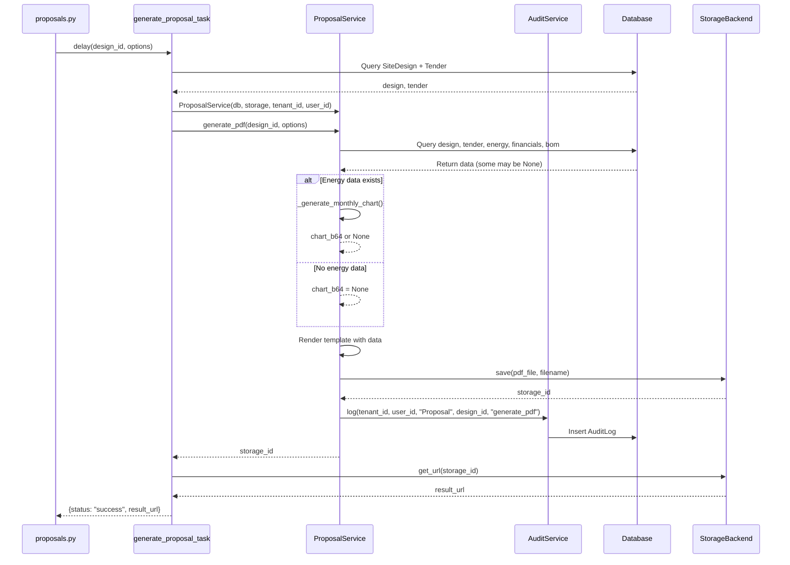

I have created the following plan after thorough exploration and analysis of the codebase. Follow the below plan verbatim. Trust the files and references. Do not re-verify what's written in the plan. Explore only when absolutely necessary. First implement all the proposed file changes and then I'll review all the changes together at the end.

## Key Observations

The proposal generation system already has configurable sections and storage backend implemented. The template file:c:\Users\SSTECH\developments\apps\solarepc-pro\backend\templates\proposal.html has conditional blocks for each section. The `ProposalService` in file:c:\Users\SSTECH\developments\apps\solarepc-pro\backend\app\services\proposal.py handles PDF generation and CSV export. The `AuditService` in file:c:\Users\SSTECH\developments\apps\solarepc-pro\backend\app\services\audit.py provides logging capabilities. Currently, the service lacks audit logging, graceful error handling for missing data, and proper null/empty data handling in chart generation.

## Approach

Enhance the proposal service with comprehensive audit logging and robust error handling. Add audit logging to both PDF and CSV generation operations by integrating `AuditService`. Implement graceful degradation for missing `EnergyEstimate` and `FinancialAnalysis` data by adding null checks and fallback values. Enhance the template with better "N/A" messaging for missing sections. Strengthen the `_generate_monthly_chart()` method to handle empty, null, or malformed data without crashing. Update the task to properly handle partial data scenarios and log errors appropriately.

## Implementation Steps

### 1. Enhance ProposalService with Audit Logging Support

**File: file:c:\Users\SSTECH\developments\apps\solarepc-pro\backend\app\services\proposal.py**

- Modify `ProposalService.__init__()` to accept optional `tenant_id` and `user_id` parameters
- Initialize `AuditService` instance when tenant_id and user_id are provided
- Store these as instance variables for use in audit logging

### 2. Add Audit Logging to PDF Generation

**File: file:c:\Users\SSTECH\developments\apps\solarepc-pro\backend\app\services\proposal.py**

In `generate_pdf()` method:

- After successfully generating and saving the PDF, add audit log entry
- Fetch `tenant_id` from `design.tender.tenant_id` if not provided in constructor
- Fetch `user_id` from `design.created_by` if not provided in constructor
- Use `AuditService.log()` to record the action with:
  - `entity_type`: "Proposal"
  - `entity_id`: `site_design_id`
  - `action`: "generate_pdf"
  - `new_value`: Dictionary containing options used, storage_id, and timestamp
- Wrap audit logging in try-except to prevent failures from breaking PDF generation
- Log any audit failures using Python's logging module

### 3. Add Audit Logging to CSV Export

**File: file:c:\Users\SSTECH\developments\apps\solarepc-pro\backend\app\services\proposal.py**

In `generate_bom_csv()` method:

- After successfully generating CSV, add audit log entry
- Fetch `tenant_id` from `design.tender.tenant_id` if not provided
- Fetch `user_id` from `design.created_by` if not provided
- Use `AuditService.log()` to record the action with:
  - `entity_type`: "BOM"
  - `entity_id`: `site_design_id`
  - `action`: "export_csv"
  - `new_value`: Dictionary containing item count and timestamp
- Wrap in try-except to prevent audit failures from breaking export

### 4. Implement Graceful Degradation for Missing Data

**File: file:c:\Users\SSTECH\developments\apps\solarepc-pro\backend\app\services\proposal.py**

In `generate_pdf()` method:

- Add explicit null checks after querying `EnergyEstimate` and `FinancialAnalysis`
- When `energy` is None or `energy.status != "completed"`, set `energy` to None and `chart_b64` to None
- When `financials` is None, ensure template receives None value
- Add logging statements to record when data is missing (INFO level)
- Ensure template rendering handles None values gracefully by passing them explicitly

### 5. Enhance Chart Generation with Null/Empty Data Handling

**File: file:c:\Users\SSTECH\developments\apps\solarepc-pro\backend\app\services\proposal.py**

In `_generate_monthly_chart()` method:

- Add null/None check at the beginning - return None if `monthly_data` is None
- Add empty data check - return None if data structure is empty (empty list or dict)
- Add validation for list length - ensure at least one non-zero value exists
- Add validation for dict values - ensure at least one valid numeric value exists
- Wrap matplotlib operations in try-except block
- Return None on any exception and log the error
- Add type checking to handle unexpected data types gracefully

### 6. Enhance Template with Better "N/A" Handling

**File: file:c:\Users\SSTECH\developments\apps\solarepc-pro\backend\templates\proposal.html**

In the Energy Production section (lines 79-106):

- Enhance the existing `` block to also check `energy.status == "completed"`
- Update the warning message to be more descriptive: "Energy estimate is not yet available. Calculation may be in progress or failed."
- Add a conditional check for `chart_image` - only render chart container if chart exists
- If energy exists but chart is missing, show message: "Monthly production chart unavailable"

In the Financial Analysis section (lines 109-137):

- Enhance the existing `` block with more descriptive message
- Update warning to: "Financial analysis is not yet available. Please ensure energy estimate is completed and BOQ is configured."
- Add conditional rendering for individual financial metrics to handle partial data
- Show "N/A" for individual fields if they are None or zero

In the Equipment/BOM section (lines 140-165):

- Add check for empty `bom_items` list
- If empty, show message: "Bill of Materials is not yet configured for this project."
- Ensure table only renders if items exist

### 7. Update Task to Handle Partial Data Scenarios

**File: file:c:\Users\SSTECH\developments\apps\solarepc-pro\backend\app\services\tasks.py**

In `generate_proposal_task()`:

- Fetch the `SiteDesign` and `Tender` to get tenant_id and user_id
- Pass `tenant_id` and `user_id` to `ProposalService` constructor
- Wrap the entire generation in try-except with specific error handling
- On exception, check if it's due to missing design (ValueError) vs other errors
- Log detailed error information including design_id, options, and error type
- Return error response with appropriate status and error message
- Ensure database session is properly closed in finally block

### 8. Add Comprehensive Error Logging

**File: file:c:\Users\SSTECH\developments\apps\solarepc-pro\backend\app\services\proposal.py**

Throughout the service:

- Import Python's `logging` module at the top
- Create logger instance: `logger = logging.getLogger(__name__)`
- Add INFO level logs for successful operations (PDF generated, CSV exported)
- Add WARNING level logs for missing data scenarios (no energy, no financials)
- Add ERROR level logs for failures (chart generation failed, storage failed)
- Include relevant context in log messages (design_id, tenant_id, error details)

### 9. Update Service Instantiation Pattern

**File: file:c:\Users\SSTECH\developments\apps\solarepc-pro\backend\app\services\tasks.py**

In `generate_proposal_task()`:

- Query `SiteDesign` with joins to `Tender` to get all needed context
- Extract `tenant_id` from `design.tender.tenant_id`
- Extract `user_id` from `design.created_by`
- Instantiate `ProposalService(db, storage=storage, tenant_id=tenant_id, user_id=user_id)`
- This enables audit logging within the service

**File: file:c:\Users\SSTECH\developments\apps\solarepc-pro\backend\app\api\proposals.py**

In `export_bom_csv()`:

- Extract `tenant_id` and `user_id` from `current_user`
- Instantiate `ProposalService(db, tenant_id=current_user.tenant_id, user_id=current_user.id)`
- This enables audit logging for CSV exports

### 10. Add Validation and Safety Checks

**File: file:c:\Users\SSTECH\developments\apps\solarepc-pro\backend\app\services\proposal.py**

In `generate_pdf()`:

- Validate that `design` exists before proceeding (already done)
- Validate that `tender` exists - raise ValueError if None
- Add check for `bom_items` - if None, set to empty list
- Ensure all numeric values have fallbacks (use 0.0 or "N/A" in template)

In `generate_bom_csv()`:

- Validate that `design` exists (already done)
- Handle case where `bom_items` is empty - still generate CSV with headers only
- Add null checks for item attributes before formatting

## Sequence Diagram

